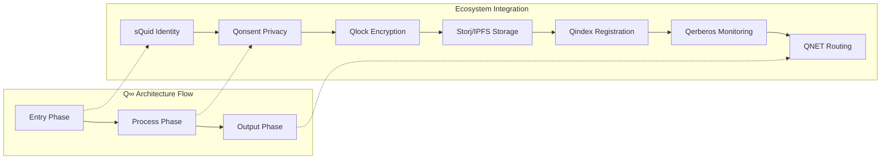
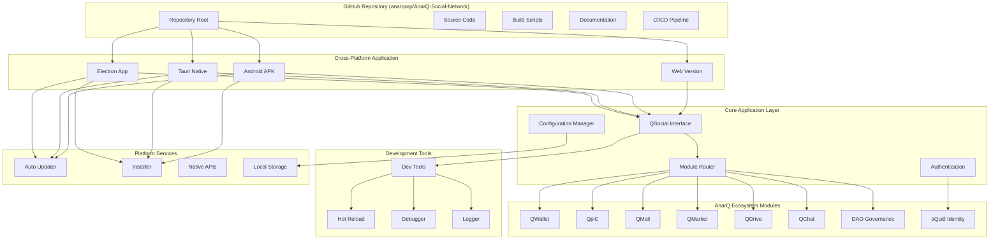
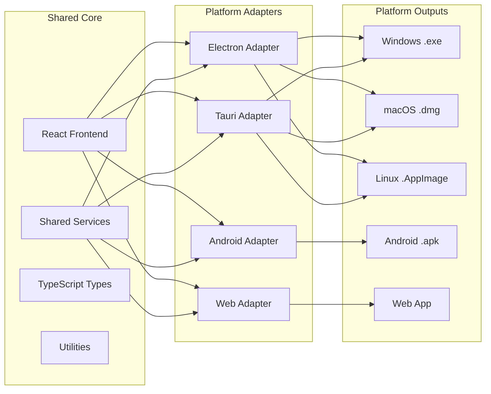

# AnarQ Social Network Repository Design Document

## Overview

The AnarQ Social Network repository is a comprehensive, cross-platform application that serves as the primary entry point for users to access the complete AnarQ & Q ecosystem while **preserving the complete Q∞ philosophy and modular architecture**. Built with modern web technologies and packaged for multiple platforms including Android, this application provides a unified development environment where users can experience QSocial as the main interface while having seamless access to all ecosystem modules.

**Q∞ Philosophy Preservation:**
The application maintains the core principles of the AnarQ&Q ecosystem:
- **Decentralization**: No central points of failure or control
- **Privacy by Design**: User data sovereignty and privacy-preserving interactions
- **Modular Architecture**: Independent, self-contained modules with standardized interfaces
- **Entry → Process → Output Flow**: Q∞ architecture maintained throughout all operations
- **Ecosystem Integration**: Complete integration of all 14 Q modules with their philosophical foundations

**Complete Ecosystem Integration:**
The application includes all 14 Q ecosystem modules with their complete functionality:
- **Core Identity & Security**: sQuid, Qerberos, Qmask
- **Financial & Transaction**: Qwallet, Qmarket  
- **Communication & Collaboration**: Qmail, Qchat
- **Storage & Data**: Qdrive, QpiC
- **Infrastructure & Utility**: Qindex, Qlock, Qonsent, QNET
- **Governance**: DAO

**Repository Structure:**
- **Development Location**: All development work will be conducted in the `AnarQ-Social-Network/` folder within the current project workspace
- **GitHub Repository**: A new repository will be created at `https://github.com/anarqorp/AnarQ-Social-Network`
- **Distribution**: The repository will feature automated CI/CD pipelines for building and distributing applications across all supported platforms
- **Philosophy Preservation**: Complete import of Q∞ documentation, glossary, and architectural principles

This approach ensures that the new application is developed as a standalone project while **completely preserving the Q∞ ecosystem philosophy, architecture, and all 14 modules** with their full functionality and integration capabilities.

## Q∞ Philosophy and Architecture Preservation

### Core Q∞ Principles

The AnarQ Social Network application is built upon the foundational principles of the Q∞ ecosystem:

#### 1. **Q∞ Modular Architecture (Entry → Process → Output)**


#### 2. **Digital Sovereignty and Decentralization**
- **User Control**: Users maintain complete control over their digital identity, data, and interactions
- **No Central Authority**: Distributed architecture with no single points of failure
- **Privacy by Design**: Privacy protection built into every component from the ground up
- **Interoperability**: Seamless communication between all ecosystem modules

#### 3. **Modular Independence with Ecosystem Integration**
- Each of the 14 Q modules operates independently while providing standardized integration interfaces
- Cross-module communication through established protocols and event systems
- Shared authentication and identity management through sQuid
- Unified privacy and consent management through Qonsent

### Q∞ Ecosystem Module Integration

#### Core Identity and Security Layer
```typescript
interface QSecurityLayer {
  sQuid: IdentityManagement;      // Secure Quantum Identity
  Qerberos: SecurityAudit;        // Quantum Kerberos Security
  Qmask: PrivacyAnonymization;    // Quantum Mask Privacy
}
```

#### Financial and Transaction Layer
```typescript
interface QFinancialLayer {
  Qwallet: PaymentProcessing;     // Quantum Wallet
  Qmarket: DecentralizedMarket;   // Quantum Market
}
```

#### Communication and Collaboration Layer
```typescript
interface QCommunicationLayer {
  Qmail: SecureMessaging;         // Quantum Mail
  Qchat: RealTimeCommunication;   // Quantum Chat
}
```

#### Storage and Data Layer
```typescript
interface QStorageLayer {
  Qdrive: DecentralizedStorage;   // Quantum Drive
  QpiC: MediaManagement;          // Quantum Picture
}
```

#### Infrastructure and Utility Layer
```typescript
interface QInfrastructureLayer {
  Qindex: SearchIndexing;         // Quantum Index
  Qlock: AccessControl;           // Quantum Lock
  Qonsent: ConsentManagement;     // Quantum Consent
  QNET: NetworkInfrastructure;    // Quantum Network
}
```

#### Governance Layer
```typescript
interface QGovernanceLayer {
  DAO: DecentralizedGovernance;   // Decentralized Autonomous Organization
}
```

### Philosophy Implementation Strategy

#### 1. **Complete Ecosystem Import**
- Import all existing Q∞ documentation, including glossary, architecture guides, and module specifications
- Preserve all existing service implementations and their philosophical foundations
- Maintain existing test suites that validate Q∞ compliance
- Import all existing scripts and automation that support the Q∞ workflow

#### 2. **Cross-Platform Philosophy Consistency**
- Ensure Q∞ principles are maintained across all platforms (Desktop, Mobile, Web)
- Implement platform-specific optimizations without compromising core philosophy
- Maintain consistent user experience that reflects Q∞ values across all interfaces

#### 3. **Development Mode Philosophy**
- Provide developers with complete access to Q∞ architecture and documentation
- Enable hot-reload and debugging while maintaining ecosystem integrity
- Support contribution workflows that preserve Q∞ principles and standards

## Architecture

### High-Level System Architecture



### Cross-Platform Architecture Strategy



## Components and Interfaces

### Core Application Components

#### Main Application Shell
```typescript
interface ApplicationShell {
  // Platform detection and initialization
  platform: 'electron' | 'tauri' | 'android' | 'web';
  initialize(): Promise<void>;
  
  // Module management
  loadModule(moduleId: string): Promise<Module>;
  unloadModule(moduleId: string): Promise<void>;
  getLoadedModules(): Module[];
  
  // Navigation and routing
  navigateToModule(moduleId: string, route?: string): void;
  getCurrentModule(): Module | null;
  
  // Development mode features
  isDevelopmentMode(): boolean;
  enableHotReload(): void;
  openDevTools(): void;
  
  // Configuration management
  getConfiguration(): ApplicationConfig;
  updateConfiguration(config: Partial<ApplicationConfig>): Promise<void>;
}
```

#### Module Router
```typescript
interface ModuleRouter {
  // Module registration
  registerModule(module: ModuleDefinition): void;
  unregisterModule(moduleId: string): void;
  
  // Routing
  route(path: string): Promise<RouteResult>;
  getCurrentRoute(): Route;
  
  // Module communication
  sendMessage(targetModule: string, message: any): Promise<any>;
  broadcastMessage(message: any): void;
  
  // Module lifecycle
  startModule(moduleId: string): Promise<void>;
  stopModule(moduleId: string): Promise<void>;
  restartModule(moduleId: string): Promise<void>;
}
```

#### Configuration Manager
```typescript
interface ConfigurationManager {
  // Configuration loading and saving
  loadConfiguration(): Promise<ApplicationConfig>;
  saveConfiguration(config: ApplicationConfig): Promise<void>;
  
  // Environment-specific configs
  getEnvironmentConfig(env: 'development' | 'production'): EnvironmentConfig;
  
  // Module-specific configurations
  getModuleConfig(moduleId: string): ModuleConfig;
  setModuleConfig(moduleId: string, config: ModuleConfig): Promise<void>;
  
  // Validation
  validateConfiguration(config: ApplicationConfig): ValidationResult;
  
  // Migration
  migrateConfiguration(fromVersion: string, toVersion: string): Promise<void>;
}
```

### Platform-Specific Components

#### Electron Integration
```typescript
interface ElectronIntegration {
  // Window management
  createWindow(options: WindowOptions): BrowserWindow;
  getMainWindow(): BrowserWindow;
  
  // Native features
  showNotification(notification: NotificationOptions): void;
  openFileDialog(options: FileDialogOptions): Promise<string[]>;
  
  // System integration
  setAppUserModelId(id: string): void;
  registerProtocol(protocol: string, handler: ProtocolHandler): void;
  
  // Auto updater
  checkForUpdates(): Promise<UpdateInfo>;
  downloadUpdate(): Promise<void>;
  installUpdate(): void;
}
```

#### Android Integration
```typescript
interface AndroidIntegration {
  // Native Android APIs
  requestPermissions(permissions: string[]): Promise<PermissionResult>;
  accessCamera(): Promise<CameraResult>;
  accessStorage(): Promise<StorageResult>;
  
  // Android-specific UI
  showToast(message: string, duration: 'short' | 'long'): void;
  createNotification(notification: AndroidNotification): void;
  
  // Performance optimization
  optimizeForLowMemory(): void;
  enableBatteryOptimization(): void;
  
  // App lifecycle
  onPause(): void;
  onResume(): void;
  onDestroy(): void;
}
```

### Development Tools Integration

#### Hot Reload System
```typescript
interface HotReloadSystem {
  // File watching
  watchFiles(patterns: string[]): void;
  stopWatching(): void;
  
  // Reload triggers
  onFileChange(callback: (file: string) => void): void;
  reloadModule(moduleId: string): Promise<void>;
  reloadApplication(): Promise<void>;
  
  // Development server
  startDevServer(port: number): Promise<void>;
  stopDevServer(): Promise<void>;
  
  // Error handling
  onReloadError(callback: (error: Error) => void): void;
}
```

#### Debug Tools
```typescript
interface DebugTools {
  // Logging
  createLogger(namespace: string): Logger;
  setLogLevel(level: 'debug' | 'info' | 'warn' | 'error'): void;
  
  // Performance monitoring
  startPerformanceMonitoring(): void;
  getPerformanceMetrics(): PerformanceMetrics;
  
  // State inspection
  inspectModuleState(moduleId: string): any;
  inspectApplicationState(): ApplicationState;
  
  // Network monitoring
  monitorNetworkRequests(): void;
  getNetworkLogs(): NetworkLog[];
}
```

## Data Models

### Application Configuration
```typescript
interface ApplicationConfig {
  // Application metadata
  version: string;
  buildNumber: number;
  environment: 'development' | 'production';
  
  // Platform configuration
  platform: PlatformConfig;
  
  // Module configurations
  modules: Record<string, ModuleConfig>;
  
  // User preferences
  userPreferences: UserPreferences;
  
  // Development settings
  developmentSettings: DevelopmentSettings;
  
  // Security settings
  security: SecurityConfig;
}

interface PlatformConfig {
  // Window settings (for desktop)
  window?: {
    width: number;
    height: number;
    minWidth: number;
    minHeight: number;
    resizable: boolean;
    fullscreen: boolean;
  };
  
  // Android settings
  android?: {
    orientation: 'portrait' | 'landscape' | 'auto';
    theme: 'light' | 'dark' | 'auto';
    permissions: string[];
  };
  
  // Auto-updater settings
  autoUpdater: {
    enabled: boolean;
    checkInterval: number;
    autoDownload: boolean;
    autoInstall: boolean;
  };
}

interface ModuleConfig {
  enabled: boolean;
  version: string;
  configuration: Record<string, any>;
  dependencies: string[];
  routes: RouteDefinition[];
}

interface UserPreferences {
  theme: 'light' | 'dark' | 'auto';
  language: string;
  notifications: NotificationPreferences;
  privacy: PrivacyPreferences;
  accessibility: AccessibilityPreferences;
}

interface DevelopmentSettings {
  hotReload: boolean;
  devTools: boolean;
  debugMode: boolean;
  logLevel: 'debug' | 'info' | 'warn' | 'error';
  mockServices: boolean;
  apiEndpoints: Record<string, string>;
}
```

### Module Definition
```typescript
interface ModuleDefinition {
  // Module metadata
  id: string;
  name: string;
  version: string;
  description: string;
  author: string;
  
  // Module configuration
  main: string;
  routes: RouteDefinition[];
  dependencies: string[];
  permissions: string[];
  
  // Platform compatibility
  platforms: ('electron' | 'tauri' | 'android' | 'web')[];
  
  // Lifecycle hooks
  onLoad?: () => Promise<void>;
  onUnload?: () => Promise<void>;
  onActivate?: () => Promise<void>;
  onDeactivate?: () => Promise<void>;
  
  // API exports
  exports: Record<string, any>;
}

interface RouteDefinition {
  path: string;
  component: string;
  exact?: boolean;
  guards?: string[];
  metadata?: Record<string, any>;
}
```

## Error Handling

### Error Categories and Handling Strategies

#### Platform-Specific Errors
```typescript
enum PlatformErrorType {
  ELECTRON_MAIN_PROCESS_ERROR = 'electron_main_process_error',
  ELECTRON_RENDERER_ERROR = 'electron_renderer_error',
  ANDROID_NATIVE_ERROR = 'android_native_error',
  ANDROID_PERMISSION_ERROR = 'android_permission_error',
  WEB_BROWSER_COMPATIBILITY = 'web_browser_compatibility',
  TAURI_BACKEND_ERROR = 'tauri_backend_error'
}

interface PlatformError extends Error {
  type: PlatformErrorType;
  platform: string;
  nativeError?: any;
  recoverable: boolean;
  userMessage: string;
}
```

#### Module Loading Errors
```typescript
enum ModuleErrorType {
  MODULE_NOT_FOUND = 'module_not_found',
  MODULE_LOAD_FAILED = 'module_load_failed',
  MODULE_DEPENDENCY_MISSING = 'module_dependency_missing',
  MODULE_VERSION_INCOMPATIBLE = 'module_version_incompatible',
  MODULE_PERMISSION_DENIED = 'module_permission_denied'
}

interface ModuleError extends Error {
  type: ModuleErrorType;
  moduleId: string;
  dependencies?: string[];
  requiredVersion?: string;
  actualVersion?: string;
}
```

#### Development Mode Errors
```typescript
enum DevelopmentErrorType {
  HOT_RELOAD_FAILED = 'hot_reload_failed',
  DEV_SERVER_ERROR = 'dev_server_error',
  BUILD_ERROR = 'build_error',
  COMPILATION_ERROR = 'compilation_error'
}

interface DevelopmentError extends Error {
  type: DevelopmentErrorType;
  file?: string;
  line?: number;
  column?: number;
  buildLog?: string;
}
```

### Error Recovery Strategies

#### Graceful Degradation
- **Module Failure**: Disable failed module, show error state, allow retry
- **Network Issues**: Cache content, show offline mode, queue actions
- **Platform Issues**: Fallback to web version, show compatibility warnings

#### Error Reporting
- **Development Mode**: Show detailed error information, stack traces, debugging tools
- **Production Mode**: Log errors securely, show user-friendly messages, collect telemetry
- **Crash Recovery**: Auto-restart application, preserve user data, restore session

## Testing Strategy

### Cross-Platform Testing

#### Unit Testing
```typescript
// Platform-agnostic core logic testing
describe('ModuleRouter', () => {
  test('should register and route to modules correctly', () => {
    // Test module registration and routing logic
  });
  
  test('should handle module communication', () => {
    // Test inter-module messaging
  });
});

// Platform-specific testing
describe('ElectronIntegration', () => {
  test('should create windows with correct options', () => {
    // Test Electron-specific functionality
  });
});

describe('AndroidIntegration', () => {
  test('should request permissions correctly', () => {
    // Test Android-specific functionality
  });
});
```

#### Integration Testing
```typescript
// End-to-end module integration
describe('QSocial Integration', () => {
  test('should load QSocial and navigate to other modules', async () => {
    // Test complete user workflow across modules
  });
  
  test('should maintain session across module switches', async () => {
    // Test session persistence
  });
});

// Platform integration testing
describe('Cross-Platform Compatibility', () => {
  test('should work consistently across all platforms', async () => {
    // Test platform-specific behaviors
  });
});
```

#### Performance Testing
- **Startup Time**: Measure application startup across platforms
- **Module Loading**: Test module loading performance and memory usage
- **Memory Management**: Monitor memory leaks and garbage collection
- **Battery Usage**: Test Android battery optimization

#### Security Testing
- **Permission Handling**: Test Android permission requests and handling
- **Data Encryption**: Test secure storage and transmission
- **Authentication**: Test sQuid identity integration
- **Input Validation**: Test against injection attacks and malformed input

### Automated Testing Pipeline

#### CI/CD Testing Strategy
```yaml
# GitHub Actions workflow example
name: Cross-Platform Testing
on: [push, pull_request]

jobs:
  test-core:
    runs-on: ubuntu-latest
    steps:
      - name: Run unit tests
      - name: Run integration tests
      - name: Generate coverage report
  
  test-electron:
    strategy:
      matrix:
        os: [ubuntu-latest, windows-latest, macos-latest]
    runs-on: ${{ matrix.os }}
    steps:
      - name: Build Electron app
      - name: Run Electron tests
      - name: Test installer
  
  test-android:
    runs-on: ubuntu-latest
    steps:
      - name: Setup Android SDK
      - name: Build APK
      - name: Run Android tests
      - name: Test on emulator
  
  test-web:
    runs-on: ubuntu-latest
    steps:
      - name: Build web version
      - name: Run browser tests
      - name: Test PWA functionality
```

## Implementation Phases

### Phase 1: Repository Setup and Core Infrastructure
- Initialize GitHub repository with proper structure
- Set up development environment and tooling
- Create basic cross-platform application shell
- Implement configuration management system
- Set up CI/CD pipeline for automated building

### Phase 2: QSocial Integration and Module Router
- Integrate existing QSocial codebase
- Implement module router and navigation system
- Create unified authentication with sQuid identity
- Set up inter-module communication system
- Implement basic development tools integration

### Phase 3: Cross-Platform Implementation
- Implement Electron wrapper for desktop platforms
- Create Android application with React Native or Capacitor
- Implement Tauri alternative for native performance
- Set up platform-specific optimizations and native API access
- Create unified build system for all platforms

### Phase 4: Development Tools and Hot Reload
- Implement hot reload system for development mode
- Create debugging tools and error reporting
- Set up performance monitoring and profiling
- Implement development server and API mocking
- Create developer documentation and guides

### Phase 5: Auto-Update and Distribution
- Implement auto-update system for all platforms
- Create installer packages and distribution system
- Set up release automation and versioning
- Implement crash reporting and telemetry
- Create user onboarding and setup wizard

### Phase 6: Optimization and Polish
- Optimize performance for each platform
- Implement accessibility features
- Add comprehensive error handling and recovery
- Create comprehensive testing suite
- Polish user interface and user experience

## Security Considerations

### Platform Security
- **Code Signing**: Sign all executables and packages for distribution
- **Sandboxing**: Implement appropriate sandboxing for each platform
- **Permission Management**: Handle platform-specific permissions securely
- **Secure Updates**: Implement secure auto-update mechanism with signature verification

### Data Security
- **Local Storage**: Encrypt sensitive data stored locally
- **Network Communication**: Use HTTPS and certificate pinning
- **Authentication**: Integrate securely with sQuid identity system
- **Privacy**: Implement privacy-by-design principles

### Development Security
- **Dependency Management**: Regular security audits of dependencies
- **Build Security**: Secure build pipeline and artifact signing
- **Secret Management**: Secure handling of API keys and certificates
- **Code Review**: Mandatory security review for all changes

## Deployment and Distribution

### Development and Repository Structure

#### Local Development Structure
```
AnarQ-Social-Network/                    # Local development folder
├── README.md
├── CONTRIBUTING.md
├── LICENSE
├── SECURITY.md
├── package.json
├── .gitignore
├── .github/
│   ├── workflows/
│   ├── ISSUE_TEMPLATE/
│   └── PULL_REQUEST_TEMPLATE.md
├── src/
│   ├── core/                           # Core application logic
│   ├── modules/                        # Ecosystem module integrations
│   ├── platforms/                      # Platform-specific code
│   └── shared/                         # Shared utilities and types
├── platforms/
│   ├── electron/                       # Electron desktop app
│   ├── android/                        # Android mobile app
│   ├── tauri/                          # Tauri native app
│   └── web/                            # Web application
├── docs/                               # Documentation
├── scripts/                            # Build and deployment scripts
├── tests/                              # Test suites
├── releases/                           # Release artifacts
└── ecosystem-integration/              # Integration with existing ecosystem
    ├── qsocial/                        # QSocial integration
    ├── qwallet/                        # QWallet integration
    └── shared-services/                # Shared ecosystem services
```

#### GitHub Repository Creation
- **Repository URL**: `https://github.com/anarqorp/AnarQ-Social-Network`
- **Repository Type**: Public repository for open-source development
- **Initial Setup**: Repository will be initialized from the local `AnarQ-Social-Network/` folder
- **Branch Strategy**: Main branch for stable releases, develop branch for ongoing development
- **Access Control**: Managed under anarqorp organization with appropriate team permissions

### Release Strategy
- **Semantic Versioning**: Follow semver for all releases
- **Release Channels**: Stable, beta, and nightly release channels
- **Platform Parity**: Ensure feature parity across all platforms
- **Backward Compatibility**: Maintain compatibility with previous versions
- **Migration Tools**: Provide tools for migrating between versions

### Distribution Channels
- **GitHub Releases**: Primary distribution through GitHub releases
- **Package Managers**: Distribution through platform-specific package managers
- **Direct Download**: Direct download links for all platforms
- **App Stores**: Android APK through GitHub, potential future app store distribution