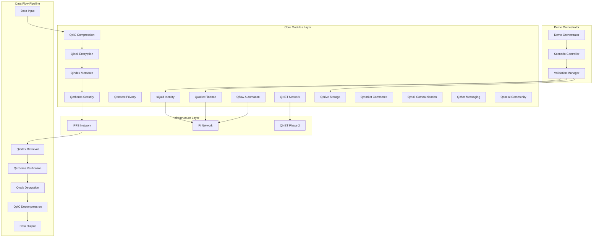

# Design Document

## Overview

The AnarQ&Q ecosystem demo is a comprehensive demonstration platform that showcases the complete integration and functionality of all 14 core modules within the AnarQ&Q decentralized ecosystem. The system operates as a production-ready validation platform that demonstrates real-world data flows, module interactions, and Pi Network integration capabilities in a fully decentralized manner.

The demo architecture follows a microservices pattern with each module operating independently while maintaining seamless integration through standardized APIs and data flows. The system is designed to run on QNET Phase 2 with external nodes, ensuring true decentralization without any central servers.

## Architecture

### High-Level Architecture



### Module Integration Architecture

The system implements a hub-and-spoke architecture where each module operates independently but communicates through standardized interfaces:

1. **Identity Layer**: sQuid provides decentralized identity management with Pi Network integration
2. **Security Layer**: Qerberos handles authentication, authorization, and audit trails
3. **Storage Layer**: Qdrive and IPFS provide decentralized storage with Qlock encryption
4. **Communication Layer**: Qmail, Qchat, and Qsocial handle various communication needs
5. **Automation Layer**: Qflow orchestrates complex workflows and smart contract execution
6. **Network Layer**: QNET Phase 2 provides the underlying decentralized network infrastructure

## Components and Interfaces

### Demo Orchestrator

**Purpose**: Central coordination of demo scenarios and validation processes

**Key Components**:
- Scenario Controller: Manages execution of identity, content, DAO, and social flows
- Validation Manager: Monitors performance metrics and validates outputs
- Report Generator: Creates comprehensive execution reports
- Environment Manager: Handles different deployment environments (local, staging, QNET Phase 2)

**Interfaces**:
```typescript
interface DemoOrchestrator {
  executeScenario(scenarioType: ScenarioType, environment: Environment): Promise<ScenarioResult>
  validateExecution(executionId: string): Promise<ValidationResult>
  generateReport(executionId: string): Promise<DemoReport>
  getHealthStatus(): Promise<HealthStatus>
}

interface ScenarioResult {
  scenarioId: string
  status: 'success' | 'failure' | 'partial'
  duration: number
  auditCid: string
  qerberosSignature: string
  moduleResults: ModuleResult[]
}
```

### Q∞ Data Flow Engine

**Purpose**: Implements and validates the complete Q∞ data processing pipeline

**Data Flow Pipeline**:
1. **Input Processing**: Raw data ingestion with validation
2. **Qompress (QpiC)**: Data compression using advanced algorithms
3. **Qlock**: Encryption with user-controlled keys
4. **Qindex**: Metadata generation and indexing
5. **Qerberos**: Security validation and audit trail creation
6. **IPFS Storage**: Decentralized storage with content addressing

**Reverse Flow**:
1. **IPFS Retrieval**: Content-addressed retrieval from IPFS
2. **Qindex Lookup**: Metadata verification and routing
3. **Qerberos Verification**: Security validation and audit verification
4. **Qlock Decryption**: Secure decryption with user keys
5. **Qompress Decompression**: Data restoration
6. **Output Delivery**: Validated data delivery to user

**Interface**:
```typescript
interface QInfinityDataFlow {
  processInput(data: any, userId: string): Promise<ProcessingResult>
  retrieveOutput(contentId: string, userId: string): Promise<RetrievalResult>
  validateIntegrity(contentId: string): Promise<IntegrityResult>
  getFlowMetrics(): Promise<FlowMetrics>
}
```

### Pi Network Integration Layer

**Purpose**: Seamless integration with Pi Network ecosystem

**Components**:
- **Pi Wallet Authentication**: Direct integration with Pi Wallet for user authentication
- **Smart Contract Executor**: Qflow-based execution of Pi Network smart contracts
- **Identity Linker**: sQuid integration for secure Pi identity management
- **Transaction Processor**: Qwallet integration for Pi transaction handling
- **DAO Governance Hooks**: Pi contract integration for DAO voting and governance mechanisms

**Interface**:
```typescript
interface PiNetworkIntegration {
  authenticateWithPiWallet(piUserId: string): Promise<AuthResult>
  linkPiIdentity(piUserId: string, squidId: string): Promise<LinkResult>
  executeSmartContract(contractAddress: string, method: string, params: any[]): Promise<ExecutionResult>
  processTransaction(transaction: PiTransaction): Promise<TransactionResult>
  executeDaoGovernanceVote(proposalId: string, vote: VoteOption, piUserId: string): Promise<GovernanceResult>
  validatePiContractGovernance(contractAddress: string): Promise<GovernanceValidation>
}
```

### Scenario Execution Engine

**Purpose**: Executes predefined demo scenarios with validation

**Scenarios**:

1. **Identity Flow Scenario**:
   - User registration through sQuid
   - Pi Wallet authentication
   - Identity verification via Qerberos
   - Qwallet setup and configuration

2. **Content Flow Scenario**:
   - Content upload through Qdrive
   - Q∞ data flow processing
   - IPFS storage and retrieval
   - Content sharing via Qsocial

3. **DAO Flow Scenario**:
   - Governance proposal creation
   - Voting through integrated modules
   - Qflow workflow execution
   - Result distribution via QNET

4. **Social Flow Scenario**:
   - Community interaction through Qsocial as social governance hub
   - Integration with sQuid sub-identities and DAOs for moderated participation
   - Data flow validation ensuring Qsocial posts follow Q∞ pipeline for storage and indexing
   - Reputation system integration with governance mechanisms
   - Communication via Qchat and Qmail

**Interface**:
```typescript
interface ScenarioEngine {
  executeIdentityFlow(params: IdentityFlowParams): Promise<ScenarioResult>
  executeContentFlow(params: ContentFlowParams): Promise<ScenarioResult>
  executeDaoFlow(params: DaoFlowParams): Promise<ScenarioResult>
  executeSocialFlow(params: SocialFlowParams): Promise<ScenarioResult>
}
```

### Deployment Manager

**Purpose**: Manages private repository setup and automated deployment across environments

**Components**:
- Repository Provisioner: Creates and configures private GitHub repository under AnarQorp
- Environment Orchestrator: Manages docker-compose deployments for different environments
- Rollback Manager: Handles deployment failures and system recovery
- Configuration Manager: Manages environment-specific configurations

**Interface**:
```typescript
interface DeploymentManager {
  provisionPrivateRepo(org: 'AnarQorp', repoName: string): Promise<RepoResult>
  runDockerCompose(env: 'local' | 'staging' | 'qnet-phase2'): Promise<DeploymentResult>
  rollbackOnFailure(): Promise<RollbackResult>
  validateDeployment(env: Environment): Promise<ValidationResult>
  generateDeploymentReport(): Promise<DeploymentReport>
}
```

## Data Models

### Core Data Models

```typescript
// Demo Execution Model
interface DemoExecution {
  executionId: string
  timestamp: Date
  environment: 'local' | 'staging' | 'qnet-phase2'
  scenarios: ScenarioExecution[]
  metrics: ExecutionMetrics
  auditTrail: AuditEntry[]
  status: ExecutionStatus
}

// Module Integration Model
interface ModuleIntegration {
  moduleId: string
  version: string
  status: 'active' | 'inactive' | 'error'
  endpoints: ModuleEndpoint[]
  dependencies: string[]
  healthCheck: HealthCheckResult
}

// Q∞ Data Flow Model
interface QInfinityFlow {
  flowId: string
  inputData: any
  processingSteps: ProcessingStep[]
  outputData: any
  integrity: IntegrityValidation
  auditCid: string
}

// Pi Network Integration Model
interface PiIntegration {
  piUserId: string
  squidId: string
  walletAddress: string
  authToken: string
  linkedContracts: string[]
  transactionHistory: PiTransaction[]
}
```

### Validation Models

```typescript
// Performance Metrics Model
interface PerformanceMetrics {
  latency: {
    p50: number
    p95: number
    p99: number
  }
  throughput: {
    requestsPerSecond: number
    dataProcessedPerSecond: number
  }
  errorRate: number
  availability: number
}

// Decentralization Validation Model
interface DecentralizationValidation {
  nodeCount: number
  geographicDistribution: string[]
  consensusHealth: number
  networkPartitionTolerance: boolean
  singlePointsOfFailure: string[]
}
```

## Error Handling

### Error Categories

1. **Module Integration Errors**:
   - Module unavailability
   - API version mismatches
   - Authentication failures
   - Network connectivity issues

2. **Data Flow Errors**:
   - Compression/decompression failures
   - Encryption/decryption errors
   - IPFS storage/retrieval issues
   - Metadata corruption

3. **Pi Network Integration Errors**:
   - Authentication failures
   - Smart contract execution errors
   - Transaction processing failures
   - Network connectivity issues

4. **Performance Errors**:
   - Latency threshold violations
   - Throughput degradation
   - Resource exhaustion
   - Timeout errors

### Error Handling Strategy

```typescript
interface ErrorHandler {
  handleModuleError(error: ModuleError): Promise<ErrorResolution>
  handleDataFlowError(error: DataFlowError): Promise<ErrorResolution>
  handlePiNetworkError(error: PiNetworkError): Promise<ErrorResolution>
  handlePerformanceError(error: PerformanceError): Promise<ErrorResolution>
}

interface ErrorResolution {
  strategy: 'retry' | 'fallback' | 'abort' | 'escalate'
  retryCount?: number
  fallbackAction?: string
  escalationLevel?: 'warning' | 'error' | 'critical'
  userMessage: string
}
```

## Testing Strategy

### Test Categories

1. **Unit Tests**: Individual module functionality
2. **Integration Tests**: Module-to-module communication
3. **End-to-End Tests**: Complete scenario execution
4. **Performance Tests**: Latency and throughput validation
5. **Security Tests**: Qerberos validation and audit trail verification
6. **Decentralization Tests**: Network resilience and fault tolerance

### Test Environments

1. **Local Environment**:
   - Docker-based module simulation
   - Local IPFS node
   - Simulated Pi Network integration

2. **Staging Environment**:
   - Distributed module deployment
   - Shared IPFS cluster
   - Pi Network testnet integration

3. **QNET Phase 2 Environment**:
   - Production-like distributed network
   - External node participation
   - Pi Network mainnet integration

### Validation Gates

```typescript
interface ValidationGates {
  performanceGate: {
    maxLatency: 2000 // milliseconds
    minThroughput: 100 // requests per second
    maxErrorRate: 0.01 // 1%
  }
  
  decentralizationGate: {
    minNodes: 5
    maxSinglePointFailures: 0
    minGeographicDistribution: 3
    dynamicNodeScaling: boolean
    qnetPhase2ScalingThresholds: {
      cpuThreshold: 70
      memoryThreshold: 80
      networkLatencyThreshold: 200
    }
  }
  
  integrityGate: {
    dataIntegrityCheck: boolean
    auditTrailCompleteness: boolean
    qerberosSignatureValidation: boolean
  }
}
```

### Continuous Validation

The system implements continuous validation through:

1. **Real-time Monitoring**: Performance metrics collection and alerting
2. **Automated Testing**: Scheduled execution of all test scenarios
3. **Health Checks**: Continuous module and network health monitoring
4. **Audit Trail Validation**: Ongoing verification of Qerberos signatures and audit CIDs

### QNET Phase 2 Scaling Architecture

The system implements dynamic node scaling on QNET Phase 2 with threshold-based triggers:

**Scaling Components**:
- **Resource Monitor**: Continuous monitoring of CPU, memory, and network metrics
- **Scaling Controller**: Automated node provisioning based on performance thresholds
- **Load Balancer**: Dynamic traffic distribution across available nodes
- **Health Manager**: Node health assessment and automatic failover

**Scaling Triggers**:
- CPU utilization > 70%: Provision additional compute nodes
- Memory utilization > 80%: Scale memory-intensive services
- Network latency > 200ms: Add geographically distributed nodes
- Error rate > 1%: Activate redundant nodes and investigate issues

**Interface**:
```typescript
interface QNETScalingManager {
  monitorResourceUsage(): Promise<ResourceMetrics>
  triggerScaling(trigger: ScalingTrigger): Promise<ScalingResult>
  balanceLoad(nodes: QNETNode[]): Promise<LoadBalancingResult>
  validateScalingHealth(): Promise<ScalingHealthResult>
}
```

This design ensures the demo system operates as a production-ready validation platform that accurately demonstrates the capabilities and performance of the complete AnarQ&Q ecosystem while maintaining the highest standards of decentralization, security, and performance. The enhanced architecture specifically addresses repository management, Pi Network DAO governance integration, Qsocial's role as a social governance hub, and dynamic scaling capabilities on QNET Phase 2.