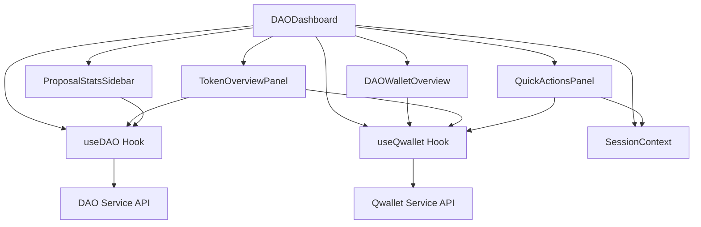

# DAO Dashboard Enhancement Design Document

## Overview

The DAO Dashboard Enhancement extends the existing DAODashboard component with economic and reputational data integration. The design maintains the current architecture while adding new components for wallet integration, token displays, enhanced metrics, and governance analytics. The enhancement follows Q∞ principles with modular components, responsive design, and seamless ecosystem integration.

## Architecture

### Component Hierarchy

```
DAODashboard.tsx (Enhanced)
├── DAOWalletOverview.tsx        # New: Token & NFT wallet summary
├── ProposalStatsSidebar.tsx     # New: Quorum statistics widget
├── QuickActionsPanel.tsx        # New: Wallet action buttons
├── EnhancedProposalCard.tsx     # Enhanced: Extended voting metrics
└── TokenOverviewPanel.tsx       # New: DAO token information display
```

### Data Flow Enhancement



## Components and Interfaces

### Enhanced DAODashboard Component

**New Props:**
```typescript
interface DAODashboardProps {
  daoId: string;
  className?: string;
  showEconomicData?: boolean; // New: Toggle economic features
  layout?: 'default' | 'compact'; // New: Layout variants
}
```

**Enhanced State:**
```typescript
interface DAODashboardState {
  // Existing state...
  walletData: WalletBalances | null;
  userNFTs: NFT[];
  tokenInfo: TokenInfo | null;
  proposalStats: ProposalStats | null;
  votingPower: number;
  showWalletActions: boolean;
}
```

### DAOWalletOverview Component

**Purpose:** Display member's wallet summary with DAO tokens and NFTs.

**Props:**
```typescript
interface DAOWalletOverviewProps {
  daoId: string;
  squidId: string;
  daoTokenSymbol: string;
  className?: string;
}
```

**Features:**
1. **Token Balance Display**
   - DAO governance token balance
   - Voting power calculation
   - Token value trends (if available)

2. **NFT Summary**
   - Count of DAO-issued NFTs
   - Recent NFT acquisitions
   - NFT-based voting weight

3. **Voting Power Indicator**
   - Visual representation of voting influence
   - Comparison to average member power
   - Historical voting participation

### TokenOverviewPanel Component

**Purpose:** Display comprehensive DAO token information.

**Props:**
```typescript
interface TokenOverviewPanelProps {
  daoId: string;
  tokenInfo?: TokenInfo;
  className?: string;
}
```

**Data Sources:**
1. **Primary:** Extended DAO data from `getDAO(daoId)`
2. **Fallback:** QwalletService token information
3. **Cached:** Local storage for performance

**Display Elements:**
- Token name, symbol, and type
- Total and circulating supply
- Holder count and distribution
- Governance mechanism indicator

### ProposalStatsSidebar Component

**Purpose:** Show historical governance statistics and trends.

**Props:**
```typescript
interface ProposalStatsSidebarProps {
  daoId: string;
  proposals: Proposal[];
  results: DAOResults | null;
  className?: string;
}
```

**Calculated Metrics:**
```typescript
interface ProposalStats {
  quorumReachRate: number; // Percentage of proposals reaching quorum
  averageParticipation: number; // Average voter turnout
  averageTimeToQuorum: number | null; // Hours to reach quorum
  topProposals: Array<{
    id: string;
    title: string;
    votePercentage: number;
    participationRate: number;
  }>;
  participationTrend: 'increasing' | 'decreasing' | 'stable';
}
```

### QuickActionsPanel Component

**Purpose:** Provide quick access to wallet operations for eligible users.

**Props:**
```typescript
interface QuickActionsPanelProps {
  daoId: string;
  userRole: 'member' | 'moderator' | 'admin' | 'owner';
  hasTokens: boolean;
  hasNFTs: boolean;
  onAction: (action: string) => void;
  className?: string;
}
```

**Action Buttons:**
1. **Mint NFT** - For moderators/admins
2. **Transfer Token** - Opens TokenTransferForm
3. **View NFT Gallery** - Opens NFTGallery modal
4. **Delegate Voting** - Future enhancement

### Enhanced ProposalCard Component

**Extended Props:**
```typescript
interface EnhancedProposalCardProps extends ProposalCardProps {
  showVotingBreakdown?: boolean;
  showQuorumProgress?: boolean;
  votingMechanism: 'user-based' | 'token-weighted' | 'nft-weighted';
}
```

**New Display Elements:**
- Voting weight distribution chart
- Unique voter count vs total votes
- Quorum progress indicator
- Time-based participation metrics

## Data Models

### Enhanced DAO Interface
```typescript
interface EnhancedDAO extends DetailedDAO {
  tokenInfo?: {
    name: string;
    symbol: string;
    totalSupply: number;
    circulatingSupply: number;
    holderCount: number;
    contractAddress: string;
    type: 'user-based' | 'token-weighted' | 'nft-weighted';
  };
  economicMetrics?: {
    totalValueLocked: number;
    averageHolding: number;
    distributionIndex: number; // Gini coefficient for token distribution
  };
}
```

### Voting Power Interface
```typescript
interface VotingPower {
  squidId: string;
  daoId: string;
  tokenBalance: number;
  nftCount: number;
  votingWeight: number;
  percentageOfTotal: number;
  rank: number; // Ranking among all members
  lastUpdated: string;
}
```

### Proposal Analytics Interface
```typescript
interface ProposalAnalytics extends Proposal {
  votingBreakdown: {
    byWeight: Record<string, number>;
    byCount: Record<string, number>;
    uniqueVoters: number;
    totalWeight: number;
  };
  participationMetrics: {
    voterTurnout: number; // Percentage of eligible voters
    weightTurnout: number; // Percentage of total voting weight
    timeToQuorum: number | null; // Minutes to reach quorum
    votingPattern: 'early' | 'late' | 'consistent';
  };
  quorumStatus: {
    required: number;
    current: number;
    achieved: boolean;
    projectedCompletion: string | null;
  };
}
```

## API Integration

### Enhanced DAO Service Endpoints
- `GET /api/dao/:daoId/token-info` - Get DAO token details
- `GET /api/dao/:daoId/voting-power/:squidId` - Get user's voting power
- `GET /api/dao/:daoId/analytics` - Get governance analytics
- `GET /api/dao/:daoId/proposals/:proposalId/analytics` - Get proposal analytics

### Qwallet Service Integration
```typescript
// Enhanced useQwallet integration
const {
  getBalance,
  listUserNFTs,
  getAllBalances,
  mintNFT,
  transferFunds
} = useQwallet();

// New DAO-specific wallet methods
const getDaoTokenBalance = async (squidId: string, daoTokenSymbol: string) => {
  return await getBalance(squidId, daoTokenSymbol);
};

const getDaoNFTs = async (squidId: string, daoId: string) => {
  const allNFTs = await listUserNFTs(squidId);
  return allNFTs.filter(nft => nft.attributes?.some(attr => 
    attr.trait_type === 'dao_id' && attr.value === daoId
  ));
};
```

## Layout Design

### Desktop Layout (2-Column)
```
┌─────────────────────────────────────────────────────────────┐
│ DAO Header (Full Width)                                     │
├─────────────────────────────┬───────────────────────────────┤
│ Left Column                 │ Right Column                  │
│ ┌─────────────────────────┐ │ ┌───────────────────────────┐ │
│ │ DAO Information         │ │ │ Token Overview Panel      │ │
│ └─────────────────────────┘ │ └───────────────────────────┘ │
│ ┌─────────────────────────┐ │ ┌───────────────────────────┐ │
│ │ Proposals List          │ │ │ Member Wallet Summary     │ │
│ │                         │ │ └───────────────────────────┘ │
│ │                         │ │ ┌───────────────────────────┐ │
│ │                         │ │ │ Quick Actions Panel       │ │
│ │                         │ │ └───────────────────────────┘ │
│ │                         │ │ ┌───────────────────────────┐ │
│ │                         │ │ │ Proposal Stats Sidebar    │ │
│ └─────────────────────────┘ │ └───────────────────────────┘ │
└─────────────────────────────┴───────────────────────────────┘
```

### Mobile Layout (Stacked)
```
┌─────────────────────────────────┐
│ DAO Header                      │
├─────────────────────────────────┤
│ Token Overview Panel            │
├─────────────────────────────────┤
│ Member Wallet Summary           │
├─────────────────────────────────┤
│ Quick Actions Panel             │
├─────────────────────────────────┤
│ DAO Information                 │
├─────────────────────────────────┤
│ Proposal Stats Summary          │
├─────────────────────────────────┤
│ Proposals List                  │
└─────────────────────────────────┘
```

## Error Handling

### Error Categories
1. **Wallet Connection Errors**
   - No wallet connected
   - Insufficient permissions
   - Network connectivity issues

2. **Data Loading Errors**
   - Token information unavailable
   - NFT metadata loading failures
   - Analytics calculation errors

3. **Permission Errors**
   - Insufficient role for actions
   - Non-member access attempts
   - Authentication failures

### Error Display Strategy
```typescript
interface ErrorState {
  walletError: string | null;
  tokenError: string | null;
  analyticsError: string | null;
  permissionError: string | null;
}

// Graceful degradation approach
const renderWithFallback = (component: ReactNode, error: string | null, fallback: ReactNode) => {
  if (error) {
    return (
      <div className="bg-yellow-50 border border-yellow-200 rounded-lg p-4">
        <p className="text-yellow-800 text-sm">{error}</p>
        {fallback}
      </div>
    );
  }
  return component;
};
```

## Testing Strategy

### Unit Tests
- Component rendering with various props
- Hook functionality and state management
- Utility functions for calculations
- Error handling scenarios

### Integration Tests
- Wallet service integration
- DAO service API interactions
- Cross-component data flow
- Permission-based rendering

### E2E Tests
- Complete wallet integration workflow
- Token transfer and NFT minting flows
- Analytics display accuracy
- Responsive design validation

## Performance Considerations

### Optimization Strategies
1. **Lazy Loading**
   - Load wallet data only for authenticated members
   - Defer analytics calculations until needed
   - Progressive image loading for NFTs

2. **Caching Strategy**
   - Cache token information for 5 minutes
   - Cache user voting power for 2 minutes
   - Cache proposal analytics for 1 minute
   - Persist user preferences locally

3. **Efficient Updates**
   - Use React.memo for expensive components
   - Implement debounced refresh for real-time data
   - Batch API calls where possible

### Memory Management
```typescript
// Cleanup strategy for component unmounting
useEffect(() => {
  return () => {
    // Clear intervals and timeouts
    clearInterval(refreshInterval);
    // Cancel pending API requests
    abortController.abort();
    // Clear large data structures
    setAnalyticsData(null);
  };
}, []);
```

## Security Considerations

### Access Control
- Role-based component rendering
- API endpoint permission validation
- Secure token transfer confirmations
- Audit logging for sensitive operations

### Data Protection
- Sanitize all user inputs
- Validate API responses
- Encrypt sensitive wallet data in transit
- Implement rate limiting for expensive operations

## Accessibility Features

### WCAG 2.1 Compliance
- **Keyboard Navigation:** Full keyboard support for all interactive elements
- **Screen Reader Support:** Comprehensive ARIA labels and descriptions
- **Color Accessibility:** High contrast ratios and color-blind friendly palettes
- **Focus Management:** Clear focus indicators and logical tab order

### Responsive Design
- **Mobile Optimization:** Touch-friendly interface with appropriate target sizes
- **Flexible Layouts:** Adapts to various screen sizes and orientations
- **Progressive Enhancement:** Core functionality works without JavaScript
- **Performance:** Optimized loading for slower connections

## Future Enhancements

### Phase 2 Features
1. **Advanced Analytics**
   - Governance participation trends
   - Token distribution analysis
   - Proposal success prediction

2. **Social Features**
   - Member reputation scores
   - Delegation networks
   - Governance discussion threads

3. **Economic Tools**
   - Token staking mechanisms
   - Yield farming integration
   - Treasury management tools