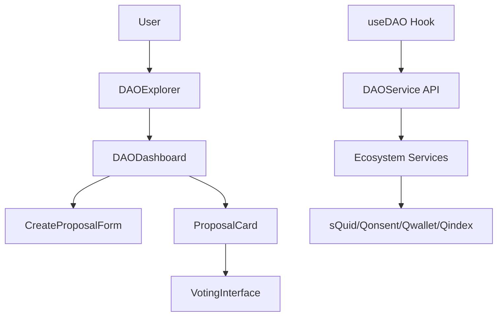

# DAO Governance Design Document

## Overview

The DAO Governance module provides a comprehensive interface for decentralized autonomous organization management within the AnarQ&Q ecosystem. The design follows Q∞ principles with modular architecture, sQuid identity integration, and seamless ecosystem connectivity.

## Architecture

### Component Hierarchy

```
DAOGovernance/
├── DAOExplorer.tsx          # DAO discovery and browsing
├── DAODashboard.tsx         # Individual DAO management
├── CreateProposalForm.tsx   # Proposal creation interface
├── ProposalCard.tsx         # Individual proposal display
├── VotingInterface.tsx      # Voting interaction component
└── useDAO.ts               # React hook for DAO operations
```

### Data Flow



## Components and Interfaces

### DAODashboard Component

**Purpose:** Main interface for individual DAO management and proposal interaction.

**Props:**
```typescript
interface DAODashboardProps {
  daoId: string;
  className?: string;
}
```

**State Management:**
- DAO details and metadata
- Proposal list with pagination
- User membership status
- Loading and error states
- Modal states for forms

**Key Features:**
1. **DAO Information Display**
   - Name, description, visibility
   - Member count and quorum requirements
   - Governance rules and token requirements

2. **Proposal Management**
   - List all proposals with status
   - Filter by active/closed status
   - Pagination for large proposal lists
   - Real-time updates for active proposals

3. **Member Actions**
   - Join DAO if not a member
   - Create proposals if eligible
   - Vote on active proposals
   - View voting history

4. **Access Control**
   - Check membership status
   - Validate proposal creation rights
   - Verify voting eligibility
   - Display appropriate UI based on permissions

### API Integration

**DAO Service Endpoints:**
- `GET /api/dao/:daoId` - Fetch DAO details
- `GET /api/dao/:daoId/proposals` - List proposals
- `POST /api/dao/:daoId/join` - Join DAO
- `GET /api/dao/:daoId/membership` - Check membership
- `POST /api/dao/:daoId/proposals` - Create proposal

**Hook Methods:**
```typescript
const {
  currentDAO,
  proposals,
  membership,
  loading,
  error,
  getDAO,
  getProposals,
  joinDAO,
  getMembership,
  createProposal
} = useDAO();
```

## Data Models

### DAO Interface
```typescript
interface DetailedDAO {
  id: string;
  name: string;
  description: string;
  visibility: 'public' | 'dao-only' | 'private';
  memberCount: number;
  quorum: number;
  governanceRules: {
    votingDuration: number;
    tokenRequirement: {
      token: string;
      amount: number;
    };
    proposalCreationRights: string;
    votingMechanism: string;
  };
  activeProposals: ProposalSummary[];
  recentActivity: Activity[];
}
```

### Proposal Interface
```typescript
interface Proposal {
  id: string;
  daoId: string;
  title: string;
  description: string;
  options: string[];
  createdBy: string;
  createdAt: string;
  expiresAt: string;
  status: 'active' | 'closed';
  voteCount: number;
  quorum: number;
  results: Record<string, { count: number; weight: number }>;
  quorumReached: boolean;
}
```

## Error Handling

### Error Types
1. **Network Errors** - API connectivity issues
2. **Authentication Errors** - sQuid identity validation failures
3. **Permission Errors** - Insufficient rights for actions
4. **Validation Errors** - Invalid input data
5. **Business Logic Errors** - DAO rules violations

### Error Display Strategy
- **Toast Notifications** - For temporary errors
- **Inline Messages** - For form validation errors
- **Error Boundaries** - For component-level failures
- **Fallback UI** - For critical failures

## Testing Strategy

### Unit Tests
- Component rendering and props handling
- Hook functionality and state management
- Utility functions and data transformations
- Error handling scenarios

### Integration Tests
- API endpoint interactions
- Ecosystem service integration
- User workflow testing
- Permission and access control

### E2E Tests
- Complete DAO joining workflow
- Proposal creation and voting flow
- Multi-user governance scenarios
- Cross-module integration testing

## Performance Considerations

### Optimization Strategies
1. **Lazy Loading** - Load proposals on demand
2. **Memoization** - Cache expensive computations
3. **Virtual Scrolling** - Handle large proposal lists
4. **Debounced Search** - Optimize filtering operations
5. **Background Updates** - Refresh data without blocking UI

### Caching Strategy
- **DAO Details** - Cache for 5 minutes
- **Proposals** - Cache active proposals for 1 minute
- **Membership Status** - Cache for session duration
- **Vote Results** - Cache completed votes indefinitely

## Security Considerations

### Authentication
- All actions require valid sQuid identity
- Token-based API authentication
- Session validation and refresh

### Authorization
- Qonsent-based access control
- Token/NFT balance verification
- Role-based permission checking

### Data Validation
- Input sanitization and validation
- SQL injection prevention
- XSS protection
- CSRF token validation

## Accessibility Features

### WCAG 2.1 Compliance
- **Keyboard Navigation** - Full keyboard accessibility
- **Screen Reader Support** - ARIA labels and descriptions
- **Color Contrast** - Minimum 4.5:1 contrast ratio
- **Focus Management** - Clear focus indicators
- **Alternative Text** - Images and icons have alt text

### Responsive Design
- **Mobile First** - Optimized for mobile devices
- **Touch Targets** - Minimum 44px touch targets
- **Viewport Scaling** - Proper viewport meta tags
- **Flexible Layouts** - Adapts to different screen sizes