# Design Document

## Overview

Este documento presenta el diseño técnico para la consolidación y estructuración de toda la documentación del ecosistema AnarQ&Q, junto con la creación de guiones de video para presentaciones. El sistema aprovechará la infraestructura de automatización existente y creará una nueva estructura organizacional que facilite el acceso, mantenimiento y producción de contenido audiovisual.

## Architecture

### Current State Analysis

El ecosistema actualmente cuenta con:
- **Documentación técnica completa** en `/docs` con 14 módulos documentados
- **Sistema de automatización** existente para validación y generación
- **Whitepapers** en inglés (AnarQ_Q_Whitepaper_EN.pdf, anarq_whitepaper_en.pdf)
- **Documentación modular** bien estructurada por módulo
- **Specs técnicas** en `.kiro/specs/` para diferentes funcionalidades
- **Análisis técnicos** distribuidos en varios archivos de resumen

### Target Architecture

```mermaid
graph TB
    subgraph "Documentation Structure"
        Global["/docs/global/"]
        Modules["/docs/modules/"]
        Scripts["/docs/video-scripts/"]
        Validation["/docs/validation/"]
    end

    subgraph "Global Documentation"
        Vision["vision-overview.md"]
        Architecture["q-infinity-architecture.md"]
        Strategy["strategic-narrative.md"]
        Whitepapers["whitepapers/"]
        TechAnalysis["technical-analysis/"]
    end

    subgraph "Video Scripts"
        GlobalScript["global/ecosystem-overview.md"]
        ModuleScripts["modules/[module-name].md"]
        Languages["en/ & es/"]
    end

    subgraph "Automation System"
        Validator["docs-validator.mjs"]
        Generator["script-generator.mjs"]
        IndexBuilder["master-index-builder.mjs"]
    end

    Global --> Vision
    Global --> Architecture
    Global --> Strategy
    Global --> Whitepapers
    Global --> TechAnalysis
    
    Scripts --> GlobalScript
    Scripts --> ModuleScripts
    Scripts --> Languages
    
    Validation --> Validator
    Validation --> Generator
    Validation --> IndexBuilder
```



## Components and Interfaces

### 1. Documentation Restructuring System

#### GlobalDocumentationManager
```typescript
interface GlobalDocumentationManager {
  consolidateWhitepapers(): Promise<void>
  extractTechnicalAnalysis(): Promise<void>
  createVisionOverview(): Promise<void>
  buildArchitectureDoc(): Promise<void>
  generateStrategicNarrative(): Promise<void>
}
```

#### ModuleDocumentationNormalizer
```typescript
interface ModuleDocumentationNormalizer {
  normalizeFormat(moduleName: string): Promise<void>
  addMetadata(document: Document): Document
  validateCompleteness(moduleName: string): ValidationResult
  generateCrossReferences(): Promise<void>
}
```

### 2. Video Script Generation System

#### ScriptGenerator
```typescript
interface ScriptGenerator {
  generateGlobalScript(language: 'en' | 'es'): Promise<VideoScript>
  generateModuleScript(moduleName: string, language: 'en' | 'es'): Promise<VideoScript>
  validateScriptStructure(script: VideoScript): ValidationResult
  addVisualCues(script: VideoScript): VideoScript
}

interface VideoScript {
  title: string
  duration: string
  language: 'en' | 'es'
  sections: ScriptSection[]
  visualCues: VisualCue[]
  metadata: ScriptMetadata
}

interface ScriptSection {
  title: string
  content: string
  duration: string
  visualSuggestions: string[]
  keyPoints: string[]
}
```

### 3. Validation and Automation System

#### DocumentationValidator
```typescript
interface DocumentationValidator {
  validateStructure(): ValidationResult
  checkCompleteness(): CompletenessReport
  validateLinks(): LinkValidationResult
  checkMetadata(): MetadataValidationResult
  runAutomatedChecks(): Promise<ValidationSummary>
}
```

#### MasterIndexBuilder
```typescript
interface MasterIndexBuilder {
  buildGlobalIndex(): Promise<void>
  buildModuleIndex(): Promise<void>
  buildScriptIndex(): Promise<void>
  generateNavigationMap(): NavigationMap
  updateCrossReferences(): Promise<void>
}
```

## Data Models

### Document Metadata Schema
```json
{
  "version": "1.0.0",
  "author": "string",
  "lastModified": "ISO-8601",
  "reviewedBy": "string",
  "module": "string | null",
  "relatedModules": ["string"],
  "ecosystemVersion": "v1.0.0 | v2.0.0",
  "category": "global | module | script | technical-analysis",
  "language": "en | es",
  "completeness": "draft | review | complete",
  "dependencies": ["string"],
  "tags": ["string"]
}
```

### Video Script Schema
```json
{
  "title": "string",
  "duration": "string",
  "language": "en | es",
  "targetAudience": "developers | business | general",
  "sections": [
    {
      "title": "string",
      "content": "string",
      "duration": "string",
      "visualSuggestions": ["string"],
      "keyPoints": ["string"]
    }
  ],
  "visualCues": [
    {
      "timestamp": "string",
      "type": "diagram | screenshot | animation",
      "description": "string",
      "source": "string"
    }
  ],
  "metadata": {
    "version": "string",
    "author": "string",
    "reviewStatus": "draft | review | approved",
    "assets": ["cid://ipfs_hash", "s3://bucket/..."]
  }
}
```

## Error Handling

### Documentation Processing Errors
- **Missing Files**: Graceful handling with clear error messages
- **Format Inconsistencies**: Automatic normalization where possible
- **Broken Links**: Comprehensive link validation and repair suggestions
- **Metadata Validation**: Strict validation with helpful error messages

### Script Generation Errors
- **Content Extraction Failures**: Fallback to manual templates
- **Translation Issues**: Clear marking of untranslated content
- **Duration Calculation Errors**: Conservative estimates with warnings
- **Visual Cue Mapping**: Graceful degradation without visual suggestions

### Validation Errors
- **Completeness Checks**: Detailed reports with actionable items
- **Cross-Reference Validation**: Automatic repair where possible
- **Automation Failures**: Comprehensive logging and recovery procedures

## Testing Strategy

### Unit Testing
- **Document Processing Functions**: Test normalization, metadata extraction
- **Script Generation Logic**: Test content extraction, formatting
- **Validation Functions**: Test all validation rules and edge cases
- **Index Building**: Test cross-reference generation and navigation

### Integration Testing
- **End-to-End Documentation Flow**: From source to final structure
- **Script Generation Pipeline**: From documentation to video scripts
- **Validation Integration**: Test automation system integration
- **Cross-Module Dependencies**: Test module interaction documentation

### Content Quality Testing
- **Documentation Completeness**: Automated checks for all required sections
- **Script Quality**: Duration validation, content coherence
- **Language Consistency**: Terminology validation across languages
- **Visual Cue Accuracy**: Validation of suggested visual elements

## Implementation Phases

### Phase 1: Documentation Analysis and Restructuring
1. **Audit Current Documentation**
   - Scan all existing documents
   - Identify content categories and quality
   - Map current structure to target structure

2. **Create Global Documentation Structure**
   - Extract and consolidate whitepapers
   - Compile technical analyses
   - Create vision and strategy documents

3. **Normalize Module Documentation**
   - Apply consistent formatting
   - Add required metadata
   - Validate completeness

### Phase 2: Video Script Generation System
1. **Develop Script Templates**
   - Global ecosystem template
   - Module-specific templates
   - Bilingual support (EN/ES)

2. **Content Extraction Engine**
   - Parse existing documentation
   - Extract key points and benefits
   - Generate structured content

3. **Script Assembly System**
   - Combine templates with extracted content
   - Add visual cues and timing
   - Generate final scripts

### Phase 3: Automation and Validation
1. **Enhanced Validation System**
   - Extend existing automation
   - Add script-specific validation
   - Implement completeness checking

2. **Master Index System**
   - Build comprehensive navigation
   - Generate cross-references
   - Create search capabilities

3. **Continuous Integration**
   - Automated validation on changes
   - Script regeneration triggers
   - Quality assurance workflows

### Phase 4: Qflow Integration (Optional)
1. **Automated Documentation Pipeline**
   - Trigger: Changes detected in `/docs`
   - Pipeline: Validation → Index regeneration → Script generation
   - Result: Real-time updates to public portal

2. **Workflow Automation**
   - Automated review assignments
   - Notification system for stakeholders
   - Automated deployment to documentation portal

3. **Integration Benefits**
   - Real-time documentation updates
   - Automated quality assurance
   - Streamlined content publication workflow

## Security Considerations

### Content Security
- **Version Control**: All documentation changes tracked
- **Access Control**: Appropriate permissions for editing
- **Backup Strategy**: Regular backups of all documentation
- **Integrity Validation**: Checksums for critical documents

### Script Security
- **Content Review**: All scripts require review before approval
- **Translation Validation**: Bilingual content consistency checks
- **Visual Asset Security**: Secure handling of referenced visual materials
- **Asset Integration**: Secure linking to IPFS and cloud storage assets
- **Distribution Control**: Controlled access to final video scripts

## Performance Considerations

### Documentation Processing
- **Incremental Updates**: Only process changed documents
- **Parallel Processing**: Concurrent processing of independent modules
- **Caching Strategy**: Cache processed content and metadata
- **Efficient Indexing**: Optimized search and navigation structures

### Script Generation
- **Template Caching**: Reuse compiled templates
- **Content Extraction Optimization**: Efficient parsing algorithms
- **Batch Processing**: Generate multiple scripts in batches
- **Resource Management**: Efficient memory usage for large documents

## Monitoring and Maintenance

### Documentation Health Monitoring
- **Completeness Metrics**: Track documentation coverage
- **Quality Metrics**: Monitor content quality scores
- **Update Frequency**: Track documentation freshness
- **Link Health**: Monitor and report broken links
- **Version Tracking**: % of docs with outdated ecosystem version
- **Review Backlog**: % of scripts pending review approval

### Script Quality Monitoring
- **Content Accuracy**: Validate script content against source
- **Duration Compliance**: Monitor script timing accuracy
- **Translation Quality**: Track bilingual consistency
- **Review Status**: Monitor approval workflow progress
- **Asset Integration**: Track visual asset availability and quality

### Automation System Monitoring
- **Validation Success Rates**: Track automation reliability
- **Processing Performance**: Monitor generation times
- **Error Rates**: Track and analyze failure patterns
- **System Health**: Monitor overall system performance

### Key Performance Indicators (KPIs)
- **Documentation Freshness**: % of docs with version < current ecosystem version
- **Review Efficiency**: % of scripts pending review vs. total scripts
- **Link Health Score**: Number of broken links detected per validation cycle
- **Content Coverage**: % of modules with complete documentation sets
- **Bilingual Parity**: % of content available in both EN/ES languages