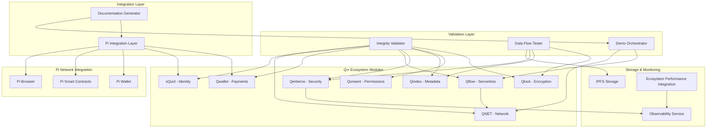

# Design Document

## Overview

El sistema de validación de integridad del ecosistema AnarQ&Q está diseñado para garantizar la coherencia completa entre todos los módulos Q∞, validar flujos de datos de extremo a extremo, preparar demostraciones estables e integrar Pi Network. La arquitectura se basa en cinco componentes principales que trabajan de manera coordinada para proporcionar validación integral, monitoreo de rendimiento y documentación automatizada.

## Architecture



## Components and Interfaces

### 1. Integrity Validator

**Propósito**: Validar la salud y coherencia de todos los módulos del ecosistema Q∞.

**Interfaces**:
```javascript
class IntegrityValidator {
  async validateEcosystemHealth()
  async validateCrossLayerIntegrity()
  async generateIntegrityReport()
  async validateModuleEndpoints(moduleId)
  async validateQflowCoherence()
  async verifyDecentralizationAttestation()
  async validateCriticalConsensus(execId, stepId)
  async validatePerformanceGates()
}
```

**Funcionalidades**:
- Health checks individuales por módulo (status, endpoints, configuración)
- Validaciones cruzadas Q∞: Qlock → Qonsent → Qindex → Qerberos
- Validación de Qflow como orchestrator distribuido en nodos QNET
- **Verificación de Descentralización**: Attestation criptográfico que certifica ausencia de dependencias centralizadas
- **Consenso Crítico**: Validación de quorum/2PC para operaciones críticas (pagos, gobernanza)
- **Performance Gates**: Integración con Task 35/36 (p99, burn-rate, cache hit)
- Generación de informes de integridad con anomalías y recomendaciones
- Detección automática de inconsistencias entre módulos

### 2. Data Flow Tester

**Propósito**: Verificar flujos de datos completos de extremo a extremo con validación de integridad.

**Interfaces**:
```javascript
class DataFlowTester {
  async testInputFlow(data, options)
  async testOutputFlow(ipfsHash, options)
  async validateQflowExecution(workflow, nodes)
  async runStressTests(eventCount, parallelism)
  async verifySignaturesAndHashes(flowData)
  async verifyExecutionLedger(execId)
  async deterministicReplay(execId)
  async validateGossipsubBackpressure()
}
```

**Flujos de Validación**:
1. **Flujo de Entrada**: `data → Qompress → Qlock → Qindex → Qerberos → IPFS`
2. **Flujo de Salida**: `IPFS → Qindex → Qerberos → Qlock → Qompress → user`
3. **Validación Qflow**: Ejecución serverless en nodos QNET con confirmación de estado
4. **Execution Ledger**: Verificación de hash-chain + vector clocks para auditoría completa
5. **Deterministic Replay**: Reproducción determinista de ejecuciones para validar consistencia
6. **Gossipsub Backpressure**: Validación de fair scheduling y reanuncio con backoff
7. **Pruebas de Estrés**: 1000+ eventos en paralelo con <5% error rate

### 3. Demo Orchestrator

**Propósito**: Preparar y ejecutar escenarios de demostración reproducibles.

**Interfaces**:
```javascript
class DemoOrchestrator {
  async prepareDemoEnvironment(scenarios)
  async executeDemoScenario(scenarioId, options)
  async generateDemoData(dataType, count)
  async validateDemoResults(scenarioId, expectedOutputs)
  async deployToQNETPhase2(configuration)
  async warmUpPaths()
  async produceNoCentralServerReport()
}
```

**Escenarios de Demo**:
1. **Flujo de Identidad**: Creación sQuid → Qwallet → Transacción → Qerberos audit
2. **Flujo de Contenido**: Upload → Qlock encryption → Qindex metadata → IPFS storage
3. **Flujo DAO**: Governance → Voting → Qflow execution → QNET distribution
4. **No Central Server**: Demostración de kill-first-launcher con continuidad en otros nodos
5. **Cache Warm-up**: Pre-calentamiento de paths críticos para demos estables

### 4. Pi Integration Layer

**Propósito**: Integrar Pi Network con el ecosistema AnarQ&Q de manera nativa.

**Interfaces**:
```javascript
class PiIntegrationLayer {
  async integratePiWallet(qwalletInstance, piCredentials)
  async deployPiSmartContract(contractCode, qflowWorkflow)
  async linkPiIdentity(squidId, piUserId)
  async validatePiBrowserCompatibility(apiEndpoints)
  async executePiTransaction(transactionData, qflowContext)
  setEnvironment(env)
  async checkPiBrowserCSP()
  async verifyWebhookSignature(headers, body)
}
```

**Componentes de Integración**:
- **Pi Wallet Adapter**: Conecta Qwallet con Pi Wallet para transacciones nativas
- **Pi Smart Contract Templates**: Contratos pre-configurados para integración con Qflow
- **sQuid ↔ Pi Identity Binding**: Vinculación segura de identidades Pi con sQuid
- **Pi Browser Compatibility**: APIs nativas para developers Pi con CSP validation
- **Multi-Environment Support**: Perfiles pi-sandbox, pi-testnet, pi-mainnet
- **Webhook Security**: Verificación de firmas y aplicación de scopes Qonsent

### 5. Documentation Generator

**Propósito**: Generar documentación bilingüe automatizada con diagramas actualizados.

**Interfaces**:
```javascript
class DocumentationGenerator {
  async generatePiDocumentation(language, outputPath)
  async generateDemoDocumentation(scenarios, language)
  async updateDiagramsAndFlows(moduleChanges)
  async validateDocumentationConsistency()
  async generateBilingualContent(sourceContent, targetLanguage)
  async updateDiagramsWithRealMetrics(validationResults)
}
```

**Estructura de Documentación**:
```
/docs/pi/
├── en/
│   ├── wallet-integration.md
│   ├── smart-contracts.md
│   ├── identity-linking.md
│   ├── browser-compatibility.md
│   └── example-workflows.md
├── es/
│   ├── integracion-wallet.md
│   ├── contratos-inteligentes.md
│   ├── vinculacion-identidad.md
│   ├── compatibilidad-navegador.md
│   └── flujos-ejemplo.md
└── diagrams/
    ├── pi-integration-flow.mermaid
    ├── wallet-architecture.mermaid
    └── identity-binding.mermaid

/docs/demo/
├── en/
│   ├── setup-guide.md
│   ├── test-scenarios.md
│   ├── expected-results.md
│   └── troubleshooting.md
├── es/
│   ├── guia-configuracion.md
│   ├── escenarios-prueba.md
│   ├── resultados-esperados.md
│   └── solucion-problemas.md
└── scripts/
    ├── demo-setup.sh
    ├── demo-run-identity.sh
    ├── demo-run-content.sh
    ├── demo-run-dao.sh
    ├── demo-validate.sh
    └── fixtures/
        ├── canonical-identities.json
        ├── test-content-samples.json
        └── dao-governance-scenarios.json
```

## Data Models

### Integrity Report Model
```javascript
{
  reportId: string,
  timestamp: string,
  overallStatus: 'healthy' | 'degraded' | 'critical',
  moduleResults: {
    [moduleId]: {
      status: 'healthy' | 'degraded' | 'failed',
      endpoints: EndpointStatus[],
      integrations: IntegrationStatus[],
      performance: PerformanceMetrics,
      anomalies: Anomaly[]
    }
  },
  attestations: {
    decentralization: { 
      attestationCID: string, 
      checks: string[],
      noCentralDependencies: boolean,
      ipfsRequired: boolean,
      libp2pActive: boolean
    }
  },
  crossLayerValidation: {
    qflowCoherence: ValidationResult,
    dataFlowIntegrity: ValidationResult,
    dependencyConsistency: ValidationResult,
    criticalConsensus: { 
      passed: boolean, 
      quorum: number, 
      threshold: number, 
      votes: string[] 
    }
  },
  performanceGates: {
    p95Regression: boolean,
    p99Regression: boolean,
    errorBudgetOk: boolean,
    cacheHitRate: number
  },
  recommendations: Recommendation[]
}
```

### Data Flow Validation Model
```javascript
{
  flowId: string,
  flowType: 'input' | 'output' | 'qflow_execution',
  startTime: string,
  endTime: string,
  steps: FlowStep[],
  validation: {
    hashVerification: boolean,
    signatureValidation: boolean,
    integrityCheck: boolean,
    executionLedger: { 
      chainValid: boolean, 
      lastRecordCID: string,
      vectorClocks: { [nodeId]: number }
    },
    deterministicReplay: { 
      deterministic: boolean, 
      divergenceAt?: string,
      replayDuration: number
    },
    gossipsubBackpressure: {
      fairnessIndex: number,
      lostJobs: number,
      backoffCompliance: boolean
    },
    performanceMetrics: {
      totalDuration: number,
      stepDurations: { [stepId]: number },
      errorRate: number,
      throughput: number
    }
  },
  anomalies: FlowAnomaly[]
}
```

### Pi Integration Model
```javascript
{
  integrationId: string,
  piUserId: string,
  squidId: string,
  walletAddress: string,
  contractAddresses: string[],
  environment: 'sandbox' | 'testnet' | 'mainnet',
  browserCompatibility: {
    apiVersion: string,
    supportedFeatures: string[],
    limitations: string[],
    cspCompliance: boolean,
    missingHeaders: string[]
  },
  qonsentScopes: string[],
  webhook: {
    signatureAlgo: 'ed25519' | 'bls' | 'dilithium',
    lastVerifiedAt: string,
    verificationStatus: 'valid' | 'invalid' | 'expired'
  },
  transactionHistory: PiTransaction[],
  securityBindings: {
    identityHash: string,
    bindingTimestamp: string,
    verificationStatus: 'verified' | 'pending' | 'failed'
  }
}
```

## Error Handling

### Validation Error Categories
1. **Module Health Errors**: Fallos en endpoints, configuración incorrecta, servicios no disponibles
2. **Cross-Layer Errors**: Inconsistencias entre módulos, fallos de comunicación, datos corruptos
3. **Data Flow Errors**: Interrupciones en el flujo, fallos de verificación, timeouts
4. **Pi Integration Errors**: Fallos de autenticación Pi, contratos inválidos, incompatibilidades de browser
5. **Demo Execution Errors**: Fallos de setup, datos de prueba inválidos, timeouts de escenario

### Error Recovery Strategies
```javascript
class ErrorRecoveryManager {
  async handleModuleFailure(moduleId, error) {
    // Retry with exponential backoff
    // Fallback to degraded mode
    // Alert monitoring systems
  }
  
  async handleDataFlowInterruption(flowId, step, error) {
    // Resume from last valid checkpoint
    // Validate data integrity
    // Log detailed error context
  }
  
  async handlePiIntegrationFailure(integrationId, error) {
    // Retry Pi authentication
    // Fallback to native Qwallet
    // Maintain transaction consistency
  }
}
```

## Testing Strategy

### Unit Testing
- Cada componente tiene tests unitarios independientes
- Mocking de dependencias externas (Pi Network, IPFS, QNET)
- Cobertura mínima del 90% en funciones críticas

### Integration Testing
- Tests de integración entre módulos Q∞
- Validación de flujos completos de datos
- Tests de rendimiento con cargas simuladas

### End-to-End Testing
- Escenarios completos de demo automatizados
- Tests de integración Pi Network en testnet
- Validación de documentación generada

### Performance Testing
- Stress tests con 1000+ eventos paralelos
- Benchmarks de latencia por módulo
- Tests de degradación gradual bajo carga

### Demo Validation Testing
```javascript
describe('Demo Scenarios', () => {
  it('should execute identity flow demo in <30 seconds', async () => {
    const result = await demoOrchestrator.executeDemoScenario('identity-flow');
    expect(result.duration).toBeLessThan(30000);
    expect(result.success).toBe(true);
  });
  
  it('should validate Pi integration demo with real Pi testnet', async () => {
    const result = await demoOrchestrator.executeDemoScenario('pi-integration');
    expect(result.piTransactionConfirmed).toBe(true);
    expect(result.squidIdentityLinked).toBe(true);
  });
});
```

## Performance Considerations

### Optimization Strategies
1. **Parallel Validation**: Ejecutar validaciones de módulos en paralelo cuando sea posible
2. **Caching Inteligente**: Cache de resultados de validación con TTL apropiado
3. **Lazy Loading**: Cargar componentes de validación solo cuando se necesiten
4. **Resource Pooling**: Pool de conexiones y recursos para evitar overhead de creación

### Monitoring and Alerting
- Métricas de rendimiento en tiempo real
- Alertas automáticas para degradación de SLO
- Dashboard de salud del ecosistema
- Integración con sistemas de observabilidad existentes

### Scalability Design
- Arquitectura distribuida para validaciones en múltiples nodos QNET
- Balanceador de carga para requests de validación
- Auto-scaling basado en carga de trabajo
- Particionamiento de datos para grandes volúmenes

## Decentralization and Consensus

### Decentralization Attestation
El sistema genera evidencia criptográfica que certifica la ausencia de dependencias centralizadas:

```javascript
class DecentralizationValidator {
  async generateAttestation() {
    const checks = [
      'no_central_database',
      'no_message_brokers', 
      'ipfs_required',
      'libp2p_active',
      'kill_first_launcher_test'
    ];
    
    const attestation = {
      checks: await this.runDecentralizationChecks(checks),
      timestamp: new Date().toISOString(),
      nodeSignatures: await this.collectNodeSignatures()
    };
    
    const attestationCID = await this.publishToIPFS(attestation);
    await this.eventBus.publish('q.qflow.attestation.published.v1', {
      attestationCID,
      checks: attestation.checks
    });
    
    return { attestationCID, checks: attestation.checks };
  }
}
```

### Critical Consensus Validation
Para operaciones críticas (pagos, gobernanza, licencias), el sistema implementa quorum/2PC:

```javascript
class ConsensusValidator {
  async validateCriticalOperation(execId, stepId, operation) {
    const requiredQuorum = this.calculateRequiredQuorum(operation.type);
    const votes = await this.collectVotes(execId, stepId, requiredQuorum);
    
    const consensus = {
      quorum: votes.length,
      threshold: requiredQuorum,
      passed: votes.length >= requiredQuorum,
      votes: votes.map(v => v.nodeId),
      operation: operation.type
    };
    
    if (!consensus.passed) {
      throw new Error(`Critical consensus failed: ${votes.length}/${requiredQuorum}`);
    }
    
    return consensus;
  }
}
```

## Execution Ledger and Replay

### Hash-Chain Validation
Cada ejecución Qflow mantiene un ledger con hash-chain y vector clocks:

```javascript
class ExecutionLedger {
  async verifyChain(execId) {
    const records = await this.getExecutionRecords(execId);
    let previousHash = null;
    
    for (const record of records) {
      const expectedHash = this.calculateHash(record.data, previousHash);
      if (record.hash !== expectedHash) {
        return { chainValid: false, brokenAt: record.id };
      }
      previousHash = record.hash;
    }
    
    return { 
      chainValid: true, 
      lastRecordCID: records[records.length - 1].cid,
      vectorClocks: this.extractVectorClocks(records)
    };
  }
}
```

### Deterministic Replay
Sistema de replay para validar consistencia de ejecuciones:

```javascript
class DeterministicReplay {
  async replayExecution(execId) {
    const originalExecution = await this.getExecution(execId);
    const replayResult = await this.executeWithSameInputs(
      originalExecution.workflow,
      originalExecution.inputs,
      originalExecution.context
    );
    
    const deterministic = this.compareResults(
      originalExecution.outputs,
      replayResult.outputs
    );
    
    return {
      deterministic: deterministic.match,
      divergenceAt: deterministic.firstDifference,
      replayDuration: replayResult.duration
    };
  }
}
```

## Advanced Testing Scenarios

### Byzantine Fault Tolerance
```javascript
describe('Byzantine Fault Tolerance', () => {
  it('should isolate malicious nodes and maintain quorum', async () => {
    const maliciousNodes = await deployMaliciousNodes(2);
    const honestNodes = await deployHonestNodes(5);
    
    const result = await integrityValidator.validateCriticalConsensus(
      'test-exec-byzantine',
      'critical-payment'
    );
    
    expect(result.passed).toBe(true);
    expect(result.quorum).toBeGreaterThanOrEqual(4); // 2/3 + 1 of honest nodes
  });
});
```

### No-Egress WASM Sandbox
```javascript
describe('WASM Sandbox Security', () => {
  it('should prevent unauthorized network/filesystem access', async () => {
    const sandboxedCode = `
      // Attempt to access filesystem
      const fs = require('fs');
      fs.readFileSync('/etc/passwd');
    `;
    
    const result = await qflowService.executeInSandbox(sandboxedCode);
    expect(result.success).toBe(false);
    expect(result.error).toContain('Capability not granted');
  });
});
```

### Network Partition Recovery
```javascript
describe('Network Partition Recovery', () => {
  it('should reconcile state after partition heals', async () => {
    await networkSimulator.createPartition(['node1', 'node2'], ['node3', 'node4']);
    
    // Execute operations on both sides
    const partition1Ops = await executeOperations(['node1', 'node2']);
    const partition2Ops = await executeOperations(['node3', 'node4']);
    
    await networkSimulator.healPartition();
    
    const reconciliation = await integrityValidator.validateStateReconciliation();
    expect(reconciliation.success).toBe(true);
    expect(reconciliation.conflictsResolved).toBeGreaterThan(0);
  });
});
```