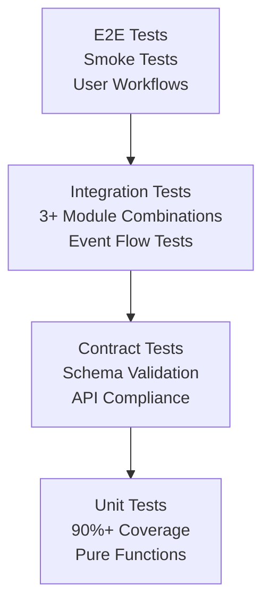

# Design Document

## Overview

This design document outlines the comprehensive architecture for auditing and updating all Q ecosystem modules to achieve modular independence and correlative interoperability. The solution transforms the current tightly-coupled ecosystem into a collection of standalone, serverless-ready modules that communicate through standardized contracts, events, and APIs.

The design follows the Q∞ principles: independence, correlatividad (interoperability through contracts), serverless readiness, and transversal compliance across identity, permissions, encryption, indexing, privacy, audit, payments, and storage.

## Architecture

### High-Level Architecture

```mermaid
graph TB
    subgraph "Q Ecosystem Modules"
        sQuid[sQuid<br/>Identity & Subidentities]
        Qwallet[Qwallet<br/>Payments & Fees]
        Qlock[Qlock<br/>Encryption & Signatures]
        Qonsent[Qonsent<br/>Policies & Permissions]
        Qindex[Qindex<br/>Indexing & Pointers]
        Qerberos[Qerberos<br/>Security & Audit]
        Qmask[Qmask<br/>Privacy & Anonymization]
        Qdrive[Qdrive<br/>File Storage]
        QpiC[QpiC<br/>Media Management]
        Qmarket[Qmarket<br/>Content Marketplace]
        Qmail[Qmail<br/>Certified Messaging]
        Qchat[Qchat<br/>Instant Messaging]
        QNET[QNET<br/>Network Infrastructure]
        DAO[DAO/Communities<br/>Governance]
    end

    subgraph "Common Infrastructure"
        CommonSchemas[@anarq/common-schemas]
        CommonClients[@anarq/common-clients]
        CommonTesting[@anarq/testing]
        IPFS[IPFS Storage]
        EventBus[Event Bus<br/>q.bus]
    end

    subgraph "Interface Standards"
        HTTP[HTTP APIs<br/>OpenAPI]
        MCP[MCP Tools<br/>mcp.json]
        Events[Event System<br/>Pub/Sub]
        Contracts[JSON Schema<br/>Contracts]
    end

    sQuid -.->|identity headers| Qwallet
    sQuid -.->|identity headers| Qmail
    sQuid -.->|identity headers| Qmarket
    Qonsent -.->|permission checks| Qwallet
    Qonsent -.->|permission checks| Qdrive
    Qonsent -.->|permission checks| Qmarket
    Qlock -.->|encryption| Qdrive
    Qlock -.->|encryption| Qmail
    Qlock -.->|signatures| Qwallet
    Qindex -.->|indexing| Qdrive
    Qindex -.->|indexing| Qmarket
    Qindex -.->|indexing| Qmail
    Qerberos -.->|audit logs| Qwallet
    Qerberos -.->|audit logs| Qmarket
    Qmask -.->|privacy profiles| Qdrive
    Qmask -.->|privacy profiles| QpiC

    HTTP --> sQuid
    HTTP --> Qwallet
    MCP --> Qlock
    MCP --> Qindex
    Events --> EventBus
    Contracts --> CommonSchemas
```

### Module Independence Architecture

Each module follows a standardized structure that enables standalone operation:

```
module-name/
├── README.md                    # Run modes: standalone, integrated
├── package.json                 # Dependencies and scripts
├── docker-compose.yml          # Standalone deployment
├── openapi.yaml                # HTTP API specification
├── mcp.json                    # MCP tools configuration
├── contracts/                  # Request/response schemas
│   ├── *.schema.json          # JSON Schema definitions
│   └── *.test.js              # Contract tests
├── events/                     # Event definitions
│   ├── catalog.md             # Event catalog
│   ├── *.event.json           # Event schemas
│   └── *.test.js              # Event tests
├── security/                   # Security policies
│   ├── policies.md            # Qlock/Qonsent policies
│   ├── middleware.js          # Auth middleware
│   └── keys/                  # Development keys
├── storage/                    # Storage mapping
│   ├── map.md                 # IPFS mapping
│   └── pinning.policy.json    # Pinning policies
├── observability/              # Audit and monitoring
│   ├── audit.md               # Audit specifications
│   └── metrics.js             # Metrics collection
├── compat/                     # Compatibility matrix
│   └── matrix.md              # Integration versions
├── src/                        # Source code
│   ├── handlers/              # Pure request handlers
│   ├── services/              # Business logic
│   ├── mocks/                 # Mock services
│   └── utils/                 # Utilities
└── tests/                      # Test suites
    ├── unit/                  # Unit tests
    ├── contract/              # Contract tests
    ├── integration/           # Integration tests
    └── e2e/                   # End-to-end tests
```

### Correlatividad (Interoperability) Architecture

Modules communicate through three primary mechanisms:

1. **HTTP APIs with OpenAPI**: RESTful endpoints with standardized headers and responses
2. **MCP Tools**: Function-based interfaces for serverless environments
3. **Event System**: Pub/sub messaging with standardized topics and payloads

#### Standard Headers
```
x-squid-id: <identity-id>
x-subid: <subidentity-id>
x-qonsent: <consent-token>
x-sig: <qlock-signature>
x-ts: <timestamp>
x-api-version: <version>
```

#### Standard Response Format
```json
{
  "status": "ok|error",
  "code": "SUCCESS|ERROR_CODE",
  "message": "Human readable message",
  "data": {},
  "cid": "ipfs-content-id"
}
```

#### Event Naming Convention
```
q.<module>.<action>.<version>
Examples:
- q.qmail.sent.v1
- q.qwallet.tx.signed.v1
- q.qindex.record.created.v1
```

## Components and Interfaces

### Core Identity Module (sQuid)

**Purpose**: Manages root identities, subidentities, reputation, and DAO associations.

**Interfaces**:
- HTTP API: Identity management, subidentity creation, reputation tracking
- MCP Tools: `squid.verifyIdentity`, `squid.activeContext`
- Events: `q.squid.created.v1`, `q.squid.sub.created.v1`, `q.squid.reputation.updated.v1`

**Key Components**:
- Identity Manager: Core identity operations
- Subidentity Controller: Subidentity lifecycle management
- Reputation Engine: Reputation calculation and tracking
- DAO Association Manager: Community membership management

### Payment Module (Qwallet)

**Purpose**: Manages payments, fees, multi-chain transactions, and dynamic limits.

**Interfaces**:
- HTTP API: Payment intents, wallet configuration, transaction history
- MCP Tools: `wallet.sign`, `wallet.pay`, `wallet.quote`
- Events: `q.qwallet.intent.created.v1`, `q.qwallet.tx.signed.v1`, `q.qwallet.tx.settled.v1`

**Key Components**:
- Payment Intent Manager: Payment request handling
- Multi-chain Adapter: Blockchain abstraction layer
- Fee Calculator: Dynamic fee computation
- Transaction Signer: Cryptographic transaction signing

### Encryption Module (Qlock)

**Purpose**: Provides encryption, signatures, time-locks, and distributed mutex.

**Interfaces**:
- MCP Tools: `qlock.encrypt`, `qlock.decrypt`, `qlock.sign`, `qlock.verify`, `qlock.lock`
- Events: `q.qlock.lock.acquired.v1`, `q.qlock.lock.released.v1`

**Key Components**:
- Encryption Engine: Multi-algorithm encryption service
- Signature Service: Digital signature operations
- Time-lock Manager: Temporal access controls
- Distributed Lock Service: Mutex coordination

### Permission Module (Qonsent)

**Purpose**: Granular authorization through UCAN/policies with deny-by-default.

**Interfaces**:
- HTTP API: Policy management, grant issuance, permission checking
- MCP Tools: `qonsent.check`, `qonsent.grant`, `qonsent.revoke`
- Events: `q.qonsent.grant.issued.v1`, `q.qonsent.revoked.v1`

**Key Components**:
- Policy Engine: UCAN policy evaluation
- Grant Manager: Permission grant lifecycle
- Scope Validator: Permission scope verification
- Revocation Service: Real-time permission revocation

### Indexing Module (Qindex)

**Purpose**: Lightweight indices, mutable pointers, append-only history, simple queries.

**Interfaces**:
- HTTP API: Index operations, key-based queries, history tracking
- MCP Tools: `qindex.put`, `qindex.get`, `qindex.list`
- Events: `q.qindex.record.created.v1`

**Key Components**:
- Index Manager: Core indexing operations
- Pointer Service: Mutable pointer management
- History Tracker: Append-only change log
- Query Engine: Simple query processing

### Security Module (Qerberos)

**Purpose**: Active security, anomaly detection, risk scoring, audit trails.

**Interfaces**:
- HTTP API: Audit logging, risk assessment, anomaly reporting
- MCP Tools: `qerberos.audit`, `qerberos.riskScore`
- Events: `q.qerberos.alert.v1`, `q.qerberos.anomaly.v1`

**Key Components**:
- Anomaly Detector: Pattern-based threat detection
- Risk Scorer: Dynamic risk assessment
- Audit Logger: Immutable audit trail
- Alert Manager: Real-time security notifications

### Privacy Module (Qmask)

**Purpose**: Privacy profiles, anonymization, re-identification prevention.

**Interfaces**:
- HTTP API: Profile management, data masking, privacy assessment
- MCP Tools: `qmask.apply`, `qmask.profile`
- Events: `q.qmask.applied.v1`

**Key Components**:
- Profile Manager: Privacy profile lifecycle
- Anonymization Engine: Data anonymization algorithms
- Re-identification Checker: Privacy breach detection
- Policy Enforcer: Privacy policy compliance

### Storage Modules (Qdrive, QpiC)

**Purpose**: File ingestion, management, and marketplace integration.

**Interfaces**:
- HTTP API: File upload, retrieval, metadata management
- MCP Tools: `qdrive.put`, `qdrive.get`, `qpic.transcode`
- Events: `q.qdrive.file.created.v1`, `q.qpic.asset.transcoded.v1`

**Key Components**:
- File Manager: Core file operations
- Metadata Extractor: File metadata processing
- Transcoding Service: Media format conversion
- Access Controller: File access management

### Marketplace Module (Qmarket)

**Purpose**: Content publishing, selling, licensing with integrated payments.

**Interfaces**:
- HTTP API: Listing management, purchase processing, license delivery
- MCP Tools: `qmarket.list`, `qmarket.purchase`, `qmarket.license`
- Events: `q.qmarket.listed.v1`, `q.qmarket.sold.v1`

**Key Components**:
- Listing Manager: Content listing lifecycle
- Purchase Processor: Transaction handling
- License Manager: Digital rights management
- Revenue Distributor: Payment distribution

### Messaging Modules (Qmail, Qchat)

**Purpose**: Certified messaging, instant messaging, group communication.

**Interfaces**:
- HTTP API: Message sending, inbox management, conversation handling
- MCP Tools: `qmail.send`, `qmail.fetch`, `qchat.post`
- Events: `q.qmail.sent.v1`, `q.qmail.receipt.v1`, `q.qchat.message.v1`

**Key Components**:
- Message Router: Message delivery coordination
- Encryption Handler: End-to-end message encryption
- Receipt Manager: Delivery confirmation tracking
- Spam Filter: Unwanted message detection

### Network Module (QNET)

**Purpose**: Network infrastructure, node health, latency monitoring.

**Interfaces**:
- HTTP API: Node status, network health, capability discovery
- MCP Tools: `qnet.ping`, `qnet.capabilities`
- Events: `q.qnet.node.joined.v1`, `q.qnet.node.alert.v1`

**Key Components**:
- Node Monitor: Network node health tracking
- Latency Tracker: Network performance monitoring
- Capability Registry: Node capability management
- Health Aggregator: Overall network health assessment

### Governance Module (DAO/Communities)

**Purpose**: Community governance, voting, rule management.

**Interfaces**:
- HTTP API: DAO management, voting, rule enforcement
- MCP Tools: `dao.vote`, `dao.propose`, `dao.execute`
- Events: `q.dao.rule.changed.v1`, `q.dao.vote.cast.v1`

**Key Components**:
- Governance Engine: Voting and proposal management
- Rule Enforcer: Community rule implementation
- Reputation Integrator: Reputation-based governance
- Decision Tracker: Governance decision history

## Data Models

### Common Data Models

```typescript
// Identity Reference
interface IdentityRef {
  squidId: string;
  subId?: string;
  daoId?: string;
}

// Consent Reference
interface ConsentRef {
  policyCid: string;
  scope: string;
  grant: string;
  exp: number;
}

// Lock Signature
interface LockSig {
  alg: string;
  pub: string;
  sig: string;
  ts: number;
  nonce: string;
}

// Index Record
interface IndexRecord {
  type: string;
  key: string;
  cid: string;
  version: number;
  prevCid?: string;
  tags: string[];
  createdAt: string;
}

// Audit Event
interface AuditEvent {
  type: string;
  ref: string;
  actor: IdentityRef;
  layer: string;
  verdict: 'ALLOW' | 'DENY' | 'WARN';
  details: Record<string, any>;
  cid?: string;
}

// Mask Profile
interface MaskProfile {
  name: string;
  rules: MaskRule[];
  defaults: Record<string, any>;
  version: string;
}
```

### Module-Specific Data Models

Each module defines its own data models while extending common models:

```typescript
// Qwallet Payment Intent
interface PaymentIntent {
  intentId: string;
  actor: IdentityRef;
  amount: number;
  currency: string;
  recipient: string;
  purpose: string;
  metadata: Record<string, any>;
  status: 'PENDING' | 'SIGNED' | 'SETTLED' | 'FAILED';
  createdAt: string;
  expiresAt: string;
}

// Qmail Message
interface QmailMessage {
  messageId: string;
  from: IdentityRef;
  to: IdentityRef[];
  subject: string;
  encryptedContent: string;
  signature: LockSig;
  timestamp: string;
  receiptRequested: boolean;
  priority: 'LOW' | 'NORMAL' | 'HIGH';
}

// Qindex Pointer
interface QindexPointer {
  key: string;
  currentCid: string;
  version: number;
  history: IndexRecord[];
  metadata: Record<string, any>;
  lastUpdated: string;
}
```

## Error Handling

### Standardized Error Codes

All modules use consistent error codes with prefixes:

```typescript
enum ErrorCodes {
  // Authentication & Authorization
  QLOCK_AUTH_FAIL = 'QLOCK_AUTH_FAIL',
  QONSENT_DENIED = 'QONSENT_DENIED',
  SQUID_IDENTITY_INVALID = 'SQUID_IDENTITY_INVALID',
  
  // Data & Storage
  QINDEX_NOT_FOUND = 'QINDEX_NOT_FOUND',
  QDRIVE_STORAGE_FULL = 'QDRIVE_STORAGE_FULL',
  IPFS_UNAVAILABLE = 'IPFS_UNAVAILABLE',
  
  // Security & Privacy
  QERB_SUSPECT = 'QERB_SUSPECT',
  QMASK_POLICY_VIOLATION = 'QMASK_POLICY_VIOLATION',
  SIGNATURE_INVALID = 'SIGNATURE_INVALID',
  
  // Network & Services
  SERVICE_UNAVAILABLE = 'SERVICE_UNAVAILABLE',
  RATE_LIMIT_EXCEEDED = 'RATE_LIMIT_EXCEEDED',
  TIMEOUT_ERROR = 'TIMEOUT_ERROR',
  
  // Business Logic
  INSUFFICIENT_FUNDS = 'INSUFFICIENT_FUNDS',
  DEPENDENCY_MISSING = 'DEPENDENCY_MISSING',
  VERSION_CONFLICT = 'VERSION_CONFLICT'
}
```

### Error Response Structure

```typescript
interface ErrorResponse {
  status: 'error';
  code: string;
  message: string;
  details?: Record<string, any>;
  timestamp: string;
  requestId: string;
  retryable: boolean;
  suggestedActions?: string[];
}
```

### Error Recovery Patterns

1. **Exponential Backoff**: For transient network errors
2. **Circuit Breaker**: For service unavailability
3. **Fallback Services**: For critical path failures
4. **Graceful Degradation**: For non-essential features
5. **User Notification**: For user-actionable errors

## Testing Strategy

### Testing Pyramid



### Test Categories

1. **Unit Tests**: 90%+ coverage of critical paths
   - Pure function testing
   - Business logic validation
   - Error condition handling

2. **Contract Tests**: Schema and interface validation
   - Request/response schema validation
   - Event payload verification
   - API compliance testing

3. **Integration Tests**: Multi-module interactions
   - Qmail ↔ Qwallet ↔ Qlock ↔ Qonsent ↔ Qindex
   - Qmarket ↔ Qwallet ↔ Qmask ↔ Qindex ↔ Qerberos
   - Qdrive/QpiC ↔ Qmarket ↔ Qindex

4. **End-to-End Tests**: Complete user workflows
   - Login (sQuid) → Upload (Qdrive) → List (Qmarket) → Purchase (Qwallet) → Receipt (Qerberos) → Access (Qonsent) → Fetch (QpiC/Qdrive)

### Test Infrastructure

- **Mock Services**: Standardized mocks for external dependencies
- **Test Data**: Consistent test datasets across modules
- **Test Utilities**: Shared testing utilities and helpers
- **CI/CD Integration**: Automated testing in deployment pipeline

### Performance Testing

- **Load Testing**: Module capacity under stress
- **Latency Testing**: Response time measurements
- **Concurrency Testing**: Multi-user scenarios
- **Resource Testing**: Memory and CPU usage

## Security Architecture

### Defense in Depth

1. **Authentication Layer**: sQuid identity verification
2. **Authorization Layer**: Qonsent permission checking
3. **Encryption Layer**: Qlock data protection
4. **Audit Layer**: Qerberos activity logging
5. **Privacy Layer**: Qmask data anonymization
6. **Network Layer**: QNET infrastructure security

### Security Policies

#### Default Security Posture
- **Deny by Default**: All operations require explicit permission
- **Least Privilege**: Minimal required permissions granted
- **Zero Trust**: No implicit trust between modules
- **Encryption Everywhere**: Data encrypted at rest and in transit

#### Key Management and Cryptographic Standards
- **KMS Integration**: All modules use centralized KMS/keystore for key management
- **Key Rotation**: Automated key rotation schedules (daily for dev, weekly for staging, monthly for prod)
- **Environment Scoping**: Keys are environment-specific with no cross-environment access
- **PQC Readiness**: Qlock supports post-quantum cryptographic algorithms (Kyber, Dilithium)
- **Key Derivation**: Identity-based key derivation with secure entropy sources
- **Hardware Security**: HSM integration for production key operations
- **Audit Trail**: All key operations logged immutably with full context

#### Audit Requirements
- **Immutable Logs**: All audit events stored immutably in IPFS with CID verification
- **Real-time Monitoring**: Live security event processing with sub-second alerting
- **Compliance Reporting**: Automated GDPR, SOC2, and custom compliance reports
- **Incident Response**: Automated threat response with escalation procedures

### Privacy by Design

1. **Data Minimization**: Collect only necessary data with explicit purpose
2. **Purpose Limitation**: Use data only for stated purposes with consent tracking
3. **Storage Limitation**: Retain data only as long as needed with automated deletion
4. **Transparency**: Clear data usage policies with user-accessible audit trails
5. **User Control**: User control over personal data with self-service DSR tools
6. **Security**: Protect data throughout lifecycle with end-to-end encryption

### Rate Limiting and Anti-Abuse Protection

#### Multi-Layer Rate Limiting
- **Identity-based**: Rate limits per sQuid identity with reputation scoring
- **Subidentity-based**: Separate limits for subidentities with inheritance rules
- **DAO-based**: Collective limits for DAO operations with fair sharing
- **Adaptive Limits**: Dynamic adjustment based on reputation and behavior patterns

#### Anti-Abuse Mechanisms
- **Pattern Detection**: ML-based anomaly detection for abuse patterns
- **Exponential Backoff**: Progressive delays for repeated violations
- **Circuit Breakers**: Automatic service protection under attack
- **Qerberos Integration**: Real-time signaling of suspicious activities
- **Automated Defense**: Self-healing responses to common attack patterns

## Deployment Architecture

### Serverless Readiness

All modules are designed for serverless deployment:

1. **Stateless Handlers**: No persistent state in handlers
2. **12-Factor Compliance**: Environment-based configuration
3. **Fast Cold Starts**: Optimized initialization
4. **Resource Efficiency**: Minimal resource requirements
5. **Auto-scaling**: Automatic capacity adjustment

### Deployment Modes

#### Standalone Mode
- Docker Compose deployment
- Integrated mock services
- Development and testing
- Isolated module operation

#### Integrated Mode
- Full ecosystem deployment
- Real service dependencies
- Production environment
- Complete feature set

#### Hybrid Mode
- Selective service mocking
- Partial ecosystem deployment
- Staging environment
- Gradual migration

### Infrastructure Requirements

- **Container Runtime**: Docker/Kubernetes support
- **Service Mesh**: Inter-service communication
- **Load Balancing**: Request distribution
- **Health Monitoring**: Service health checks
- **Logging**: Centralized log aggregation
- **Metrics**: Performance monitoring
- **Alerting**: Automated incident detection

## Service Level Objectives and Observability

### SLO Definitions by Module

Each module must meet the following Service Level Objectives:

```typescript
interface ModuleSLO {
  latency: {
    p50: number;    // 50ms for read operations
    p95: number;    // 150ms for write operations
    p99: number;    // 200ms for complex operations
  };
  availability: {
    uptime: number;        // 99.9% (8.76 hours downtime/year)
    errorBudget: number;   // 0.1% error rate
  };
  throughput: {
    rps: number;           // Requests per second capacity
    concurrent: number;    // Concurrent request handling
  };
}
```

### Observability Stack

#### Metrics Collection
- **Request Metrics**: Count, duration, status codes, payload sizes
- **Business Metrics**: Module-specific KPIs (transactions, messages, files)
- **System Metrics**: CPU, memory, disk, network utilization
- **Queue Metrics**: Depth, processing time, backlog age

#### Health Endpoints
```typescript
interface HealthResponse {
  status: 'healthy' | 'degraded' | 'unhealthy';
  timestamp: string;
  version: string;
  dependencies: {
    [service: string]: {
      status: 'up' | 'down' | 'degraded';
      latency: number;
      lastCheck: string;
    };
  };
  metrics: {
    uptime: number;
    requestCount: number;
    errorRate: number;
    avgResponseTime: number;
  };
}
```

#### Distributed Tracing
- **Trace Context**: Propagated across all module interactions
- **Span Attributes**: Module, operation, identity, subidentity, DAO context
- **Correlation IDs**: Request tracking across the entire ecosystem
- **Performance Profiling**: Bottleneck identification and optimization

## Idempotency and Retry Architecture

### Idempotency Implementation

#### Idempotency Key Support
```typescript
interface IdempotentRequest {
  headers: {
    'Idempotency-Key': string;  // Client-generated UUID
    'x-squid-id': string;
    'x-api-version': string;
  };
  body: any;
}

interface IdempotencyRecord {
  key: string;
  requestHash: string;
  response: any;
  status: 'PROCESSING' | 'COMPLETED' | 'FAILED';
  createdAt: string;
  expiresAt: string;  // 24 hours default
}
```

#### Duplicate Detection
- **Request Fingerprinting**: Hash of headers + body for duplicate detection
- **State Management**: Track operation state during processing
- **Response Caching**: Cache successful responses for replay
- **Expiration Policy**: Automatic cleanup of old idempotency records

### Retry Policies

#### Exponential Backoff Configuration
```typescript
interface RetryPolicy {
  maxAttempts: number;        // 3 attempts default
  baseDelay: number;          // 100ms initial delay
  maxDelay: number;           // 30s maximum delay
  backoffMultiplier: number;  // 2x multiplier
  jitter: boolean;            // Add randomization
  retryableErrors: string[];  // Which errors to retry
}
```

#### Circuit Breaker Pattern
- **Failure Threshold**: Trip after 5 consecutive failures
- **Recovery Time**: 30s before attempting recovery
- **Half-Open State**: Limited requests during recovery
- **Health Monitoring**: Automatic circuit state management

## Data Governance and Lifecycle Management

### Data Retention Policies

#### Retention by Resource Type
```typescript
interface RetentionPolicy {
  resourceType: string;
  retentionPeriod: string;    // ISO 8601 duration
  archivalPolicy: 'DELETE' | 'ARCHIVE' | 'ANONYMIZE';
  complianceRequirements: string[];
  exceptions: {
    legalHold: boolean;
    userConsent: boolean;
    businessCritical: boolean;
  };
}

// Example policies
const RETENTION_POLICIES = {
  'audit-logs': { period: 'P7Y', policy: 'ARCHIVE' },      // 7 years
  'user-messages': { period: 'P2Y', policy: 'DELETE' },    // 2 years
  'transaction-records': { period: 'P10Y', policy: 'ARCHIVE' }, // 10 years
  'session-data': { period: 'P30D', policy: 'DELETE' },    // 30 days
  'temp-files': { period: 'P7D', policy: 'DELETE' }        // 7 days
};
```

#### GDPR Compliance
- **Data Subject Rights**: Automated DSR (Data Subject Request) processing
- **Right to Erasure**: Secure deletion with cryptographic proof
- **Data Portability**: Standardized export formats
- **Consent Management**: Granular consent tracking and withdrawal
- **Processing Records**: Automated Article 30 compliance documentation

### IPFS Storage Management

#### Pinning Policies
```typescript
interface PinningPolicy {
  resourceType: string;
  pinningStrategy: 'PERMANENT' | 'TEMPORARY' | 'CONDITIONAL';
  replicationFactor: number;
  geoDistribution: string[];
  accessPattern: 'HOT' | 'WARM' | 'COLD';
  costOptimization: boolean;
}
```

#### Garbage Collection
- **Reference Counting**: Track CID references across modules
- **Orphan Detection**: Identify unreferenced content
- **Grace Periods**: Delayed deletion for recovery
- **Backup Verification**: Ensure backups before deletion

## Serverless Cost Control and Resource Management

### Cost Control Mechanisms

#### Invocation Limits
```typescript
interface InvocationLimits {
  module: string;
  limits: {
    perMinute: number;
    perHour: number;
    perDay: number;
    perMonth: number;
  };
  budgetAlerts: {
    warning: number;    // 80% of budget
    critical: number;   // 95% of budget
    cutoff: number;     // 100% of budget
  };
}
```

#### Resource Optimization
- **Cold Start Optimization**: Pre-warmed containers for critical paths
- **Memory Tuning**: Right-sized memory allocation per function
- **Timeout Management**: Appropriate timeouts to prevent runaway costs
- **Batch Processing**: Aggregate operations to reduce invocations

### Circuit Breakers and Graceful Degradation

#### Circuit Breaker Configuration
```typescript
interface CircuitBreakerConfig {
  failureThreshold: number;     // 5 failures
  recoveryTimeout: number;      // 30 seconds
  monitoringWindow: number;     // 60 seconds
  halfOpenMaxCalls: number;     // 3 test calls
  fallbackStrategy: 'CACHE' | 'MOCK' | 'QUEUE' | 'REJECT';
}
```

#### Graceful Degradation Strategies
- **Feature Toggles**: Disable non-essential features under load
- **Cache Fallbacks**: Serve stale data when services are unavailable
- **Mock Responses**: Provide mock data for development/testing
- **Queue Deferral**: Queue non-urgent operations for later processing

## Event Schema Evolution and Compatibility

### Schema Registry Architecture

#### Schema Versioning
```typescript
interface EventSchema {
  topic: string;
  version: string;
  schema: JSONSchema;
  compatibility: 'BACKWARD' | 'FORWARD' | 'FULL' | 'NONE';
  deprecated: boolean;
  deprecationDate?: string;
  migrationPath?: string;
}
```

#### Compatibility Matrix
- **Backward Compatibility**: New consumers can read old events
- **Forward Compatibility**: Old consumers can read new events
- **Full Compatibility**: Both backward and forward compatible
- **Breaking Changes**: Require major version increments

### Event Evolution Patterns

#### Schema Migration Tools
```typescript
interface SchemaMigration {
  fromVersion: string;
  toVersion: string;
  transformFunction: (oldEvent: any) => any;
  validationRules: JSONSchema;
  rollbackSupport: boolean;
}
```

#### Consumer Version Management
- **Version Negotiation**: Consumers specify compatible schema versions
- **Multi-Version Support**: Producers support multiple schema versions
- **Deprecation Warnings**: Notify consumers of upcoming changes
- **Migration Assistance**: Tools to help consumers upgrade

## CI/CD Quality Gates and Security Scanning

### Quality Gate Pipeline

#### Pre-commit Hooks
- **Linting**: OpenAPI/MCP specification validation
- **Security Scanning**: Secret detection and vulnerability scanning
- **Code Quality**: Static analysis and complexity metrics
- **Test Coverage**: Minimum coverage thresholds

#### Build Pipeline Gates
```typescript
interface QualityGate {
  stage: string;
  checks: {
    unitTests: { coverage: number; threshold: 90 };
    contractTests: { required: true; blocking: true };
    securityScan: { severity: 'HIGH' | 'CRITICAL'; blocking: true };
    performanceTests: { latency: number; throughput: number };
    complianceCheck: { gdpr: boolean; sox: boolean };
  };
  approvals: {
    automated: boolean;
    manual: boolean;
    reviewers: string[];
  };
}
```

#### Security Scanning Integration
- **SAST (Static Analysis)**: Code vulnerability scanning
- **DAST (Dynamic Analysis)**: Runtime security testing
- **Dependency Scanning**: Third-party vulnerability detection
- **Container Scanning**: Image vulnerability assessment
- **Infrastructure Scanning**: IaC security validation

### Deployment Automation

#### Progressive Deployment
- **Blue-Green Deployment**: Zero-downtime deployments
- **Canary Releases**: Gradual rollout with monitoring
- **Feature Flags**: Runtime feature control
- **Rollback Automation**: Automatic rollback on failure detection

## Formal Deprecation and Migration Management

### Deprecation Lifecycle

#### Deprecation Calendar
```typescript
interface DeprecationSchedule {
  feature: string;
  deprecationDate: string;
  sunsetDate: string;
  migrationDeadline: string;
  supportLevel: 'FULL' | 'MAINTENANCE' | 'SECURITY_ONLY' | 'NONE';
  replacementFeature?: string;
  migrationGuide: string;
}
```

#### Usage Telemetry
- **Feature Usage Tracking**: Monitor deprecated feature usage
- **Consumer Identification**: Identify users of deprecated features
- **Impact Assessment**: Measure deprecation impact
- **Migration Progress**: Track migration completion

### Migration Tools and Support

#### Automated Migration Tools
```typescript
interface MigrationTool {
  name: string;
  sourceVersion: string;
  targetVersion: string;
  automationLevel: 'FULL' | 'PARTIAL' | 'MANUAL';
  validationRules: JSONSchema;
  rollbackSupport: boolean;
  estimatedDuration: string;
}
```

#### Migration Support Services
- **Migration Guides**: Step-by-step migration documentation
- **Compatibility Layers**: Temporary compatibility shims
- **Support Channels**: Dedicated migration support
- **Testing Tools**: Migration validation and testing utilities

## Qflow Integration Hooks

### Qflow Evaluator Contract

The ecosystem provides explicit hooks for Qflow coherence evaluation:

```typescript
interface QflowEvaluationRequest {
  refs: string[];              // CIDs to evaluate
  layers: string[];            // Coherence layers to invoke
  context: {
    identity: IdentityRef;
    operation: string;
    timestamp: string;
    metadata: Record<string, any>;
  };
}

interface QflowEvaluationResponse {
  status: 'ok' | 'error';
  evaluationId: string;
  verdicts: {
    [layer: string]: {
      verdict: 'ALLOW' | 'DENY' | 'WARN';
      confidence: number;       // 0.0 - 1.0
      reason: string;
      evidence: string[];       // Supporting CIDs
      policy: string;           // Applied policy reference
    };
  };
  thresholdPolicy: {
    allowThreshold: number;     // Minimum confidence for ALLOW
    denyThreshold: number;      // Maximum confidence for DENY
    escalationRules: string[];  // When to escalate to human review
  };
  aggregateVerdict: 'ALLOW' | 'DENY' | 'WARN' | 'ESCALATE';
  processingTime: number;
  cacheHint: number;           // Cache validity in seconds
}
```

#### Qflow Endpoint Specification
```yaml
/qflow/evaluate:
  post:
    summary: Evaluate coherence across specified layers
    parameters:
      - name: x-qflow-version
        in: header
        required: true
        schema:
          type: string
          pattern: '^v[0-9]+\.[0-9]+$'
    requestBody:
      required: true
      content:
        application/json:
          schema:
            $ref: '#/components/schemas/QflowEvaluationRequest'
    responses:
      200:
        description: Evaluation completed
        content:
          application/json:
            schema:
              $ref: '#/components/schemas/QflowEvaluationResponse'
```

## MCP Tool Discovery and Capability Negotiation

### Tool Registry Service

Each module exposes its MCP capabilities through a standardized discovery mechanism:

```typescript
interface MCPToolRegistry {
  module: string;
  version: string;
  capabilities: {
    tools: {
      [toolName: string]: {
        version: string;
        description: string;
        inputSchema: JSONSchema;
        outputSchema: JSONSchema;
        capabilities: string[];    // ['read', 'write', 'admin']
        rateLimit: {
          rpm: number;
          burst: number;
        };
        dependencies: string[];    // Required other tools/modules
        deprecation?: {
          deprecated: boolean;
          sunsetDate: string;
          replacement: string;
        };
      };
    };
    events: {
      [eventName: string]: {
        version: string;
        schema: JSONSchema;
        frequency: 'HIGH' | 'MEDIUM' | 'LOW';
        retention: string;         // ISO 8601 duration
      };
    };
    compatibility: {
      minVersion: string;
      maxVersion: string;
      breakingChanges: string[];
    };
  };
  healthEndpoint: string;
  documentationUrl: string;
  lastUpdated: string;
}
```

#### Discovery Event
```
Topic: q.tools.registry.updated.v1
Payload: {
  module: string;
  action: 'ADDED' | 'UPDATED' | 'REMOVED';
  capabilities: MCPToolRegistry;
  timestamp: string;
}
```

#### Version Negotiation Protocol
```typescript
interface VersionNegotiation {
  clientRequirements: {
    module: string;
    minVersion: string;
    maxVersion: string;
    requiredCapabilities: string[];
  };
  serverResponse: {
    supportedVersion: string;
    availableCapabilities: string[];
    limitations: string[];
    alternativeModules?: string[];
  };
}
```

## Runbooks and SLO Integration

### SLO-Linked Runbooks

Each module's SLOs are directly linked to operational runbooks:

```typescript
interface SLORunbook {
  sloMetric: string;            // 'p99_latency' | 'error_rate' | 'availability'
  threshold: number;
  runbook: {
    title: string;
    urgency: 'P0' | 'P1' | 'P2' | 'P3';
    escalationPath: string[];
    investigationSteps: {
      step: number;
      description: string;
      commands: string[];
      expectedOutput: string;
      troubleshootingHints: string[];
    }[];
    mitigationActions: {
      action: string;
      impact: string;
      rollbackPlan: string;
      approvalRequired: boolean;
    }[];
    postIncidentActions: string[];
  };
  automatedAlerts: {
    channels: string[];          // ['slack', 'pagerduty', 'email']
    suppressionRules: {
      condition: string;
      duration: string;
    }[];
    escalationDelay: string;     // ISO 8601 duration
  };
}
```

#### Runbook Automation
```typescript
interface RunbookAutomation {
  trigger: {
    metric: string;
    condition: string;
    duration: string;
  };
  automatedActions: {
    action: string;
    parameters: Record<string, any>;
    timeout: string;
    rollbackOnFailure: boolean;
  }[];
  humanApprovalRequired: boolean;
  notificationChannels: string[];
}
```

## Unified Key and Secret Management Policy

### KMS/HSM Integration Architecture

```typescript
interface KeyManagementPolicy {
  environments: {
    [env: string]: {
      kmsProvider: 'AWS_KMS' | 'AZURE_KEY_VAULT' | 'HASHICORP_VAULT' | 'HSM';
      keyRotationSchedule: {
        signingKeys: string;      // 'P30D' (30 days)
        encryptionKeys: string;   // 'P90D' (90 days)
        apiKeys: string;          // 'P7D' (7 days)
      };
      keyScopes: {
        [keyType: string]: {
          allowedOperations: string[];
          accessPolicies: string[];
          auditLevel: 'BASIC' | 'DETAILED' | 'COMPREHENSIVE';
        };
      };
      complianceRequirements: string[];  // ['FIPS-140-2', 'Common-Criteria']
    };
  };
  crossEnvironmentPolicy: {
    keySharing: boolean;         // false - no cross-env key sharing
    emergencyAccess: {
      enabled: boolean;
      approvers: string[];
      auditTrail: boolean;
    };
  };
}
```

### CI/CD Key Validation

```typescript
interface KeyScopeValidation {
  stage: 'pre-commit' | 'build' | 'deploy';
  checks: {
    keyPresence: {
      requiredKeys: string[];
      environment: string;
      blocking: boolean;
    };
    scopeValidation: {
      keyUsage: string[];
      allowedScopes: string[];
      crossReference: boolean;
    };
    rotationCompliance: {
      maxAge: string;           // ISO 8601 duration
      warningThreshold: string; // Warn before expiry
      blockExpired: boolean;
    };
  };
  remediation: {
    autoRotate: boolean;
    notificationChannels: string[];
    escalationPolicy: string;
  };
}
```

#### Key Scope Enforcement
```bash
# CI/CD Pipeline Check Example
key-scope-validator \
  --environment staging \
  --module qwallet \
  --required-scopes "payment.sign,transaction.encrypt" \
  --max-age P30D \
  --block-on-missing \
  --audit-log /var/log/key-validation.log
```

## Event Schema Registry Governance

### Schema Governance Roles and Processes

```typescript
interface SchemaGovernance {
  roles: {
    schemaOwner: {
      responsibilities: string[];  // ['create', 'update', 'deprecate']
      approvalAuthority: boolean;
      modules: string[];
    };
    schemaReviewer: {
      responsibilities: string[];  // ['review', 'approve', 'reject']
      requiredFor: string[];      // ['breaking-changes', 'new-schemas']
      expertise: string[];        // ['security', 'privacy', 'performance']
    };
    schemaConsumer: {
      responsibilities: string[];  // ['subscribe', 'feedback', 'migrate']
      notificationPreferences: string[];
    };
  };
  approvalProcess: {
    newSchema: {
      reviewers: number;          // Minimum 2 reviewers
      approvalThreshold: number;  // 100% approval required
      timeoutDuration: string;    // 'P7D' - 7 days
      autoApprovalCriteria?: string[];
    };
    schemaUpdate: {
      compatibilityCheck: boolean;
      impactAssessment: boolean;
      consumerNotification: boolean;
      canaryWindow: string;       // 'P14D' - 14 days
    };
    breakingChange: {
      deprecationNotice: string;  // 'P90D' - 90 days notice
      migrationPlan: boolean;
      stakeholderApproval: string[];
      rollbackPlan: boolean;
    };
  };
}
```

### Schema Migration Tooling and Governance

```typescript
interface SchemaMigrationGovernance {
  migrationProcess: {
    phases: {
      announcement: {
        duration: string;         // 'P30D' - 30 days
        channels: string[];       // ['email', 'slack', 'docs']
        stakeholders: string[];
      };
      canaryDeployment: {
        duration: string;         // 'P14D' - 14 days
        rolloutPercentage: number; // 5% initial rollout
        successCriteria: {
          errorRate: number;      // < 0.1%
          consumerAdoption: number; // > 80%
          performanceImpact: number; // < 5%
        };
      };
      fullRollout: {
        duration: string;         // 'P7D' - 7 days
        monitoringPeriod: string; // 'P30D' - 30 days
        rollbackTriggers: string[];
      };
    };
  };
  automatedTooling: {
    compatibilityChecker: {
      enabled: boolean;
      blockingViolations: string[];
      warningViolations: string[];
    };
    migrationGenerator: {
      supportedTransformations: string[];
      validationRules: JSONSchema;
      testGeneration: boolean;
    };
    impactAnalyzer: {
      consumerDiscovery: boolean;
      usageAnalytics: boolean;
      riskAssessment: boolean;
    };
  };
  qualityGates: {
    preDeployment: {
      schemaValidation: boolean;
      backwardCompatibility: boolean;
      performanceTesting: boolean;
      securityReview: boolean;
    };
    postDeployment: {
      monitoringDashboard: boolean;
      alerting: boolean;
      rollbackAutomation: boolean;
      consumerFeedback: boolean;
    };
  };
}
```

#### Schema Registry CLI Tools
```bash
# Schema governance commands
schema-registry governance \
  --action propose \
  --schema qwallet.payment.v2 \
  --breaking-changes "removed field: legacy_amount" \
  --migration-plan ./migration-plan.md \
  --reviewers security,privacy \
  --canary-duration P14D

schema-registry migration \
  --from qwallet.payment.v1 \
  --to qwallet.payment.v2 \
  --generate-tests \
  --validate-consumers \
  --dry-run
```

This comprehensive design provides a robust foundation for transforming the Q ecosystem into a modular, interoperable, and serverless-ready architecture with enterprise-grade reliability, security, operational excellence, and seamless Qflow integration capabilities.