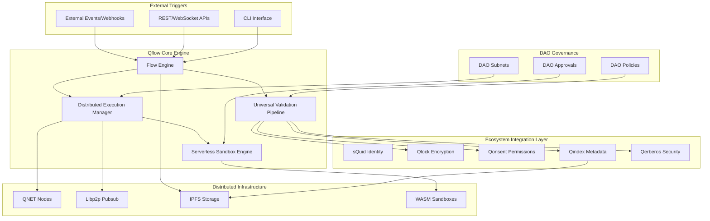
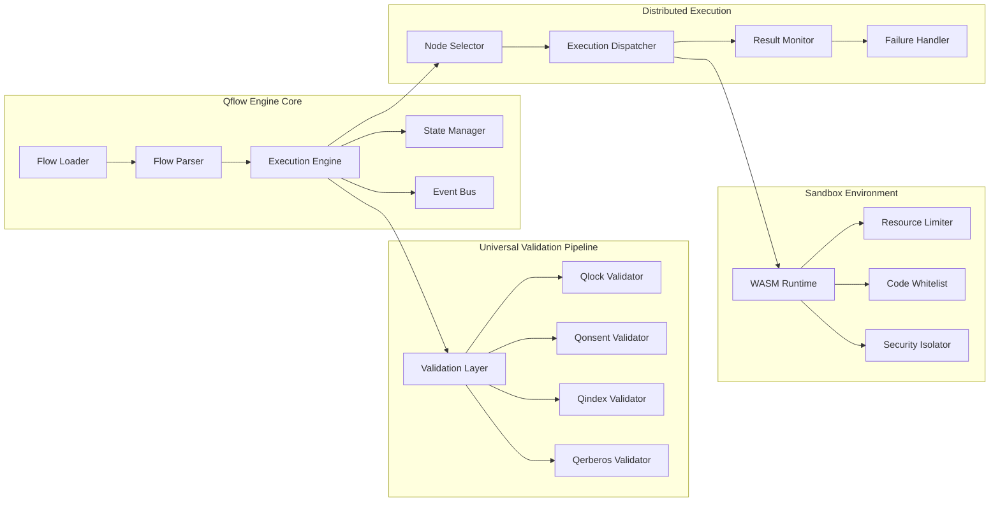

# Qflow Serverless Automation Engine - Design Document

## Overview

Qflow is the serverless, distributed automation engine that serves as the universal coherence motor for the entire AnarQ & Q ecosystem. It replaces centralized orchestrators like n8n with a decentralized, multi-tenant execution environment that maintains layer-by-layer coherence across all ecosystem operations while enabling dynamic, DAO-validated workflows without any central server.

The system operates on a peer-to-peer architecture using QNET nodes for execution, Libp2p Pubsub for coordination, IPFS for distributed state storage, and WebAssembly (WASM) sandboxes for secure, portable execution. Every operation flows through the universal validation pipeline (Qlock → Qonsent → Qindex → Qerberos) ensuring ecosystem-wide integrity and compliance.

## Architecture

### High-Level Architecture



### Component Architecture



## Components and Interfaces

### 1. Qflow Engine Core

#### Flow Loader & Parser
- **Purpose**: Load flow definitions from IPFS and parse JSON/YAML structures
- **Interface**:
  ```typescript
  interface FlowLoader {
    loadFlow(flowId: string): Promise<FlowDefinition>
    parseFlow(flowData: string): FlowDefinition
    validateFlowStructure(flow: FlowDefinition): ValidationResult
  }
  ```

#### Execution Engine
- **Purpose**: Orchestrate step-by-step flow execution with distributed coordination
- **Interface**:
  ```typescript
  interface ExecutionEngine {
    startExecution(flowId: string, context: ExecutionContext): Promise<ExecutionId>
    resumeExecution(executionId: string): Promise<void>
    pauseExecution(executionId: string): Promise<void>
    abortExecution(executionId: string): Promise<void>
    getExecutionStatus(executionId: string): Promise<ExecutionStatus>
  }
  ```

#### State Manager
- **Purpose**: Manage distributed execution state with IPFS persistence
- **Interface**:
  ```typescript
  interface StateManager {
    saveState(executionId: string, state: ExecutionState): Promise<string>
    loadState(executionId: string): Promise<ExecutionState>
    createCheckpoint(executionId: string): Promise<CheckpointId>
    restoreCheckpoint(executionId: string, checkpointId: string): Promise<void>
  }
  ```

### 2. Universal Validation Pipeline

#### Validation Coordinator
- **Purpose**: Orchestrate the universal validation pipeline as a reusable component
- **Interface**:
  ```typescript
  interface ValidationPipeline {
    validate(operation: Operation, context: ValidationContext): Promise<ValidationResult>
    validateStep(step: FlowStep, context: StepContext): Promise<StepValidationResult>
    getValidationHistory(operationId: string): Promise<ValidationHistory[]>
  }
  ```

#### Layer Validators
- **Qlock Validator**: Encryption/decryption validation
- **Qonsent Validator**: Permission and consent verification
- **Qindex Validator**: Metadata indexing and searchability
- **Qerberos Validator**: Security and integrity checks

### 3. Distributed Execution Manager

#### Node Selector
- **Purpose**: Select optimal QNET nodes for execution based on multiple criteria
- **Interface**:
  ```typescript
  interface NodeSelector {
    selectNode(criteria: NodeSelectionCriteria): Promise<QNETNode>
    getAvailableNodes(daoSubnet?: string): Promise<QNETNode[]>
    updateNodeMetrics(nodeId: string, metrics: NodeMetrics): Promise<void>
  }
  ```

#### Execution Dispatcher
- **Purpose**: Dispatch step execution to selected nodes via Libp2p Pubsub
- **Interface**:
  ```typescript
  interface ExecutionDispatcher {
    dispatchStep(step: FlowStep, targetNode: QNETNode): Promise<DispatchResult>
    monitorExecution(executionId: string): Promise<ExecutionMonitor>
    handleNodeFailure(nodeId: string, executionId: string): Promise<void>
  }
  ```

### 4. Serverless Sandbox Engine

#### WASM Runtime
- **Purpose**: Execute arbitrary code in isolated WebAssembly sandboxes
- **Interface**:
  ```typescript
  interface WASMRuntime {
    executeCode(code: WASMModule, input: any, limits: ResourceLimits): Promise<ExecutionResult>
    loadModule(moduleCode: string): Promise<WASMModule>
    validateModule(moduleCode: string): Promise<ValidationResult>
  }
  ```

#### Resource Limiter
- **Purpose**: Enforce memory, CPU, and execution time limits
- **Interface**:
  ```typescript
  interface ResourceLimiter {
    setLimits(limits: ResourceLimits): void
    monitorUsage(): ResourceUsage
    enforceTimeout(timeoutMs: number): Promise<void>
  }
  ```

### 5. API Layer

#### REST API Endpoints
```typescript
// Flow Management
POST   /api/v1/flows                    // Create flow definition
GET    /api/v1/flows/:id               // Get flow definition
PUT    /api/v1/flows/:id               // Update flow definition
DELETE /api/v1/flows/:id               // Delete flow definition

// Execution Management
POST   /api/v1/flows/:id/start         // Start flow execution
POST   /api/v1/flows/:id/trigger       // Trigger external event
GET    /api/v1/executions/:id          // Get execution status
POST   /api/v1/executions/:id/pause    // Pause execution
POST   /api/v1/executions/:id/resume   // Resume execution
POST   /api/v1/executions/:id/abort    // Abort execution

// Monitoring and Observability
GET    /api/v1/executions/:id/logs     // Get execution logs
GET    /api/v1/executions/:id/metrics  // Get execution metrics
GET    /api/v1/system/health           // System health check
GET    /api/v1/system/metrics          // System-wide metrics

// External Integration
POST   /api/v1/webhooks/:flowId        // Webhook endpoint for external triggers
GET    /api/v1/schemas                 // Get supported event schemas
```

#### WebSocket API
```typescript
// Real-time Updates
WS     /ws/executions/:id              // Real-time execution updates
WS     /ws/system/metrics              // Real-time system metrics
WS     /ws/dao/:daoId/events           // DAO-specific event stream
```

### 6. CLI Interface

```bash
# Flow Management
qflow create <flow-file>               # Create flow from file
qflow list                             # List available flows
qflow show <flow-id>                   # Show flow details
qflow update <flow-id> <flow-file>     # Update flow definition
qflow delete <flow-id>                 # Delete flow

# Execution Management
qflow start <flow-id> [--context=file] # Start flow execution
qflow status <execution-id>            # Get execution status
qflow logs <execution-id>              # Get execution logs
qflow pause <execution-id>             # Pause execution
qflow resume <execution-id>            # Resume execution
qflow abort <execution-id>             # Abort execution

# System Management
qflow nodes                            # List available QNET nodes
qflow health                           # System health check
qflow metrics                          # System metrics
qflow dao-subnets                      # List DAO subnets
```

## Data Models

### Flow Definition
```typescript
interface FlowDefinition {
  id: string
  name: string
  version: string
  owner: string // sQuid identity
  description?: string
  steps: FlowStep[]
  metadata: FlowMetadata
  daoPolicy?: string
  createdAt: string
  updatedAt: string
}

interface FlowStep {
  id: string
  type: 'task' | 'condition' | 'parallel' | 'event-trigger' | 'module-call'
  action: string
  params: Record<string, any>
  onSuccess?: string
  onFailure?: string
  timeout?: number
  retryPolicy?: RetryPolicy
  resourceLimits?: ResourceLimits
}

interface FlowMetadata {
  tags: string[]
  category: string
  visibility: 'public' | 'dao-only' | 'private'
  daoSubnet?: string
  requiredPermissions: string[]
  estimatedDuration?: number
  resourceRequirements?: ResourceRequirements
}
```

### Execution State
```typescript
interface ExecutionState {
  executionId: string
  flowId: string
  status: 'pending' | 'running' | 'paused' | 'completed' | 'failed' | 'aborted'
  currentStep: string
  completedSteps: string[]
  failedSteps: string[]
  context: ExecutionContext
  startTime: string
  endTime?: string
  error?: ExecutionError
  checkpoints: Checkpoint[]
  nodeAssignments: Record<string, string> // stepId -> nodeId
}

interface ExecutionContext {
  triggeredBy: string // sQuid identity
  triggerType: 'manual' | 'webhook' | 'event' | 'schedule'
  inputData: Record<string, any>
  variables: Record<string, any>
  daoSubnet?: string
  permissions: string[]
}
```

### Node Selection Criteria
```typescript
interface NodeSelectionCriteria {
  daoSubnet?: string
  requiredCapabilities: string[]
  minPerformanceScore: number
  maxLatency: number
  resourceRequirements: ResourceRequirements
  geographicPreference?: string[]
  excludeNodes?: string[]
}

interface QNETNode {
  nodeId: string
  address: string
  capabilities: string[]
  performanceScore: number
  currentLoad: number
  latency: number
  daoSubnets: string[]
  lastSeen: string
  reputation: number
}
```

### Validation Pipeline Models
```typescript
interface ValidationResult {
  valid: boolean
  layer: 'qlock' | 'qonsent' | 'qindex' | 'qerberos'
  errors: ValidationError[]
  warnings: ValidationWarning[]
  metadata: Record<string, any>
  timestamp: string
}

interface Operation {
  operationId: string
  type: 'flow-execution' | 'step-execution' | 'external-event'
  actor: string // sQuid identity
  target: string
  payload: any
  context: OperationContext
}
```

## Error Handling

### Error Classification
```typescript
enum ErrorType {
  VALIDATION_ERROR = 'validation_error',
  EXECUTION_ERROR = 'execution_error',
  NODE_FAILURE = 'node_failure',
  NETWORK_ERROR = 'network_error',
  PERMISSION_DENIED = 'permission_denied',
  RESOURCE_EXHAUSTED = 'resource_exhausted',
  TIMEOUT_ERROR = 'timeout_error',
  DAO_POLICY_VIOLATION = 'dao_policy_violation'
}

interface ExecutionError {
  type: ErrorType
  message: string
  stepId?: string
  nodeId?: string
  retryable: boolean
  details: Record<string, any>
  timestamp: string
}
```

### Error Recovery Strategies
1. **Automatic Retry**: For transient failures with exponential backoff
2. **Node Failover**: Automatic reassignment to alternative nodes
3. **Graceful Degradation**: Continue execution with reduced functionality
4. **Manual Intervention**: Escalate to human operators for complex issues
5. **Rollback**: Restore to previous checkpoint when possible

### Circuit Breaker Pattern
```typescript
interface CircuitBreaker {
  state: 'closed' | 'open' | 'half-open'
  failureCount: number
  lastFailureTime: string
  timeout: number
  
  execute<T>(operation: () => Promise<T>): Promise<T>
  reset(): void
  trip(): void
}
```

## Testing Strategy

### Unit Testing
- **Flow Parser**: Test flow definition parsing and validation
- **Validation Pipeline**: Test each validation layer independently
- **State Manager**: Test state persistence and recovery
- **Node Selector**: Test node selection algorithms
- **WASM Runtime**: Test sandbox execution and resource limits

### Integration Testing
- **End-to-End Flow Execution**: Test complete flow execution across multiple nodes
- **Ecosystem Integration**: Test integration with all ecosystem services
- **Multi-Tenant Isolation**: Test DAO subnet isolation
- **External Event Processing**: Test webhook and external trigger handling
- **Failure Recovery**: Test various failure scenarios and recovery mechanisms

### Performance Testing
- **Load Testing**: Test system performance under high flow execution loads
- **Stress Testing**: Test system behavior at resource limits
- **Scalability Testing**: Test horizontal scaling with additional nodes
- **Latency Testing**: Test execution latency across different network conditions

### Security Testing
- **Sandbox Escape**: Test WASM sandbox security
- **Permission Bypass**: Test access control enforcement
- **Data Leakage**: Test multi-tenant data isolation
- **Cryptographic Validation**: Test encryption/decryption integrity

### Chaos Engineering
- **Node Failures**: Random node failures during execution
- **Network Partitions**: Test behavior during network splits
- **Resource Exhaustion**: Test behavior when resources are exhausted
- **Byzantine Failures**: Test behavior with malicious nodes

## Performance Considerations

### Optimization Strategies
1. **Caching**: Cache frequently accessed flows and validation results
2. **Lazy Loading**: Load flow steps on-demand during execution
3. **Parallel Execution**: Execute independent steps in parallel
4. **Resource Pooling**: Pool WASM runtimes and network connections
5. **Predictive Scaling**: Scale resources based on execution patterns

### Monitoring Metrics
- **Execution Latency**: p50, p95, p99 execution times
- **Throughput**: Flows executed per second
- **Resource Utilization**: CPU, memory, network usage per node
- **Error Rates**: Error percentage by type and component
- **Cache Hit Rates**: Validation and flow definition cache effectiveness

### Performance Targets
- **Flow Start Latency**: < 100ms for simple flows
- **Step Execution Latency**: < 1s for basic operations
- **Validation Pipeline**: < 50ms per validation layer
- **State Persistence**: < 200ms for state saves
- **Node Selection**: < 10ms for node selection decisions

## Security Model

### Authentication & Authorization
- **Identity Verification**: All operations require valid sQuid identity signatures
- **Permission Validation**: Dynamic permission checks via Qonsent before each step
- **DAO Governance**: Execution policies enforced by DAO subnet rules
- **Multi-Factor Authentication**: Support for enhanced security requirements

### Encryption & Data Protection
- **End-to-End Encryption**: All data encrypted via Qlock throughout the pipeline
- **Key Management**: Distributed key management with rotation policies
- **Data Isolation**: Complete isolation between DAO subnets
- **Audit Trails**: Immutable audit logs for all operations

### Sandbox Security
- **WASM Isolation**: Complete process isolation for code execution
- **Resource Limits**: Strict CPU, memory, and execution time limits
- **Code Whitelisting**: Only DAO-approved code templates allowed
- **Network Restrictions**: Limited network access from sandboxes

### Threat Mitigation
- **DDoS Protection**: Rate limiting and traffic shaping
- **Code Injection**: WASM sandboxing prevents code injection
- **Data Exfiltration**: Encryption and access controls prevent data theft
- **Byzantine Tolerance**: Consensus mechanisms for critical operations

## Scalability Architecture

### Horizontal Scaling
- **Node Auto-Discovery**: Automatic discovery and integration of new QNET nodes
- **Load Balancing**: Intelligent distribution of execution across available nodes
- **Elastic Scaling**: Automatic scaling based on demand patterns
- **Geographic Distribution**: Support for globally distributed node networks

### Vertical Scaling
- **Resource Optimization**: Efficient resource utilization per node
- **Performance Tuning**: Adaptive performance optimization based on workload
- **Capacity Planning**: Predictive capacity planning based on usage patterns

### Data Scaling
- **Distributed Storage**: IPFS-based distributed state storage
- **Sharding**: Partition large datasets across multiple nodes
- **Replication**: Configurable replication for high availability
- **Compression**: Efficient data compression for storage optimization

## Deployment Architecture

### Multi-Environment Support
- **Development**: Local development with mock ecosystem services
- **Staging**: Full ecosystem integration testing environment
- **Production**: Distributed production deployment across QNET nodes
- **DAO Subnets**: Isolated environments for different DAO communities

### Container Strategy
```dockerfile
# Qflow Node Container
FROM node:18-alpine
COPY qflow-engine /app/
COPY wasm-runtime /app/runtime/
EXPOSE 8080 9090
CMD ["node", "server.mjs"]
```

### Configuration Management
```yaml
# qflow-config.yaml
qflow:
  engine:
    maxConcurrentFlows: 100
    defaultTimeout: 300000
    checkpointInterval: 30000
  
  validation:
    enablePipeline: true
    timeoutPerLayer: 5000
    retryAttempts: 3
  
  sandbox:
    wasmRuntime: "wasmtime"
    maxMemoryMB: 128
    maxExecutionTimeMs: 30000
    allowedModules: ["dao-approved"]
  
  networking:
    libp2pPort: 4001
    apiPort: 8080
    metricsPort: 9090
```

### Health Checks
```typescript
interface HealthCheck {
  component: string
  status: 'healthy' | 'degraded' | 'unhealthy'
  lastCheck: string
  details: Record<string, any>
}

// Health check endpoints
GET /health/live     // Liveness probe
GET /health/ready    // Readiness probe  
GET /health/startup  // Startup probe
```

This design provides a comprehensive foundation for implementing Qflow as the universal automation engine for the AnarQ & Q ecosystem, ensuring scalability, security, and seamless integration with all ecosystem components while maintaining the decentralized, serverless architecture requirements.