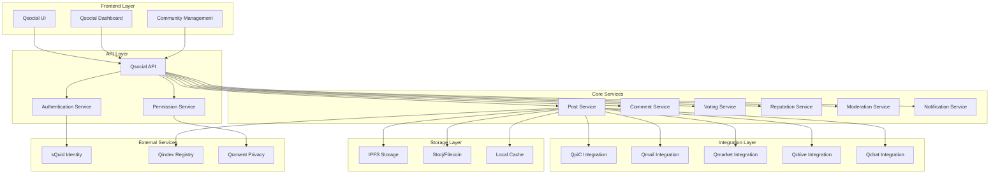
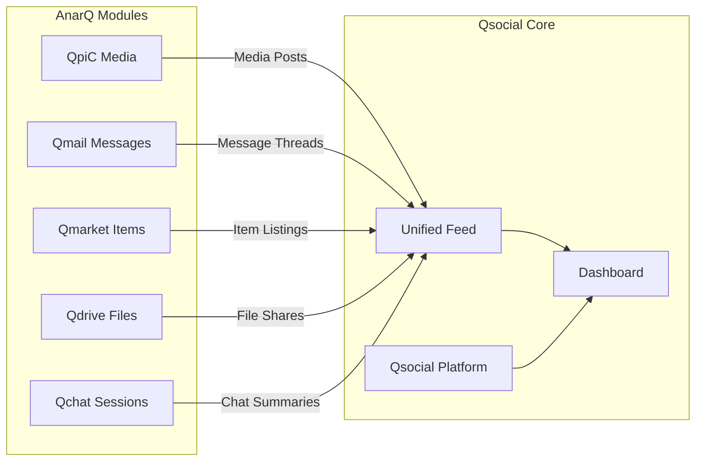

# Qsocial Design Document

## Overview

Qsocial is a decentralized Reddit-style social platform that serves as both a standalone community hub and a central dashboard for the AnarQ ecosystem. It integrates with existing modules (QpiC, Qmail, Qmarket, Qdrive, Qchat) while providing social features like posts, comments, voting, subcommunities, and reputation-based governance.

The platform leverages sQuid decentralized identities, IPFS/Storj/Filecoin for content storage, and implements a Qarma-based reputation system with DAO governance for community moderation.

## Architecture

### High-Level Architecture



### Module Integration Architecture



## Components and Interfaces

### Core Data Models

#### Post Model
```typescript
interface QsocialPost {
  id: string;
  authorId: string;
  authorIdentity: Identity;
  title: string;
  content: string;
  contentType: 'text' | 'link' | 'media' | 'cross-post';
  
  // Cross-module integration
  sourceModule?: 'qpic' | 'qmail' | 'qmarket' | 'qdrive' | 'qchat';
  sourceId?: string;
  sourceData?: any;
  
  // Community organization
  subcommunityId?: string;
  tags: string[];
  
  // Engagement metrics
  upvotes: number;
  downvotes: number;
  commentCount: number;
  
  // Storage and privacy
  ipfsHash?: string;
  storjCid?: string;
  privacyLevel: PrivacyLevel;
  
  // Metadata
  createdAt: Date;
  updatedAt: Date;
  isEdited: boolean;
  isPinned: boolean;
  isLocked: boolean;
  
  // Moderation
  moderationStatus: 'approved' | 'pending' | 'hidden' | 'removed';
  moderatedBy?: string;
  moderationReason?: string;
}
```

#### Comment Model
```typescript
interface QsocialComment {
  id: string;
  postId: string;
  authorId: string;
  authorIdentity: Identity;
  content: string;
  
  // Threading
  parentCommentId?: string;
  depth: number;
  childrenIds: string[];
  
  // Engagement
  upvotes: number;
  downvotes: number;
  
  // Storage
  ipfsHash?: string;
  privacyLevel: PrivacyLevel;
  
  // Metadata
  createdAt: Date;
  updatedAt: Date;
  isEdited: boolean;
  
  // Moderation
  moderationStatus: 'approved' | 'pending' | 'hidden' | 'removed';
  moderatedBy?: string;
}
```

#### Subcommunity Model
```typescript
interface Subcommunity {
  id: string;
  name: string;
  displayName: string;
  description: string;
  
  // Governance
  creatorId: string;
  moderators: string[];
  daoAddress?: string;
  governanceRules: GovernanceRule[];
  
  // Community settings
  isPrivate: boolean;
  requiresApproval: boolean;
  minimumQarma: number;
  allowedContentTypes: string[];
  
  // Statistics
  memberCount: number;
  postCount: number;
  
  // Metadata
  createdAt: Date;
  avatar?: string;
  banner?: string;
  rules: string[];
  
  // Storage
  ipfsHash?: string;
}
```

#### Reputation Model
```typescript
interface UserReputation {
  userId: string;
  totalQarma: number;
  postQarma: number;
  commentQarma: number;
  
  // Subcommunity-specific qarma
  subcommunityQarma: Record<string, number>;
  
  // Achievements and badges
  badges: Badge[];
  achievements: Achievement[];
  
  // Moderation privileges
  moderationLevel: 'none' | 'community' | 'global';
  canModerate: string[]; // subcommunity IDs
  
  // Reputation history
  qarmaHistory: QarmaEvent[];
  
  // Metadata
  lastUpdated: Date;
}
```

### API Interfaces

#### Post Service Interface
```typescript
interface PostService {
  // CRUD operations
  createPost(post: CreatePostRequest): Promise<QsocialPost>;
  getPost(id: string): Promise<QsocialPost>;
  updatePost(id: string, updates: UpdatePostRequest): Promise<QsocialPost>;
  deletePost(id: string): Promise<void>;
  
  // Feed operations
  getFeed(options: FeedOptions): Promise<QsocialPost[]>;
  getSubcommunityFeed(subcommunityId: string, options: FeedOptions): Promise<QsocialPost[]>;
  getUserPosts(userId: string, options: FeedOptions): Promise<QsocialPost[]>;
  
  // Cross-module integration
  createCrossPost(sourceModule: string, sourceId: string, options: CrossPostOptions): Promise<QsocialPost>;
  
  // Voting
  votePost(postId: string, vote: 'up' | 'down' | 'remove'): Promise<VoteResult>;
}
```

#### Comment Service Interface
```typescript
interface CommentService {
  // CRUD operations
  createComment(comment: CreateCommentRequest): Promise<QsocialComment>;
  getComment(id: string): Promise<QsocialComment>;
  updateComment(id: string, updates: UpdateCommentRequest): Promise<QsocialComment>;
  deleteComment(id: string): Promise<void>;
  
  // Thread operations
  getPostComments(postId: string, options: CommentOptions): Promise<QsocialComment[]>;
  getCommentThread(commentId: string): Promise<QsocialComment[]>;
  
  // Voting
  voteComment(commentId: string, vote: 'up' | 'down' | 'remove'): Promise<VoteResult>;
}
```

#### Subcommunity Service Interface
```typescript
interface SubcommunityService {
  // CRUD operations
  createSubcommunity(subcommunity: CreateSubcommunityRequest): Promise<Subcommunity>;
  getSubcommunity(id: string): Promise<Subcommunity>;
  updateSubcommunity(id: string, updates: UpdateSubcommunityRequest): Promise<Subcommunity>;
  deleteSubcommunity(id: string): Promise<void>;
  
  // Membership
  joinSubcommunity(subcommunityId: string): Promise<void>;
  leaveSubcommunity(subcommunityId: string): Promise<void>;
  getMembers(subcommunityId: string): Promise<User[]>;
  
  // Moderation
  addModerator(subcommunityId: string, userId: string): Promise<void>;
  removeModerator(subcommunityId: string, userId: string): Promise<void>;
  
  // Discovery
  searchSubcommunities(query: string): Promise<Subcommunity[]>;
  getTrendingSubcommunities(): Promise<Subcommunity[]>;
}
```

### Frontend Components

#### Core Components
- `QsocialFeed`: Main feed component with infinite scroll
- `PostCard`: Individual post display with voting and actions
- `CommentThread`: Threaded comment display
- `SubcommunityCard`: Subcommunity information display
- `CreatePostForm`: Post creation with module integration
- `UserProfile`: User profile with reputation display
- `ModerationPanel`: Moderation tools for community managers

#### Dashboard Components
- `QsocialDashboard`: Central dashboard aggregating all modules
- `ModuleActivityCard`: Activity summary for each module
- `NotificationCenter`: Unified notifications from all modules
- `QuickActions`: Quick access to common actions across modules

#### Integration Components
- `CrossPostSelector`: UI for selecting content from other modules
- `ModuleContentPreview`: Preview of content from other modules
- `UnifiedSearch`: Search across all modules and content types

## Data Models

### Database Schema

#### Posts Table
```sql
CREATE TABLE qsocial_posts (
  id UUID PRIMARY KEY DEFAULT gen_random_uuid(),
  author_id VARCHAR(255) NOT NULL,
  title TEXT NOT NULL,
  content TEXT,
  content_type VARCHAR(50) NOT NULL,
  source_module VARCHAR(50),
  source_id VARCHAR(255),
  source_data JSONB,
  subcommunity_id UUID,
  tags TEXT[],
  upvotes INTEGER DEFAULT 0,
  downvotes INTEGER DEFAULT 0,
  comment_count INTEGER DEFAULT 0,
  ipfs_hash VARCHAR(255),
  storj_cid VARCHAR(255),
  privacy_level VARCHAR(20) NOT NULL,
  created_at TIMESTAMP DEFAULT NOW(),
  updated_at TIMESTAMP DEFAULT NOW(),
  is_edited BOOLEAN DEFAULT FALSE,
  is_pinned BOOLEAN DEFAULT FALSE,
  is_locked BOOLEAN DEFAULT FALSE,
  moderation_status VARCHAR(20) DEFAULT 'approved',
  moderated_by VARCHAR(255),
  moderation_reason TEXT
);
```

#### Comments Table
```sql
CREATE TABLE qsocial_comments (
  id UUID PRIMARY KEY DEFAULT gen_random_uuid(),
  post_id UUID NOT NULL REFERENCES qsocial_posts(id),
  author_id VARCHAR(255) NOT NULL,
  content TEXT NOT NULL,
  parent_comment_id UUID REFERENCES qsocial_comments(id),
  depth INTEGER DEFAULT 0,
  upvotes INTEGER DEFAULT 0,
  downvotes INTEGER DEFAULT 0,
  ipfs_hash VARCHAR(255),
  privacy_level VARCHAR(20) NOT NULL,
  created_at TIMESTAMP DEFAULT NOW(),
  updated_at TIMESTAMP DEFAULT NOW(),
  is_edited BOOLEAN DEFAULT FALSE,
  moderation_status VARCHAR(20) DEFAULT 'approved',
  moderated_by VARCHAR(255)
);
```

#### Subcommunities Table
```sql
CREATE TABLE qsocial_subcommunities (
  id UUID PRIMARY KEY DEFAULT gen_random_uuid(),
  name VARCHAR(100) UNIQUE NOT NULL,
  display_name VARCHAR(200) NOT NULL,
  description TEXT,
  creator_id VARCHAR(255) NOT NULL,
  moderators TEXT[],
  dao_address VARCHAR(255),
  governance_rules JSONB,
  is_private BOOLEAN DEFAULT FALSE,
  requires_approval BOOLEAN DEFAULT FALSE,
  minimum_qarma INTEGER DEFAULT 0,
  allowed_content_types TEXT[],
  member_count INTEGER DEFAULT 0,
  post_count INTEGER DEFAULT 0,
  created_at TIMESTAMP DEFAULT NOW(),
  avatar VARCHAR(255),
  banner VARCHAR(255),
  rules TEXT[],
  ipfs_hash VARCHAR(255)
);
```

#### User Reputation Table
```sql
CREATE TABLE qsocial_user_reputation (
  user_id VARCHAR(255) PRIMARY KEY,
  total_qarma INTEGER DEFAULT 0,
  post_qarma INTEGER DEFAULT 0,
  comment_qarma INTEGER DEFAULT 0,
  subcommunity_qarma JSONB DEFAULT '{}',
  badges JSONB DEFAULT '[]',
  achievements JSONB DEFAULT '[]',
  moderation_level VARCHAR(20) DEFAULT 'none',
  can_moderate TEXT[],
  qarma_history JSONB DEFAULT '[]',
  last_updated TIMESTAMP DEFAULT NOW()
);
```

### Storage Strategy

#### Content Storage
- **Text Content**: Stored in database with IPFS backup for immutability
- **Media Content**: Stored on Storj/Filecoin via S3 API with IPFS fallback
- **Large Files**: Direct Storj/Filecoin storage with metadata in database
- **Cached Content**: Local storage for frequently accessed content

#### Privacy Levels
- **Public**: Accessible to all users, stored on public IPFS
- **Community**: Accessible to subcommunity members, encrypted storage
- **Private**: Accessible only to author and mentioned users, encrypted

## Error Handling

### Error Categories

#### Client Errors (4xx)
- `400 Bad Request`: Invalid post content or format
- `401 Unauthorized`: Invalid or missing authentication
- `403 Forbidden`: Insufficient permissions for action
- `404 Not Found`: Post, comment, or subcommunity not found
- `409 Conflict`: Duplicate subcommunity name or voting conflict
- `429 Too Many Requests`: Rate limiting exceeded

#### Server Errors (5xx)
- `500 Internal Server Error`: General server error
- `502 Bad Gateway`: External service (IPFS, Storj) unavailable
- `503 Service Unavailable`: Temporary service maintenance
- `504 Gateway Timeout`: External service timeout

### Error Response Format
```typescript
interface ErrorResponse {
  error: {
    code: string;
    message: string;
    details?: any;
    timestamp: string;
    requestId: string;
  };
}
```

### Error Handling Strategies

#### Storage Failures
- **IPFS Failure**: Fallback to local storage, retry with exponential backoff
- **Storj/Filecoin Failure**: Fallback to IPFS, queue for retry
- **Database Failure**: Cache operations, implement eventual consistency

#### Integration Failures
- **Module Unavailable**: Show cached content, display service status
- **Authentication Failure**: Redirect to login, preserve user context
- **Permission Denied**: Show appropriate error message, suggest alternatives

## Testing Strategy

### Unit Testing
- **Service Layer**: Test all CRUD operations and business logic
- **Integration Layer**: Mock external services, test error handling
- **Utility Functions**: Test Qarma calculations, content parsing
- **Validation**: Test input validation and sanitization

### Integration Testing
- **API Endpoints**: Test all REST endpoints with various scenarios
- **Database Operations**: Test complex queries and transactions
- **External Services**: Test IPFS, Storj, and module integrations
- **Authentication**: Test sQuid identity integration

### End-to-End Testing
- **User Workflows**: Test complete user journeys (post creation, voting, commenting)
- **Cross-Module Integration**: Test content sharing between modules
- **Moderation Workflows**: Test community management features
- **Real-time Features**: Test notifications and live updates

### Performance Testing
- **Load Testing**: Test system under high user load
- **Storage Performance**: Test file upload/download performance
- **Database Performance**: Test query performance with large datasets
- **Caching Effectiveness**: Test cache hit rates and performance impact

### Security Testing
- **Authentication**: Test identity verification and session management
- **Authorization**: Test permission enforcement
- **Input Validation**: Test against injection attacks and malformed input
- **Privacy**: Test data isolation and privacy level enforcement

### Test Data Management
- **Mock Data**: Generate realistic test data for development
- **Test Environments**: Separate environments for different test types
- **Data Cleanup**: Automated cleanup of test data
- **Seed Data**: Consistent seed data for reproducible tests

## Implementation Phases

### Phase 1: Core Infrastructure
- Basic post and comment CRUD operations
- Simple voting system
- Basic subcommunity management
- sQuid identity integration
- IPFS storage integration

### Phase 2: Social Features
- Threaded comments
- Karma and reputation system
- User profiles and achievements
- Basic moderation tools
- Notification system

### Phase 3: Module Integration
- Cross-posting from other modules
- Unified dashboard
- Module-specific content handling
- Advanced search across modules

### Phase 4: Advanced Features
- DAO governance for subcommunities
- Advanced moderation tools
- Storj/Filecoin integration
- Real-time features
- Analytics and insights

### Phase 5: Optimization
- Performance optimization
- Advanced caching
- Mobile optimization
- Accessibility improvements
- Advanced privacy features