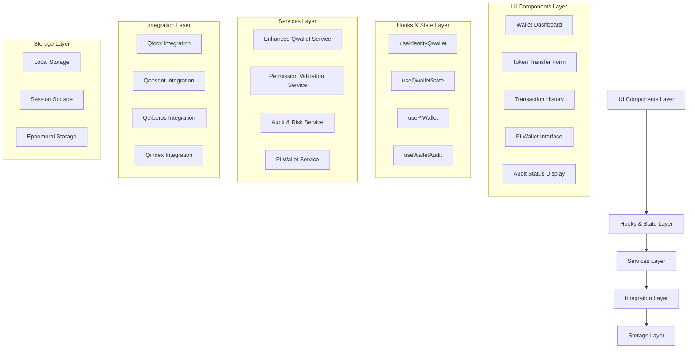
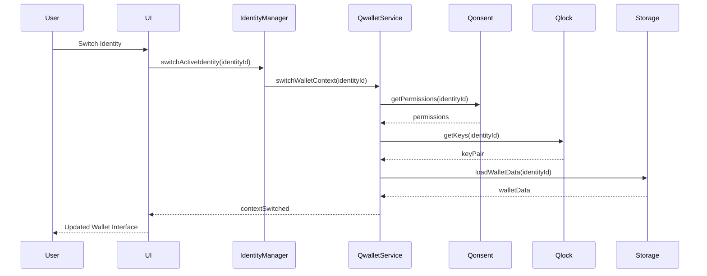

# Design Document

## Overview

The enhanced Qwallet module provides a comprehensive, identity-aware wallet system that seamlessly integrates with the sQuid identity management system. The design extends the existing wallet context switching foundation with modular components, enhanced security controls, Pi Wallet compatibility, and comprehensive audit capabilities.

The system architecture follows a layered approach with clear separation between identity management, wallet operations, security controls, and user interface components. All wallet operations are governed by the active sQuid identity's type, permissions, and Qonsent settings.

## Architecture

### High-Level Architecture



### Identity-Aware Wallet Context Flow



## Components and Interfaces

### Core Service Interfaces

#### Enhanced Qwallet Service

```typescript
interface EnhancedQwalletService extends IdentityQwalletService {
  // Identity-specific operations
  getIdentityWalletConfig(identityId: string): Promise<IdentityWalletConfig>;
  updateIdentityLimits(identityId: string, limits: WalletLimits): Promise<boolean>;
  
  // Pi Wallet integration
  linkPiWallet(identityId: string, piWalletData: PiWalletData): Promise<boolean>;
  unlinkPiWallet(identityId: string): Promise<boolean>;
  transferToPiWallet(identityId: string, amount: number, token: string): Promise<TransferResult>;
  transferFromPiWallet(identityId: string, amount: number, token: string): Promise<TransferResult>;
  
  // Enhanced audit and compliance
  logWalletOperation(operation: WalletAuditLog): Promise<void>;
  getRiskAssessment(identityId: string): Promise<RiskAssessment>;
  generateComplianceReport(identityId: string, period: DateRange): Promise<ComplianceReport>;
  
  // Token management
  getSupportedTokens(identityId: string): Promise<TokenInfo[]>;
  addCustomToken(identityId: string, tokenConfig: CustomTokenConfig): Promise<boolean>;
  
  // Emergency controls
  freezeWallet(identityId: string, reason: string): Promise<boolean>;
  unfreezeWallet(identityId: string): Promise<boolean>;
}
```

#### Identity Wallet Configuration

```typescript
interface IdentityWalletConfig {
  identityId: string;
  identityType: IdentityType;
  permissions: WalletPermissions;
  limits: WalletLimits;
  securitySettings: SecuritySettings;
  privacySettings: PrivacySettings;
  auditSettings: AuditSettings;
  piWalletConfig?: PiWalletConfig;
  customTokens: CustomTokenConfig[];
  emergencyContacts?: string[];
}

interface WalletLimits {
  dailyTransferLimit: number;
  monthlyTransferLimit: number;
  maxTransactionAmount: number;
  maxTransactionsPerHour: number;
  allowedTokens: string[];
  restrictedAddresses: string[];
  requiresApprovalAbove: number;
}

interface SecuritySettings {
  requiresDeviceVerification: boolean;
  requiresMultiSig: boolean;
  sessionTimeout: number;
  maxConcurrentSessions: number;
  suspiciousActivityThreshold: number;
  autoFreezeOnSuspiciousActivity: boolean;
}

interface PrivacySettings {
  logTransactions: boolean;
  shareWithAnalytics: boolean;
  anonymizeMetadata: boolean;
  ephemeralStorage: boolean;
  dataRetentionPeriod: number;
}
```

### UI Component Architecture

#### Wallet Dashboard Component

```typescript
interface WalletDashboardProps {
  identityId: string;
  compact?: boolean;
  showPiWallet?: boolean;
  showAuditStatus?: boolean;
}

interface WalletDashboardState {
  balances: IdentityBalances;
  limits: WalletLimits;
  recentTransactions: Transaction[];
  riskStatus: RiskAssessment;
  piWalletStatus?: PiWalletStatus;
  loading: boolean;
  error: string | null;
}
```

#### Token Transfer Form Component

```typescript
interface TokenTransferFormProps {
  identityId: string;
  prefilledRecipient?: string;
  prefilledAmount?: number;
  prefilledToken?: string;
  onTransferComplete?: (result: TransferResult) => void;
  onTransferError?: (error: string) => void;
}

interface TransferValidation {
  isValid: boolean;
  errors: string[];
  warnings: string[];
  requiresApproval: boolean;
  estimatedFees: number;
  riskLevel: 'LOW' | 'MEDIUM' | 'HIGH' | 'CRITICAL';
}
```

#### Pi Wallet Integration Component

```typescript
interface PiWalletInterfaceProps {
  identityId: string;
  showBalance?: boolean;
  allowTransfers?: boolean;
  onConnectionChange?: (connected: boolean) => void;
}

interface PiWalletStatus {
  connected: boolean;
  balance: number;
  lastSync: string;
  connectionError?: string;
  supportedOperations: string[];
}
```

## Data Models

### Enhanced Token Model

```typescript
interface TokenInfo {
  tokenId: string;
  name: string;
  symbol: string;
  chain: 'PI' | 'ANARQ' | 'ETH' | 'BTC' | 'FILECOIN' | 'CUSTOM';
  decimals: number;
  iconUrl?: string;
  governanceRequired?: boolean;
  contractAddress?: string;
  metadata?: Record<string, any>;
}
```

*Note: The token model supports multi-chain metadata and governance, allowing future expansion to external chains (e.g., ETH, BTC, Filecoin) while maintaining DAO-level control.*

### Enhanced Wallet Limits Model

```typescript
interface WalletLimits {
  dailyTransferLimit: number;
  monthlyTransferLimit: number;
  maxTransactionAmount: number;
  maxTransactionsPerHour: number;
  allowedTokens: string[];
  restrictedAddresses: string[];
  requiresApprovalAbove: number;
  
  // Dynamic governance controls
  dynamicLimitsEnabled?: boolean;
  governanceControlled?: boolean;
  policyId?: string; // ID of the policy in Qonsent
  daoOverrides?: Record<string, any>;
}
```

### Wallet Mode Configuration

```typescript
interface WalletMode {
  isSandbox: boolean;
  simulatedTime?: string;
  mockBalances?: Record<string, number>;
  fakeSignature?: boolean;
  testingScenario?: string;
}
```

### Wallet Transaction Model

```typescript
interface WalletTransaction extends Transaction {
  identityId: string;
  identityType: IdentityType;
  privacyLevel: PrivacyLevel;
  riskScore: number;
  complianceFlags: string[];
  qonsentApproved: boolean;
  qlockSigned: boolean;
  piWalletInvolved: boolean;
  auditTrail: AuditEntry[];
  walletMode?: WalletMode;
  metadata: {
    deviceFingerprint?: string;
    ipAddress?: string;
    userAgent?: string;
    geolocation?: string;
    sessionId: string;
    chain?: string;
  };
}
```

### Risk Assessment Model

```typescript
interface RiskAssessment {
  identityId: string;
  overallRisk: 'LOW' | 'MEDIUM' | 'HIGH' | 'CRITICAL';
  riskFactors: RiskFactor[];
  recommendations: string[];
  lastAssessment: string;
  nextAssessment: string;
  autoActions: AutoAction[];
  
  // Enhanced reputation integration
  reputationScore?: number;
  reputationTier?: 'TRUSTED' | 'NEUTRAL' | 'RESTRICTED';
  trustedByDAOs?: string[]; // DAO IDs that endorse this wallet
}

interface RiskFactor {
  type: 'VELOCITY' | 'AMOUNT' | 'FREQUENCY' | 'PATTERN' | 'DEVICE' | 'LOCATION';
  severity: 'LOW' | 'MEDIUM' | 'HIGH' | 'CRITICAL';
  description: string;
  value: number;
  threshold: number;
  firstDetected: string;
  lastDetected: string;
}

interface AutoAction {
  trigger: string;
  action: 'LOG' | 'WARN' | 'RESTRICT' | 'FREEZE' | 'NOTIFY';
  executed: boolean;
  executedAt?: string;
  result?: string;
}
```

### Pi Wallet Integration Model

```typescript
interface PiWalletData {
  piUserId: string;
  piWalletAddress: string;
  accessToken: string;
  refreshToken: string;
  permissions: string[];
  linkedAt: string;
  lastSync: string;
  syncErrors: string[];
}

interface PiTransferRequest {
  amount: number;
  memo?: string;
  recipientId: string;
  metadata: {
    squidIdentityId: string;
    transactionType: 'DEPOSIT' | 'WITHDRAWAL';
    originalCurrency: string;
  };
}
```

## Error Handling

### Error Classification

```typescript
enum WalletErrorType {
  PERMISSION_DENIED = 'PERMISSION_DENIED',
  INSUFFICIENT_BALANCE = 'INSUFFICIENT_BALANCE',
  LIMIT_EXCEEDED = 'LIMIT_EXCEEDED',
  INVALID_RECIPIENT = 'INVALID_RECIPIENT',
  QONSENT_BLOCKED = 'QONSENT_BLOCKED',
  QLOCK_FAILED = 'QLOCK_FAILED',
  PI_WALLET_ERROR = 'PI_WALLET_ERROR',
  NETWORK_ERROR = 'NETWORK_ERROR',
  VALIDATION_ERROR = 'VALIDATION_ERROR',
  SECURITY_VIOLATION = 'SECURITY_VIOLATION',
  COMPLIANCE_VIOLATION = 'COMPLIANCE_VIOLATION'
}

interface WalletError {
  type: WalletErrorType;
  message: string;
  identityId: string;
  operation: string;
  details?: any;
  recoverable: boolean;
  suggestedActions: string[];
  timestamp: string;
}
```

### Error Recovery Strategies

```typescript
interface ErrorRecoveryStrategy {
  errorType: WalletErrorType;
  strategy: 'RETRY' | 'FALLBACK' | 'USER_ACTION' | 'ESCALATE';
  maxRetries?: number;
  retryDelay?: number;
  fallbackMethod?: string;
  userActionRequired?: string;
  escalationLevel?: 'SUPPORT' | 'ADMIN' | 'SECURITY';
}
```

### Critical Failure Response Policy

| Failure Type | System Behavior | Recovery Strategy |
|--------------|-----------------|-------------------|
| Qlock unavailable | Wallet ops paused, user notified | Retry + fallback |
| Qonsent validation timeout | Op blocked temporarily, risk alert raised | Retry, user override? |
| Audit log failure (Qerberos) | Log locally and sync later | Deferred sync |
| Session hijack detected | Auto logout + IP ban + alert admin | Escalate & block |
| Pi Wallet API failure | Disable Pi operations, show status | Retry with exponential backoff |
| Identity context corruption | Force re-authentication | Clear cache + re-login |

## Extensibility Architecture

### Plugin Interface

```typescript
interface QwalletPlugin {
  pluginId: string;
  name: string;
  version: string;
  type: 'AUDIT' | 'TOKEN' | 'UI' | 'SERVICE' | 'INTEGRATION';
  
  // Lifecycle methods
  activate(): Promise<void>;
  deactivate(): Promise<void>;
  configure(config: Record<string, any>): Promise<void>;
  
  // Plugin capabilities
  capabilities: string[];
  requiredPermissions: string[];
  supportedIdentityTypes: IdentityType[];
  
  // Integration hooks
  onWalletOperation?(operation: WalletOperation): Promise<void>;
  onIdentitySwitch?(fromId: string, toId: string): Promise<void>;
  onTransactionComplete?(transaction: WalletTransaction): Promise<void>;
  
  // Configuration
  config?: Record<string, any>;
  metadata?: {
    author: string;
    description: string;
    homepage?: string;
    repository?: string;
  };
}

interface PluginManager {
  registerPlugin(plugin: QwalletPlugin): Promise<boolean>;
  unregisterPlugin(pluginId: string): Promise<boolean>;
  getActivePlugins(): QwalletPlugin[];
  getPluginConfig(pluginId: string): Record<string, any>;
  updatePluginConfig(pluginId: string, config: Record<string, any>): Promise<boolean>;
}
```

*Note: This plugin architecture prepares the system for integration with third-party DAO wallets, external dashboards, educational systems, and custom audit tools, aligning with the modular growth vision of the ecosystem.*

## Testing Strategy

### Unit Testing Approach

1. **Component Testing**
   - Test each wallet component with all identity types
   - Mock external dependencies (Qlock, Qonsent, Pi Wallet)
   - Validate proper error handling and loading states
   - Test accessibility compliance

2. **Service Testing**
   - Test wallet operations with different permission sets
   - Validate transaction signing and verification
   - Test risk assessment algorithms
   - Test Pi Wallet integration flows

3. **Hook Testing**
   - Test state management and updates
   - Test identity switching scenarios
   - Test error propagation and recovery
   - Test concurrent operation handling

### Integration Testing Approach

1. **Identity Integration**
   - Test wallet context switching between all identity types
   - Validate permission enforcement across identity changes
   - Test data isolation between identities

2. **Service Integration**
   - Test Qlock signing integration
   - Test Qonsent permission validation
   - Test Qerberos audit logging
   - Test Pi Wallet API integration

3. **End-to-End Testing**
   - Test complete transaction flows
   - Test emergency scenarios (freezing, unfreezing)
   - Test compliance reporting
   - Test cross-identity transfers

### Security Testing

1. **Permission Testing**
   - Validate identity-based access controls
   - Test privilege escalation prevention
   - Test data leakage between identities

2. **Audit Testing**
   - Validate comprehensive logging
   - Test log integrity and tamper detection
   - Test compliance report accuracy

3. **Risk Assessment Testing**
   - Test suspicious activity detection
   - Test automated response systems
   - Test false positive handling

### Performance Testing

1. **Load Testing**
   - Test concurrent wallet operations
   - Test identity switching performance
   - Test large transaction history handling

2. **Stress Testing**
   - Test system behavior under high load
   - Test memory usage with multiple identities
   - Test network failure scenarios

## Security Considerations

### Data Protection

1. **Encryption at Rest**
   - All private keys encrypted with identity-specific keys
   - Transaction history encrypted based on privacy level
   - Audit logs encrypted and signed

2. **Encryption in Transit**
   - All API communications use TLS 1.3
   - Additional encryption for sensitive operations
   - Certificate pinning for critical endpoints

3. **Key Management**
   - Integration with Qlock for key derivation
   - Hardware security module support
   - Key rotation policies

### Access Control

1. **Identity-Based Access**
   - Strict enforcement of identity permissions
   - No cross-identity data access
   - Audit trail for all access attempts

2. **Session Management**
   - Secure session handling
   - Automatic session timeout
   - Concurrent session limits

3. **Device Verification**
   - Device fingerprinting
   - Trusted device management
   - Anomaly detection

### Compliance

1. **Regulatory Compliance**
   - AML/KYC integration
   - Transaction monitoring
   - Suspicious activity reporting

2. **Privacy Compliance**
   - GDPR compliance for EU users
   - Data minimization principles
   - Right to be forgotten implementation

3. **Audit Requirements**
   - Immutable audit trails
   - Compliance reporting
   - External audit support