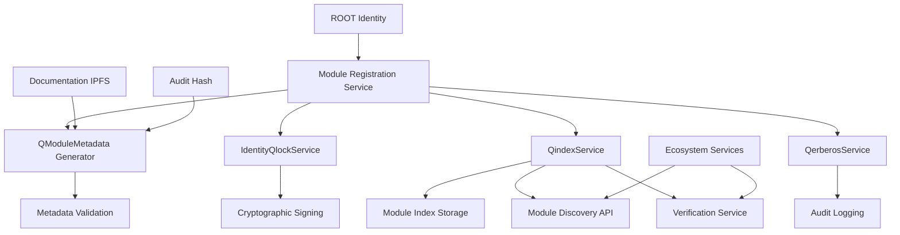
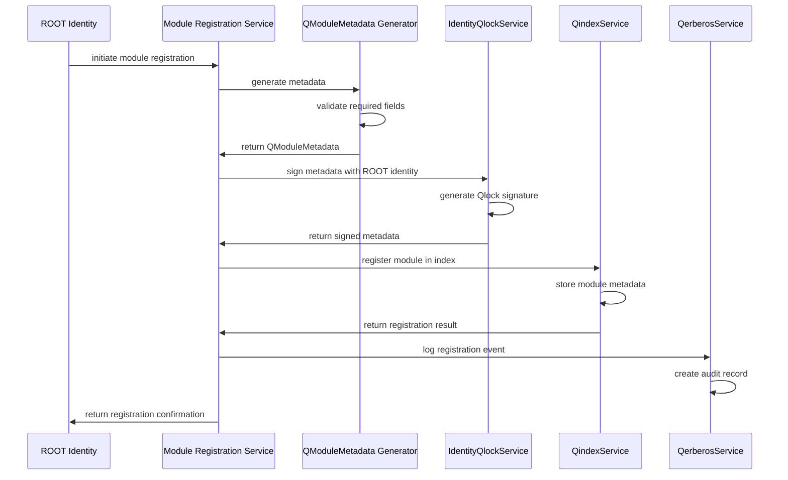

# Design Document

## Overview

The Qwallet Module Registration system provides a secure, auditable mechanism for registering ecosystem modules in the AnarQ & Q decentralized infrastructure. This system extends the existing QindexService with module-specific registration capabilities, integrates with the Qlock signature system for cryptographic verification, and ensures proper compliance tracking through Qerberos audit logging.

The design follows the established ecosystem patterns while introducing new module metadata structures and registration workflows specifically tailored for production module deployment.

## Architecture

### High-Level Architecture



### Service Integration Flow



## Components and Interfaces

### QModuleMetadata Interface

```typescript
interface QModuleMetadata {
  // Core Module Information
  module: string;                    // Module name (e.g., "Qwallet")
  version: string;                   // Semantic version (e.g., "1.0.0")
  description: string;               // Human-readable description
  
  // Ecosystem Integration
  identities_supported: IdentityType[];  // Supported identity types
  integrations: string[];            // Integrated ecosystem services
  dependencies?: string[];           // Required module dependencies
  
  // Status and Compliance
  status: ModuleStatus;              // DEVELOPMENT | TESTING | PRODUCTION_READY
  audit_hash: string;                // SHA256 hash of audit results
  compliance: ModuleCompliance;      // Compliance information
  
  // Documentation and Repository
  repository: string;                // Git repository URL
  documentation: string;             // IPFS CID for documentation
  changelog?: string;                // IPFS CID for changelog
  
  // Registration Metadata
  activated_by: string;              // Identity DID that registered the module
  timestamp: number;                 // Registration timestamp
  expires_at?: number;               // Optional expiration timestamp
  
  // Security and Verification
  checksum: string;                  // Module package checksum
  signature_algorithm: string;       // Signature algorithm used
  public_key_id: string;            // Public key identifier for verification
}

interface ModuleCompliance {
  audit: boolean;                    // Has passed security audit
  risk_scoring: boolean;             // Supports risk assessment
  privacy_enforced: boolean;         // Enforces privacy controls
  kyc_support: boolean;              // Supports KYC requirements
  gdpr_compliant: boolean;           // GDPR compliance status
  data_retention_policy: string;     // Data retention policy reference
}

enum ModuleStatus {
  DEVELOPMENT = 'DEVELOPMENT',
  TESTING = 'TESTING',
  PRODUCTION_READY = 'PRODUCTION_READY',
  DEPRECATED = 'DEPRECATED',
  SUSPENDED = 'SUSPENDED'
}

interface SignedModuleMetadata {
  metadata: QModuleMetadata;
  signature: string;                 // Qlock cryptographic signature
  publicKey: string;                 // Verifying public key
  signature_type: string;            // Signature algorithm type
  signed_at: number;                 // Signature timestamp
  signer_identity: string;           // Identity DID of signer
}
```

### Module Registration Service

```typescript
interface ModuleRegistrationService {
  // Core Registration
  registerModule(moduleData: ModuleRegistrationRequest): Promise<ModuleRegistrationResult>;
  updateModule(moduleId: string, updates: Partial<QModuleMetadata>): Promise<boolean>;
  deregisterModule(moduleId: string, reason: string): Promise<boolean>;
  
  // Metadata Management
  generateMetadata(moduleInfo: ModuleInfo): Promise<QModuleMetadata>;
  validateMetadata(metadata: QModuleMetadata): Promise<ValidationResult>;
  
  // Signature Operations
  signMetadata(metadata: QModuleMetadata, identityId: string): Promise<SignedModuleMetadata>;
  verifySignature(signedMetadata: SignedModuleMetadata): Promise<VerificationResult>;
  
  // Registration Verification
  verifyRegistration(moduleId: string): Promise<RegistrationStatus>;
  getRegistrationStatus(moduleId: string): Promise<ModuleRegistrationInfo>;
  
  // Sandbox Operations
  registerSandboxModule(moduleData: ModuleRegistrationRequest): Promise<ModuleRegistrationResult>;
  promoteSandboxToProduction(moduleId: string): Promise<boolean>;
}

interface ModuleRegistrationRequest {
  moduleInfo: ModuleInfo;
  testMode?: boolean;
  skipValidation?: boolean;
  customMetadata?: Record<string, any>;
}

interface ModuleInfo {
  name: string;
  version: string;
  description: string;
  identitiesSupported: IdentityType[];
  integrations: string[];
  repositoryUrl: string;
  documentationCid?: string;
  auditHash?: string;
  compliance?: Partial<ModuleCompliance>;
}
```

### Enhanced QindexService

```typescript
interface EnhancedQindexService extends QindexService {
  // Module Registration
  registerModule(moduleId: string, signedMetadata: SignedModuleMetadata, options?: RegistrationOptions): Promise<ModuleRegistrationResult>;
  updateModuleMetadata(moduleId: string, updates: Partial<QModuleMetadata>): Promise<boolean>;
  deregisterModule(moduleId: string): Promise<boolean>;
  
  // Module Discovery
  getModule(moduleId: string): Promise<RegisteredModule | null>;
  searchModules(criteria: ModuleSearchCriteria): Promise<ModuleSearchResult>;
  listModules(filter?: ModuleFilter): Promise<RegisteredModule[]>;
  
  // Module Verification
  verifyModule(moduleId: string): Promise<ModuleVerificationResult>;
  validateModuleSignature(moduleId: string): Promise<SignatureValidationResult>;
  
  // Module Dependencies
  getModuleDependencies(moduleId: string): Promise<string[]>;
  checkDependencyCompatibility(moduleId: string, dependencies: string[]): Promise<CompatibilityResult>;
  
  // Sandbox Operations
  registerSandboxModule(moduleId: string, signedMetadata: SignedModuleMetadata): Promise<ModuleRegistrationResult>;
  listSandboxModules(): Promise<RegisteredModule[]>;
  promoteSandboxModule(moduleId: string): Promise<boolean>;
}

interface RegistrationOptions {
  testMode?: boolean;
  skipDependencyCheck?: boolean;
  customIndexPath?: string;
  expirationTime?: number;
}

interface RegisteredModule {
  moduleId: string;
  metadata: QModuleMetadata;
  signedMetadata: SignedModuleMetadata;
  registrationInfo: {
    cid: string;
    indexId: string;
    registeredAt: string;
    registeredBy: string;
    status: ModuleStatus;
    verificationStatus: 'VERIFIED' | 'UNVERIFIED' | 'INVALID';
  };
  accessStats: {
    queryCount: number;
    lastAccessed: string;
    dependentModules: string[];
  };
}
```

### Enhanced IdentityQlockService

```typescript
interface EnhancedIdentityQlockService extends IdentityQlockService {
  // Module Metadata Signing
  signMetadata(metadata: QModuleMetadata, identityId: string): Promise<SignedModuleMetadata>;
  verifyMetadataSignature(signedMetadata: SignedModuleMetadata): Promise<VerificationResult>;
  
  // Module-specific Key Management
  generateModuleSigningKeys(identityId: string): Promise<ModuleKeyPair>;
  getModuleSigningKeys(identityId: string): Promise<ModuleKeyPair | null>;
  rotateModuleSigningKeys(identityId: string): Promise<boolean>;
  
  // Signature Validation
  validateSignatureChain(moduleId: string): Promise<SignatureChainResult>;
  verifySignerAuthority(signerIdentity: string, moduleId: string): Promise<boolean>;
}

interface ModuleKeyPair {
  publicKey: string;
  privateKey: string;
  keyId: string;
  algorithm: string;
  createdAt: string;
  expiresAt?: string;
}
```

## Data Models

### Module Registry Storage

```typescript
interface ModuleRegistry {
  // Production Modules
  productionModules: Map<string, RegisteredModule>;
  
  // Sandbox Modules
  sandboxModules: Map<string, RegisteredModule>;
  
  // Module Dependencies
  dependencyGraph: Map<string, string[]>;
  
  // Signature Verification Cache
  signatureCache: Map<string, VerificationResult>;
  
  // Access Statistics
  accessStats: Map<string, ModuleAccessStats>;
  
  // Audit Trail
  auditLog: ModuleAuditEvent[];
}

interface ModuleAccessStats {
  moduleId: string;
  totalQueries: number;
  uniqueCallers: Set<string>;
  lastAccessed: string;
  averageResponseTime: number;
  errorCount: number;
}

interface ModuleAuditEvent {
  eventId: string;
  moduleId: string;
  action: 'REGISTERED' | 'UPDATED' | 'DEREGISTERED' | 'VERIFIED' | 'ACCESSED';
  actorIdentity: string;
  timestamp: string;
  details: Record<string, any>;
  signature?: string;
}
```

### Verification Results

```typescript
interface ModuleVerificationResult {
  moduleId: string;
  status: 'production_ready' | 'testing' | 'development' | 'invalid';
  verificationChecks: {
    metadataValid: boolean;
    signatureValid: boolean;
    dependenciesResolved: boolean;
    complianceVerified: boolean;
    auditPassed: boolean;
  };
  issues: VerificationIssue[];
  lastVerified: string;
  verifiedBy: string;
}

interface VerificationIssue {
  severity: 'ERROR' | 'WARNING' | 'INFO';
  code: string;
  message: string;
  field?: string;
  suggestion?: string;
}
```

## Error Handling

### Error Classification

```typescript
enum ModuleRegistrationErrorCode {
  INVALID_METADATA = 'INVALID_METADATA',
  SIGNATURE_VERIFICATION_FAILED = 'SIGNATURE_VERIFICATION_FAILED',
  UNAUTHORIZED_SIGNER = 'UNAUTHORIZED_SIGNER',
  MODULE_ALREADY_EXISTS = 'MODULE_ALREADY_EXISTS',
  DEPENDENCY_NOT_FOUND = 'DEPENDENCY_NOT_FOUND',
  COMPLIANCE_CHECK_FAILED = 'COMPLIANCE_CHECK_FAILED',
  AUDIT_HASH_INVALID = 'AUDIT_HASH_INVALID',
  DOCUMENTATION_UNAVAILABLE = 'DOCUMENTATION_UNAVAILABLE',
  QINDEX_STORAGE_FAILED = 'QINDEX_STORAGE_FAILED',
  QERBEROS_LOGGING_FAILED = 'QERBEROS_LOGGING_FAILED'
}

class ModuleRegistrationError extends Error {
  constructor(
    public code: ModuleRegistrationErrorCode,
    message: string,
    public moduleId?: string,
    public details?: any
  ) {
    super(message);
    this.name = 'ModuleRegistrationError';
  }
}
```

### Error Recovery Strategies

```typescript
interface ErrorRecoveryStrategy {
  // Retry Mechanisms
  retryRegistration(moduleId: string, maxRetries: number): Promise<boolean>;
  retryWithBackoff(operation: () => Promise<any>, maxRetries: number): Promise<any>;
  
  // Fallback Operations
  registerWithReducedMetadata(moduleInfo: ModuleInfo): Promise<ModuleRegistrationResult>;
  registerInSandboxMode(moduleInfo: ModuleInfo): Promise<ModuleRegistrationResult>;
  
  // Recovery Actions
  repairCorruptedRegistration(moduleId: string): Promise<boolean>;
  resyncWithQindex(moduleId: string): Promise<boolean>;
  regenerateSignature(moduleId: string, identityId: string): Promise<boolean>;
}
```

## Testing Strategy

### Unit Testing

- **Metadata Generation**: Test QModuleMetadata generation with various input combinations
- **Signature Operations**: Test signing and verification with different identity types
- **Validation Logic**: Test metadata validation with valid and invalid inputs
- **Error Handling**: Test all error scenarios and recovery mechanisms

### Integration Testing

- **Service Integration**: Test interaction between ModuleRegistrationService, QindexService, and IdentityQlockService
- **Identity Context**: Test registration with different identity types (ROOT, DAO, ENTERPRISE)
- **Dependency Resolution**: Test module dependency checking and resolution
- **Audit Logging**: Test Qerberos integration for audit trail creation

### End-to-End Testing

- **Complete Registration Flow**: Test full module registration from metadata generation to verification
- **Sandbox to Production**: Test promotion of sandbox modules to production
- **Module Discovery**: Test module search and retrieval functionality
- **Signature Verification**: Test signature verification across service boundaries

### Security Testing

- **Signature Tampering**: Test detection of tampered signatures
- **Unauthorized Registration**: Test prevention of unauthorized module registration
- **Identity Spoofing**: Test protection against identity spoofing attacks
- **Metadata Injection**: Test protection against malicious metadata injection

## Performance Considerations

### Optimization Strategies

- **Signature Caching**: Cache signature verification results to avoid repeated cryptographic operations
- **Metadata Indexing**: Create efficient indexes for module search and discovery
- **Lazy Loading**: Load module documentation and extended metadata on demand
- **Batch Operations**: Support batch registration for multiple modules

### Scalability Measures

- **Distributed Storage**: Use IPFS for large metadata and documentation storage
- **Sharded Indexes**: Implement sharded indexing for large module registries
- **Async Processing**: Use asynchronous processing for non-critical operations
- **Rate Limiting**: Implement rate limiting for registration operations

## Security Architecture

### Cryptographic Security

- **Strong Signatures**: Use RSA-4096 or ECDSA-P384 for module signatures
- **Key Rotation**: Implement automatic key rotation for long-lived modules
- **Signature Chains**: Support signature chains for module updates
- **Timestamp Verification**: Include and verify timestamps in signatures

### Access Control

- **Identity-based Authorization**: Only ROOT and authorized identities can register modules
- **Permission Validation**: Validate permissions before allowing registration operations
- **Audit Trail**: Maintain complete audit trail of all registration activities
- **Rate Limiting**: Implement rate limiting to prevent abuse

### Data Integrity

- **Checksum Verification**: Verify module package checksums during registration
- **Metadata Validation**: Validate all metadata fields against schemas
- **Dependency Verification**: Verify that all dependencies are valid and available
- **Compliance Checking**: Validate compliance information against requirements