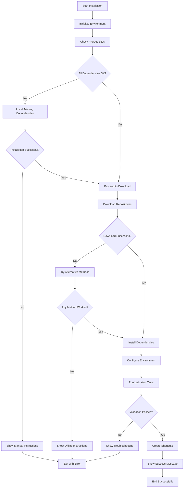

# Design Document

## Overview

The robust installer system will be a modular, cross-platform shell script that provides reliable installation of the AnarQ&Q ecosystem with comprehensive error handling, multiple fallback mechanisms, and user-friendly progress feedback. The design emphasizes resilience, modularity, and maintainability while addressing the critical issues found in the current installer.

## Architecture

### Core Components

1. **Dependency Manager**: Detects and installs missing system utilities
2. **Download Engine**: Multi-method repository acquisition with retry logic
3. **Installation Orchestrator**: Coordinates the installation process
4. **Validation Engine**: Post-installation testing and verification
5. **Error Handler**: Comprehensive error management and recovery
6. **User Interface**: Interactive prompts and progress feedback

### System Flow



## Components and Interfaces

### 1. Environment Detection Module

**Purpose**: Detect system capabilities and configuration

**Functions**:
- `detect_os()`: Identify operating system and version
- `detect_package_manager()`: Find available package managers
- `detect_shell()`: Identify current shell environment
- `check_permissions()`: Verify installation permissions

**Interface**:
```bash
# Returns: "linux", "macos", "windows", "unknown"
OS_TYPE=$(detect_os)

# Returns: "apt", "yum", "brew", "choco", "manual"
PKG_MANAGER=$(detect_package_manager)
```

### 2. Dependency Manager Module

**Purpose**: Ensure all required system utilities are available

**Functions**:
- `command_exists()`: Check if a command is available
- `install_dependency()`: Install missing utilities
- `validate_version()`: Check minimum version requirements
- `suggest_manual_install()`: Provide manual installation instructions

**Interface**:
```bash
# Check if command exists
if command_exists "unzip"; then
    echo "unzip is available"
fi

# Install missing dependency
install_dependency "unzip" "Archive extraction utility"
```

### 3. Download Engine Module

**Purpose**: Robust repository downloading with multiple fallback methods

**Functions**:
- `download_with_git()`: Git clone method
- `download_with_curl()`: cURL ZIP download
- `download_with_wget()`: wget ZIP download
- `extract_archive()`: Multi-method archive extraction
- `retry_with_backoff()`: Exponential backoff retry logic

**Interface**:
```bash
# Download repository with automatic fallback
download_repository "https://github.com/user/repo" "/target/path" "repo-name"
```

### 4. Installation Orchestrator Module

**Purpose**: Coordinate the overall installation process

**Functions**:
- `select_installation_mode()`: Interactive mode selection
- `install_components()`: Install selected components
- `configure_environment()`: Set up configuration files
- `create_startup_scripts()`: Generate convenience scripts

**Interface**:
```bash
# Installation modes: "minimal", "full", "development"
INSTALL_MODE=$(select_installation_mode)
install_components "$INSTALL_MODE"
```

### 5. Validation Engine Module

**Purpose**: Verify installation integrity and functionality

**Functions**:
- `validate_installation()`: Comprehensive system validation
- `test_module_loading()`: Test individual module functionality
- `check_network_connectivity()`: Verify network requirements
- `generate_health_report()`: Create installation health report

**Interface**:
```bash
# Returns 0 for success, 1 for failure
validate_installation "$INSTALL_DIR"
```

### 6. Error Handler Module

**Purpose**: Comprehensive error management and user guidance

**Functions**:
- `log_error()`: Structured error logging
- `cleanup_on_error()`: Remove partial installations
- `show_troubleshooting()`: Display context-specific help
- `generate_support_bundle()`: Create diagnostic information

**Interface**:
```bash
# Log error with context
log_error "DOWNLOAD_FAILED" "Could not download repository" "$repo_url"

# Cleanup and exit
cleanup_and_exit 1 "Installation failed at dependency check"
```

### 7. User Interface Module

**Purpose**: Interactive user experience and progress feedback

**Functions**:
- `show_progress()`: Display progress indicators
- `prompt_user()`: Interactive user prompts
- `display_summary()`: Installation summary
- `show_next_steps()`: Post-installation guidance

**Interface**:
```bash
# Show progress with percentage
show_progress "Installing dependencies" 45

# Prompt with default
RESPONSE=$(prompt_user "Install full ecosystem?" "y" "y/N")
```

## Data Models

### Installation Configuration

```bash
# Installation configuration structure
INSTALL_CONFIG=(
    ["mode"]="full"                    # minimal, full, development
    ["target_dir"]="/home/user/anarqq" # Installation directory
    ["components"]="demo,core,backend"  # Selected components
    ["skip_validation"]="false"        # Skip post-install validation
    ["verbose"]="false"                # Verbose logging
    ["offline"]="false"                # Offline installation mode
)
```

### System Capabilities

```bash
# System capabilities detection
SYSTEM_CAPS=(
    ["os"]="linux"                     # Operating system
    ["package_manager"]="apt"          # Available package manager
    ["shell"]="bash"                   # Current shell
    ["has_docker"]="true"              # Docker availability
    ["has_git"]="true"                 # Git availability
    ["has_node"]="true"                # Node.js availability
    ["node_version"]="20.19.4"         # Node.js version
)
```

### Error Context

```bash
# Error context for troubleshooting
ERROR_CONTEXT=(
    ["step"]="download_repositories"   # Current installation step
    ["component"]="demo"               # Component being processed
    ["method"]="curl_zip"              # Method being attempted
    ["attempt"]="2"                    # Retry attempt number
    ["last_error"]="Connection timeout" # Last error message
)
```

## Error Handling

### Error Categories

1. **System Errors**: Missing dependencies, permission issues
2. **Network Errors**: Download failures, connectivity issues
3. **Configuration Errors**: Invalid settings, missing files
4. **Validation Errors**: Post-installation test failures

### Error Recovery Strategies

1. **Automatic Retry**: Network operations with exponential backoff
2. **Method Fallback**: Try alternative download/extraction methods
3. **Graceful Degradation**: Continue with partial functionality
4. **User Guidance**: Provide clear remediation steps

### Logging Strategy

```bash
# Log levels: ERROR, WARN, INFO, DEBUG
log_message "INFO" "Starting installation process"
log_message "ERROR" "Failed to download repository: $error_details"

# Log file location: /tmp/anarqq-installer-$(date +%Y%m%d-%H%M%S).log
```

## Testing Strategy

### Unit Testing

- Test individual functions with mock dependencies
- Validate error handling paths
- Test cross-platform compatibility

### Integration Testing

- Test complete installation flows
- Validate component interactions
- Test error recovery scenarios

### System Testing

- Test on different operating systems
- Test with various network conditions
- Test with different system configurations

### User Acceptance Testing

- Test installation experience with real users
- Validate error messages and guidance
- Test documentation completeness

## Performance Considerations

### Download Optimization

- Parallel downloads where possible
- Resume interrupted downloads
- Compress transfer data

### Resource Management

- Monitor disk space during installation
- Clean up temporary files promptly
- Limit concurrent operations

### User Experience

- Responsive progress indicators
- Estimated time remaining
- Clear status messages

## Security Considerations

### Download Security

- Verify repository authenticity
- Check file integrity with checksums
- Use HTTPS for all downloads

### Permission Management

- Request minimal required permissions
- Validate installation directories
- Secure temporary file handling

### Configuration Security

- Sanitize user inputs
- Validate configuration files
- Secure credential handling

## Deployment Strategy

### Distribution

- Single self-contained script
- Minimal external dependencies
- Version-controlled releases

### Updates

- Automatic installer updates
- Backward compatibility
- Migration support

### Documentation

- Comprehensive README
- Troubleshooting guides
- Platform-specific instructions