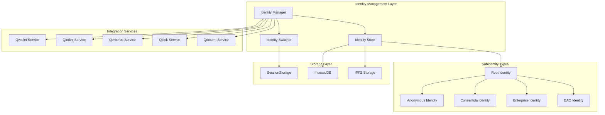
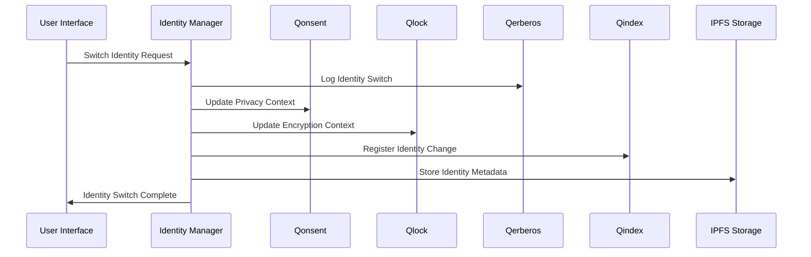

# Design Document

## Overview

The sQuid Identity Expansion extends the existing sQuid identity system to support comprehensive identity management with multiple identity types, seamless switching, and integrated privacy controls. The design builds upon the current architecture while adding sophisticated subidentity management, dynamic Qonsent policies, secure audit logging, and persistent encryption capabilities.

The system follows the Q∞ architecture pattern (Entry → Process → Output) and integrates deeply with existing ecosystem services (Qonsent, Qlock, Qerberos, Qindex, Qwallet) to provide a unified identity experience.

## Architecture

### Core Components



### Identity Hierarchy

The system implements a hierarchical identity structure where:

- **Root Identity**: The primary verified identity that owns all subidentities
- **Subidentities**: Specialized identities for different contexts and use cases
- **Identity Tree**: A structured representation of the relationship between identities

### Data Flow Architecture



## Components and Interfaces

### 1. Identity Manager Service

**Purpose**: Central orchestrator for all identity operations

**Key Methods**:
```typescript
interface IdentityManager {
  // Core Identity Operations
  createSubidentity(type: IdentityType, metadata: SubidentityMetadata): Promise<SubidentityResult>
  switchActiveIdentity(identityId: string): Promise<SwitchResult>
  getIdentityTree(rootId: string): Promise<IdentityTree>
  deleteSubidentity(identityId: string): Promise<DeleteResult>
  
  // Identity Validation
  validateIdentityCreation(type: IdentityType, parentId: string): Promise<ValidationResult>
  verifyIdentityOwnership(identityId: string, userId: string): Promise<boolean>
  
  // Integration Coordination
  syncWithEcosystem(identity: Identity): Promise<SyncResult>
  updateModuleContexts(identity: Identity): Promise<UpdateResult>
}
```

### 2. Identity Store

**Purpose**: Persistent storage and retrieval of identity data

**Storage Strategy**:
- **IPFS**: Encrypted identity metadata and profiles
- **IndexedDB**: Local identity cache and preferences
- **SessionStorage**: Active identity state
- **Zustand Store**: React state management

**Data Structure**:
```typescript
interface ExtendedSquidIdentity extends SquidIdentity {
  // Core Identity Properties
  did: string
  name: string
  type: IdentityType
  parentId?: string // For subidentities
  
  // Governance and Permissions
  governanceLevel: 'ROOT' | 'DAO_GOVERNED' | 'PARENT_CONTROLLED' | 'AUTONOMOUS'
  creationRules: IdentityCreationRules
  permissions: IdentityPermissions
  
  // Privacy and Security
  qonsentProfileId: string
  qlockKeyPair: KeyPair
  privacyLevel: 'PUBLIC' | 'DAO_ONLY' | 'PRIVATE' | 'ANONYMOUS'
  
  // Metadata
  avatar?: string
  description?: string
  tags: string[]
  createdAt: string
  lastUsed: string
  
  // Audit Trail
  auditLog: AuditEntry[]
  securityFlags: SecurityFlag[]
}
```

### 3. Identity Switcher Component

**Purpose**: UI component for seamless identity switching

**Features**:
- Visual identity selector with type indicators
- Real-time context updates
- Smooth transition animations
- Security confirmations for sensitive switches

**Component Structure**:
```typescript
interface IdentitySwitcherProps {
  identities: ExtendedSquidIdentity[]
  activeIdentity: ExtendedSquidIdentity
  onSwitch: (identityId: string) => Promise<void>
  showSecurityBadges?: boolean
  compactMode?: boolean
}
```

### 4. Subidentity Creation Wizard

**Purpose**: Guided creation flow for new subidentities

**Wizard Steps**:
1. **Type Selection**: Choose identity type with governance explanations
2. **Basic Information**: Name, description, avatar
3. **Governance Setup**: DAO linking, parental controls
4. **Privacy Configuration**: Qonsent profile setup
5. **Security Setup**: Qlock key generation
6. **Review and Confirm**: Final validation and creation

### 5. Integration Hooks

**Core Hooks**:
```typescript
// Primary identity management hook
const useIdentityManager = () => {
  return {
    identities: ExtendedSquidIdentity[],
    activeIdentity: ExtendedSquidIdentity | null,
    createSubidentity: (type, metadata) => Promise<SubidentityResult>,
    switchIdentity: (id) => Promise<void>,
    deleteIdentity: (id) => Promise<void>,
    loading: boolean,
    error: string | null
  }
}

// Identity tree visualization hook
const useIdentityTree = (rootId: string) => {
  return {
    tree: IdentityTreeNode,
    expandedNodes: string[],
    toggleNode: (nodeId: string) => void,
    loading: boolean
  }
}

// Active identity context hook
const useActiveIdentity = () => {
  return {
    identity: ExtendedSquidIdentity | null,
    isRoot: boolean,
    canCreateSubidentities: boolean,
    governanceType: GovernanceType,
    privacyLevel: PrivacyLevel
  }
}
```

## Data Models

### Identity Types and Rules

```typescript
enum IdentityType {
  ROOT = 'ROOT',
  DAO = 'DAO',
  ENTERPRISE = 'ENTERPRISE',
  CONSENTIDA = 'CONSENTIDA',
  AID = 'AID'
}

interface IdentityTypeRules {
  [IdentityType.ROOT]: {
    kycRequired: false, // Inherits from registration
    canCreateSubidentities: true,
    visibility: 'PUBLIC',
    governedBy: 'SELF'
  },
  [IdentityType.DAO]: {
    kycRequired: true,
    canCreateSubidentities: true, // Optional
    visibility: 'PUBLIC',
    governedBy: 'DAO'
  },
  [IdentityType.ENTERPRISE]: {
    kycRequired: true, // Via DAO
    canCreateSubidentities: false,
    visibility: 'PUBLIC',
    governedBy: 'DAO'
  },
  [IdentityType.CONSENTIDA]: {
    kycRequired: false, // Inherits from root
    canCreateSubidentities: false,
    visibility: 'PRIVATE',
    governedBy: 'PARENT'
  },
  [IdentityType.AID]: {
    kycRequired: true, // Root must be verified
    canCreateSubidentities: false,
    visibility: 'ANONYMOUS',
    governedBy: 'SELF'
  }
}
```

### Qonsent Integration Model

```typescript
interface IdentityQonsentProfile {
  identityId: string
  profileId: string
  privacyLevel: PrivacyLevel
  dataSharing: {
    [module: string]: {
      enabled: boolean
      level: 'MINIMAL' | 'STANDARD' | 'FULL'
      restrictions: string[]
    }
  }
  visibilityRules: {
    profile: 'PUBLIC' | 'DAO_ONLY' | 'PRIVATE'
    activity: 'PUBLIC' | 'DAO_ONLY' | 'PRIVATE'
    connections: 'PUBLIC' | 'DAO_ONLY' | 'PRIVATE'
  }
  consentHistory: ConsentEvent[]
  lastUpdated: string
}
```

### Audit and Security Model

```typescript
interface IdentityAuditEntry {
  id: string
  identityId: string
  action: IdentityAction
  timestamp: string
  metadata: {
    previousState?: any
    newState?: any
    triggeredBy: string
    ipAddress?: string
    deviceFingerprint?: string
    securityLevel: 'LOW' | 'MEDIUM' | 'HIGH'
  }
  qerberosLogId: string
}

enum IdentityAction {
  CREATED = 'CREATED',
  SWITCHED = 'SWITCHED',
  UPDATED = 'UPDATED',
  DELETED = 'DELETED',
  PRIVACY_CHANGED = 'PRIVACY_CHANGED',
  SECURITY_EVENT = 'SECURITY_EVENT'
}
```

## Error Handling

### Error Categories

1. **Validation Errors**: Invalid input data, rule violations
2. **Permission Errors**: Insufficient rights, governance violations
3. **Integration Errors**: Service communication failures
4. **Security Errors**: Suspicious activity, integrity violations
5. **Storage Errors**: IPFS failures, local storage issues

### Error Recovery Strategies

```typescript
interface ErrorRecoveryStrategy {
  // Graceful degradation for service failures
  fallbackToLocalStorage: boolean
  
  // Retry mechanisms for transient failures
  retryAttempts: number
  retryDelay: number
  
  // User notification strategies
  showUserError: boolean
  errorSeverity: 'INFO' | 'WARNING' | 'ERROR' | 'CRITICAL'
  
  // Automatic recovery actions
  autoRecoveryActions: RecoveryAction[]
}
```

### Security Error Handling

- **Suspicious Activity Detection**: Automated flagging of unusual patterns
- **Identity Lockdown**: Temporary suspension of identity operations
- **Audit Trail Preservation**: Immutable logging of all security events
- **Recovery Procedures**: Guided recovery flows for compromised identities

## Testing Strategy

### Unit Testing

**Identity Manager Tests**:
- Identity creation validation
- Switching logic verification
- Integration service mocking
- Error handling scenarios

**Component Tests**:
- Identity switcher interactions
- Creation wizard flow
- Visual state management
- Accessibility compliance

### Integration Testing

**Service Integration Tests**:
- Qonsent profile synchronization
- Qlock encryption/decryption
- Qerberos audit logging
- Qindex registration
- IPFS storage operations

**End-to-End Testing**:
- Complete identity lifecycle
- Cross-module context updates
- Security event handling
- Performance under load

### Security Testing

**Identity Security Tests**:
- Signature verification
- Encryption key management
- Access control validation
- Audit trail integrity

**Privacy Testing**:
- Data isolation between identities
- Qonsent policy enforcement
- Information leakage prevention
- Anonymous identity protection

### Performance Testing

**Load Testing**:
- Multiple identity switching
- Concurrent user operations
- Large identity tree handling
- Storage performance optimization

**Scalability Testing**:
- Identity tree depth limits
- Subidentity count limits
- Integration service load
- IPFS storage scaling

## Security Considerations

### Identity Isolation

- **Cryptographic Separation**: Each identity has unique encryption keys
- **Storage Isolation**: Separate IPFS namespaces per identity
- **Context Isolation**: Module states are completely separated
- **Audit Separation**: Individual audit trails per identity

### Privacy Protection

- **Anonymous Identity Protection**: AID identities are completely unlinkable
- **Data Minimization**: Only necessary data is shared between identities
- **Consent Management**: Granular privacy controls per identity
- **Visibility Controls**: Fine-grained visibility settings

### Security Monitoring

- **Behavioral Analysis**: Detection of unusual identity usage patterns
- **Integrity Verification**: Continuous validation of identity data
- **Threat Detection**: Real-time security threat identification
- **Incident Response**: Automated response to security events

### Governance Security

- **DAO Governance Validation**: Verification of DAO-controlled identity operations
- **Parental Control Enforcement**: Secure implementation of parental controls
- **Permission Validation**: Strict enforcement of identity permissions
- **Audit Compliance**: Comprehensive audit trail for governance actions

📌 Recomendaciones (opcional)
Métricas de uso de identidades (para futuro analytics)
Podrías añadir una propiedad opcional usageStats en ExtendedSquidIdentity para tracking anónimo del uso de cada identidad. Esto puede servir para análisis agregados de comportamiento.

ts
Copiar
Editar
usageStats?: {
  switchCount: number
  lastSwitch: string
  modulesAccessed: string[]
}
Compatibilidad con multicliente / multisesión
Si se prevé el uso simultáneo de múltiples sesiones (ej. móvil + escritorio), se podría incluir en el IdentityManager una función tipo syncSessionWithRemote() o getRemoteSessionSnapshot() para prevenir colisiones de estado.