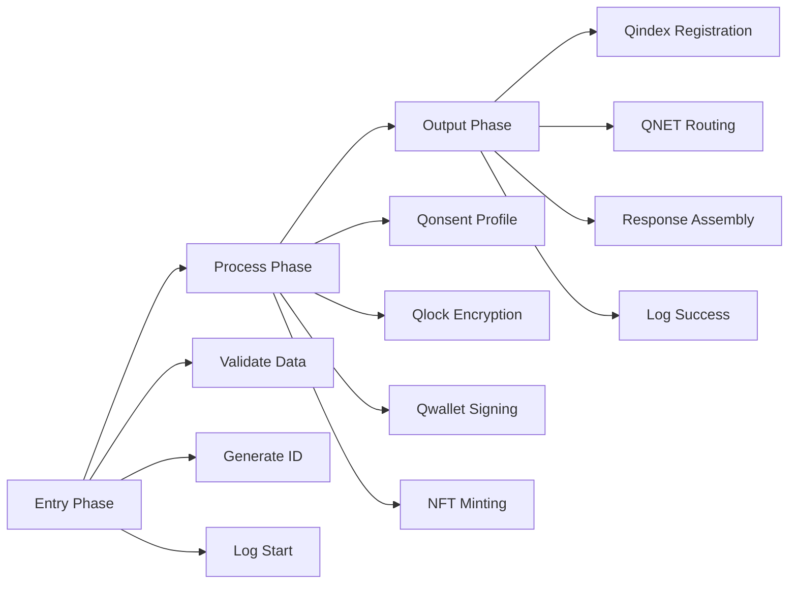
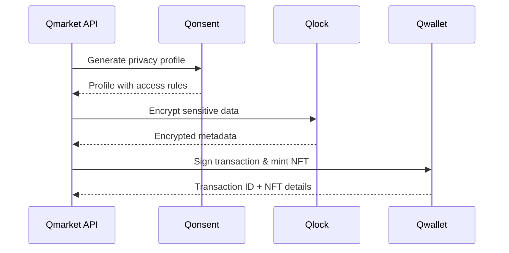
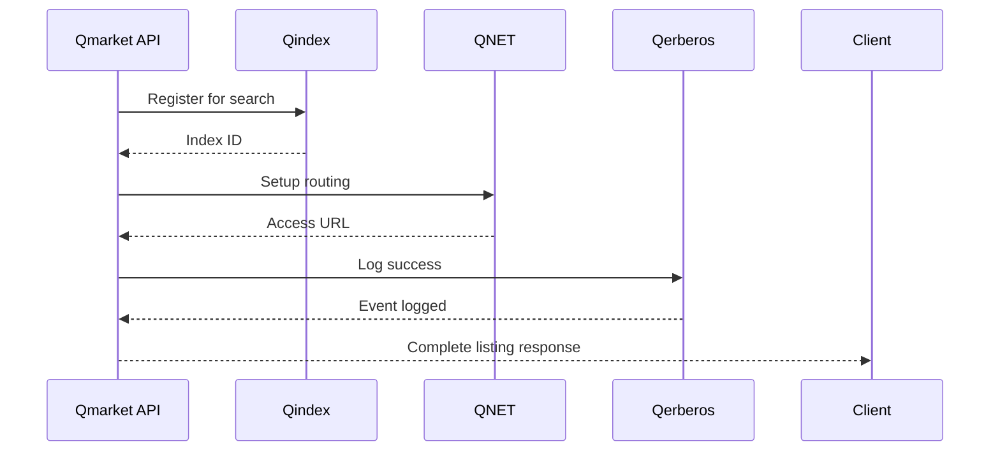

# Qmarket - Decentralized Marketplace Module

## 🌟 Overview

Qmarket is a decentralized marketplace module within the AnarQ&Q ecosystem that enables users to create, tokenize, and trade digital content as NFTs. Built on the Q∞ architecture (Entry → Process → Output), it provides seamless integration with all ecosystem services for privacy, encryption, indexing, routing, and tokenization.

### Key Features

- 🎨 **Digital Content Marketplace** - List and trade any digital asset
- 🪙 **Multi-Currency Support** - Accept payments in $QToken and $PI
- 🔐 **Privacy Controls** - Public, DAO-only, or private listings
- 🎯 **Automatic NFT Minting** - Every listing becomes a tradeable NFT
- 🔍 **Advanced Search** - Filter by category, price, tags, and more
- 🌐 **Decentralized Access** - Content routing via QNET
- 🔒 **Encrypted Storage** - Sensitive data protected by Qlock
- 📊 **Real-time Analytics** - Marketplace statistics and insights

## 🏗️ Architecture

### Q∞ Flow Implementation



### Ecosystem Integration

| Service | Purpose | Integration Point |
|---------|---------|-------------------|
| **Qonsent** | Privacy profiles and access control | Listing visibility and permissions |
| **Qlock** | Data encryption and security | Sensitive metadata protection |
| **Qindex** | Search and discovery | Listing metadata indexing |
| **Qerberos** | Event logging and moderation | Action tracking and audit trail |
| **QNET** | Content routing and delivery | Optimized file access URLs |
| **Qwallet** | Tokenization and payments | NFT minting and transaction signing |

## 📁 Project Structure

```
backend/
├── services/
│   └── QmarketService.mjs          # Core marketplace logic
├── routes/
│   └── qmarket.mjs                 # REST API endpoints
├── middleware/
│   ├── auth.mjs                    # sQuid authentication
│   └── validation.mjs              # Request validation
├── tests/
│   └── qmarket.test.mjs           # Integration tests
└── docs/
    └── qmarket-integration-summary.md

frontend/
├── src/qsocial/                   # Reusable components
│   ├── CreatePostForm.vue         # File upload form (reused)
│   ├── PostCard.vue               # Content display (reused)
│   └── EcosystemFileDisplay.vue   # File viewer (reused)
└── composables/
    └── useEcosystemFiles.js       # File management (reused)
```

## 🚀 Getting Started

### Backend Setup

1. **Install Dependencies**
   ```bash
   cd backend
   npm install
   ```

2. **Environment Configuration**
   ```bash
   # .env file
   JWT_SECRET=your_jwt_secret
   NODE_ENV=development
   PORT=3001
   ```

3. **Start the Server**
   ```bash
   npm start
   # or for development
   npm run dev
   ```

4. **Verify Integration**
   ```bash
   # Run Qmarket tests
   node tests/qmarket.test.mjs
   
   # Check health endpoint
   curl http://localhost:3001/api/qmarket/health
   ```

### Frontend Setup

The Qmarket module reuses existing frontend components from the qsocial module:

1. **File Upload** - Use `CreatePostForm.vue` with marketplace-specific props
2. **Content Display** - Use `PostCard.vue` for listing previews
3. **File Management** - Use `useEcosystemFiles` composable

## 📝 API Reference

### Create Listing

**Endpoint:** `POST /api/qmarket/listings`

**Headers:**
```typescript
{
  "Content-Type": "application/json",
  "X-Squid-ID": "your_squid_identity"
}
```

**Request Payload:**
```typescript
interface CreateListingRequest {
  squidId: string;                    // sQuid identity
  title: string;                      // 3-100 characters
  description: string;                // 10-1000 characters
  price: number;                      // > 0
  currency?: 'QToken' | 'PI';         // Default: 'QToken'
  category?: string;                  // Default: 'digital-art'
  tags?: string[];                    // Optional tags
  fileCid: string;                    // IPFS/Storj CID
  fileMetadata?: {
    contentType?: string;
    fileSize?: number;
    thumbnailUrl?: string;
  };
  visibility?: 'public' | 'dao-only' | 'private'; // Default: 'public'
  daoId?: string;                     // Required for dao-only
  mintNFT?: boolean;                  // Default: true
  enableResale?: boolean;             // Default: true
  royaltyPercentage?: number;         // Default: 5
}
```

**Response:**
```typescript
interface CreateListingResponse {
  success: boolean;
  listing: {
    id: string;
    title: string;
    description: string;
    price: number;
    currency: string;
    category: string;
    tags: string[];
    status: 'active';
    createdAt: string;
    fileCid: string;
    fileMetadata: object;
    accessUrl: string;                // QNET routed URL
    nft?: {
      tokenId: string;
      contractAddress: string;
      metadata: object;
      mintedAt: string;
    };
    ecosystem: {
      qonsent: {
        profileId: string;
        visibility: string;
        encryptionLevel: string;
      };
      qlock: {
        encrypted: boolean;
        encryptionLevel: string;
      };
      qindex: {
        indexId: string;
        searchable: boolean;
      };
      qnet: {
        routingId: string;
        gateway: string;
      };
      qwallet: {
        transactionId: string;
        walletAddress: string;
      };
    };
  };
  processingTime: number;
}
```

### Search Listings

**Endpoint:** `GET /api/qmarket/listings`

**Query Parameters:**
```typescript
interface SearchParams {
  q?: string;                         // Search query
  category?: string;                  // Filter by category
  minPrice?: number;                  // Minimum price
  maxPrice?: number;                  // Maximum price
  currency?: 'QToken' | 'PI';         // Currency filter
  tags?: string;                      // Comma-separated tags
  squidId?: string;                   // Filter by seller
  status?: 'active' | 'sold' | 'expired'; // Default: 'active'
  limit?: number;                     // Default: 20
  offset?: number;                    // Default: 0
  sortBy?: 'createdAt' | 'price' | 'viewCount'; // Default: 'createdAt'
  sortOrder?: 'asc' | 'desc';         // Default: 'desc'
}
```

### Other Endpoints

| Method | Endpoint | Description |
|--------|----------|-------------|
| `GET` | `/api/qmarket/listings/:id` | Get specific listing |
| `PUT` | `/api/qmarket/listings/:id` | Update listing (owner only) |
| `DELETE` | `/api/qmarket/listings/:id` | Delete listing (owner only) |
| `GET` | `/api/qmarket/stats` | Marketplace statistics |
| `GET` | `/api/qmarket/categories` | Available categories |
| `GET` | `/api/qmarket/health` | Service health check |

## 🔄 Listing Lifecycle

### 1. Creation Phase (Entry)
```typescript
// User submits listing data
const listingData = {
  squidId: "user_squid_123",
  title: "Digital Artwork",
  description: "Beautiful AI-generated art",
  price: 25.0,
  currency: "QToken",
  fileCid: "QmHash123...",
  // ... other fields
};

// API validates and processes
POST /api/qmarket/listings
```

### 2. Processing Phase (Process)


### 3. Output Phase (Output)


### 4. Post-Creation
- **Searchable** - Listed in marketplace search results
- **Accessible** - Available via QNET routing
- **Tradeable** - NFT can be transferred/sold
- **Trackable** - All interactions logged by Qerberos

## 💻 Frontend Integration

### Using Existing Components

```vue
<template>
  <!-- Reuse CreatePostForm for listing creation -->
  <CreatePostForm
    :mode="'marketplace'"
    :additional-fields="marketplaceFields"
    @file-uploaded="handleFileUpload"
    @form-submit="createListing"
  />
  
  <!-- Reuse PostCard for listing display -->
  <PostCard
    v-for="listing in listings"
    :key="listing.id"
    :post="adaptListingToPost(listing)"
    :show-price="true"
    :show-nft-badge="true"
  />
</template>

<script setup>
import { CreatePostForm, PostCard } from '@/qsocial/components';
import { useEcosystemFiles } from '@/composables/useEcosystemFiles';

const marketplaceFields = [
  { name: 'price', type: 'number', required: true },
  { name: 'currency', type: 'select', options: ['QToken', 'PI'] },
  { name: 'category', type: 'select', options: categories.value }
];

const createListing = async (formData) => {
  const response = await fetch('/api/qmarket/listings', {
    method: 'POST',
    headers: {
      'Content-Type': 'application/json',
      'X-Squid-ID': userSquidId.value
    },
    body: JSON.stringify(formData)
  });
  
  const result = await response.json();
  if (result.success) {
    // Handle successful listing creation
    listings.value.unshift(result.listing);
  }
};
</script>
```

### File Upload Integration

```javascript
// composables/useMarketplace.js
import { useEcosystemFiles } from './useEcosystemFiles';

export function useMarketplace() {
  const { uploadFile, getFileUrl } = useEcosystemFiles();
  
  const createMarketplaceListing = async (listingData, file) => {
    // 1. Upload file using existing ecosystem
    const uploadResult = await uploadFile(file, {
      visibility: listingData.visibility,
      contentType: 'marketplace-listing'
    });
    
    // 2. Create listing with file CID
    const listing = await createListing({
      ...listingData,
      fileCid: uploadResult.cid,
      fileMetadata: uploadResult.metadata
    });
    
    return listing;
  };
  
  return {
    createMarketplaceListing,
    // ... other marketplace functions
  };
}
```

## 🔧 Developer Notes

### Extending Categories

Add new categories by modifying the `initializeCategories()` method in `QmarketService.mjs`:

```javascript
initializeCategories() {
  const defaultCategories = [
    // Existing categories...
    { id: 'music', name: 'Music', description: 'Audio files and compositions' },
    { id: 'code', name: 'Source Code', description: 'Software and scripts' }
  ];
  // ...
}
```

### Custom Validation

Add custom validation rules in `middleware/validation.mjs`:

```javascript
export const validateCustomListing = (req, res, next) => {
  const { customField } = req.body;
  
  if (customField && !isValidCustomField(customField)) {
    return res.status(400).json({
      success: false,
      error: 'Invalid custom field format'
    });
  }
  
  next();
};
```

### Adding New Currencies

1. Update `QwalletService.mjs` supported tokens:
```javascript
initializeDefaultTokens() {
  this.supportedTokens = {
    'QToken': { /* config */ },
    'PI': { /* config */ },
    'USDC': { /* new currency config */ }
  };
}
```

2. Update validation in `QmarketService.mjs`:
```javascript
const validCurrencies = ['QToken', 'PI', 'USDC'];
```

### Custom Ecosystem Integration

To add integration with a new ecosystem service:

```javascript
// In createListing method
const customService = getCustomService();
const customResult = await customService.processListing({
  listingId,
  squidId,
  // ... other data
});

// Add to listing object
listing.customIntegration = {
  serviceId: customResult.serviceId,
  processedAt: customResult.timestamp
};
```

### Performance Optimization

For high-volume marketplaces, consider:

1. **Database Integration** - Replace in-memory storage with persistent database
2. **Caching Layer** - Add Redis for frequently accessed listings
3. **Pagination** - Implement cursor-based pagination for large result sets
4. **Search Optimization** - Integrate with Elasticsearch for advanced search

### Security Considerations

1. **Rate Limiting** - Implement rate limiting for listing creation
2. **Content Validation** - Add content moderation hooks
3. **Price Validation** - Implement min/max price limits
4. **Spam Prevention** - Add reputation-based listing limits

## 🧪 Testing

### Running Tests

```bash
# Run all Qmarket tests
cd backend
node tests/qmarket.test.mjs

# Test specific functionality
npm test -- --grep "qmarket"
```

### Test Coverage

The test suite covers:
- ✅ Service health checks
- ✅ Listing creation with full ecosystem integration
- ✅ Listing retrieval and search
- ✅ Marketplace statistics
- ✅ Error handling and validation

### Adding Custom Tests

```javascript
// tests/qmarket.custom.test.mjs
import { getQmarketService } from '../services/QmarketService.mjs';

async function testCustomFeature() {
  const qmarketService = getQmarketService();
  
  // Your custom test logic
  const result = await qmarketService.customMethod();
  
  console.log(result.success ? '✅ Custom test passed' : '❌ Custom test failed');
}
```

## 📊 Monitoring and Analytics

### Health Monitoring

```bash
# Check service health
curl http://localhost:3001/api/qmarket/health

# Get marketplace statistics
curl http://localhost:3001/api/qmarket/stats
```

### Event Logging

All marketplace actions are logged via Qerberos:
- `listing_creation_start` - Listing creation initiated
- `listing_creation_success` - Listing created successfully
- `listing_creation_error` - Listing creation failed
- `listing_updated` - Listing modified
- `listing_deleted` - Listing removed

### Performance Metrics

Monitor these key metrics:
- Listing creation time (target: <100ms)
- Search response time (target: <50ms)
- NFT minting success rate (target: >99%)
- Ecosystem service availability (target: >99.9%)

## 🤝 Contributing

### Development Workflow

1. **Fork** the repository
2. **Create** a feature branch
3. **Implement** changes following Q∞ architecture
4. **Test** with the provided test suite
5. **Document** any new features or changes
6. **Submit** a pull request

### Code Style

- Use ES6+ modules and async/await
- Follow existing naming conventions
- Add JSDoc comments for public methods
- Maintain ecosystem service integration patterns

## 📄 License

This module is part of the AnarQ&Q ecosystem and follows the project's licensing terms.

---

**Built with ❤️ for the decentralized future**