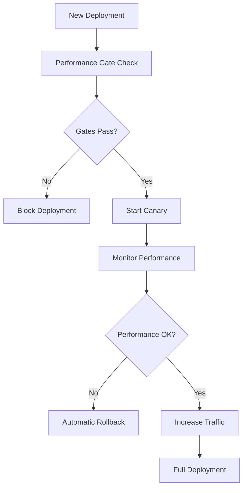

# Ecosystem Performance Integration

## Overview

The Ecosystem Performance Integration system connects the performance monitoring capabilities with all major Q ecosystem components, creating a performance-aware infrastructure that automatically optimizes routing, operations, and resource allocation based on real-time performance data.

## Architecture

### Core Integration Points

1. **QNET Integration** - Performance-based node weighting and routing optimization
2. **Qflow Integration** - Performance-aware operation decisions and policy enforcement
3. **Qerberos Integration** - Performance-based risk assessment and correlation
4. **CI/CD Integration** - Performance gates and deployment validation
5. **DAO Subnet Integration** - Per-DAO performance monitoring and isolation

## QNET Integration: Performance-Based Routing

### Node Performance Scoring

The system continuously evaluates node performance across multiple dimensions:

```javascript
const nodeScore = {
  latencyScore: 0.85,      // Based on P95/P99 latency
  errorRateScore: 0.92,    // Based on error rates
  capacityScore: 0.78,     // Based on resource utilization
  regressionScore: 0.95,   // Based on recent regressions
  overallScore: 0.87,      // Weighted combination
  recommendation: 'healthy' // Routing recommendation
};
```

### Routing Weight Calculation

QNET routing weights are dynamically adjusted based on performance scores:

- **Up-weight** (1.2x): High-performing nodes (score > 0.9)
- **Normal weight** (1.0x): Healthy nodes (0.6 ≤ score ≤ 0.9)
- **Down-weight moderate** (0.5x): Degraded nodes (0.3 ≤ score < 0.6)
- **Down-weight critical** (0.1x): Failing nodes (score < 0.3)

### API Usage

```javascript
// Calculate node performance score
POST /ecosystem-performance/qnet/node-score
{
  "nodeId": "node-1",
  "nodeMetrics": {
    "latency": { "p99": 180, "p95": 120 },
    "errorRate": 0.002,
    "capacity": { "utilization": 0.65 }
  }
}

// Get routing weights for all nodes
GET /ecosystem-performance/qnet/weights?nodes=[{"id":"node-1"},{"id":"node-2"}]
```

## Qflow Integration: Performance-Aware Operations

### Performance Policy Engine

Qflow evaluates each operation against current performance conditions:

```javascript
const policyEvaluation = {
  decision: 'cache_fallback',     // proceed | queue_deferral | cache_fallback
  reason: 'high_latency_risk',    // Why this decision was made
  riskLevel: 'high',              // low | moderate | high | critical
  alternatives: ['use_cached_result', 'simplified_operation']
};
```

### Policy Decisions

1. **Proceed** - Normal operation when performance is healthy
2. **Queue Deferral** - Defer non-critical operations during SLO violations
3. **Cache Fallback** - Use cached results when fresh data would be too slow

### Performance Checks

- **SLO Status**: Current violation state
- **Estimated Latency**: Predicted operation duration
- **Error Budget Burn**: Current error budget consumption
- **Cache Availability**: Cache hit rates and performance

### API Usage

```javascript
POST /ecosystem-performance/qflow/policy-check
{
  "operation": {
    "id": "user-profile-update",
    "type": "write",
    "params": { "complexity": "medium" }
  },
  "context": {
    "userId": "user123",
    "priority": "normal"
  }
}
```

## Qerberos Integration: Performance Risk Assessment

### Risk Signal Generation

Performance issues are correlated with security and abuse patterns:

```javascript
const riskSignal = {
  entityId: "user123",
  riskLevel: 'high',              // low | moderate | high | critical
  riskScore: 75,                  // 0-100 scale
  signals: [
    {
      type: 'performance_regression',
      severity: 'critical',
      count: 3,
      impact: 'service_degradation'
    }
  ],
  correlations: [
    {
      type: 'cost_performance_correlation',
      costIncrease: 0.6,
      suspicion: 'resource_abuse_or_inefficiency'
    }
  ]
};
```

### Risk Correlation Patterns

1. **Performance Regressions** - Repeated degradations indicate potential abuse
2. **Anomaly Clusters** - Multiple anomalies suggest suspicious activity
3. **Capacity Stress** - Resource exhaustion patterns
4. **Cost Correlations** - Performance issues coupled with cost spikes

### API Usage

```javascript
POST /ecosystem-performance/qerberos/risk-assessment
{
  "entityId": "user123",
  "performanceData": {
    "latency": { "p99": 250, "trend": "increasing" },
    "errorRate": 0.008,
    "costMetrics": {
      "current": 150,
      "historical": [100, 105, 110, 120, 135, 145, 150]
    }
  }
}
```

## CI/CD Integration: Performance Gates

### Performance Gate Evaluation

Automated performance validation before deployment:

```javascript
const performanceGate = {
  deployment: "v2.1.0",
  passed: false,
  violations: [
    {
      type: 'p99_latency_degradation',
      current: 220,
      baseline: 200,
      threshold: 230,
      severity: 'high'
    }
  ],
  recommendation: 'block_deployment'
};
```

### Gate Criteria

1. **P95 Latency**: ≤ 110% of baseline
2. **P99 Latency**: ≤ 115% of baseline
3. **Cache Hit Rate**: ≥ 90% of baseline
4. **Error Rate**: ≤ 200% of baseline

### API Usage

```javascript
POST /ecosystem-performance/cicd/gate-check
{
  "deploymentMetrics": {
    "deploymentId": "v2.1.0",
    "p95Latency": 165,
    "p99Latency": 220,
    "errorRate": 0.003,
    "cacheHitRate": 0.82
  },
  "baseline": {
    "p95Latency": 150,
    "p99Latency": 200,
    "errorRate": 0.002,
    "cacheHitRate": 0.85
  }
}
```

## Go-Live Readiness Gates

### Comprehensive Readiness Assessment

Multi-dimensional go-live validation:

```javascript
const goLiveReadiness = {
  module: "qwallet",
  environment: "production",
  overallStatus: 'ready',         // ready | blocked
  gates: {
    latency: { passed: true, message: "Latency requirements met" },
    errorBudget: { passed: true, message: "Error budget within limits" },
    cache: { passed: false, message: "Cache hit rate below threshold" },
    cost: { passed: true, message: "Cost utilization within budget" },
    capacity: { passed: true, message: "Sufficient capacity headroom" }
  },
  blockers: [],
  recommendations: []
};
```

### Go/No-Go Quick Gates

1. **P99 ≤ 200ms** (read), **≤ 300ms** (complex write) for 30m steady state
2. **Error budget burn < 10%** weekly
3. **Cache hit-rate ≥ 85%** on hot queries
4. **Cost utilization < 80%** of monthly budget (forecast 30d)
5. **Capacity headroom ≥ 30%** for peak RPS

### API Usage

```javascript
GET /ecosystem-performance/go-live/readiness/qwallet?environment=production
```

## DAO Subnet Performance Isolation

### Per-DAO Performance Monitoring

Individual DAO performance tracking and isolation decisions:

```javascript
const daoEvaluation = {
  daoId: "dao-123",
  performanceScore: 85,
  sloCompliance: {
    latency: { status: 'compliant', actual: 190, target: 200 },
    availability: { status: 'violation', actual: 99.8, target: 99.9 },
    throughput: { status: 'compliant', actual: 15, target: 10 }
  },
  isolationRecommendation: 'traffic_throttling',
  errorBudgetBurn: 0.6,
  impactAssessment: 'high'
};
```

### Isolation Recommendations

1. **None** - DAO performing within limits
2. **Performance Monitoring** - Increased monitoring for minor issues
3. **Traffic Throttling** - Reduce traffic to prevent further degradation
4. **Immediate Isolation** - Complete isolation due to critical issues

### API Usage

```javascript
POST /ecosystem-performance/dao/subnet-evaluation
{
  "daoId": "dao-123",
  "subnetMetrics": {
    "latency": { "p99": 190 },
    "availability": { "uptime": 99.8 },
    "throughput": { "rps": 15 },
    "errorRate": 0.005
  }
}
```

## CLI Usage

### QNET Operations

```bash
# Calculate routing weights
ecosystem-perf qnet --weights --nodes '[{"id":"node-1"},{"id":"node-2"}]'

# Calculate node performance score
ecosystem-perf qnet --score node-1
```

### Qflow Operations

```bash
# Check performance policy
ecosystem-perf qflow --check user-update --type write
```

### Qerberos Operations

```bash
# Generate risk assessment
ecosystem-perf qerberos --risk user123
```

### CI/CD Operations

```bash
# Evaluate performance gate
ecosystem-perf cicd --gate v2.1.0
```

### Go-Live Operations

```bash
# Check readiness
ecosystem-perf go-live --readiness qwallet --environment production
```

### DAO Operations

```bash
# Evaluate DAO subnet
ecosystem-perf dao --subnet dao-123
```

### Dashboard

```bash
# Show ecosystem dashboard
ecosystem-perf dashboard
```

## Real-Time Integration

### WebSocket Events

Real-time performance updates via WebSocket:

```javascript
// Connect to real-time feed
const ws = new WebSocket('/ecosystem-performance/realtime');

// Listen for events
ws.onmessage = (event) => {
  const data = JSON.parse(event.data);
  
  switch (data.type) {
    case 'node_performance_update':
      updateQNETWeights(data.data);
      break;
    case 'qflow_policy_update':
      adjustOperationPolicies(data.data);
      break;
    case 'risk_assessment_update':
      updateSecurityPolicies(data.data);
      break;
    case 'go_live_update':
      updateDeploymentStatus(data.data);
      break;
  }
};
```

### Event Types

- `node_performance_update` - QNET node score changes
- `qflow_policy_update` - Qflow policy decisions
- `risk_assessment_update` - Qerberos risk signal updates
- `go_live_update` - Go-live readiness changes

## Blue-Green & Canary Deployment Integration

### Performance-Aware Deployment

The system integrates with deployment strategies:

1. **Blue-Green Validation**: Performance gates must pass before traffic switch
2. **Canary Analysis**: Real-time performance comparison between versions
3. **Automatic Rollback**: Triggered by performance degradation
4. **Traffic Shaping**: Gradual traffic increase based on performance metrics

### Deployment Flow



## Disaster Recovery Integration

### Performance-Aware DR

1. **Baseline Verification**: Ensure DR environment meets performance baselines
2. **Restore Drills**: Automated performance validation during DR tests
3. **Failover Triggers**: Performance degradation can trigger DR procedures
4. **Recovery Validation**: Performance gates for returning to primary

## Monitoring and Alerting

### Integrated Dashboards

- **Ecosystem Overview**: High-level performance health across all components
- **Component Deep-Dive**: Detailed performance metrics per component
- **Risk Correlation**: Performance issues correlated with security events
- **Cost Impact**: Performance optimization impact on operational costs

### Alert Integration

Performance events automatically trigger appropriate alerts:

- **QNET**: Node performance degradation alerts
- **Qflow**: Operation policy trigger notifications
- **Qerberos**: Performance-based risk escalations
- **CI/CD**: Deployment gate failure alerts
- **DAO**: Subnet isolation notifications

## Best Practices

### Performance-First Design

1. **Design for Observability**: Ensure all components emit performance metrics
2. **Implement Circuit Breakers**: Prevent cascade failures
3. **Cache Strategically**: Use performance data to optimize caching
4. **Monitor Continuously**: Real-time performance tracking
5. **Automate Responses**: Reduce manual intervention through automation

### Integration Guidelines

1. **Gradual Rollout**: Implement performance integration incrementally
2. **Baseline Establishment**: Set realistic performance baselines
3. **Threshold Tuning**: Adjust thresholds based on actual usage patterns
4. **Regular Review**: Periodically review and update performance criteria
5. **Documentation**: Maintain clear documentation of performance policies

## Troubleshooting

### Common Issues

1. **False Positives**: Overly sensitive thresholds causing unnecessary actions
2. **Performance Overhead**: Monitoring impact on system performance
3. **Integration Complexity**: Coordination between multiple systems
4. **Data Consistency**: Ensuring consistent performance data across components

### Debugging Tools

- **Performance Trace Viewer**: End-to-end request tracing
- **Component Health Dashboard**: Real-time component status
- **Policy Decision Log**: Audit trail of performance policy decisions
- **Correlation Analysis**: Performance issue root cause analysis

This ecosystem integration creates a self-optimizing, performance-aware infrastructure that automatically adapts to changing conditions while maintaining high service quality and user experience.