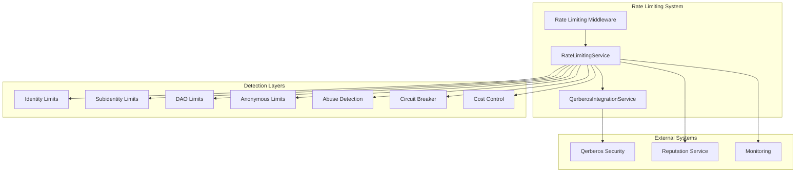

# Comprehensive Rate Limiting and Anti-Abuse Protection System

## Overview

The comprehensive rate limiting system provides multi-layer protection against abuse, implements adaptive rate limiting based on reputation, and includes cost control mechanisms for serverless deployments. It integrates with Qerberos for security event reporting and automated threat response.

## Features

### 🛡️ Multi-Layer Rate Limiting
- **Identity-based limits**: Rate limits per sQuid identity with reputation multipliers
- **Subidentity-based limits**: Separate limits for subidentities
- **DAO-based limits**: Collective limits for DAO operations
- **Anonymous user limits**: Restrictive limits for unauthenticated users

### 🧠 Adaptive Behavior
- **Reputation-based multipliers**: Higher reputation = higher limits
- **Behavioral pattern analysis**: Detects suspicious request patterns
- **Dynamic risk assessment**: Real-time risk scoring and adjustment

### 🔒 Anti-Abuse Protection
- **Rapid fire detection**: Identifies burst request patterns
- **Pattern similarity analysis**: Detects repeated identical requests
- **Suspicious user agent filtering**: Blocks known bot patterns
- **High failure rate detection**: Identifies potential attack patterns

### ⚡ Circuit Breaker Integration
- **Endpoint protection**: Prevents cascade failures
- **Automatic recovery**: Self-healing circuit breakers
- **Configurable thresholds**: Customizable failure detection

### 💰 Cost Control
- **Serverless invocation limits**: Prevents runaway costs
- **Budget alerts**: Proactive cost monitoring
- **Emergency stops**: Automatic protection at critical thresholds

### 🔍 Qerberos Integration
- **Security event reporting**: Real-time threat intelligence
- **Risk score integration**: Dynamic threat assessment
- **Automated response**: Coordinated security actions

## Architecture



## Configuration

### Environment Variables

```bash
# Base rate limits
RATE_LIMIT_IDENTITY_REQUESTS=1000
RATE_LIMIT_IDENTITY_WINDOW=3600000
RATE_LIMIT_SUBIDENTITY_REQUESTS=100
RATE_LIMIT_SUBIDENTITY_WINDOW=3600000
RATE_LIMIT_DAO_REQUESTS=5000
RATE_LIMIT_DAO_WINDOW=3600000
RATE_LIMIT_ANONYMOUS_REQUESTS=10
RATE_LIMIT_ANONYMOUS_WINDOW=3600000

# Reputation multipliers
RATE_LIMIT_EXCELLENT_MULTIPLIER=2.0
RATE_LIMIT_GOOD_MULTIPLIER=1.5
RATE_LIMIT_NEUTRAL_MULTIPLIER=1.0
RATE_LIMIT_POOR_MULTIPLIER=0.5
RATE_LIMIT_BLOCKED_MULTIPLIER=0.0

# Circuit breaker settings
CIRCUIT_BREAKER_FAILURE_THRESHOLD=5
CIRCUIT_BREAKER_RECOVERY_TIMEOUT=30000
CIRCUIT_BREAKER_MONITORING_WINDOW=60000
CIRCUIT_BREAKER_HALF_OPEN_MAX_CALLS=3

# Cost control
COST_CONTROL_MAX_INVOCATIONS_PER_MINUTE=1000
COST_CONTROL_MAX_INVOCATIONS_PER_HOUR=50000
COST_CONTROL_BUDGET_ALERT_THRESHOLD=0.8
COST_CONTROL_EMERGENCY_STOP_THRESHOLD=0.95

# Abuse detection
ABUSE_RAPID_FIRE_THRESHOLD=100
ABUSE_PATTERN_SIMILARITY_THRESHOLD=0.8
ABUSE_SUSPICIOUS_USER_AGENTS=bot,crawler,scraper,spider
ABUSE_MAX_FAILURE_RATE=0.5

# Qerberos integration
QERBEROS_INTEGRATION_ENABLED=true
QERBEROS_ENDPOINT=http://localhost:3001
QERBEROS_API_KEY=your-api-key
QERBEROS_TIMEOUT=5000
```

### Programmatic Configuration

```javascript
import { initializeRateLimiting } from './middleware/rateLimiting.mjs';

const rateLimitingService = initializeRateLimiting({
  baseLimits: {
    identity: { requests: 1000, window: 3600000 },
    subidentity: { requests: 100, window: 3600000 },
    dao: { requests: 5000, window: 3600000 },
    anonymous: { requests: 10, window: 3600000 }
  },
  reputationMultipliers: {
    excellent: 2.0,
    good: 1.5,
    neutral: 1.0,
    poor: 0.5,
    blocked: 0.0
  }
});
```

## Usage

### Basic Integration

```javascript
import express from 'express';
import { 
  rateLimitMiddleware, 
  initializeRateLimiting 
} from './middleware/rateLimiting.mjs';

const app = express();

// Initialize rate limiting
initializeRateLimiting();

// Apply rate limiting middleware
app.use(rateLimitMiddleware());

// Your routes here
app.get('/api/data', (req, res) => {
  res.json({ message: 'Data retrieved successfully' });
});
```

### Advanced Integration with Endpoint-Specific Limits

```javascript
import { 
  rateLimitMiddleware,
  adaptiveRateLimitMiddleware,
  recordRequestOutcome,
  costTrackingMiddleware
} from './middleware/rateLimiting.mjs';

// Global middleware
app.use(costTrackingMiddleware());
app.use(rateLimitMiddleware());
app.use(recordRequestOutcome());

// Endpoint-specific configuration
const endpointConfigs = {
  'POST /auth/login': {
    strictMode: true,
    customLimits: {
      identity: { requests: 10, window: 900000 },
      anonymous: { requests: 3, window: 900000 }
    }
  }
};

// Apply adaptive rate limiting
app.post('/auth/login', 
  adaptiveRateLimitMiddleware(endpointConfigs),
  loginHandler
);
```

### Qerberos Integration

```javascript
import { initializeQerberosIntegration } from './services/QerberosIntegrationService.mjs';

// Initialize Qerberos integration
const qerberosService = initializeQerberosIntegration({
  enabled: true,
  endpoint: 'http://qerberos-service:3001',
  apiKey: process.env.QERBEROS_API_KEY
});

// Connect to rate limiting service
rateLimitingService.on('suspiciousActivity', async (event) => {
  await qerberosService.reportSuspiciousActivity(event);
});
```

## API Reference

### RateLimitingService

#### `checkRateLimit(context)`

Checks if a request should be allowed based on comprehensive rate limiting rules.

**Parameters:**
- `context` (Object): Request context
  - `squidId` (string): Identity ID
  - `subId` (string, optional): Subidentity ID
  - `daoId` (string, optional): DAO ID
  - `endpoint` (string): Endpoint being accessed
  - `userAgent` (string): User agent string
  - `ip` (string): Client IP address
  - `timestamp` (number, optional): Request timestamp

**Returns:**
```javascript
{
  allowed: boolean,
  reason: string,
  remaining?: number,
  resetTime?: number,
  limit?: number,
  reputation?: string
}
```

#### `setReputation(squidId, reputation)`

Sets reputation score for an identity.

**Parameters:**
- `squidId` (string): Identity ID
- `reputation` (number): Reputation score

#### `getStatistics()`

Returns current service statistics.

**Returns:**
```javascript
{
  rateLimitEntries: number,
  circuitBreakerEntries: number,
  behaviorPatternEntries: number,
  costTrackingEntries: number,
  reputationEntries: number
}
```

### QerberosIntegrationService

#### `reportSuspiciousActivity(event)`

Reports suspicious activity to Qerberos.

**Parameters:**
- `event` (Object): Security event
  - `type` (string): Event type
  - `actor` (Object): Actor information
  - `details` (Object): Event details
  - `severity` (string): Severity level

#### `getRiskScore(squidId, context)`

Gets risk score for an identity from Qerberos.

**Parameters:**
- `squidId` (string): Identity ID
- `context` (Object, optional): Additional context

**Returns:**
```javascript
{
  riskScore: number,
  level: string,
  factors: string[]
}
```

## Rate Limit Headers

The system adds the following headers to responses:

- `X-RateLimit-Allowed`: Whether the request was allowed
- `X-RateLimit-Reason`: Reason for the decision
- `X-RateLimit-Remaining`: Remaining requests in current window
- `X-RateLimit-Reset`: When the rate limit resets
- `X-RateLimit-Limit`: Current rate limit
- `Retry-After`: Seconds to wait before retrying (when rate limited)

## Error Codes

| Code | Description | HTTP Status |
|------|-------------|-------------|
| `RATE_LIMIT_EXCEEDED` | Rate limit exceeded | 429 |
| `CIRCUIT_BREAKER_OPEN` | Circuit breaker is open | 503 |
| `COST_LIMIT_EXCEEDED` | Cost limits exceeded | 402 |
| `ABUSE_DETECTED` | Suspicious activity detected | 403 |

## Monitoring and Alerting

### Health Check Endpoint

```bash
GET /health/rate-limiting
```

Returns service health and statistics.

### Statistics Endpoint

```bash
GET /stats/rate-limiting
```

Returns detailed statistics for monitoring.

### Event Monitoring

The system emits events for monitoring:

```javascript
rateLimitingService.on('suspiciousActivity', (event) => {
  console.log('Suspicious activity:', event);
});

rateLimitingService.on('budgetAlert', (alert) => {
  console.log('Budget alert:', alert);
});
```

## CLI Tool

The system includes a comprehensive CLI tool for testing and management:

```bash
# Test rate limiting for an identity
node backend/scripts/rate-limiting-cli.mjs test-identity -i user123 -c 20

# Test abuse detection
node backend/scripts/rate-limiting-cli.mjs test-abuse -p rapid-fire

# Monitor statistics
node backend/scripts/rate-limiting-cli.mjs monitor -i 5

# Load testing
node backend/scripts/rate-limiting-cli.mjs load-test -c 10 -r 100

# Set reputation
node backend/scripts/rate-limiting-cli.mjs set-reputation -i user123 -s 75
```

## Testing

### Unit Tests

```bash
npm test backend/tests/rate-limiting.test.mjs
```

### Integration Testing

```bash
# Start the example server
node backend/examples/rate-limiting-integration.mjs

# Test endpoints
curl -H "x-squid-id: test-user" http://localhost:3000/auth/login
curl -H "x-squid-id: test-user" http://localhost:3000/qwallet/pay
```

### Load Testing

```bash
# Use the CLI tool for load testing
node backend/scripts/rate-limiting-cli.mjs load-test -c 50 -r 100 -d 50
```

## Best Practices

### 1. Configure Appropriate Limits

- Set realistic limits based on expected usage patterns
- Use different limits for different endpoint types
- Consider user experience when setting limits

### 2. Monitor and Alert

- Set up monitoring for rate limiting statistics
- Configure alerts for abuse detection
- Monitor cost control metrics

### 3. Reputation Management

- Implement fair reputation scoring
- Provide mechanisms for reputation recovery
- Consider reputation decay over time

### 4. Graceful Degradation

- Implement fallback mechanisms
- Provide clear error messages
- Use appropriate HTTP status codes

### 5. Security Integration

- Connect to Qerberos for threat intelligence
- Implement automated response mechanisms
- Maintain audit trails

## Troubleshooting

### Common Issues

1. **High False Positive Rate**
   - Adjust abuse detection thresholds
   - Review reputation scoring logic
   - Check endpoint-specific configurations

2. **Performance Issues**
   - Enable Redis for distributed caching
   - Optimize cleanup intervals
   - Review memory usage patterns

3. **Integration Problems**
   - Verify Qerberos connectivity
   - Check API key configuration
   - Review event queue status

### Debug Mode

Enable debug logging:

```bash
DEBUG=rate-limiting:* node your-app.js
```

### Health Checks

Monitor service health:

```bash
curl http://localhost:3000/health/rate-limiting
```

## Security Considerations

1. **Data Protection**: Rate limiting data may contain sensitive information
2. **Bypass Prevention**: Ensure rate limiting cannot be easily bypassed
3. **DoS Protection**: Implement protection against DoS attacks on the rate limiting system itself
4. **Audit Logging**: Maintain comprehensive audit logs for security events

## Performance Optimization

1. **Memory Management**: Regular cleanup of expired entries
2. **Distributed Caching**: Use Redis for multi-instance deployments
3. **Batch Processing**: Batch Qerberos events for efficiency
4. **Async Operations**: Use asynchronous processing where possible

## Future Enhancements

1. **Machine Learning**: Advanced pattern recognition
2. **Geolocation**: Location-based rate limiting
3. **Device Fingerprinting**: Enhanced identity tracking
4. **Predictive Scaling**: Proactive limit adjustment
5. **Integration APIs**: Enhanced third-party integrations