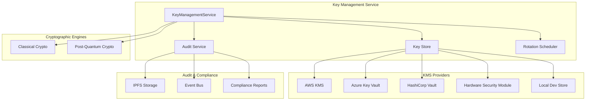

# Key Management Service

## Overview

The Key Management Service provides unified cryptographic key management for the Q ecosystem, implementing enterprise-grade security standards with KMS/HSM integration, automated key rotation, post-quantum cryptographic readiness, and comprehensive audit logging.

## Features

### 🔐 Cryptographic Standards
- **Classical Algorithms**: Ed25519, ECDSA-secp256k1, RSA-2048/4096, AES-256-GCM, ChaCha20-Poly1305
- **Post-Quantum Algorithms**: Dilithium2/3/5, Falcon-512/1024, Kyber512/768/1024
- **Hybrid Mode**: Support for both classical and PQC algorithms during migration

### 🔄 Automated Key Rotation
- **Scheduled Rotation**: Configurable rotation schedules per key usage type
- **Emergency Rotation**: Immediate rotation for compromised keys
- **Grace Periods**: Configurable overlap periods for seamless transitions
- **Chain Tracking**: Complete rotation history and key versioning

### 🏢 KMS/HSM Integration
- **Multi-Provider Support**: AWS KMS, Azure Key Vault, HashiCorp Vault, HSM
- **Environment Scoping**: Separate key management per environment (dev/staging/prod)
- **Secure Storage**: Keys never stored in plaintext in application memory
- **Hardware Security**: HSM integration for production environments

### 📝 Comprehensive Audit Logging
- **Immutable Logs**: All key operations logged with IPFS CID references
- **Real-time Events**: Event-driven architecture with audit event streaming
- **Compliance Ready**: GDPR, SOC2, and custom compliance reporting
- **Forensic Analysis**: Complete audit trail for security investigations

### 🌍 Environment Management
- **Environment Isolation**: Keys scoped to specific environments
- **Configuration Management**: Environment-specific policies and settings
- **Deployment Safety**: Prevents cross-environment key usage

## Architecture



## Usage

### Basic Key Creation

```javascript
import { KeyManagementService } from './KeyManagementService.mjs';

const keyService = new KeyManagementService({
  environment: 'prod',
  kmsProvider: 'HSM',
  auditEnabled: true,
  rotationEnabled: true,
  pqcEnabled: true
});

// Create a signing key
const signingKey = await keyService.createKey({
  usage: 'SIGNING',
  algorithm: 'Ed25519',
  owner: 'user-service',
  rotationSchedule: 'P30D' // 30 days
});

console.log('Created key:', signingKey.keyId);
```

### Key Usage Operations

```javascript
// Sign data
const signature = await keyService.useKey(
  signingKey.keyId, 
  'SIGN', 
  'message to sign',
  { actor: { type: 'USER', id: 'user123' } }
);

// Create encryption key
const encryptionKey = await keyService.createKey({
  usage: 'ENCRYPTION',
  algorithm: 'AES-256-GCM',
  owner: 'storage-service'
});

// Encrypt data
const encrypted = await keyService.useKey(
  encryptionKey.keyId,
  'ENCRYPT',
  'sensitive data'
);

// Decrypt data
const decrypted = await keyService.useKey(
  encryptionKey.keyId,
  'DECRYPT',
  encrypted
);
```

### Key Rotation

```javascript
// Schedule rotation
const rotationResult = await keyService.rotateKey(signingKey.keyId, {
  reason: 'SCHEDULED',
  gracePeriod: 'P7D', // 7 days
  immediate: false
});

// Emergency rotation
await keyService.rotateKey(compromisedKeyId, {
  reason: 'COMPROMISE',
  immediate: true
});
```

### Post-Quantum Cryptography

```javascript
// Create PQC signing key
const pqcKey = await keyService.createKey({
  usage: 'SIGNING',
  algorithm: 'Dilithium3',
  owner: 'secure-service'
});

// Create PQC encryption key
const pqcEncKey = await keyService.createKey({
  usage: 'ENCRYPTION',
  algorithm: 'Kyber768',
  owner: 'secure-service'
});
```

## Configuration

### Key Management Policy

```json
{
  "environments": {
    "prod": {
      "kmsProvider": "HSM",
      "keyRotationSchedule": {
        "SIGNING": "P30D",
        "ENCRYPTION": "P90D",
        "KEY_DERIVATION": "P180D",
        "AUTHENTICATION": "P30D",
        "TRANSPORT": "P7D"
      },
      "backupPolicy": {
        "enabled": true,
        "retentionPeriod": "P7Y",
        "encryptionRequired": true
      },
      "auditPolicy": {
        "enabled": true,
        "immutableStorage": true,
        "retentionPeriod": "P7Y"
      }
    }
  },
  "pqcPolicy": {
    "enabled": true,
    "migrationDeadline": "2030-12-31T23:59:59Z",
    "hybridMode": true,
    "preferredAlgorithms": {
      "signing": ["Dilithium3", "Falcon-1024"],
      "encryption": ["Kyber768", "AES-256-GCM"]
    }
  }
}
```

### Environment Variables

```bash
# Required
NODE_ENV=production
KMS_PROVIDER=HSM
AUDIT_ENABLED=true

# KMS Provider Specific
# AWS KMS
AWS_REGION=us-east-1
AWS_KMS_KEY_ID=arn:aws:kms:...

# Azure Key Vault
AZURE_VAULT_URL=https://vault.vault.azure.net/
AZURE_CLIENT_ID=...
AZURE_CLIENT_SECRET=...
AZURE_TENANT_ID=...

# HashiCorp Vault
VAULT_ADDR=https://vault.company.com
VAULT_TOKEN=...
VAULT_MOUNT_PATH=secret/keys

# HSM
HSM_SLOT=0
HSM_PIN=...
HSM_LIBRARY=/usr/lib/libpkcs11.so
```

## API Reference

### KeyManagementService

#### Constructor Options

```typescript
interface KeyManagementConfig {
  environment?: 'dev' | 'staging' | 'prod';
  kmsProvider?: KMSProvider;
  auditEnabled?: boolean;
  rotationEnabled?: boolean;
  pqcEnabled?: boolean;
}
```

#### Methods

##### `createKey(keySpec: KeySpec): Promise<KeyMetadata>`

Creates a new cryptographic key.

**Parameters:**
- `keySpec.usage`: Key usage type ('SIGNING', 'ENCRYPTION', etc.)
- `keySpec.algorithm`: Cryptographic algorithm
- `keySpec.owner`: Key owner identifier
- `keySpec.rotationSchedule`: ISO 8601 duration for rotation

**Returns:** Key metadata with unique key ID

##### `useKey(keyId: string, operation: string, data: any, options?: any): Promise<any>`

Uses a key for cryptographic operations.

**Parameters:**
- `keyId`: Unique key identifier
- `operation`: Operation type ('SIGN', 'ENCRYPT', 'DECRYPT', 'DERIVE')
- `data`: Data to process
- `options`: Additional options including actor information

**Returns:** Operation result (signature, encrypted data, etc.)

##### `rotateKey(keyId: string, request: KeyRotationRequest): Promise<KeyRotationResult>`

Rotates an existing key.

**Parameters:**
- `keyId`: Key to rotate
- `request.reason`: Rotation reason
- `request.gracePeriod`: Grace period for old key
- `request.immediate`: Immediate rotation flag

**Returns:** Rotation result with old and new key IDs

##### `revokeKey(keyId: string, reason: string): Promise<void>`

Revokes a key immediately.

##### `getStatistics(): Promise<KeyStatistics>`

Returns key management statistics.

##### `healthCheck(): Promise<HealthStatus>`

Returns service health status.

## Events

The service emits the following events:

### `keyCreated`
```javascript
keyService.on('keyCreated', (event) => {
  console.log('Key created:', event.keyId);
});
```

### `keyRotated`
```javascript
keyService.on('keyRotated', (result) => {
  console.log('Key rotated:', result.oldKeyId, '->', result.newKeyId);
});
```

### `keyRevoked`
```javascript
keyService.on('keyRevoked', (event) => {
  console.log('Key revoked:', event.keyId, 'reason:', event.reason);
});
```

### `auditEvent`
```javascript
keyService.on('auditEvent', (event) => {
  console.log('Audit event:', event.operation, event.result);
});
```

## Security Considerations

### Key Storage
- Keys are never stored in plaintext in application memory
- Production environments must use HSM or cloud KMS
- Development environments can use local encrypted storage
- All key material is encrypted at rest

### Access Control
- Keys are scoped to specific environments
- All operations require proper authentication
- Audit logs track all key access and usage
- Role-based access control for key operations

### Rotation and Lifecycle
- Automated rotation based on configurable schedules
- Emergency rotation capabilities for compromised keys
- Grace periods prevent service disruption during rotation
- Complete key lifecycle tracking and audit trails

### Compliance
- GDPR compliance with data lifecycle management
- SOC2 compliance with comprehensive audit trails
- Immutable audit logs stored in IPFS
- Configurable retention policies per environment

## Testing

### Unit Tests
```bash
cd backend
npx vitest tests/key-management.test.mjs --run
```

### Validation Script
```bash
node scripts/validate-key-management.mjs
```

### Integration Tests
```bash
# Test with different KMS providers
KMS_PROVIDER=AWS_KMS npm test
KMS_PROVIDER=HASHICORP_VAULT npm test
```

## Deployment

### Development
```bash
export NODE_ENV=development
export KMS_PROVIDER=LOCAL_DEV
npm start
```

### Production
```bash
export NODE_ENV=production
export KMS_PROVIDER=HSM
export HSM_SLOT=0
export HSM_PIN=secure_pin
export AUDIT_ENABLED=true
npm start
```

### Docker
```dockerfile
FROM node:20-alpine
COPY . /app
WORKDIR /app
RUN npm ci --only=production
EXPOSE 3000
CMD ["npm", "start"]
```

## Monitoring

### Health Checks
- `/health/keys` - Key management service health
- `/metrics/keys` - Key usage and rotation metrics
- `/audit/keys` - Audit log statistics

### Alerts
- Key rotation failures
- KMS/HSM connectivity issues
- Audit log storage failures
- Unusual key usage patterns

### Metrics
- Key creation rate
- Key usage frequency
- Rotation success rate
- Audit event volume
- KMS response times

## Migration Guide

### From Legacy Key Management
1. Audit existing keys and usage patterns
2. Create migration plan with key mapping
3. Deploy new service in parallel
4. Gradually migrate services to new key management
5. Retire legacy system after full migration

### Post-Quantum Migration
1. Enable PQC support in configuration
2. Create hybrid keys for critical services
3. Test PQC algorithms in staging environment
4. Gradually migrate to PQC algorithms
5. Monitor performance and compatibility

## Troubleshooting

### Common Issues

#### Key Not Found
```
Error: Key not found: key_prod_abc123
```
**Solution:** Verify key ID and environment scoping

#### KMS Connection Failed
```
Error: KMS provider unavailable
```
**Solution:** Check KMS configuration and network connectivity

#### Rotation Failed
```
Error: Key rotation failed: grace period expired
```
**Solution:** Check rotation schedules and service dependencies

#### Audit Storage Failed
```
Error: Audit event storage failed
```
**Solution:** Verify IPFS connectivity and storage capacity

### Debug Mode
```bash
DEBUG=key-management:* npm start
```

### Log Analysis
```bash
# View audit logs
grep "Audit:" logs/key-management.log

# Check rotation events
grep "Rotated key:" logs/key-management.log

# Monitor KMS operations
grep "KMS:" logs/key-management.log
```

## Contributing

1. Follow the existing code style and patterns
2. Add comprehensive tests for new features
3. Update documentation for API changes
4. Run validation script before submitting PRs
5. Ensure all security checks pass

## License

This key management implementation is part of the Q ecosystem and follows the project's licensing terms.