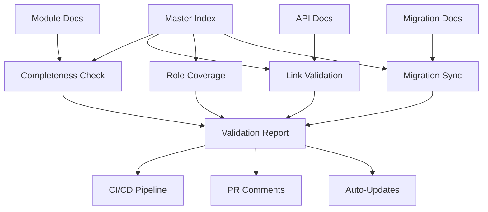

# Documentation Automation System

This document describes the comprehensive documentation automation system that keeps the Q Ecosystem documentation synchronized, validated, and deployment-ready.

## Overview

The documentation automation system integrates the master documentation index (Task 38) with the module documentation automation (Task 37) to provide:

- **Completeness Check**: Ensures every module has all required documentation types
- **Link Validation**: Prevents dead or outdated references in the index
- **Role Coverage Scan**: Maintains entry points for developers, DevOps, and product managers
- **Migration Sync Check**: Keeps Task 38 migration docs synchronized with the index

## Architecture



## Components

### 1. Master Index Automation (`scripts/master-index-automation.mjs`)

The core automation script that provides:

- **Validation Engine**: Runs all validation checks
- **Index Generator**: Updates the master index with current information
- **Report Generator**: Creates detailed validation reports
- **CI Integration**: Provides commands for CI/CD pipelines

### 2. GitHub Actions Workflow (`.github/workflows/documentation-validation.yml`)

Automated workflow that runs on every PR and main branch push:

- **PR Validation**: Validates documentation changes before merge
- **PR Comments**: Posts detailed validation results as PR comments
- **Auto-Updates**: Updates the master index on main branch pushes
- **Issue Creation**: Creates issues when auto-updates fail

### 3. Pre-commit Hook (`scripts/pre-commit-docs-validation.sh`)

Local validation that runs before commits:

- **Fast Validation**: Quick checks for common issues
- **Commit Prevention**: Blocks commits with validation errors
- **Developer Feedback**: Provides immediate feedback on documentation issues

## Validation Checks

### Completeness Check

Ensures every module has all required documentation types:

- `README.md` - Module overview
- `api-reference.md` - API documentation
- `mcp-tools.md` - MCP tools documentation
- `deployment-guide.md` - Deployment instructions
- `integration-guide.md` - Integration patterns
- `examples.md` - Code examples
- `runbook.md` - Operational procedures
- `troubleshooting.md` - Issue resolution

**Example Error:**
```
Missing required document: docs/modules/qwallet/troubleshooting.md
Module qwallet not referenced in master index
```

### Link Validation

Checks for broken or outdated references:

- **Internal Links**: Validates all relative links within the documentation
- **Cross-References**: Ensures module cross-references are valid
- **Deprecated Paths**: Identifies references to deprecated or moved files

**Example Error:**
```
Broken internal link: docs/modules/old-module/api.md
Reference to deprecated path: docs/legacy-deployment.md
```

### Role Coverage Scan

Ensures entry points exist for all user types:

#### For Developers
- Module API references and examples
- Integration guides and patterns
- Code samples and tutorials
- MCP tools documentation

#### For DevOps/SRE
- Deployment guides and matrices
- Operational runbooks
- Monitoring and troubleshooting
- Disaster recovery procedures

#### For Architects
- System architecture documentation
- Integration matrices and patterns
- Migration strategies and planning
- Technology integration guides

#### For Product Managers
- Feature documentation and capabilities
- Migration timelines and planning
- User guides and FAQ sections
- Business impact assessments

**Example Error:**
```
Missing developers entry point: Integration guides and patterns
Missing devops entry point: Operational runbooks
```

### Migration Sync Check

Ensures Task 38 migration documentation stays synchronized:

- **Document References**: All migration docs are referenced in the index
- **Section Completeness**: Required migration sections are present
- **Cross-References**: Migration docs properly link to related content

**Example Error:**
```
Migration document not referenced in index: migration/lessons-learned.md
Missing required migration section: Migration Dashboard
```

## Usage

### Local Development

```bash
# Run all validation checks
npm run docs:index:validate

# Run specific checks
npm run docs:index:completeness
npm run docs:index:links
npm run docs:index:roles
npm run docs:index:migration

# Update the master index
npm run docs:index:update

# Generate detailed report
npm run docs:index:report
```

### CI/CD Integration

The system automatically runs on:

- **Pull Requests**: Validates changes and posts results as comments
- **Main Branch Pushes**: Updates the master index automatically
- **Scheduled Runs**: Daily validation to catch drift

### Pre-commit Validation

Install the pre-commit hook:

```bash
# Copy the hook to git hooks directory
cp scripts/pre-commit-docs-validation.sh .git/hooks/pre-commit
chmod +x .git/hooks/pre-commit
```

The hook will automatically run validation before each commit.

## Configuration

### Required Documentation Types

Modify `requiredDocTypes` in `scripts/master-index-automation.mjs`:

```javascript
this.requiredDocTypes = [
  'README.md',
  'api-reference.md',
  'mcp-tools.md',
  'deployment-guide.md',
  'integration-guide.md',
  'examples.md',
  'runbook.md',
  'troubleshooting.md'
];
```

### Role Requirements

Update `requiredRoles` to modify role coverage requirements:

```javascript
this.requiredRoles = {
  developers: [
    'Module API references and examples',
    'Integration guides and patterns',
    // ... more requirements
  ],
  // ... other roles
};
```

### Migration Documents

The system automatically discovers migration documents in `docs/migration/`. No configuration needed.

## Validation Report Format

The system generates detailed JSON reports:

```json
{
  "passed": false,
  "totalErrors": 3,
  "timestamp": "2024-01-01T00:00:00.000Z",
  "results": {
    "completeness": {
      "passed": false,
      "errors": [
        {
          "module": "qwallet",
          "docType": "troubleshooting.md",
          "error": "Missing required document: docs/modules/qwallet/troubleshooting.md"
        }
      ]
    },
    "linkValidation": {
      "passed": true,
      "errors": []
    },
    "roleCoverage": {
      "passed": false,
      "errors": [
        {
          "role": "developers",
          "requirement": "Integration guides and patterns",
          "error": "Missing developers entry point: Integration guides and patterns"
        }
      ]
    },
    "migrationSync": {
      "passed": true,
      "errors": []
    }
  },
  "summary": {
    "completeness": "FAIL",
    "linkValidation": "PASS",
    "roleCoverage": "FAIL",
    "migrationSync": "PASS"
  }
}
```

## Troubleshooting

### Common Issues

#### "Module not found" errors
- Ensure module directories exist in `docs/modules/`
- Check that module names match directory names exactly

#### Link validation failures
- Use relative paths from the `docs/` directory
- Ensure linked files actually exist
- Check for typos in file names and paths

#### Role coverage failures
- Review the master index content for missing sections
- Ensure role-specific entry points are clearly marked
- Add missing documentation sections as needed

#### Migration sync failures
- Ensure all migration documents are properly linked
- Check that required migration sections exist in the index
- Verify migration document paths are correct

### Debug Commands

```bash
# Verbose validation output
DEBUG=1 npm run docs:index:validate

# Check specific module
node scripts/master-index-automation.mjs completeness --module qwallet

# Generate detailed report
npm run docs:index:report && cat docs/index-validation-report.json | jq
```

## Integration with Existing Systems

### Task 37 Integration

The master index automation integrates seamlessly with the existing Task 37 module documentation system:

- **Module Discovery**: Uses the same module discovery logic
- **Documentation Standards**: Enforces the same documentation structure
- **Validation**: Extends validation to include index synchronization

### Migration System Integration

Integrates with Task 38 migration documentation:

- **Document Discovery**: Automatically finds migration documents
- **Sync Validation**: Ensures migration docs are referenced in the index
- **Update Automation**: Updates index when migration docs change

## Benefits

### For Developers
- **Consistent Documentation**: Ensures all modules follow the same documentation standards
- **Easy Navigation**: Master index provides clear entry points for all documentation
- **Automated Maintenance**: Reduces manual effort to keep documentation synchronized

### For DevOps/SRE
- **Deployment Ready**: Ensures documentation is always deployment-ready
- **Operational Clarity**: Guarantees operational procedures are documented and accessible
- **Automated Validation**: Catches documentation issues before they reach production

### For Product Managers
- **Complete Coverage**: Ensures all features and capabilities are documented
- **User-Friendly Access**: Provides clear entry points for different user types
- **Migration Tracking**: Keeps migration documentation synchronized and accessible

### For the Ecosystem
- **Quality Assurance**: Maintains high documentation quality standards
- **Scalability**: Automatically handles new modules and documentation
- **Reliability**: Prevents documentation drift and ensures consistency

## Portal Generation System

The documentation automation now includes a comprehensive portal generation system that transforms validated documentation into public-facing portals:

### Content Quality Validation

Enhanced validation system with advanced content quality checks:

```bash
# Content quality validation
npm run docs:quality:validate     # Validate all documentation quality
npm run docs:quality:file <file>  # Validate specific file quality
npm run docs:quality:report       # Generate quality metrics report
```

**Quality Checks Include:**
- Minimum section lengths
- Required code examples and diagrams
- Accessibility compliance (alt text, heading hierarchy)
- Readability scores and sentence structure
- Link quality and cross-references

### Release Integration

Automatic portal updates triggered by module releases:

```bash
# Release integration
npm run release:webhook <source> <payload>  # Process release webhook
npm run release:simulate <module> <version> # Simulate module release
npm run release:validate <module> <version> # Validate release readiness
```

**Supported Release Sources:**
- GitHub releases
- NPM package publishes
- Docker image pushes

### Multi-Audience Portal Generation

Generate portals for different audiences from the same source:

```bash
# Portal generation
npm run portal:build              # Generate complete portal
npm run portal:audience public    # Generate public portal only
npm run portal:preview            # Preview portal locally
npm run portal:deploy             # Deploy to production
```

**Audience Types:**
- **Public**: External developers and users
- **Internal**: Internal teams and operations
- **Partner**: Integration partners and enterprise users

### Automated Content Transformation

The system automatically transforms content for each audience:

- **Public Version**: Removes internal details, adds community links
- **Internal Version**: Includes operational procedures, monitoring links
- **Partner Version**: Focuses on integration and enterprise features

## Future Enhancements

### Implemented Features ✅
- **Content Quality Validation**: Advanced quality checks and scoring
- **Release Integration**: Automatic updates on module releases
- **Multi-Audience Portals**: Public, internal, and partner portals
- **Content Transformation**: Audience-specific content adaptation

### Planned Features
- **External Link Validation**: HTTP checks for external links
- **Automated Content Fixes**: Auto-fix common documentation issues
- **Performance Monitoring**: Track documentation system performance
- **Advanced Analytics**: Usage analytics and improvement insights
- **Interactive API Explorer**: Live API testing in documentation
- **Community Features**: Feedback collection and contributions

### Integration Opportunities
- **IDE Integration**: Real-time validation in development environments
- **Slack/Teams Integration**: Notifications for validation failures
- **Metrics Dashboard**: Visual dashboard for documentation health
- **CDN Integration**: Global content delivery and caching
- **Search Integration**: Advanced search across all portals

## Contributing

To contribute to the documentation automation system:

1. **Follow Standards**: Use the established patterns and conventions
2. **Test Changes**: Run validation locally before submitting PRs
3. **Update Documentation**: Keep this documentation updated with changes
4. **Add Tests**: Include tests for new validation logic
5. **Consider Impact**: Ensure changes don't break existing workflows

## Support

For issues with the documentation automation system:

- **GitHub Issues**: Create issues for bugs or feature requests
- **Documentation**: Check this guide and inline code comments
- **Team Contact**: Reach out to the documentation team
- **Debugging**: Use the debug commands and validation reports

---

*This documentation is automatically validated and kept synchronized with the codebase.*