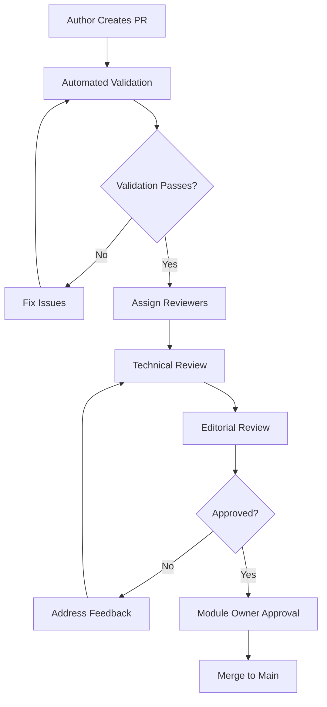

# Contributing to Q∞ Ecosystem Documentation

## Overview

Welcome to the Q∞ ecosystem documentation contribution guide. This document outlines the processes, standards, and guidelines for contributing to our documentation. Whether you're fixing a typo, adding new content, or proposing structural changes, this guide will help you contribute effectively.

## Table of Contents

- [Getting Started](#getting-started)
- [Types of Contributions](#types-of-contributions)
- [Contribution Workflow](#contribution-workflow)
- [Documentation Standards](#documentation-standards)
- [Review Process](#review-process)
- [Quality Assurance](#quality-assurance)
- [Tools and Automation](#tools-and-automation)
- [Community Guidelines](#community-guidelines)

## Getting Started

### Prerequisites

Before contributing, ensure you have:

- **Git**: Version control system for managing changes
- **Node.js**: Required for running validation tools
- **Text Editor**: Markdown-capable editor (VS Code recommended)
- **GitHub Account**: For submitting pull requests

### Repository Setup

1. **Fork the repository:**
   ```bash
   # Fork on GitHub, then clone your fork
   git clone https://github.com/YOUR_USERNAME/q-ecosystem.git
   cd q-ecosystem
   ```

2. **Install dependencies:**
   ```bash
   npm install
   ```

3. **Verify setup:**
   ```bash
   npm run docs:validate
   ```

### Understanding the Structure

```
docs/
├── global/                 # Ecosystem-wide documentation
│   ├── vision/            # Vision and strategy documents
│   ├── architecture/      # Technical architecture
│   └── whitepapers/       # Official whitepapers
├── modules/               # Module-specific documentation
│   └── [module-name]/     # Individual module docs
├── integration/           # Cross-module integration guides
├── deployment/            # Deployment documentation
├── video-scripts/         # Video content scripts
├── STYLEGUIDE.md         # Documentation standards
├── GLOSSARY.md           # Terminology definitions
└── CONTRIBUTING.md       # This document
```

## Types of Contributions

### 1. Content Updates

**Minor Updates:**
- Fixing typos and grammar
- Updating outdated information
- Correcting broken links
- Improving clarity of existing content

**Major Updates:**
- Adding new sections or documents
- Restructuring existing content
- Adding new modules or features
- Updating architecture documentation

### 2. Structural Improvements

- Reorganizing content for better navigation
- Improving cross-references and linking
- Enhancing search and discoverability
- Optimizing document structure

### 3. Translation Contributions

- Translating existing content to Spanish
- Maintaining bilingual consistency
- Updating translated content when source changes
- Reviewing translation quality

### 4. Technical Enhancements

- Improving automation scripts
- Adding validation rules
- Enhancing generation tools
- Optimizing build processes

## Contribution Workflow

### 1. Planning Your Contribution

**Before starting:**
- Check existing issues and pull requests
- Discuss major changes in GitHub issues
- Review the [Style Guide](./STYLEGUIDE.md)
- Understand the [Glossary](./GLOSSARY.md) terms

**For new content:**
- Identify the appropriate location
- Check if similar content exists
- Plan the structure and scope
- Consider related modules and dependencies

### 2. Making Changes

**Create a branch:**
```bash
git checkout -b docs/your-contribution-name
```

**Follow standards:**
- Use the [Style Guide](./STYLEGUIDE.md) for formatting
- Include proper metadata headers
- Follow naming conventions
- Add appropriate tags and categories

**Validate changes:**
```bash
# Run validation before committing
npm run docs:validate

# Check specific files
npm run docs:validate -- --file docs/path/to/file.md
```

### 3. Submitting Changes

**Commit guidelines:**
```bash
# Use descriptive commit messages
git commit -m "docs(qwallet): add payment flow examples"
git commit -m "docs(global): update architecture diagrams"
git commit -m "fix(docs): correct broken links in integration guide"
```

**Push and create PR:**
```bash
git push origin docs/your-contribution-name
# Create pull request on GitHub
```

## Documentation Standards

### Content Requirements

**All documents must include:**
- Complete YAML metadata header
- Clear title and overview
- Table of contents (for documents >500 words)
- Proper heading hierarchy
- Related documentation links

**Quality standards:**
- Accurate and up-to-date information
- Clear, concise writing
- Proper grammar and spelling
- Consistent terminology from glossary
- Appropriate code examples and formatting

### Metadata Standards

**Required metadata fields:**
```yaml
---
version: "1.0.0"                    # Document version
author: "Your Name"                 # Primary author
lastModified: "2025-08-30T16:49:09.046Z"  # ISO 8601 timestamp
reviewedBy: ""                      # Last reviewer (empty if not reviewed)
module: "module-name"               # Module name or null for global
relatedModules: ["mod1", "mod2"]    # Related modules array
ecosystemVersion: "v2.0.0"         # Current ecosystem version
lastAudit: "2025-08-30T16:49:09.046Z"     # Last audit timestamp
category: "module"                  # Document category
language: "en"                      # Language code
completeness: "draft"               # Status: draft|review|complete
dependencies: []                    # Document dependencies
tags: ["tag1", "tag2"]             # Relevant tags
---
```

### Writing Guidelines

**Style requirements:**
- Follow the [Style Guide](./STYLEGUIDE.md)
- Use active voice and present tense
- Write for your target audience
- Be concise but comprehensive
- Use inclusive language

**Technical content:**
- Include working code examples
- Provide complete API documentation
- Add troubleshooting sections
- Include integration examples
- Reference related modules appropriately

## Review Process

### Peer Review Workflow



### Review Roles

**Technical Reviewer:**
- Validates technical accuracy
- Checks code examples and APIs
- Verifies integration information
- Ensures completeness of technical content

**Editorial Reviewer:**
- Reviews writing quality and clarity
- Checks style guide compliance
- Validates grammar and spelling
- Ensures consistent terminology

**Module Owner:**
- Final approval for module-specific content
- Validates business requirements
- Ensures alignment with module roadmap
- Approves publication

### Review Criteria

**Technical Accuracy:**
- ✅ Code examples work correctly
- ✅ API documentation is current
- ✅ Integration steps are accurate
- ✅ Technical concepts are correct

**Content Quality:**
- ✅ Clear and understandable writing
- ✅ Appropriate level of detail
- ✅ Good organization and flow
- ✅ Helpful examples and use cases

**Standards Compliance:**
- ✅ Follows style guide formatting
- ✅ Complete and accurate metadata
- ✅ Proper heading hierarchy
- ✅ Consistent terminology usage

**Completeness:**
- ✅ All required sections present
- ✅ Appropriate cross-references
- ✅ Related documentation linked
- ✅ Prerequisites clearly stated

## Quality Assurance

### Automated Validation

**Pre-commit checks:**
```bash
# Runs automatically on commit
npm run docs:validate:pre-commit
```

**Full validation:**
```bash
# Complete validation suite
npm run docs:validate:full
```

**Validation includes:**
- Metadata completeness and format
- Link validation (internal and external)
- Style guide compliance
- Grammar and spelling checks
- Code syntax validation
- Cross-reference accuracy

### Manual Quality Checks

**Content review checklist:**
- [ ] Information is accurate and current
- [ ] Writing is clear and concise
- [ ] Examples work as documented
- [ ] All links function correctly
- [ ] Terminology matches glossary
- [ ] Metadata is complete and accurate

**Technical review checklist:**
- [ ] Code examples are syntactically correct
- [ ] API documentation matches implementation
- [ ] Integration steps are complete
- [ ] Prerequisites are clearly stated
- [ ] Troubleshooting covers common issues

### Continuous Improvement

**Quality metrics:**
- Documentation coverage per module
- Link health and accuracy
- Content freshness (last update dates)
- Review completion times
- User feedback and satisfaction

**Regular maintenance:**
- Monthly link validation
- Quarterly content audits
- Semi-annual style guide reviews
- Annual comprehensive reviews

## Tools and Automation

### Validation Tools

**docs-validator.mjs:**
```bash
# Validate all documentation
npm run docs:validate

# Validate specific module
npm run docs:validate -- --module qwallet

# Validate specific file
npm run docs:validate -- --file docs/modules/qwallet/README.md
```

**Front-matter linter:**
```bash
# Check metadata compliance
npm run docs:lint:metadata
```

**Link checker:**
```bash
# Validate all links
npm run docs:validate:links
```

### Generation Tools

**Master index builder:**
```bash
# Regenerate documentation index
npm run docs:index:build
```

**Script generator:**
```bash
# Generate video scripts
npm run docs:scripts:generate
```

### Development Tools

**Live preview:**
```bash
# Start documentation server
npm run docs:serve
```

**Watch mode:**
```bash
# Auto-validate on changes
npm run docs:watch
```

## Community Guidelines

### Code of Conduct

**Be respectful:**
- Treat all contributors with respect
- Provide constructive feedback
- Be patient with new contributors
- Celebrate diverse perspectives

**Be collaborative:**
- Share knowledge and expertise
- Help others learn and improve
- Work together toward common goals
- Support community growth

**Be professional:**
- Maintain high standards of quality
- Follow established processes
- Communicate clearly and effectively
- Take responsibility for your contributions

### Communication Channels

**GitHub Issues:**
- Bug reports and feature requests
- Discussion of major changes
- Questions about contribution process

**Pull Request Reviews:**
- Specific feedback on contributions
- Technical discussions
- Collaborative improvement

**Documentation Team:**
- Regular team meetings
- Strategic planning discussions
- Process improvements

### Recognition

**Contributor acknowledgment:**
- Contributors listed in document metadata
- Regular recognition in team communications
- Annual contributor appreciation

**Quality contributions:**
- Featured in documentation highlights
- Shared as examples of best practices
- Considered for documentation team membership

## Getting Help

### Resources

**Documentation:**
- [Style Guide](./STYLEGUIDE.md) - Writing and formatting standards
- [Glossary](./GLOSSARY.md) - Terminology and definitions
- [Module Documentation](./modules/) - Module-specific guides

**Tools:**
- Validation scripts in `/scripts` directory
- Templates in `/templates` directory
- Automation tools documentation

### Support Channels

**For questions about:**
- **Content**: Create GitHub issue with `documentation` label
- **Process**: Create GitHub issue with `process` label
- **Tools**: Create GitHub issue with `tooling` label
- **Urgent issues**: Contact documentation team directly

### Common Issues

**Validation failures:**
1. Check metadata format and completeness
2. Validate all links are working
3. Ensure style guide compliance
4. Run spell check and grammar validation

**Review delays:**
1. Ensure all automated checks pass
2. Provide clear description of changes
3. Address reviewer feedback promptly
4. Follow up if review is stalled

**Technical questions:**
1. Check existing documentation first
2. Search GitHub issues for similar questions
3. Ask specific, detailed questions
4. Provide context and examples

## Appendices

### A. Commit Message Format

```
type(scope): brief description

Longer description if needed

- Bullet points for multiple changes
- Reference issues: Fixes #123
- Breaking changes: BREAKING CHANGE: description
```

**Types:**
- `docs`: Documentation changes
- `fix`: Bug fixes in documentation
- `feat`: New documentation features
- `refactor`: Restructuring without content changes
- `style`: Formatting and style changes

**Scopes:**
- Module names: `qwallet`, `qindex`, etc.
- Areas: `global`, `integration`, `deployment`
- Tools: `validation`, `automation`, `scripts`

### B. Review Checklist Template

```markdown
## Technical Review
- [ ] Content is technically accurate
- [ ] Code examples work correctly
- [ ] API documentation is current
- [ ] Integration steps are complete

## Editorial Review
- [ ] Writing is clear and concise
- [ ] Grammar and spelling are correct
- [ ] Style guide is followed
- [ ] Terminology is consistent

## Standards Review
- [ ] Metadata is complete and accurate
- [ ] File structure follows conventions
- [ ] Links are working correctly
- [ ] Cross-references are appropriate

## Final Approval
- [ ] Content meets quality standards
- [ ] Changes align with module goals
- [ ] Ready for publication
```

### C. Module Owner Responsibilities

**Content oversight:**
- Review and approve module-specific documentation
- Ensure alignment with module roadmap
- Maintain documentation quality standards
- Coordinate with development team

**Process management:**
- Assign appropriate reviewers
- Monitor review completion times
- Escalate blocked reviews
- Ensure timely updates

**Quality assurance:**
- Regular content audits
- User feedback integration
- Continuous improvement initiatives
- Team training and development

---

*Thank you for contributing to the Q∞ ecosystem documentation. Your efforts help make our platform more accessible and successful for everyone.*