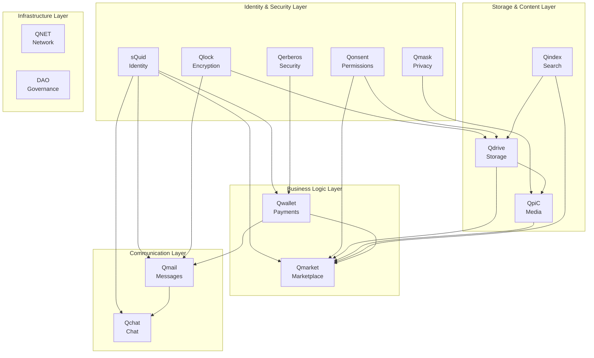
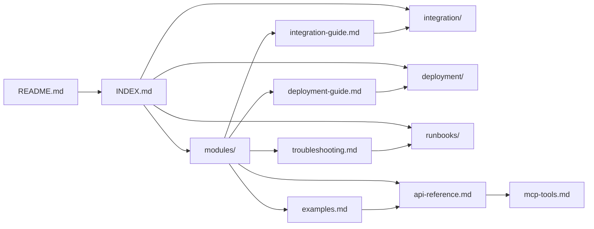

# Q Ecosystem Cross-References

This document maps the relationships, dependencies, and cross-references between all documentation and modules in the Q Ecosystem.

## 📊 Module Dependency Matrix

### Direct Dependencies

| Module | Depends On | Used By | Integration Type |
|--------|------------|---------|------------------|
| sQuid | - | Qwallet, Qmail, Qmarket, Qchat | Identity Provider |
| Qlock | - | Qdrive, Qmail, sQuid | Encryption Service |
| Qonsent | sQuid | Qdrive, Qmarket, QpiC | Permission Engine |
| Qindex | - | All Modules | Indexing Service |
| Qwallet | sQuid, Qerberos | Qmarket, Qmail | Payment Processor |
| Qerberos | sQuid | Qwallet, Qmask | Security Monitor |
| Qmask | sQuid, Qlock | QpiC, Qmarket | Privacy Layer |
| Qdrive | sQuid, Qlock, Qonsent, Qindex | QpiC, Qmarket | Storage Backend |
| QpiC | Qdrive, Qmask, Qindex | Qmarket | Media Processor |
| Qmarket | sQuid, Qonsent, Qwallet, Qdrive, QpiC | - | Marketplace |
| Qmail | sQuid, Qlock, Qwallet | Qchat | Messaging Service |
| Qchat | sQuid, Qmail | - | Chat Service |
| QNET | - | All Modules | Network Layer |
| DAO | sQuid, Qwallet | - | Governance |

### Integration Patterns

#### Identity Integration (sQuid)
- **Primary Integration**: Qwallet, Qmail, Qmarket, Qchat
- **Authentication Flow**: All modules use sQuid for user authentication
- **Sub-identity Management**: Modules can create and manage sub-identities
- **Related Documentation**:
  - [sQuid API Reference](modules/squid/api-reference.md)
  - [Identity Integration Guide](qwallet-identity-expansion/integration/overview.md)
  - [Authentication Patterns](modules/squid/integration-guide.md)

#### Security Integration (Qerberos + Qmask + Qlock)
- **Security Monitoring**: Qerberos monitors all critical operations
- **Privacy Protection**: Qmask provides anonymization services
- **Encryption Services**: Qlock handles all cryptographic operations
- **Related Documentation**:
  - [Security Architecture](modules/qerberos/README.md)
  - [Privacy Patterns](modules/qmask/integration-guide.md)
  - [Encryption Guide](modules/qlock/integration-guide.md)

#### Storage Integration (Qdrive + QpiC + Qindex)
- **File Storage**: Qdrive provides IPFS-based storage
- **Media Processing**: QpiC handles media transcoding and optimization
- **Content Indexing**: Qindex provides search and discovery
- **Related Documentation**:
  - [Storage Architecture](modules/qdrive/integration-guide.md)
  - [Media Processing](modules/qpic/integration-guide.md)
  - [Search Integration](modules/qindex/integration-guide.md)

#### Payment Integration (Qwallet)
- **Transaction Processing**: Handles all payment operations
- **Fee Management**: Manages ecosystem fees and rewards
- **Multi-chain Support**: Supports multiple blockchain networks
- **Related Documentation**:
  - [Payment Integration](modules/qwallet/integration-guide.md)
  - [Fee Structure](modules/qwallet/api-reference.md)
  - [Multi-chain Guide](MULTI_CHAIN_TOKEN_MANAGEMENT_SUMMARY.md)

## 🔗 Document Cross-References

### Architecture Documentation
- **Primary**: [DAO Dashboard Architecture](DAO-DASHBOARD-ARCHITECTURE.md)
- **Related**: 
  - [Q∞ Architecture](global/q-infinity-architecture.md)
  - [Integration Matrix](integration/integration-matrix.md)
  - [System Design Patterns](modules/*/integration-guide.md)

### API Documentation
- **Module APIs**: Each module has `api-reference.md`
- **Cross-Module APIs**: Documented in integration guides
- **OpenAPI Specs**: Available in module directories
- **Related**:
  - [API Changes](API-CHANGES.md)
  - [Standard Headers](integration/integration-matrix.md#standard-headers)
  - [Response Formats](integration/integration-matrix.md#response-format)

### Deployment Documentation
- **Primary**: [Deployment Matrix](deployment/deployment-matrix.md)
- **Module-Specific**: Each module has `deployment-guide.md`
- **Environment Configs**: Kubernetes and serverless configurations
- **Related**:
  - [Production Deployment](production-deployment-runbook.md)
  - [Disaster Recovery](disaster-recovery-procedures.md)
  - [Environment Validation](scripts/validate-deployment-readiness.sh)

### Operational Documentation
- **Runbooks**: Each module has operational procedures
- **Monitoring**: Performance and health monitoring guides
- **Troubleshooting**: Issue resolution procedures
- **Related**:
  - [Runbooks Overview](runbooks/README.md)
  - [Monitoring System](docs/performance-monitoring-system.md)
  - [Alert Procedures](docs/runbooks/)

## 🎯 Integration Flows

### User Registration Flow
1. **sQuid**: Create identity and sub-identities
2. **Qonsent**: Set up permission policies
3. **Qwallet**: Initialize payment account
4. **Qerberos**: Begin security monitoring

**Documentation Path**:
- [sQuid Integration](modules/squid/integration-guide.md)
- [Permission Setup](modules/qonsent/integration-guide.md)
- [Payment Integration](modules/qwallet/integration-guide.md)
- [Security Monitoring](modules/qerberos/integration-guide.md)

### Content Publishing Flow
1. **sQuid**: Authenticate user
2. **Qdrive**: Store content files
3. **QpiC**: Process media content
4. **Qindex**: Index for search
5. **Qmarket**: List for sale
6. **Qwallet**: Handle payments

**Documentation Path**:
- [Content Storage](modules/qdrive/integration-guide.md)
- [Media Processing](modules/qpic/integration-guide.md)
- [Search Indexing](modules/qindex/integration-guide.md)
- [Marketplace Integration](modules/qmarket/integration-guide.md)

### Communication Flow
1. **sQuid**: Authenticate participants
2. **Qmail**: Send certified messages
3. **Qchat**: Enable real-time chat
4. **Qlock**: Encrypt communications
5. **Qerberos**: Monitor for security

**Documentation Path**:
- [Messaging Integration](modules/qmail/integration-guide.md)
- [Chat Integration](modules/qchat/integration-guide.md)
- [Communication Security](modules/qlock/integration-guide.md)

## 📚 Documentation Categories

### By Audience

#### Developer Documentation
- **API References**: Complete API documentation for all modules
- **Integration Guides**: How to integrate modules together
- **Code Examples**: Working code samples and tutorials
- **MCP Tools**: Development tools and utilities

#### Operations Documentation
- **Deployment Guides**: How to deploy and configure modules
- **Runbooks**: Operational procedures and emergency responses
- **Monitoring**: System health and performance monitoring
- **Troubleshooting**: Issue diagnosis and resolution

#### Business Documentation
- **Module Overviews**: Business value and capabilities
- **User Guides**: End-user documentation and workflows
- **Migration Guides**: Transition planning and execution
- **Requirements**: Feature specifications and acceptance criteria

### By Module Category

#### Foundation Services
- **Identity**: sQuid identity and sub-identity management
- **Security**: Qlock encryption, Qerberos monitoring, Qmask privacy
- **Permissions**: Qonsent policy and permission management
- **Indexing**: Qindex search and discovery services

#### Business Services
- **Payments**: Qwallet transaction and fee management
- **Storage**: Qdrive file storage and content management
- **Media**: QpiC media processing and optimization
- **Marketplace**: Qmarket content commerce platform

#### Communication Services
- **Messaging**: Qmail certified message delivery
- **Chat**: Qchat real-time communication
- **Network**: QNET infrastructure and connectivity
- **Governance**: DAO community and decision management

## 🔄 Update Dependencies

### Documentation Maintenance
When updating documentation, consider these dependencies:

#### Module Documentation Updates
- Update integration guides when APIs change
- Update examples when implementation patterns change
- Update troubleshooting when new issues are discovered
- Update runbooks when operational procedures change

#### Cross-Module Impact
- API changes may affect multiple integration guides
- Security updates may require runbook modifications
- Performance changes may need monitoring updates
- New features may require example updates

#### Validation Requirements
- All links must be validated after updates
- Cross-references must be verified for accuracy
- Examples must be tested for functionality
- Procedures must be validated through execution

## 🎨 Visual Relationships

### Module Interaction Diagram

### Documentation Relationship Map

---

*Cross-references generated automatically*
*Last updated: 2025-01-29T12:00:00.000Z*
*For questions about relationships, create an issue in the main repository*