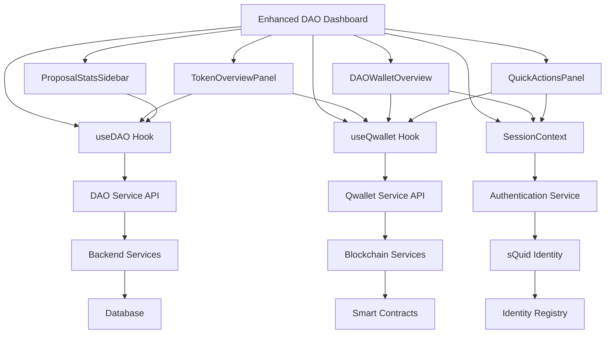

# DAO Dashboard Enhancement Architecture

## Overview

The DAO Dashboard Enhancement introduces a comprehensive set of components that extend the existing DAO governance interface with economic and reputational data integration. This document outlines the architecture, data flow, and integration patterns for the enhanced dashboard system.

## System Architecture

### Component Hierarchy

```
Enhanced DAO Dashboard
├── DAODashboard (Enhanced)
│   ├── Existing DAO functionality
│   └── Integration points for new components
├── TokenOverviewPanel
│   ├── Token information display
│   ├── Supply metrics visualization
│   └── Governance mechanism indicators
├── DAOWalletOverview
│   ├── Member wallet summary
│   ├── Voting power calculation
│   └── NFT collection display
├── QuickActionsPanel
│   ├── Role-based action buttons
│   ├── Modal integrations
│   └── Permission validation
└── ProposalStatsSidebar
    ├── Historical statistics
    ├── Participation analytics
    └── Trend analysis
```

### Data Flow Architecture



## Component Architecture

### TokenOverviewPanel

**Purpose**: Display comprehensive DAO token information with fallback data sources.

**Architecture**:
- **Primary Data Source**: Enhanced DAO service with token metadata
- **Fallback 1**: QwalletService for token information
- **Fallback 2**: Synthetic data generation from available DAO data
- **Caching Layer**: 5-minute cache with automatic refresh

**Key Features**:
- Multi-source data fetching with graceful degradation
- Real-time supply metrics calculation
- Governance mechanism visualization
- Responsive design with accessibility support

**Data Dependencies**:
```typescript
interface TokenOverviewDependencies {
  daoService: {
    getDAO: (daoId: string) => Promise<EnhancedDAO>;
  };
  walletService: {
    getBalance: (squidId: string, token: string) => Promise<Balance>;
  };
  cacheService: {
    get: (key: string) => TokenInfo | null;
    set: (key: string, data: TokenInfo, ttl: number) => void;
  };
}
```

### DAOWalletOverview

**Purpose**: Display authenticated member's wallet summary with DAO-specific assets.

**Architecture**:
- **Authentication Layer**: SessionContext integration
- **Membership Validation**: DAO membership verification
- **Asset Filtering**: DAO-specific token and NFT filtering
- **Voting Power Engine**: Multi-mechanism voting power calculation

**Key Features**:
- Real-time balance updates
- NFT collection with DAO filtering
- Voting power visualization
- Trend analysis for balance changes

**Data Dependencies**:
```typescript
interface WalletOverviewDependencies {
  sessionContext: {
    isAuthenticated: boolean;
    session: { issuer: string } | null;
  };
  daoService: {
    getMembership: (daoId: string, squidId: string) => Promise<Membership>;
  };
  walletService: {
    getBalance: (squidId: string, token: string) => Promise<Balance>;
    listUserNFTs: (squidId: string) => Promise<NFT[]>;
  };
}
```

### QuickActionsPanel

**Purpose**: Provide role-based quick access to wallet operations.

**Architecture**:
- **Permission Engine**: Role-based access control
- **Modal Integration**: Seamless integration with existing wallet components
- **Action Feedback System**: Real-time success/error feedback
- **State Management**: Individual action loading states

**Key Features**:
- Dynamic action filtering based on user role
- Integrated NFT minting with DAO attributes
- Token transfer modal integration
- Comprehensive error handling

**Data Dependencies**:
```typescript
interface QuickActionsDependencies {
  permissionService: {
    checkRole: (role: string, requiredRole: string) => boolean;
    validateConditions: (conditions: string[]) => boolean;
  };
  walletService: {
    mintNFT: (params: MintNFTParams) => Promise<NFT>;
    refreshWalletData: () => Promise<void>;
  };
  modalService: {
    openTokenTransfer: () => void;
    openNFTGallery: () => void;
  };
}
```

### ProposalStatsSidebar

**Purpose**: Display historical governance statistics and participation analytics.

**Architecture**:
- **Statistics Engine**: Complex proposal analytics calculation
- **Trend Analysis**: Participation trend detection algorithms
- **Data Visualization**: Accessible charts and progress indicators
- **Graceful Degradation**: Intelligent handling of insufficient data

**Key Features**:
- Quorum reach rate calculation
- Participation trend analysis
- Top proposals ranking
- Time-to-quorum analytics

**Data Dependencies**:
```typescript
interface ProposalStatsDependencies {
  daoService: {
    getProposals: (daoId: string) => Promise<Proposal[]>;
    getResults: (daoId: string) => Promise<DAOResults>;
  };
  analyticsService: {
    calculateQuorumRate: (proposals: Proposal[]) => number;
    analyzeTrends: (proposals: Proposal[]) => TrendAnalysis;
  };
}
```

## Integration Patterns

### Hook Integration Pattern

The enhanced components follow a consistent hook integration pattern:

```typescript
// Standard hook integration pattern
function EnhancedDAOComponent({ daoId }: { daoId: string }) {
  // Core hooks
  const { currentDAO, proposals, membership, loading, error } = useDAO();
  const { balances, nfts, refreshWalletData } = useQwallet();
  const { isAuthenticated, session } = useSessionContext();
  
  // Performance monitoring
  const { getMountTime } = useRenderMonitoring('ComponentName', { daoId });
  
  // Accessibility
  const { containerRef, focusFirst } = useKeyboardNavigation();
  const { colorScheme, shouldShowDataTable } = useAccessibleVisualization();
  
  // Component logic...
}
```

### Error Boundary Pattern

All components are wrapped with error boundaries for robust error handling:

```typescript
// Error boundary wrapper pattern
<DAOErrorBoundary
  fallback={<ComponentErrorFallback />}
  onError={(error, errorInfo) => logError(error, errorInfo)}
>
  <EnhancedDAOComponent {...props} />
</DAOErrorBoundary>
```

### Caching Strategy

Components implement a multi-layer caching strategy:

1. **Memory Cache**: Component-level state caching
2. **Session Cache**: Browser session storage for user-specific data
3. **API Cache**: Service-level caching with TTL
4. **CDN Cache**: Static asset caching

```typescript
// Caching implementation pattern
const useCachedData = <T>(
  key: string,
  fetcher: () => Promise<T>,
  ttl: number = 300000 // 5 minutes
) => {
  const [data, setData] = useState<T | null>(null);
  const [loading, setLoading] = useState(false);
  
  const fetchData = useCallback(async (forceRefresh = false) => {
    const cached = !forceRefresh ? getFromCache(key) : null;
    if (cached && Date.now() - cached.timestamp < ttl) {
      setData(cached.data);
      return;
    }
    
    setLoading(true);
    try {
      const result = await fetcher();
      setData(result);
      setCache(key, { data: result, timestamp: Date.now() });
    } finally {
      setLoading(false);
    }
  }, [key, fetcher, ttl]);
  
  return { data, loading, refresh: fetchData };
};
```

## Performance Architecture

### Optimization Strategies

1. **Component Memoization**: React.memo for prop-based re-rendering
2. **Hook Memoization**: useMemo and useCallback for expensive operations
3. **Lazy Loading**: Dynamic imports for heavy components
4. **Virtual Scrolling**: For large data sets (future enhancement)

### Bundle Splitting

```typescript
// Code splitting strategy
const TokenOverviewPanel = React.lazy(() => 
  import('./TokenOverviewPanel').then(module => ({
    default: module.default
  }))
);

const DAOWalletOverview = React.lazy(() => 
  import('./DAOWalletOverview')
);

// Preloading strategy
const preloadComponents = () => {
  import('./TokenOverviewPanel');
  import('./DAOWalletOverview');
  import('./QuickActionsPanel');
  import('./ProposalStatsSidebar');
};
```

### Performance Monitoring

```typescript
// Performance monitoring integration
const usePerformanceMonitoring = (componentName: string, props: any) => {
  const startTime = useRef(Date.now());
  
  useEffect(() => {
    const mountTime = Date.now() - startTime.current;
    
    // Log performance metrics
    if (process.env.NODE_ENV === 'development') {
      console.log(`${componentName} mounted in ${mountTime}ms`);
    }
    
    // Send to analytics service
    analytics.track('component_performance', {
      component: componentName,
      mountTime,
      props: Object.keys(props)
    });
  }, [componentName, props]);
  
  return { getMountTime: () => Date.now() - startTime.current };
};
```

## Security Architecture

### Access Control

The system implements multi-layer access control:

1. **Authentication Layer**: sQuid identity verification
2. **Authorization Layer**: DAO membership validation
3. **Permission Layer**: Role-based action permissions
4. **Data Layer**: Encrypted sensitive data transmission

```typescript
// Security validation pattern
const useSecurityValidation = (daoId: string) => {
  const { isAuthenticated, session } = useSessionContext();
  const { membership } = useDAO();
  
  const validateAccess = useCallback((requiredRole?: string) => {
    if (!isAuthenticated) {
      return { allowed: false, reason: 'authentication_required' };
    }
    
    if (!membership?.isMember) {
      return { allowed: false, reason: 'membership_required' };
    }
    
    if (requiredRole && !hasRole(membership.role, requiredRole)) {
      return { allowed: false, reason: 'insufficient_permissions' };
    }
    
    return { allowed: true };
  }, [isAuthenticated, membership]);
  
  return { validateAccess };
};
```

### Data Protection

- **Input Sanitization**: All user inputs are sanitized
- **XSS Prevention**: Content Security Policy implementation
- **CSRF Protection**: Token-based request validation
- **Audit Logging**: Security events are logged for monitoring

## Accessibility Architecture

### WCAG 2.1 Compliance

The system implements comprehensive accessibility features:

1. **Keyboard Navigation**: Full keyboard accessibility
2. **Screen Reader Support**: ARIA labels and descriptions
3. **Color Accessibility**: High contrast and color-blind friendly
4. **Focus Management**: Logical focus order and indicators

```typescript
// Accessibility implementation pattern
const useAccessibility = () => {
  const { colorScheme, shouldShowDataTable } = useAccessibleVisualization();
  const { containerRef, focusFirst } = useKeyboardNavigation();
  
  const createAccessibleChart = (data: any[], type: string) => {
    return {
      visualChart: <Chart data={data} colorScheme={colorScheme} />,
      dataTable: shouldShowDataTable ? <DataTable data={data} /> : null,
      description: generateChartDescription(data, type)
    };
  };
  
  return { createAccessibleChart, containerRef, focusFirst };
};
```

## Testing Architecture

### Testing Strategy

1. **Unit Tests**: Individual component testing
2. **Integration Tests**: Hook and service integration
3. **E2E Tests**: Complete user workflows
4. **Accessibility Tests**: WCAG compliance validation
5. **Performance Tests**: Load and stress testing

```typescript
// Testing pattern example
describe('TokenOverviewPanel Integration', () => {
  beforeEach(() => {
    mockUseDAO.mockReturnValue({
      currentDAO: mockDAO,
      loading: false,
      error: null
    });
    
    mockUseQwallet.mockReturnValue({
      balances: mockBalances,
      loading: false,
      error: null
    });
  });
  
  test('renders token information correctly', async () => {
    render(<TokenOverviewPanel daoId="test-dao" />);
    
    await waitFor(() => {
      expect(screen.getByText('Test Token')).toBeInTheDocument();
      expect(screen.getByText('1.0M')).toBeInTheDocument();
    });
  });
  
  test('handles error states gracefully', async () => {
    mockUseDAO.mockReturnValue({
      currentDAO: null,
      loading: false,
      error: 'Network error'
    });
    
    render(<TokenOverviewPanel daoId="test-dao" />);
    
    expect(screen.getByText('Token Information Unavailable')).toBeInTheDocument();
    expect(screen.getByText('Retry')).toBeInTheDocument();
  });
});
```

## Deployment Architecture

### Environment Configuration

```typescript
// Environment-specific configuration
const config = {
  development: {
    apiUrl: 'http://localhost:3000/api',
    enableDebugLogging: true,
    cacheTimeout: 1000,
    performanceMonitoring: true
  },
  staging: {
    apiUrl: 'https://staging-api.anarq.com/api',
    enableDebugLogging: false,
    cacheTimeout: 60000,
    performanceMonitoring: true
  },
  production: {
    apiUrl: 'https://api.anarq.com/api',
    enableDebugLogging: false,
    cacheTimeout: 300000,
    performanceMonitoring: true
  }
};
```

### Build Optimization

```typescript
// Vite configuration for optimal builds
export default defineConfig({
  build: {
    rollupOptions: {
      output: {
        manualChunks: {
          'dao-components': [
            './src/components/dao/TokenOverviewPanel',
            './src/components/dao/DAOWalletOverview',
            './src/components/dao/QuickActionsPanel',
            './src/components/dao/ProposalStatsSidebar'
          ],
          'dao-hooks': [
            './src/composables/useDAO',
            './src/composables/useQwallet'
          ]
        }
      }
    }
  }
});
```

## Monitoring and Analytics

### Performance Metrics

- Component mount times
- API response times
- User interaction patterns
- Error rates and types
- Cache hit/miss ratios

### Business Metrics

- DAO engagement rates
- Wallet connection success rates
- Action completion rates
- User retention metrics
- Feature adoption rates

```typescript
// Analytics integration
const useAnalytics = () => {
  const trackEvent = useCallback((event: string, properties: any) => {
    if (process.env.NODE_ENV === 'production') {
      analytics.track(event, {
        ...properties,
        timestamp: Date.now(),
        userAgent: navigator.userAgent,
        url: window.location.href
      });
    }
  }, []);
  
  const trackPerformance = useCallback((metric: string, value: number) => {
    if (process.env.NODE_ENV === 'production') {
      analytics.track('performance_metric', {
        metric,
        value,
        timestamp: Date.now()
      });
    }
  }, []);
  
  return { trackEvent, trackPerformance };
};
```

## Future Architecture Considerations

### Scalability

1. **Microservices**: Service decomposition for better scalability
2. **CDN Integration**: Global content delivery optimization
3. **Database Sharding**: Horizontal scaling for large datasets
4. **Caching Layers**: Redis integration for distributed caching

### Extensibility

1. **Plugin Architecture**: Support for custom DAO components
2. **Theme System**: Customizable UI themes and branding
3. **API Versioning**: Backward-compatible API evolution
4. **Webhook System**: Real-time event notifications

### Technology Evolution

1. **React 19**: Preparation for React 19 features
2. **Web3 Integration**: Enhanced blockchain connectivity
3. **AI/ML Integration**: Intelligent governance insights
4. **Mobile Apps**: React Native component sharing

## Conclusion

The DAO Dashboard Enhancement architecture provides a robust, scalable, and maintainable foundation for advanced DAO governance features. The modular design, comprehensive error handling, and performance optimizations ensure a high-quality user experience while maintaining code quality and developer productivity.

The architecture supports future enhancements and integrations while maintaining backward compatibility with existing systems. The emphasis on accessibility, security, and performance makes it suitable for production deployment in the AnarQ&Q ecosystem.