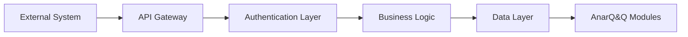

# Integration Patterns and Guidelines

**Status:** Coming Soon

## Overview

This section will provide comprehensive guidelines and patterns for integrating external systems and services with the AnarQ&Q ecosystem.

## Integration Categories

### Blockchain Integrations
- **Multi-Chain Support**: Patterns for supporting multiple blockchain networks
- **Cross-Chain Communication**: Inter-blockchain communication protocols
- **Smart Contract Integration**: Best practices for smart contract interactions
- **Wallet Connectivity**: Standardized wallet integration patterns

### Payment Systems
- **Traditional Payment Gateways**: Credit card and bank integration patterns
- **Cryptocurrency Payments**: Digital currency processing guidelines
- **Micropayment Systems**: Small transaction optimization patterns
- **Payment Security**: Security protocols for financial transactions

### Identity Providers
- **OAuth 2.0 / OpenID Connect**: Standard identity provider integration
- **Decentralized Identity**: Self-sovereign identity integration patterns
- **Multi-Factor Authentication**: Enhanced security integration guidelines
- **Identity Verification**: KYC/AML compliance integration patterns

### Cloud Services
- **Storage Providers**: Distributed and centralized storage integration
- **CDN Integration**: Content delivery network optimization
- **Monitoring Services**: External monitoring and alerting integration
- **Analytics Platforms**: Data analytics and business intelligence integration

## Integration Patterns

### Standard Integration Flow

### Authentication Patterns
- **API Key Authentication**: Simple service-to-service authentication
- **JWT Token Authentication**: Stateless token-based authentication
- **OAuth 2.0 Flow**: Third-party service authorization
- **Mutual TLS**: Certificate-based mutual authentication

### Data Exchange Patterns
- **REST API Integration**: RESTful service integration guidelines
- **GraphQL Integration**: GraphQL-based data exchange patterns
- **Event-Driven Integration**: Asynchronous event-based communication
- **Webhook Integration**: Real-time notification patterns

### Error Handling Patterns
- **Retry Mechanisms**: Intelligent retry strategies for failed requests
- **Circuit Breaker**: Fault tolerance for external service failures
- **Graceful Degradation**: Fallback mechanisms for service unavailability
- **Error Propagation**: Standardized error handling and reporting

## Security Guidelines

### Data Protection
- **Encryption Standards**: Data encryption requirements and standards
- **Data Minimization**: Principles for minimal data exchange
- **Data Retention**: Guidelines for data lifecycle management
- **Privacy Compliance**: GDPR, CCPA, and other privacy regulation compliance

### Access Control
- **Principle of Least Privilege**: Minimal access rights assignment
- **Role-Based Access Control**: RBAC implementation guidelines
- **API Rate Limiting**: Protection against abuse and overuse
- **Audit Logging**: Comprehensive audit trail requirements

## Testing Strategies

### Integration Testing
- **Contract Testing**: API contract validation strategies
- **End-to-End Testing**: Complete integration flow validation
- **Load Testing**: Performance testing for integrated systems
- **Security Testing**: Security vulnerability assessment

### Monitoring & Observability
- **Health Check Patterns**: Service health monitoring guidelines
- **Metrics Collection**: Key performance indicator tracking
- **Distributed Tracing**: Request flow tracking across systems
- **Alerting Strategies**: Proactive issue detection and notification

## Implementation Guidelines

### Development Process
1. **Requirements Analysis**: Integration requirement specification
2. **Architecture Design**: Integration architecture planning
3. **Security Review**: Security assessment and approval
4. **Implementation**: Development following established patterns
5. **Testing**: Comprehensive testing strategy execution
6. **Documentation**: Complete integration documentation
7. **Deployment**: Staged deployment with monitoring
8. **Maintenance**: Ongoing monitoring and maintenance

### Code Standards
- **API Design**: RESTful API design principles
- **Error Handling**: Standardized error response formats
- **Logging**: Structured logging requirements
- **Configuration**: Environment-specific configuration management

## Available Integrations

### Current Integrations
- **IPFS**: Distributed file storage integration
- **Storj**: Decentralized cloud storage integration
- **Ethereum**: Blockchain network integration
- **WebSocket**: Real-time communication integration

### Planned Integrations
- **Pi Network**: Pi cryptocurrency integration *(Coming Soon)*
- **Additional Blockchains**: Multi-chain support expansion *(Coming Soon)*
- **Enterprise SSO**: Enterprise identity provider integration *(Coming Soon)*
- **Advanced Analytics**: Business intelligence platform integration *(Coming Soon)*

## Support & Resources

### Documentation
- **API Reference**: Complete API documentation *(Coming Soon)*
- **SDK Documentation**: Software development kit guides *(Coming Soon)*
- **Example Implementations**: Reference implementation examples *(Coming Soon)*
- **Troubleshooting Guide**: Common issues and solutions *(Coming Soon)*

### Community
- **Developer Forum**: Community discussion and support *(Coming Soon)*
- **Integration Examples**: Community-contributed examples *(Coming Soon)*
- **Best Practices**: Community-driven best practices *(Coming Soon)*

---

*Last Updated: December 2024*  
*Status: Placeholder - Coming Soon*