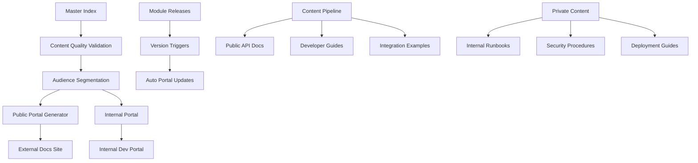

# Public Documentation Portal Blueprint

## Overview

This blueprint outlines how to transform the validated master documentation index into a versioned public documentation portal that serves both internal and external audiences without breaking the existing dev/ops structure.

## Architecture Vision



## Content Quality Validation Extensions

### Enhanced Validation Rules

```javascript
// Extended validation for content quality
const contentQualityRules = {
  minimumSectionLength: {
    overview: 200,        // chars
    examples: 500,        // chars
    troubleshooting: 300  // chars
  },
  
  requiredElements: {
    codeExamples: {
      apiReference: 3,     // minimum code blocks
      integrationGuide: 5,
      examples: 10
    },
    
    diagrams: {
      architecture: 1,     // minimum diagrams
      integrationGuide: 2,
      deploymentGuide: 1
    },
    
    links: {
      crossReferences: 3,  // minimum internal links
      externalResources: 2 // minimum external links
    }
  },
  
  contentStructure: {
    headingHierarchy: true,    // proper H1->H2->H3 structure
    tableOfContents: true,     // TOC for docs > 1000 chars
    codeLanguageLabels: true,  // all code blocks labeled
    imageAltText: true         // all images have alt text
  }
};
```

### Content Quality Checker

```javascript
class ContentQualityChecker {
  async validateContent(filePath, content) {
    const results = {
      passed: true,
      errors: [],
      warnings: [],
      metrics: {}
    };
    
    // Check minimum section lengths
    await this.checkSectionLengths(content, results);
    
    // Validate code examples
    await this.validateCodeExamples(content, results);
    
    // Check for diagrams
    await this.validateDiagrams(content, results);
    
    // Verify content structure
    await this.validateStructure(content, results);
    
    // Check accessibility
    await this.validateAccessibility(content, results);
    
    return results;
  }
  
  async checkSectionLengths(content, results) {
    const sections = this.extractSections(content);
    
    for (const [sectionName, minLength] of Object.entries(this.rules.minimumSectionLength)) {
      const section = sections[sectionName];
      if (section && section.length < minLength) {
        results.errors.push({
          type: 'section-length',
          section: sectionName,
          actual: section.length,
          required: minLength,
          message: `Section '${sectionName}' is too short (${section.length} chars, minimum ${minLength})`
        });
        results.passed = false;
      }
    }
  }
  
  async validateCodeExamples(content, results) {
    const codeBlocks = this.extractCodeBlocks(content);
    const docType = this.inferDocumentType(content);
    
    const requiredExamples = this.rules.requiredElements.codeExamples[docType];
    if (requiredExamples && codeBlocks.length < requiredExamples) {
      results.errors.push({
        type: 'insufficient-examples',
        docType,
        actual: codeBlocks.length,
        required: requiredExamples,
        message: `Document needs ${requiredExamples} code examples, found ${codeBlocks.length}`
      });
      results.passed = false;
    }
    
    // Check code block quality
    for (const block of codeBlocks) {
      if (!block.language) {
        results.warnings.push({
          type: 'unlabeled-code',
          message: 'Code block missing language label'
        });
      }
      
      if (block.content.length < 50) {
        results.warnings.push({
          type: 'trivial-example',
          message: 'Code example may be too trivial'
        });
      }
    }
  }
}
```

## Audience Segmentation System

### Content Classification

```yaml
# Content classification rules
content_classification:
  public:
    - api-reference.md
    - integration-guide.md
    - examples.md
    - README.md
    - getting-started.md
    
  internal:
    - runbook.md
    - troubleshooting.md
    - deployment-guide.md
    - security-procedures.md
    
  hybrid:
    - architecture.md      # Public overview, internal details
    - migration-guide.md   # Public timeline, internal procedures
    
  conditional:
    - mcp-tools.md        # Public if stable, internal if experimental
```

### Audience-Specific Transformations

```javascript
class AudienceSegmentation {
  async transformForAudience(content, audience, module) {
    switch (audience) {
      case 'public':
        return this.createPublicVersion(content, module);
      case 'internal':
        return this.createInternalVersion(content, module);
      case 'partner':
        return this.createPartnerVersion(content, module);
    }
  }
  
  async createPublicVersion(content, module) {
    return {
      content: this.sanitizeForPublic(content),
      metadata: {
        audience: 'public',
        module: module.name,
        version: module.version,
        lastUpdated: new Date().toISOString(),
        apiStability: module.stability || 'stable'
      },
      navigation: this.generatePublicNavigation(module),
      examples: this.filterPublicExamples(content),
      relatedModules: this.getPublicRelatedModules(module)
    };
  }
  
  sanitizeForPublic(content) {
    // Remove internal-only sections
    content = content.replace(/<!-- INTERNAL-ONLY -->[\s\S]*?<!-- \/INTERNAL-ONLY -->/g, '');
    
    // Replace internal URLs with public equivalents
    content = content.replace(/http:\/\/internal\./g, 'https://docs.q-ecosystem.com/');
    
    // Remove sensitive configuration examples
    content = content.replace(/password.*=.*$/gm, 'password=***REDACTED***');
    
    // Add public disclaimers
    content = this.addPublicDisclaimers(content);
    
    return content;
  }
}
```

## Version-Triggered Portal Updates

### Release Integration System

```javascript
class ReleaseIntegration {
  constructor() {
    this.webhookEndpoints = {
      github: '/webhooks/github/release',
      npm: '/webhooks/npm/publish',
      docker: '/webhooks/docker/push'
    };
  }
  
  async handleReleaseWebhook(payload, source) {
    const release = this.parseReleasePayload(payload, source);
    
    if (this.isModuleRelease(release)) {
      await this.triggerPortalUpdate(release);
    }
  }
  
  async triggerPortalUpdate(release) {
    console.log(`🚀 Triggering portal update for ${release.module}@${release.version}`);
    
    // Update module documentation
    await this.updateModuleDocumentation(release);
    
    // Regenerate public portal
    await this.regeneratePublicPortal(release);
    
    // Update version index
    await this.updateVersionIndex(release);
    
    // Notify stakeholders
    await this.notifyStakeholders(release);
  }
  
  async updateModuleDocumentation(release) {
    // Fetch latest documentation from module repository
    const latestDocs = await this.fetchModuleDocs(release.module, release.version);
    
    // Validate documentation quality
    const validation = await this.validateDocumentationQuality(latestDocs);
    
    if (!validation.passed) {
      throw new Error(`Documentation quality validation failed for ${release.module}@${release.version}`);
    }
    
    // Update internal documentation
    await this.updateInternalDocs(release.module, latestDocs);
    
    // Generate public documentation
    await this.generatePublicDocs(release.module, latestDocs, release.version);
  }
}
```

### Automated Portal Generation

```javascript
class PublicPortalGenerator {
  async generatePortal() {
    console.log('🏗️ Generating public documentation portal...');
    
    const portalStructure = {
      overview: await this.generateOverviewPages(),
      modules: await this.generateModuleDocumentation(),
      guides: await this.generateIntegrationGuides(),
      api: await this.generateAPIDocumentation(),
      examples: await this.generateExampleGallery(),
      changelog: await this.generateChangelog()
    };
    
    // Generate static site
    await this.buildStaticSite(portalStructure);
    
    // Deploy to CDN
    await this.deployToProduction(portalStructure);
    
    console.log('✅ Public portal generated and deployed');
  }
  
  async generateModuleDocumentation() {
    const modules = await this.getPublicModules();
    const modulePages = {};
    
    for (const module of modules) {
      modulePages[module.name] = {
        overview: await this.generateModuleOverview(module),
        quickStart: await this.generateQuickStart(module),
        apiReference: await this.generateAPIReference(module),
        examples: await this.generateModuleExamples(module),
        changelog: await this.generateModuleChangelog(module)
      };
    }
    
    return modulePages;
  }
  
  async generateAPIReference(module) {
    const openApiSpec = await this.getModuleOpenAPISpec(module);
    
    return {
      spec: openApiSpec,
      interactive: await this.generateInteractiveAPI(openApiSpec),
      sdkExamples: await this.generateSDKExamples(module),
      authentication: await this.generateAuthGuide(module),
      rateLimit: await this.generateRateLimitGuide(module)
    };
  }
}
```

## Portal Architecture

### Multi-Audience Portal Structure

```
public-portal/
├── src/
│   ├── pages/
│   │   ├── public/           # External audience
│   │   │   ├── overview/
│   │   │   ├── modules/
│   │   │   ├── guides/
│   │   │   └── api/
│   │   ├── internal/         # Internal teams
│   │   │   ├── operations/
│   │   │   ├── deployment/
│   │   │   └── troubleshooting/
│   │   └── partner/          # Integration partners
│   │       ├── enterprise/
│   │       ├── integration/
│   │       └── support/
│   ├── components/
│   │   ├── Navigation.tsx
│   │   ├── CodeExample.tsx
│   │   ├── APIExplorer.tsx
│   │   └── VersionSelector.tsx
│   └── utils/
│       ├── contentLoader.ts
│       ├── versionManager.ts
│       └── audienceFilter.ts
├── content/
│   ├── modules/              # Generated from validated docs
│   ├── guides/
│   ├── examples/
│   └── changelog/
└── config/
    ├── audiences.yml
    ├── navigation.yml
    └── deployment.yml
```

### Version Management

```typescript
interface VersionedContent {
  module: string;
  version: string;
  stability: 'experimental' | 'beta' | 'stable' | 'deprecated';
  audience: 'public' | 'internal' | 'partner';
  content: {
    overview: string;
    api: OpenAPISpec;
    examples: CodeExample[];
    changelog: ChangelogEntry[];
  };
  metadata: {
    lastUpdated: string;
    author: string;
    reviewers: string[];
    qualityScore: number;
  };
}

class VersionManager {
  async getVersionedContent(module: string, version?: string, audience: string = 'public') {
    const availableVersions = await this.getAvailableVersions(module, audience);
    const targetVersion = version || availableVersions.latest;
    
    return this.loadVersionedContent(module, targetVersion, audience);
  }
  
  async publishVersion(module: string, version: string, content: any) {
    // Validate content quality
    const qualityCheck = await this.validateContentQuality(content);
    if (!qualityCheck.passed) {
      throw new Error(`Content quality validation failed: ${qualityCheck.errors}`);
    }
    
    // Generate audience-specific versions
    const publicVersion = await this.generatePublicVersion(content);
    const internalVersion = await this.generateInternalVersion(content);
    
    // Store versioned content
    await this.storeVersionedContent(module, version, {
      public: publicVersion,
      internal: internalVersion
    });
    
    // Update version index
    await this.updateVersionIndex(module, version);
    
    // Trigger portal regeneration
    await this.triggerPortalRegeneration();
  }
}
```

## Implementation Phases

### Phase 1: Content Quality Extensions (Week 1-2)

```bash
# Enhanced validation scripts
npm run docs:quality:validate     # Content quality validation
npm run docs:quality:fix         # Auto-fix quality issues
npm run docs:quality:report      # Quality metrics report

# New validation rules
- Minimum section lengths
- Required code examples
- Diagram presence validation
- Accessibility compliance
- Content structure validation
```

### Phase 2: Audience Segmentation (Week 3-4)

```bash
# Audience-specific generation
npm run docs:generate:public     # Generate public docs
npm run docs:generate:internal   # Generate internal docs
npm run docs:generate:partner    # Generate partner docs

# Content transformation
- Public content sanitization
- Internal content enhancement
- Partner-specific customization
```

### Phase 3: Portal Infrastructure (Week 5-6)

```bash
# Portal generation
npm run portal:build            # Build complete portal
npm run portal:deploy           # Deploy to production
npm run portal:preview          # Preview changes

# Version management
npm run portal:version:create   # Create new version
npm run portal:version:publish  # Publish version
npm run portal:version:rollback # Rollback version
```

### Phase 4: Release Integration (Week 7-8)

```bash
# Release automation
npm run release:docs:update     # Update docs on release
npm run release:portal:deploy   # Deploy portal on release
npm run release:notify          # Notify stakeholders

# Webhook integration
- GitHub release webhooks
- NPM publish webhooks
- Docker push webhooks
```

## Portal Features

### Public Portal Features

1. **Interactive API Explorer**
   - Live API testing
   - Authentication playground
   - Response examples
   - SDK code generation

2. **Comprehensive Examples Gallery**
   - Searchable code examples
   - Copy-paste ready snippets
   - Integration patterns
   - Best practices showcase

3. **Version-Aware Navigation**
   - Version selector
   - Compatibility matrix
   - Migration guides
   - Deprecation notices

4. **Community Features**
   - Feedback collection
   - Usage analytics
   - Community contributions
   - Discussion forums

### Internal Portal Features

1. **Operational Dashboards**
   - System health metrics
   - Deployment status
   - Error tracking
   - Performance monitoring

2. **Advanced Troubleshooting**
   - Diagnostic tools
   - Log analysis
   - Debug procedures
   - Escalation paths

3. **Development Tools**
   - Testing utilities
   - Development guides
   - Code generators
   - Integration testing

## Quality Metrics & Analytics

### Content Quality Metrics

```javascript
const qualityMetrics = {
  completeness: {
    requiredSections: 0.95,      // 95% of required sections present
    codeExamples: 0.90,          // 90% of docs have adequate examples
    crossReferences: 0.85        // 85% have proper cross-references
  },
  
  accessibility: {
    altText: 1.0,                // 100% images have alt text
    headingStructure: 0.95,      // 95% proper heading hierarchy
    colorContrast: 1.0           // 100% meet contrast requirements
  },
  
  usability: {
    readabilityScore: 70,        // Flesch reading ease score
    avgSectionLength: 300,       // Average section length
    codeToTextRatio: 0.3         // 30% code examples
  }
};
```

### Portal Analytics

```javascript
const portalAnalytics = {
  usage: {
    pageViews: 'track',
    searchQueries: 'track',
    apiExplorerUsage: 'track',
    downloadCounts: 'track'
  },
  
  feedback: {
    helpfulnessRatings: 'collect',
    improvementSuggestions: 'collect',
    errorReports: 'collect',
    featureRequests: 'collect'
  },
  
  performance: {
    loadTimes: 'monitor',
    searchLatency: 'monitor',
    apiResponseTimes: 'monitor',
    errorRates: 'monitor'
  }
};
```

## Benefits of This Approach

### For External Users
- **Professional Documentation**: High-quality, validated content
- **Always Up-to-Date**: Automatically updated with releases
- **Interactive Experience**: API explorer, live examples
- **Version Awareness**: Clear versioning and compatibility info

### For Internal Teams
- **Unified System**: Same source, multiple audiences
- **Quality Assurance**: Automated quality validation
- **Operational Efficiency**: Integrated with release process
- **Maintenance Reduction**: Automated updates and validation

### for the Ecosystem
- **Scalable Architecture**: Handles growth automatically
- **Quality Standards**: Enforces high documentation standards
- **Developer Experience**: Excellent onboarding and integration
- **Community Building**: Facilitates external contributions

This blueprint transforms your validated documentation index into a world-class public portal while maintaining all the internal operational benefits. The system ensures that external users always see high-quality, up-to-date documentation while internal teams retain access to detailed operational information.

Would you like me to implement any specific phase of this blueprint, or would you prefer to see detailed implementation for particular components like the content quality validation or the portal generation system?