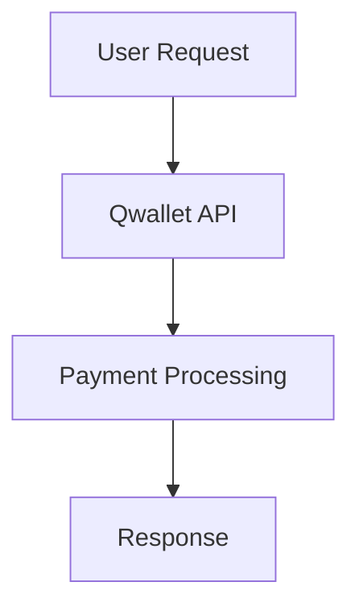

# Q∞ Ecosystem Documentation Style Guide

## Overview

This style guide establishes consistent standards for all documentation within the Q∞ ecosystem. Following these guidelines ensures clarity, maintainability, and professional presentation across all modules and global documentation.

## Table of Contents

- [Document Structure](#document-structure)
- [Metadata Requirements](#metadata-requirements)
- [Writing Style](#writing-style)
- [Formatting Standards](#formatting-standards)
- [Code Examples](#code-examples)
- [Visual Elements](#visual-elements)
- [File Organization](#file-organization)
- [Templates](#templates)

## Document Structure

### Required Sections

All documentation must include these sections in order:

1. **Metadata Header** (YAML front matter)
2. **Title** (H1)
3. **Table of Contents** (for documents >500 words)
4. **Overview** (brief description)
5. **Main Content** (organized with clear headings)
6. **Related Documentation** (links to relevant docs)

### Optional Sections

- **Prerequisites** (for technical guides)
- **Examples** (practical use cases)
- **Troubleshooting** (common issues)
- **FAQ** (frequently asked questions)
- **Changelog** (for versioned documents)

## Metadata Requirements

### Required Fields

Every document must include this YAML front matter:

```yaml
---
version: "1.0.0"
author: "Author Name"
lastModified: "2025-08-30T16:49:09.046Z"
reviewedBy: "Reviewer Name"
module: "module-name | null"
relatedModules: ["module1", "module2"]
ecosystemVersion: "v2.0.0"
lastAudit: "2025-08-30T16:49:09.046Z"
category: "global | module | integration | deployment"
language: "en | es"
completeness: "draft | review | complete"
dependencies: ["dependency1", "dependency2"]
tags: ["tag1", "tag2"]
---
```

### Field Definitions

- **version**: Document version (semantic versioning)
- **author**: Primary document author
- **lastModified**: ISO 8601 timestamp of last modification
- **reviewedBy**: Last reviewer (empty string if not reviewed)
- **module**: Module name or null for global docs
- **relatedModules**: Array of related module names
- **ecosystemVersion**: Current ecosystem version
- **lastAudit**: ISO 8601 timestamp of last audit
- **category**: Document category
- **language**: Document language code
- **completeness**: Document status
- **dependencies**: Array of document dependencies
- **tags**: Array of relevant tags

## Writing Style

### Tone and Voice

- **Professional but approachable**: Technical accuracy with clear explanations
- **Active voice**: Use active voice whenever possible
- **Present tense**: Write in present tense for current functionality
- **Consistent terminology**: Use terms from the official glossary

### Language Guidelines

- **Clarity**: Write for your audience (developers, users, stakeholders)
- **Conciseness**: Be direct and avoid unnecessary words
- **Accessibility**: Use plain language when possible
- **Inclusivity**: Use inclusive language and avoid assumptions

### Terminology Standards

- **Q∞ Ecosystem**: Official name for the complete system
- **Module names**: Always capitalize (Qwallet, Qindex, etc.)
- **API endpoints**: Use backticks for code references
- **File paths**: Use backticks and forward slashes

## Formatting Standards

### Headings

```markdown
# H1 - Document Title (only one per document)
## H2 - Major Sections
### H3 - Subsections
#### H4 - Minor Subsections (avoid deeper nesting)
```

### Lists

**Unordered Lists:**
```markdown
- Use hyphens for bullet points
- Keep items parallel in structure
- Use sub-bullets sparingly
  - Sub-item example
  - Another sub-item
```

**Ordered Lists:**
```markdown
1. Use numbers for sequential steps
2. Start each item with a capital letter
3. End with periods for complete sentences
```

### Links

```markdown
- [Internal links](./relative/path.md) - Use relative paths
- [External links](https://example.com) - Use full URLs
- [Section links](#section-name) - Use lowercase with hyphens
```

### Emphasis

```markdown
- **Bold** for important terms and UI elements
- *Italic* for emphasis and variable names
- `Code` for inline code, filenames, and commands
- ~~Strikethrough~~ for deprecated content
```

## Code Examples

### Code Blocks

````markdown
```javascript
// Always include language identifier
const example = {
  property: 'value',
  method: () => console.log('Hello Q∞')
};
```
````

### API Examples

```markdown
**Request:**
```bash
curl -X POST https://api.q-ecosystem.com/qwallet/payment \
  -H "Content-Type: application/json" \
  -d '{"amount": 100, "currency": "USD"}'
```

**Response:**
```json
{
  "status": "success",
  "transactionId": "tx_123456789",
  "amount": 100,
  "currency": "USD"
}
```
```

### Configuration Examples

```yaml
# Always include comments explaining configuration
qwallet:
  enabled: true
  apiKey: "${QWALLET_API_KEY}"  # Environment variable
  timeout: 30000  # 30 seconds
```

## Visual Elements

### Diagrams

Use Mermaid for all diagrams:

````markdown

````

### Tables

```markdown
| Column 1 | Column 2 | Column 3 |
|----------|----------|----------|
| Value 1  | Value 2  | Value 3  |
| Value 4  | Value 5  | Value 6  |
```

### Callouts

```markdown
> **Note:** Use blockquotes for important information

> **Warning:** Use for potential issues or breaking changes

> **Tip:** Use for helpful suggestions or best practices
```

## File Organization

### Naming Conventions

- **Files**: Use kebab-case (`api-reference.md`)
- **Directories**: Use kebab-case (`user-guides/`)
- **Images**: Use descriptive names (`qwallet-architecture-diagram.png`)

### Directory Structure

```
docs/
├── global/                 # Global ecosystem documentation
│   ├── vision/            # Vision and strategy
│   ├── architecture/      # Technical architecture
│   └── whitepapers/       # Official whitepapers
├── modules/               # Module-specific documentation
│   └── [module-name]/     # Individual module docs
│       ├── README.md      # Module overview
│       ├── api-reference.md
│       ├── integration-guide.md
│       └── troubleshooting.md
├── integration/           # Cross-module integration guides
├── deployment/            # Deployment documentation
└── video-scripts/         # Video script content
    ├── global/           # Ecosystem overview scripts
    └── modules/          # Module-specific scripts
```

## Templates

### Module Documentation Template

```markdown
---
version: "1.0.0"
author: "Module Team"
lastModified: "YYYY-MM-DDTHH:mm:ss.sssZ"
reviewedBy: ""
module: "module-name"
relatedModules: []
ecosystemVersion: "v2.0.0"
lastAudit: "YYYY-MM-DDTHH:mm:ss.sssZ"
category: "module"
language: "en"
completeness: "draft"
dependencies: []
tags: ["module-name"]
---

# Module Name

## Table of Contents

- [Overview](#overview)
- [Key Features](#key-features)
- [Quick Start](#quick-start)
- [Documentation](#documentation)
- [Integration](#integration)

## Overview

Brief description of the module's purpose and role in the Q∞ ecosystem.

## Key Features

- Feature 1: Description
- Feature 2: Description
- Feature 3: Description

## Quick Start

### Prerequisites

- Requirement 1
- Requirement 2

### Installation

```bash
# Installation commands
```

### Basic Usage

```javascript
// Basic usage example
```

## Documentation

- [API Reference](./api-reference.md) - Complete API documentation
- [Integration Guide](./integration-guide.md) - Integration examples
- [Troubleshooting](./troubleshooting.md) - Common issues

## Integration

### With Other Modules

- **Module 1**: Integration description
- **Module 2**: Integration description

### External Systems

- **System 1**: Integration description
- **System 2**: Integration description
```

### API Reference Template

```markdown
---
version: "1.0.0"
author: "API Team"
lastModified: "YYYY-MM-DDTHH:mm:ss.sssZ"
reviewedBy: ""
module: "module-name"
relatedModules: []
ecosystemVersion: "v2.0.0"
lastAudit: "YYYY-MM-DDTHH:mm:ss.sssZ"
category: "module"
language: "en"
completeness: "draft"
dependencies: []
tags: ["api", "reference"]
---

# Module Name API Reference

## Table of Contents

- [Authentication](#authentication)
- [Endpoints](#endpoints)
- [Error Handling](#error-handling)
- [Rate Limiting](#rate-limiting)

## Authentication

Description of authentication method.

## Endpoints

### Endpoint Name

**Method:** `POST`
**URL:** `/api/endpoint`
**Description:** Brief description of what this endpoint does.

#### Request

**Headers:**
```
Content-Type: application/json
Authorization: Bearer {token}
```

**Body:**
```json
{
  "parameter1": "string",
  "parameter2": "number"
}
```

#### Response

**Success (200):**
```json
{
  "status": "success",
  "data": {
    "result": "value"
  }
}
```

**Error (400):**
```json
{
  "status": "error",
  "message": "Error description"
}
```

## Error Handling

Standard error response format and common error codes.

## Rate Limiting

Rate limiting policies and headers.
```

## Validation and Quality Assurance

### Automated Checks

All documentation is validated for:

- **Metadata completeness**: All required fields present
- **Link validity**: Internal and external links work
- **Format consistency**: Follows style guide standards
- **Language quality**: Grammar and spelling checks
- **Code syntax**: Code examples are valid

### Review Process

1. **Author**: Creates/updates documentation
2. **Peer Review**: Technical review by team member
3. **Editorial Review**: Style and clarity review
4. **Approval**: Final approval by module owner
5. **Publication**: Integration into main documentation

### Quality Metrics

- **Completeness**: All required sections present
- **Accuracy**: Technical content is correct
- **Clarity**: Content is understandable by target audience
- **Consistency**: Follows style guide standards
- **Freshness**: Content reflects current system state

## Maintenance and Updates

### Regular Maintenance

- **Monthly audits**: Review for outdated content
- **Quarterly reviews**: Comprehensive style guide compliance
- **Version updates**: Update ecosystem version references
- **Link validation**: Check all internal and external links

### Update Triggers

Documentation must be updated when:

- **API changes**: Endpoint modifications or additions
- **Feature releases**: New functionality or changes
- **Configuration changes**: Environment or setup modifications
- **Integration updates**: Changes to module interactions
- **Security updates**: Security-related modifications

## Tools and Automation

### Validation Tools

- **docs-validator.mjs**: Automated validation script
- **Front-matter linter**: Metadata validation
- **Link checker**: Validates all links
- **Spell checker**: Grammar and spelling validation

### Generation Tools

- **Master index builder**: Generates navigation indices
- **Script generator**: Creates video scripts from documentation
- **Template generator**: Creates new documents from templates

### Integration

- **CI/CD Pipeline**: Automated validation on commits
- **Pre-commit hooks**: Validation before commits
- **Automated updates**: Triggered by code changes
- **Quality reporting**: Regular quality metrics reports

---

*This style guide is a living document. Updates should be proposed through the standard documentation review process.*