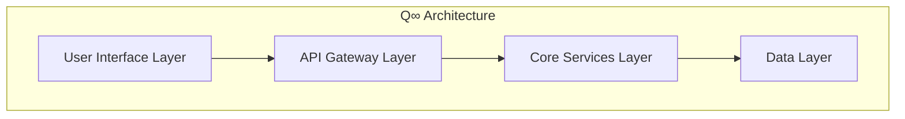

# Visual Asset Management System

The Visual Asset Management System provides unified management of diagrams, design tokens, and visual assets for the AnarQ&Q ecosystem documentation and video scripts.

## Overview

This system includes:

- **Design Tokens**: Unified color palette, typography, spacing, and branding guidelines
- **Asset Library**: Centralized management of logos, icons, diagrams, screenshots, and animations
- **Automated Diagram Generation**: Generate Mermaid diagrams from OpenAPI and MCP specifications
- **IPFS Integration**: Decentralized storage with content-addressed identifiers (CIDs)
- **Script Integration**: Seamless integration with video script generation system

## Directory Structure

```
docs/assets/
├── README.md                    # This file
├── design-tokens.json           # Design system tokens
├── visual-library.json          # Asset library configuration
├── logos/                       # Brand logos and wordmarks
├── icons/                       # Module icons and UI elements
├── screenshots/                 # Interface screenshots and demos
├── animations/                  # Animated graphics and transitions
└── diagrams/                    # Architecture and flow diagrams
    ├── mermaid/                 # Mermaid diagram source files
    ├── excalidraw/              # Excalidraw diagram files
    └── generated/               # Auto-generated diagrams
```

## Design Tokens

The design token system provides consistent styling across all visual assets:

### Color Palette

- **Primary Colors**: Q Blue (#0066CC), Q Purple (#6B46C1), Q Green (#10B981), Q Orange (#F59E0B)
- **Secondary Colors**: Light variants of primary colors
- **Neutral Colors**: Grayscale from white to black
- **Status Colors**: Success, warning, error, and info indicators

### Typography

- **Primary Font**: Inter (system-ui fallback)
- **Monospace Font**: JetBrains Mono (Consolas fallback)
- **Display Font**: Inter Display (Inter fallback)

### Module Branding

Each of the 14 ecosystem modules has dedicated branding:

| Module | Color | Icon |
|--------|-------|------|
| sQuid | #0066CC | squid-icon.svg |
| Qlock | #6B46C1 | qlock-icon.svg |
| Qonsent | #10B981 | qonsent-icon.svg |
| Qindex | #F59E0B | qindex-icon.svg |
| Qwallet | #3B82F6 | qwallet-icon.svg |
| Qerberos | #8B5CF6 | qerberos-icon.svg |
| Qmask | #34D399 | qmask-icon.svg |
| Qdrive | #FBBF24 | qdrive-icon.svg |
| QpiC | #EF4444 | qpic-icon.svg |
| Qmarket | #06B6D4 | qmarket-icon.svg |
| Qmail | #8B5A2B | qmail-icon.svg |
| Qchat | #EC4899 | qchat-icon.svg |
| QNET | #84CC16 | qnet-icon.svg |
| DAO | #F97316 | dao-icon.svg |

## Asset Management

### Asset Categories

1. **Logos**: Brand logos, wordmarks, and variations
2. **Icons**: Module icons, UI elements, and symbols
3. **Diagrams**: Architecture diagrams, flowcharts, and technical illustrations
4. **Screenshots**: Interface captures, demos, and walkthroughs
5. **Animations**: Animated graphics, transitions, and motion graphics

### Naming Convention

Assets follow the pattern: `{category}-{module}-{type}-{version}`

Examples:
- `diagram-qwallet-architecture-v1.mermaid`
- `icon-squid-primary-v2.svg`
- `screenshot-qmarket-interface-v1.png`

### Metadata Schema

Each asset includes comprehensive metadata:

```json
{
  "id": "unique-asset-id",
  "name": "asset-name",
  "path": "relative/path/to/asset",
  "type": "vector|raster|diagram",
  "format": "svg|png|jpg|mermaid|excalidraw",
  "size": 12345,
  "hash": "sha256-hash",
  "created": "2025-01-30T00:00:00.000Z",
  "modified": "2025-01-30T00:00:00.000Z",
  "metadata": {
    "dimensions": { "width": 800, "height": 600 },
    "description": "Asset description",
    "author": "Creator name",
    "version": "1.0.0",
    "module": "qwallet",
    "category": "diagrams"
  },
  "ipfsCid": "QmHash...",
  "tags": ["qwallet", "architecture", "diagram"]
}
```

## Automated Diagram Generation

The system automatically generates diagrams from specifications:

### OpenAPI Diagrams

Scans for OpenAPI specifications and generates visual API documentation:

```bash
# Scan for OpenAPI specs
npm run diagrams:scan

# Generate all diagrams
npm run diagrams:generate

# Generate specific OpenAPI diagram
npm run assets:generate-openapi modules/qwallet/openapi.yaml qwallet-api
```

### MCP Diagrams

Generates diagrams from Model Context Protocol configurations:

```bash
# Generate MCP diagram
npm run assets:generate-mcp .kiro/settings/mcp.json ecosystem-mcp
```

### Supported Specifications

- **OpenAPI 3.0+**: Complete API documentation with endpoints, schemas, and responses
- **MCP Configuration**: Tool definitions, server configurations, and parameters
- **JSON Schema**: Data model definitions and validation rules

## Mermaid Templates

Pre-built templates for common diagram types:

### Architecture Template


### Ecosystem Template
```mermaid
graph TB
    subgraph "AnarQ&Q Ecosystem"
        SQUID[sQuid Identity]
        QWALLET[Qwallet]
        QMARKET[Qmarket]
        // ... other modules
    end
    
    SQUID --> QWALLET
    QWALLET --> QMARKET
    // ... connections
```

## IPFS Integration

Assets are stored on IPFS for decentralized access:

### Content Addressing

- **CID Format**: `cid://QmHash...`
- **Gateway**: `https://ipfs.io/ipfs/`
- **Pinning Service**: Pinata for persistence

### Asset References

Video scripts and documentation reference assets by CID:

```markdown

```

## Video Script Integration

The asset management system integrates with video script generation:

### Asset Manifests

Each script type gets a customized asset manifest:

```json
{
  "type": "global|module",
  "module": "qwallet",
  "assets": {
    "logos": [...],
    "icons": [...],
    "diagrams": [...],
    "screenshots": [...],
    "animations": [...]
  },
  "designTokens": { ... },
  "generatedAt": "2025-01-30T00:00:00.000Z"
}
```

### Shot Lists

Standardized shot lists for video production:

#### Global Script Shots
1. Wide shot: Digital landscape with centralized towers
2. Close-up: User frustrated with privacy settings
3. Animation: AnarQ&Q logo reveal with ecosystem modules
4. Montage: Data harvesting visualization
5. Animation: Q∞ architecture layers

#### Module Script Shots
1. Animation: Module logo and branding
2. Screen recording: Module interface overview
3. Diagram: Module in ecosystem context
4. Screen recording: Feature demonstrations
5. Animation: Cross-module workflows

## Usage Examples

### Basic Asset Management

```bash
# Scan existing assets
npm run assets:scan

# Create a new Mermaid diagram
npm run assets:create-diagram "qwallet-flow" "graph TD\nA-->B"

# Test the system
npm run assets:test
```

### Integration with Scripts

```javascript
import { VisualAssetManager } from './scripts/VisualAssetManager.mjs';

const manager = new VisualAssetManager();
await manager.init();

// Search for assets
const qwalletAssets = manager.searchAssets({ module: 'qwallet' });

// Generate asset manifest
const manifest = manager.generateAssetManifest('module', 'qwallet');

// Get design tokens
const colors = manager.designTokens.colors.primary;
```

### Automated Generation

```javascript
import { AutomatedDiagramGenerator } from './scripts/AutomatedDiagramGenerator.mjs';

const generator = new AutomatedDiagramGenerator();
await generator.init();

// Generate all diagrams from specs
await generator.generateAllDiagrams();

// Get generation report
const report = generator.generateReport();
```

## Quality Standards

### Asset Requirements

- **Vector Graphics**: SVG format with embedded metadata
- **Raster Images**: PNG/WebP with appropriate compression
- **Diagrams**: Mermaid or Excalidraw with source preservation
- **Icons**: 64x64px minimum, scalable vector preferred
- **Screenshots**: 1200x800px minimum, consistent styling

### Validation

The system includes comprehensive validation:

- **Format Validation**: Ensures proper file formats
- **Metadata Validation**: Verifies required metadata fields
- **Naming Validation**: Enforces naming conventions
- **Content Validation**: Checks for completeness and quality
- **Link Validation**: Verifies asset references and CIDs

## Maintenance

### Regular Tasks

1. **Asset Audit**: Monthly review of asset completeness and quality
2. **IPFS Pinning**: Ensure all assets are properly pinned
3. **Metadata Updates**: Keep asset metadata current
4. **Template Updates**: Refresh diagram templates as needed
5. **Integration Testing**: Verify script generation integration

### Monitoring

Key metrics tracked:

- **Asset Coverage**: Percentage of modules with complete asset sets
- **Quality Score**: Average asset quality rating
- **IPFS Health**: Percentage of assets with valid CIDs
- **Generation Success**: Automated diagram generation success rate
- **Integration Status**: Script generation system integration health

## Troubleshooting

### Common Issues

1. **Missing Assets**: Run `npm run assets:scan` to refresh asset registry
2. **Broken CIDs**: Check IPFS gateway connectivity and re-pin assets
3. **Generation Failures**: Verify OpenAPI/MCP specification validity
4. **Integration Errors**: Run `npm run assets:test` for diagnostic information

### Support

For issues with the visual asset management system:

1. Check the test suite: `npm run assets:test`
2. Review error logs in console output
3. Verify file permissions and directory structure
4. Consult the integration documentation

---

*This system is part of the AnarQ&Q ecosystem documentation infrastructure.*
*For more information, see the main documentation at `/docs/README.md`.*