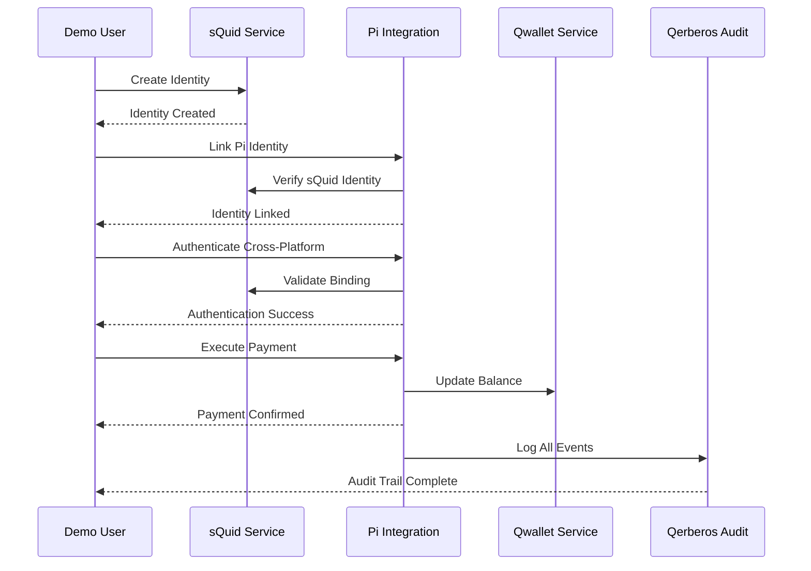
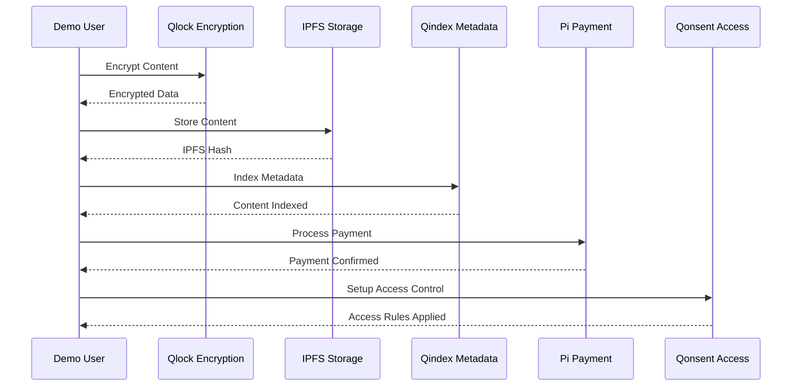
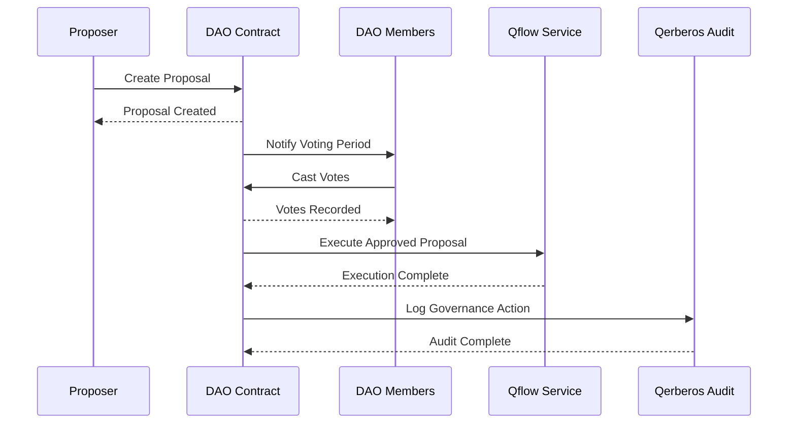

# Demo Expected Results

## Overview

This document defines the expected results and success criteria for each demo scenario in the AnarQ&Q ecosystem. These benchmarks ensure consistent performance and validate system functionality across different environments.

## Success Criteria Summary

### Performance Gates
- **P95 latency**: < 150ms for API calls
- **P99 latency**: < 200ms for API calls
- **Error burn-rate**: < 10%
- **Cache hit rate**: ≥ 85%

### Quality Gates
- **100% chain continuity** in execution ledger
- **Deterministic replay divergence**: < 1%
- **Consensus quorum**: 3/5 with <1m recovery
- **All demo scenarios complete**: ≤30s

### Security Requirements
- **No PII** in demo datasets (scanner validation)
- **WASM no-egress** sandbox enforcement
- **Pi keys vault/env-encrypted**, never committed
- **All outputs signed** by Qerberos with audit CID

## Scenario 1: Identity Flow Demo

### Expected Execution Flow



### Expected Results

#### Step 1: sQuid Identity Creation
```json
{
  "status": "success",
  "squidId": "squid-demo-alice-001",
  "publicKey": "demo-public-key-alice",
  "createdAt": "2024-01-01T10:00:00.000Z",
  "metadata": {
    "demoUser": true,
    "scenario": "identity-flow"
  }
}
```

#### Step 2: Pi Identity Linking
```json
{
  "status": "success",
  "bindingId": "binding_squid-demo-alice-001_pi-demo-alice-001",
  "squidId": "squid-demo-alice-001",
  "piUserId": "pi-demo-alice-001",
  "verificationStatus": "verified",
  "bindingHash": "a1b2c3d4e5f6...",
  "timestamp": "2024-01-01T10:01:00.000Z"
}
```

#### Step 3: Cross-Platform Authentication
```json
{
  "authenticated": true,
  "sessionToken": "eyJhbGciOiJIUzI1NiIsInR5cCI6IkpXVCJ9...",
  "binding": {
    "squidId": "squid-demo-alice-001",
    "piUserId": "pi-demo-alice-001"
  },
  "permissions": [
    "pi:wallet:read",
    "pi:wallet:transfer",
    "squid:identity:link"
  ]
}
```

#### Step 4: Pi Wallet Transaction
```json
{
  "success": true,
  "paymentId": "pi-payment-123456",
  "transactionHash": "0xabcdef123456...",
  "amount": 1.0,
  "recipient": "demo-recipient-address",
  "status": "confirmed",
  "blockNumber": 12345,
  "timestamp": "2024-01-01T10:02:00.000Z"
}
```

#### Step 5: Audit Trail Verification
```json
{
  "auditTrail": [
    {
      "eventType": "squid_identity_created",
      "squidId": "squid-demo-alice-001",
      "timestamp": "2024-01-01T10:00:00.000Z",
      "auditCid": "QmAudit1..."
    },
    {
      "eventType": "pi_identity_linked",
      "squidId": "squid-demo-alice-001",
      "piUserId": "pi-demo-alice-001",
      "timestamp": "2024-01-01T10:01:00.000Z",
      "auditCid": "QmAudit2..."
    },
    {
      "eventType": "pi_payment_completed",
      "paymentId": "pi-payment-123456",
      "amount": 1.0,
      "timestamp": "2024-01-01T10:02:00.000Z",
      "auditCid": "QmAudit3..."
    }
  ],
  "chainContinuity": true,
  "totalEvents": 3
}
```

### Performance Expectations

| Metric | Expected Value | Maximum Allowed |
|--------|---------------|-----------------|
| Total Duration | 15-25 seconds | 60 seconds |
| sQuid Creation | 2-3 seconds | 10 seconds |
| Pi Linking | 5-8 seconds | 20 seconds |
| Authentication | 1-2 seconds | 5 seconds |
| Payment Execution | 5-10 seconds | 20 seconds |
| Audit Verification | 2-3 seconds | 5 seconds |

## Scenario 2: Content Flow Demo

### Expected Execution Flow



### Expected Results

#### Step 1: Content Upload and Processing
```json
{
  "success": true,
  "contentId": "content-demo-001",
  "originalSize": 2048,
  "processedSize": 1856,
  "encryptionKey": "encrypted-key-hash",
  "contentHash": "sha256:abc123...",
  "contentType": "text/markdown"
}
```

#### Step 2: IPFS Storage
```json
{
  "success": true,
  "ipfsHash": "QmContent123...",
  "size": 1856,
  "url": "https://ipfs.io/ipfs/QmContent123...",
  "pinned": true,
  "timestamp": "2024-01-01T10:05:00.000Z"
}
```

#### Step 3: Content Indexing
```json
{
  "success": true,
  "contentId": "content-demo-001",
  "indexId": "index-123456",
  "searchable": true,
  "metadata": {
    "title": "Demo Document: AnarQ&Q Overview",
    "tags": ["demo", "content-flow", "markdown"],
    "uploader": "squid-demo-bob-002",
    "visibility": "public"
  }
}
```

#### Step 4: Pi Storage Payment
```json
{
  "success": true,
  "paymentId": "pi-storage-payment-789",
  "transactionHash": "0xstorage123...",
  "amount": 0.365,
  "storageDuration": 365,
  "status": "confirmed"
}
```

#### Step 5: Access Control Setup
```json
{
  "success": true,
  "accessRules": [
    {
      "ruleId": "rule-owner-001",
      "principal": "squid-demo-bob-002",
      "permissions": ["read", "write", "delete", "share"],
      "type": "owner"
    },
    {
      "ruleId": "rule-public-001",
      "principal": "*",
      "permissions": ["read"],
      "type": "public"
    }
  ]
}
```

### Performance Expectations

| Metric | Expected Value | Maximum Allowed |
|--------|---------------|-----------------|
| Total Duration | 20-35 seconds | 90 seconds |
| Content Processing | 3-5 seconds | 15 seconds |
| IPFS Storage | 5-10 seconds | 30 seconds |
| Content Indexing | 2-4 seconds | 10 seconds |
| Payment Processing | 5-10 seconds | 20 seconds |
| Access Control | 2-3 seconds | 10 seconds |

## Scenario 3: DAO Governance Flow Demo

### Expected Execution Flow



### Expected Results

#### Step 1: Proposal Creation
```json
{
  "success": true,
  "proposalId": "1",
  "contractAddress": "0xDAOContract123...",
  "transactionHash": "0xproposal123...",
  "title": "Demo Proposal: System Upgrade",
  "proposer": "squid-demo-charlie-003",
  "qflowWorkflowId": "demo-system-upgrade-workflow",
  "votingDeadline": "2024-01-08T10:00:00.000Z"
}
```

#### Step 2: Voting Process
```json
{
  "success": true,
  "proposalId": "1",
  "votes": [
    {
      "voter": "squid-demo-alice-001",
      "support": true,
      "votingPower": 100,
      "timestamp": "2024-01-01T10:10:00.000Z"
    },
    {
      "voter": "squid-demo-bob-002",
      "support": true,
      "votingPower": 150,
      "timestamp": "2024-01-01T10:11:00.000Z"
    },
    {
      "voter": "squid-demo-charlie-003",
      "support": false,
      "votingPower": 75,
      "timestamp": "2024-01-01T10:12:00.000Z"
    }
  ],
  "totalVotesFor": 250,
  "totalVotesAgainst": 75,
  "quorumReached": true,
  "approved": true
}
```

#### Step 3: Proposal Execution
```json
{
  "success": true,
  "contractExecutionTxHash": "0xexecution123...",
  "qflowExecutionId": "qflow-exec-456",
  "status": "executed",
  "timestamp": "2024-01-01T10:15:00.000Z"
}
```

#### Step 4: Governance Audit
```json
{
  "auditTrail": [
    {
      "eventType": "dao_proposal_created",
      "proposalId": "1",
      "proposer": "squid-demo-charlie-003",
      "timestamp": "2024-01-01T10:08:00.000Z",
      "auditCid": "QmDAOAudit1..."
    },
    {
      "eventType": "dao_vote_cast",
      "proposalId": "1",
      "voter": "squid-demo-alice-001",
      "support": true,
      "timestamp": "2024-01-01T10:10:00.000Z",
      "auditCid": "QmDAOAudit2..."
    },
    {
      "eventType": "dao_proposal_executed",
      "proposalId": "1",
      "executionTxHash": "0xexecution123...",
      "timestamp": "2024-01-01T10:15:00.000Z",
      "auditCid": "QmDAOAudit3..."
    }
  ],
  "governanceIntegrity": true,
  "consensusValid": true
}
```

### Performance Expectations

| Metric | Expected Value | Maximum Allowed |
|--------|---------------|-----------------|
| Total Duration | 25-40 seconds | 120 seconds |
| Proposal Creation | 5-8 seconds | 20 seconds |
| Voting Simulation | 8-12 seconds | 30 seconds |
| Proposal Execution | 8-15 seconds | 45 seconds |
| Audit Verification | 3-5 seconds | 15 seconds |

## System-Wide Performance Metrics

### Resource Usage Expectations

| Resource | Normal Range | Warning Threshold | Critical Threshold |
|----------|-------------|-------------------|-------------------|
| CPU Usage | 10-30% | 70% | 90% |
| Memory Usage | 2-4 GB | 6 GB | 8 GB |
| Disk I/O | 10-50 MB/s | 200 MB/s | 500 MB/s |
| Network I/O | 1-10 MB/s | 50 MB/s | 100 MB/s |

### Service Response Times

| Service | Expected Response | Warning Threshold | Error Threshold |
|---------|------------------|-------------------|-----------------|
| Backend API | 50-100ms | 500ms | 1000ms |
| IPFS Gateway | 100-300ms | 1000ms | 3000ms |
| Database Queries | 10-50ms | 200ms | 500ms |
| Pi Network API | 200-500ms | 2000ms | 5000ms |

## Error Handling Expectations

### Acceptable Error Rates

| Component | Normal Error Rate | Warning Threshold | Critical Threshold |
|-----------|------------------|-------------------|-------------------|
| API Endpoints | 0-1% | 5% | 10% |
| IPFS Operations | 0-2% | 8% | 15% |
| Pi Transactions | 0-3% | 10% | 20% |
| Database Operations | 0-0.5% | 2% | 5% |

### Recovery Expectations

| Failure Type | Expected Recovery Time | Maximum Recovery Time |
|--------------|----------------------|----------------------|
| Service Restart | 10-30 seconds | 60 seconds |
| Database Reconnection | 5-15 seconds | 30 seconds |
| IPFS Node Recovery | 30-60 seconds | 180 seconds |
| Pi Network Reconnection | 60-120 seconds | 300 seconds |

## Data Integrity Validation

### Blockchain Integrity

```json
{
  "chainContinuity": {
    "expected": true,
    "tolerance": 0,
    "description": "100% chain continuity required"
  },
  "deterministicReplay": {
    "maxDivergence": 1,
    "unit": "percent",
    "description": "Replay divergence must be < 1%"
  },
  "consensusQuorum": {
    "required": 3,
    "total": 5,
    "recoveryTime": 60,
    "unit": "seconds"
  }
}
```

### Data Validation

```json
{
  "encryptionIntegrity": {
    "expected": true,
    "tolerance": 0,
    "description": "All content must be properly encrypted"
  },
  "ipfsVerification": {
    "expected": true,
    "tolerance": 0,
    "description": "All IPFS hashes must be retrievable"
  },
  "auditTrailCompleteness": {
    "expected": 100,
    "unit": "percent",
    "description": "All operations must be audited"
  }
}
```

## Security Validation

### PII Scanner Results

```json
{
  "piiScanResults": {
    "filesScanned": 150,
    "piiDetected": 0,
    "falsePositives": 0,
    "scanDuration": "5.2s",
    "status": "PASS"
  }
}
```

### Sandbox Security

```json
{
  "wasmSandbox": {
    "egressBlocked": true,
    "capabilityEnforcement": true,
    "unauthorizedAccess": 0,
    "status": "SECURE"
  }
}
```

### Key Management

```json
{
  "keyManagement": {
    "piKeysEncrypted": true,
    "keysInRepository": 0,
    "vaultIntegration": true,
    "status": "SECURE"
  }
}
```

## Certification Requirements

### Decentralization Certification

```json
{
  "decentralizationAttestation": {
    "noCentralDatabases": true,
    "noMessageBrokers": true,
    "ipfsRequired": true,
    "libp2pActive": true,
    "killFirstLauncherTest": "PASS",
    "attestationCID": "QmDecentralization123...",
    "status": "CERTIFIED"
  }
}
```

### Integrity Report

```json
{
  "integrityReport": {
    "ecosystemHealth": "HEALTHY",
    "moduleIntegrity": "VERIFIED",
    "dataFlowIntegrity": "VERIFIED",
    "piIntegration": "VERIFIED",
    "reportCID": "QmIntegrityReport456...",
    "timestamp": "2024-01-01T10:30:00.000Z",
    "status": "CERTIFIED"
  }
}
```

## Validation Scripts

### Automated Result Validation

```javascript
// Expected result validation function
function validateDemoResults(actualResults, scenario) {
  const expectations = getExpectedResults(scenario);
  const validation = {
    passed: true,
    errors: [],
    warnings: [],
    metrics: {}
  };
  
  // Validate performance metrics
  if (actualResults.duration > expectations.maxDuration) {
    validation.errors.push(`Duration exceeded: ${actualResults.duration}s > ${expectations.maxDuration}s`);
    validation.passed = false;
  }
  
  // Validate success criteria
  if (actualResults.metrics.successful_steps !== actualResults.metrics.total_steps) {
    validation.errors.push(`Not all steps completed: ${actualResults.metrics.successful_steps}/${actualResults.metrics.total_steps}`);
    validation.passed = false;
  }
  
  // Validate data integrity
  if (!validateDataIntegrity(actualResults)) {
    validation.errors.push('Data integrity validation failed');
    validation.passed = false;
  }
  
  return validation;
}
```

### Performance Benchmark Validation

```javascript
// Performance benchmark validation
function validatePerformanceBenchmarks(metrics) {
  const benchmarks = {
    p95Latency: 150, // ms
    p99Latency: 200, // ms
    errorRate: 10,   // %
    cacheHitRate: 85 // %
  };
  
  const results = {};
  
  Object.entries(benchmarks).forEach(([metric, threshold]) => {
    const actual = metrics[metric];
    const passed = metric === 'errorRate' ? actual <= threshold : actual >= threshold;
    
    results[metric] = {
      expected: threshold,
      actual: actual,
      passed: passed,
      status: passed ? 'PASS' : 'FAIL'
    };
  });
  
  return results;
}
```

## Troubleshooting Guide

### Performance Issues

1. **Slow Response Times**
   - Check system resource usage
   - Verify database connection pool
   - Monitor IPFS node performance
   - Check Pi Network API latency

2. **High Error Rates**
   - Review service logs for error patterns
   - Check network connectivity
   - Verify service dependencies
   - Monitor resource exhaustion

### Data Integrity Issues

1. **Chain Continuity Failures**
   - Verify Qerberos audit service
   - Check execution ledger consistency
   - Validate hash chain integrity

2. **IPFS Retrieval Failures**
   - Check IPFS node connectivity
   - Verify content pinning status
   - Test gateway accessibility

### Security Validation Failures

1. **PII Detection**
   - Review demo data generation
   - Check data sanitization processes
   - Verify anonymization functions

2. **Sandbox Violations**
   - Review WASM execution logs
   - Check capability enforcement
   - Verify egress blocking

## Continuous Monitoring

### Real-time Metrics Dashboard

The demo environment should maintain real-time monitoring of:

- **System Performance**: CPU, memory, disk, network usage
- **Service Health**: Response times, error rates, availability
- **Demo Execution**: Scenario success rates, performance trends
- **Security Status**: PII scans, sandbox integrity, key management

### Alerting Thresholds

Configure alerts for:

- **Performance degradation** beyond warning thresholds
- **Error rates** exceeding acceptable limits
- **Security violations** or policy breaches
- **Demo failures** or timeout conditions

This comprehensive expected results framework ensures consistent, reliable demo execution and provides clear success criteria for validating the AnarQ&Q ecosystem functionality.