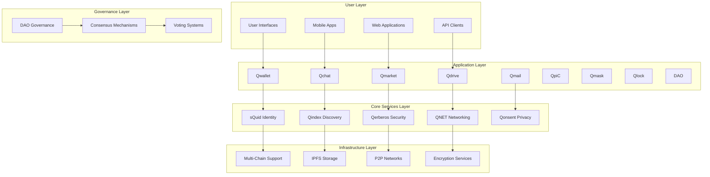

# Q∞ (Q-Infinity) Architecture

## Introduction

The Q∞ (Q-Infinity) architecture is the foundational framework that powers the entire AnarQ&Q ecosystem. This document provides a comprehensive technical overview of the architecture, its components, design principles, and implementation details.

## Architecture Overview

### Core Principles

The Q∞ architecture is built on five fundamental principles:

1. **Infinite Scalability**: Horizontal scaling across multiple chains and networks
2. **Universal Interoperability**: Seamless communication between all components
3. **Modular Composability**: Independent modules that work together seamlessly
4. **Self-Sovereign Identity**: User-controlled identity across all services
5. **Decentralized Governance**: Community-driven decision making

### High-Level Architecture

## Core Components

### 1. Identity Layer (sQuid)

**Purpose**: Self-sovereign identity management across the entire ecosystem

**Key Features**:
- Decentralized identity (DID) creation and management
- Cross-chain identity verification
- Zero-knowledge proof authentication
- Biometric integration support
- Multi-factor authentication

**Technical Implementation**:
- W3C DID standard compliance
- Ed25519 cryptographic signatures
- IPFS-based identity document storage
- Smart contract identity registry
- OAuth 2.0 and OpenID Connect compatibility

### 2. Discovery Layer (Qindex)

**Purpose**: Decentralized indexing and discovery of ecosystem resources

**Key Features**:
- Module and service discovery
- Content indexing and search
- Reputation and trust scoring
- Performance metrics tracking
- Load balancing and routing

**Technical Implementation**:
- Distributed hash table (DHT) for indexing
- GraphQL API for complex queries
- Real-time event streaming
- Caching layer for performance
- Machine learning for relevance scoring

### 3. Security Layer (Qerberos)

**Purpose**: Comprehensive security and access control management

**Key Features**:
- Role-based access control (RBAC)
- Attribute-based access control (ABAC)
- Multi-signature authentication
- Audit logging and compliance
- Threat detection and response

**Technical Implementation**:
- Zero-trust security model
- Hardware security module (HSM) integration
- Advanced encryption standard (AES-256)
- Public key infrastructure (PKI)
- Security information and event management (SIEM)

### 4. Networking Layer (QNET)

**Purpose**: Decentralized networking and communication infrastructure

**Key Features**:
- Peer-to-peer networking
- Content delivery network (CDN)
- Load balancing and failover
- Network topology optimization
- Bandwidth management

**Technical Implementation**:
- libp2p networking stack
- WebRTC for browser connectivity
- QUIC protocol for performance
- Network address translation (NAT) traversal
- Quality of service (QoS) management

### 5. Privacy Layer (Qonsent)

**Purpose**: Granular consent and privacy management

**Key Features**:
- Granular consent management
- Data usage tracking
- Privacy policy enforcement
- GDPR/CCPA compliance
- Data anonymization

**Technical Implementation**:
- Consent receipts and proofs
- Homomorphic encryption
- Differential privacy
- Secure multi-party computation
- Privacy-preserving analytics

## Module Integration Patterns

### 1. Service Mesh Architecture

All modules communicate through a service mesh that provides:
- Service discovery and registration
- Load balancing and failover
- Circuit breaker patterns
- Distributed tracing
- Security policy enforcement

### 2. Event-Driven Architecture

Modules communicate through an event-driven system:
- Asynchronous message passing
- Event sourcing for state management
- CQRS (Command Query Responsibility Segregation)
- Event replay and recovery
- Real-time event streaming

### 3. API Gateway Pattern

Unified API access through gateway:
- Request routing and transformation
- Rate limiting and throttling
- Authentication and authorization
- API versioning and deprecation
- Analytics and monitoring

## Data Architecture

### 1. Multi-Chain Data Management

**Blockchain Integration**:
- Ethereum for smart contracts
- Polygon for scalability
- Solana for high throughput
- Cosmos for interoperability
- Custom chains for specific use cases

**Data Distribution**:
- On-chain: Critical state and transactions
- IPFS: Content and document storage
- Local: Cached and temporary data
- Encrypted: Sensitive user data

### 2. Storage Patterns

**Hierarchical Storage**:
- Hot storage: Frequently accessed data
- Warm storage: Occasionally accessed data
- Cold storage: Archive and backup data
- Distributed storage: Redundancy and availability

**Data Consistency**:
- Eventual consistency for distributed data
- Strong consistency for critical operations
- Conflict resolution strategies
- Data synchronization protocols

## Security Architecture

### 1. Defense in Depth

**Multiple Security Layers**:
- Network security (firewalls, VPNs)
- Application security (input validation, OWASP)
- Data security (encryption, access controls)
- Identity security (authentication, authorization)
- Infrastructure security (hardening, monitoring)

### 2. Zero-Trust Model

**Core Principles**:
- Never trust, always verify
- Least privilege access
- Assume breach mentality
- Continuous monitoring
- Risk-based authentication

### 3. Cryptographic Standards

**Encryption Algorithms**:
- AES-256 for symmetric encryption
- RSA-4096 for asymmetric encryption
- Ed25519 for digital signatures
- SHA-256 for hashing
- Argon2 for password hashing

## Performance and Scalability

### 1. Horizontal Scaling

**Scaling Strategies**:
- Microservices architecture
- Container orchestration (Kubernetes)
- Auto-scaling based on demand
- Geographic distribution
- Edge computing integration

### 2. Performance Optimization

**Optimization Techniques**:
- Caching at multiple layers
- Database query optimization
- Content delivery networks
- Lazy loading and pagination
- Compression and minification

### 3. Monitoring and Observability

**Monitoring Stack**:
- Metrics collection (Prometheus)
- Log aggregation (ELK stack)
- Distributed tracing (Jaeger)
- Application performance monitoring
- Real-time alerting and notifications

## Interoperability Framework

### 1. Cross-Chain Communication

**Bridge Protocols**:
- Atomic swaps for asset exchange
- Cross-chain message passing
- State synchronization
- Multi-signature validation
- Rollback and recovery mechanisms

### 2. Protocol Compatibility

**Standard Compliance**:
- W3C standards (DID, VC, WebAuthn)
- IETF protocols (HTTP/3, QUIC, WebRTC)
- Blockchain standards (EIP, BIP)
- API standards (OpenAPI, GraphQL)
- Security standards (OAuth 2.0, SAML)

## Governance Architecture

### 1. DAO Structure

**Governance Components**:
- Proposal creation and voting
- Multi-signature execution
- Delegation and representation
- Quorum and consensus rules
- Upgrade and migration procedures

### 2. Decision Making Process

**Governance Flow**:
1. Proposal submission and validation
2. Community discussion and feedback
3. Formal voting period
4. Execution and implementation
5. Monitoring and evaluation

## Development and Deployment

### 1. Development Workflow

**CI/CD Pipeline**:
- Automated testing and validation
- Code quality and security scanning
- Containerization and packaging
- Staging and production deployment
- Rollback and recovery procedures

### 2. Infrastructure as Code

**Deployment Automation**:
- Terraform for infrastructure provisioning
- Ansible for configuration management
- Docker for containerization
- Kubernetes for orchestration
- Helm for package management

## Future Roadmap

### Phase 1: Foundation (Current)
- Core module development and integration
- Basic interoperability between modules
- Security and identity framework
- Developer tools and documentation

### Phase 2: Expansion (6-12 months)
- Advanced cross-chain integration
- Enhanced privacy features
- Performance optimization
- Enterprise features and compliance

### Phase 3: Maturation (1-2 years)
- Full ecosystem interoperability
- Advanced governance features
- AI/ML integration
- Global scaling and optimization

### Phase 4: Innovation (2+ years)
- Quantum-resistant cryptography
- Advanced privacy technologies
- Next-generation consensus mechanisms
- Ecosystem expansion and partnerships

## Conclusion

The Q∞ architecture represents a comprehensive approach to building decentralized digital infrastructure. By combining proven technologies with innovative design patterns, it provides a solid foundation for the AnarQ&Q ecosystem while maintaining the flexibility to evolve and adapt to future requirements.

The architecture's modular design ensures that each component can be developed, deployed, and scaled independently while maintaining seamless integration with the broader ecosystem. This approach enables rapid innovation while ensuring system stability and reliability.

---

*This document is part of the AnarQ&Q ecosystem documentation. For implementation details, see individual module documentation. For vision and strategy, see the Vision Overview documentation.*