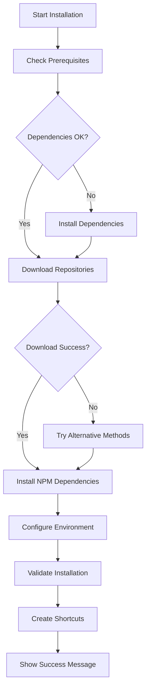

# AnarQ&Q Installer Documentation

Complete documentation for the AnarQ&Q robust installer system.

## Overview

The AnarQ&Q installer is a robust, cross-platform installation system designed to provide reliable, user-friendly installation of the AnarQ&Q ecosystem across different environments with comprehensive error recovery and fallback mechanisms.

## Documentation Index

### User Guides

- **[Installation Guides](INSTALLATION_GUIDES.md)** - Comprehensive installation guides for different user scenarios and platforms
  - Quick Start Guide
  - Installation Scenarios (Developer, Demo, Production, Educational)
  - Platform-Specific Guides (Linux, macOS, Windows WSL)
  - Advanced Installation Options
  - Post-Installation Setup

- **[Troubleshooting Guide](TROUBLESHOOTING.md)** - Detailed troubleshooting information for common issues
  - Quick Diagnostics
  - Common Issues and Solutions
  - Platform-Specific Issues
  - Network and Dependency Issues
  - Advanced Troubleshooting

### Technical Documentation

- **[Testing Framework](../../tests/installer/README.md)** - Comprehensive testing suite documentation
  - Unit Tests for individual functions
  - Integration Tests for complete flows
  - Platform Tests for cross-platform compatibility
  - Test Runner and Reporting

- **[Requirements Specification](../../.kiro/specs/robust-installer-system/requirements.md)** - Detailed requirements document
  - User Stories and Acceptance Criteria
  - System Requirements
  - Functional Requirements

- **[Design Document](../../.kiro/specs/robust-installer-system/design.md)** - Technical design and architecture
  - System Architecture
  - Component Design
  - Data Models
  - Error Handling Strategy

- **[Implementation Tasks](../../.kiro/specs/robust-installer-system/tasks.md)** - Implementation plan and progress
  - Task Breakdown
  - Implementation Status
  - Requirements Mapping

## Quick Reference

### Installation Commands

```bash
# One-command installation
curl -fsSL https://raw.githubusercontent.com/AnarQorp/anarqq-ecosystem-demo/main/install-anarqq-robust-enhanced.sh | bash

# Download and run locally
wget https://raw.githubusercontent.com/AnarQorp/anarqq-ecosystem-demo/main/install-anarqq-robust-enhanced.sh
chmod +x install-anarqq-robust-enhanced.sh
./install-anarqq-robust-enhanced.sh
```

### Testing Commands

```bash
# Run all tests
./tests/installer/run-all-tests.sh

# Run specific test categories
./tests/installer/run-all-tests.sh unit
./tests/installer/run-all-tests.sh integration
./tests/installer/run-all-tests.sh platform
```

### Common Troubleshooting

```bash
# Check system requirements
command -v curl && echo "✅ curl" || echo "❌ curl missing"
command -v git && echo "✅ git" || echo "❌ git missing"
command -v node && echo "✅ node" || echo "❌ node missing"
node --version  # Should be >= 16.0.0

# Check installation
cd ~/anarqq-ecosystem/demo
npm start
```

## Features

### Robust Installation
- ✅ **Multi-method Downloads** - Git clone, cURL, wget with automatic fallback
- ✅ **Dependency Management** - Automatic detection and installation of system dependencies
- ✅ **Error Recovery** - Comprehensive error handling with retry mechanisms
- ✅ **Cross-Platform** - Support for Linux, macOS, and Windows WSL

### User Experience
- ✅ **Interactive Interface** - Clear prompts and progress indicators
- ✅ **Multiple Installation Modes** - Demo, development, and production configurations
- ✅ **Comprehensive Logging** - Detailed logs for troubleshooting
- ✅ **Post-Installation Validation** - Automatic verification of installation

### Testing and Quality
- ✅ **Comprehensive Test Suite** - Unit, integration, and platform tests
- ✅ **Continuous Integration** - Automated testing across platforms
- ✅ **Documentation** - Complete user and technical documentation
- ✅ **Troubleshooting Support** - Detailed guides and error resolution

## System Requirements

### Minimum Requirements
- **Operating System:** Linux, macOS, or Windows with WSL
- **Disk Space:** 2GB free space
- **Memory:** 1GB RAM
- **Network:** Internet connection for downloads

### Recommended Requirements
- **Node.js:** Version 16.0.0 or later
- **NPM:** Version 8.0.0 or later
- **Git:** Version 2.0.0 or later
- **System Tools:** curl, wget, unzip

### Supported Platforms

| Platform | Status | Notes |
|----------|--------|-------|
| Ubuntu 18.04+ | ✅ Fully Supported | Recommended platform |
| Debian 10+ | ✅ Fully Supported | |
| CentOS 7+ | ✅ Fully Supported | |
| RHEL 7+ | ✅ Fully Supported | |
| Fedora 30+ | ✅ Fully Supported | |
| macOS 10.15+ | ✅ Fully Supported | Requires Xcode CLI tools |
| Windows 10 WSL | ✅ Fully Supported | WSL 2 recommended |
| Arch Linux | ⚠️ Community Tested | Should work |
| Alpine Linux | ⚠️ Community Tested | May need additional packages |

## Architecture

### Core Components

1. **Dependency Manager** (`install-dependency-manager.sh`)
   - System dependency detection
   - Automatic package installation
   - Cross-platform package manager support

2. **Main Installer** (`install-anarqq-robust-enhanced.sh`)
   - Installation orchestration
   - Multi-method repository downloads
   - Environment configuration
   - User interface and progress feedback

3. **Testing Framework** (`tests/installer/`)
   - Unit tests for individual functions
   - Integration tests for complete flows
   - Platform compatibility tests
   - Automated test reporting

### Installation Flow



## Development

### Contributing

1. **Fork the repository**
2. **Create a feature branch**
3. **Make your changes**
4. **Run the test suite**
5. **Submit a pull request**

### Testing Changes

```bash
# Run all tests
./tests/installer/run-all-tests.sh

# Test specific components
./tests/installer/run-all-tests.sh unit
./tests/installer/run-all-tests.sh integration
./tests/installer/run-all-tests.sh platform

# Test on different platforms
# (Run on Linux, macOS, and Windows WSL)
```

### Code Style

- Use bash best practices
- Include comprehensive error handling
- Add detailed comments and documentation
- Follow the existing code structure
- Include tests for new functionality

## Support

### Getting Help

1. **Check the documentation** - Start with the installation guides and troubleshooting
2. **Run the test suite** - Identify specific issues with automated tests
3. **Search existing issues** - Check if your issue has been reported
4. **Create a new issue** - Provide detailed information and logs

### Contact Information

- **GitHub Issues:** [Report bugs and request features](https://github.com/AnarQorp/anarqq-ecosystem-demo/issues)
- **Email Support:** anarqorp@proton.me
- **Business Inquiries:** contact@anarqorp.com
- **Security Issues:** security@anarqorp.com

### Community

- **Discussions:** [GitHub Discussions](https://github.com/AnarQorp/anarqq-ecosystem-demo/discussions)
- **Documentation:** [Project Wiki](https://github.com/AnarQorp/anarqq-ecosystem-demo/wiki)

## License

This installer system is part of the AnarQ&Q ecosystem and is licensed under the MIT License. See the [LICENSE](../../LICENSE) file for details.

## Changelog

### Version 2.0.0 (Current)
- ✅ Robust dependency management system
- ✅ Multi-method download engine with fallbacks
- ✅ Comprehensive error handling and logging
- ✅ Cross-platform compatibility layer
- ✅ Interactive user interface with progress feedback
- ✅ Complete testing framework
- ✅ Comprehensive documentation

### Version 1.0.0
- Basic installation functionality
- Limited error handling
- Single download method
- Basic documentation

---

*Last updated: $(date '+%Y-%m-%d')*
*Version: 2.0.0*