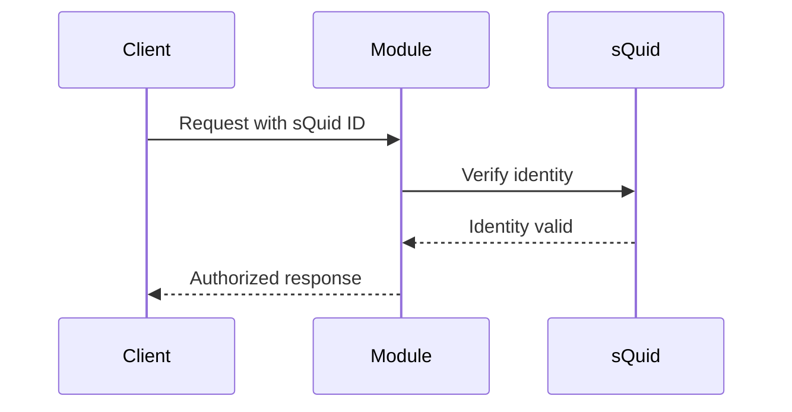
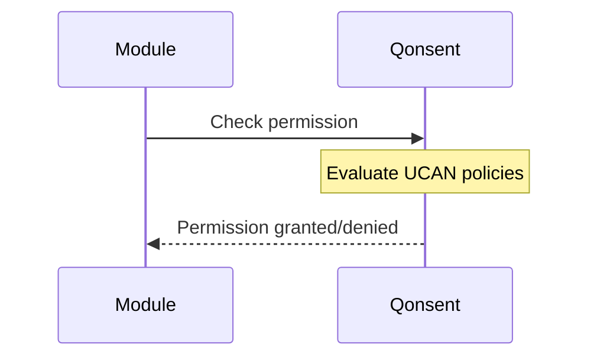
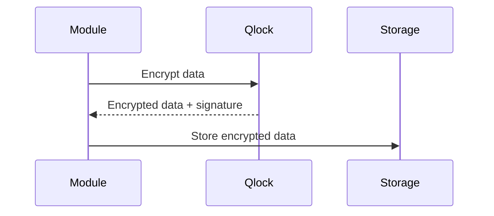
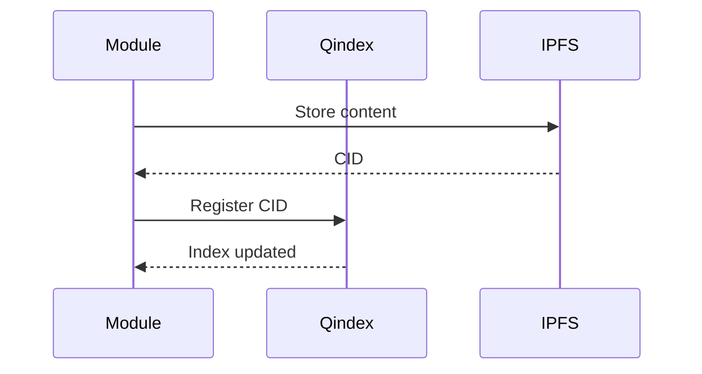

# Q Ecosystem Integration Matrix

This document provides a comprehensive overview of how modules integrate with each other.

## Module Dependencies

| Module | sQuid | Qonsent | Qlock | Qindex | Qerberos | Qmask | Qwallet | IPFS |
|--------|-------|---------|-------|--------|----------|-------|---------|------|
| dao | ✅ | ✅ | ✅ | ✅ | ✅ | ❌ | ✅ | ❌ |
| qchat | ✅ | ✅ | ✅ | ❌ | ✅ | ❌ | ❌ | ✅ |
| qdrive | ✅ | ✅ | ✅ | ❌ | ❌ | ✅ | ❌ | ✅ |
| qerberos | ✅ | ❌ | ❌ | ❌ | ✅ | ❌ | ❌ | ✅ |
| qindex | ❌ | ❌ | ✅ | ✅ | ❌ | ❌ | ❌ | ✅ |
| qlock | ❌ | ❌ | ✅ | ❌ | ❌ | ❌ | ❌ | ❌ |
| qmail | ✅ | ❌ | ✅ | ❌ | ❌ | ❌ | ❌ | ✅ |
| qmarket | ✅ | ✅ | ❌ | ✅ | ❌ | ❌ | ✅ | ✅ |
| qmask | ✅ | ❌ | ✅ | ❌ | ❌ | ✅ | ❌ | ❌ |
| qnet | ❌ | ❌ | ❌ | ❌ | ❌ | ❌ | ❌ | ❌ |
| qonsent | ✅ | ✅ | ❌ | ❌ | ❌ | ❌ | ❌ | ❌ |
| qpic | ✅ | ✅ | ❌ | ✅ | ❌ | ✅ | ❌ | ✅ |
| qwallet | ✅ | ❌ | ❌ | ❌ | ❌ | ❌ | ✅ | ❌ |
| squid | ✅ | ✅ | ❌ | ❌ | ❌ | ❌ | ❌ | ✅ |

## Integration Patterns

### Authentication Flow (sQuid)


### Permission Check Flow (Qonsent)


### Data Encryption Flow (Qlock)


### Indexing Flow (Qindex)


## Cross-Module Communication

### Event Bus Integration
All modules publish events to the centralized event bus:

```javascript
// Event naming convention
q.<module>.<action>.<version>

// Examples
q.qmail.sent.v1
q.qwallet.tx.signed.v1
q.qdrive.file.uploaded.v1
```

### Standard Headers
All inter-module requests use standard headers:

```
x-squid-id: <identity-id>
x-subid: <subidentity-id>
x-qonsent: <consent-token>
x-sig: <qlock-signature>
x-ts: <timestamp>
x-api-version: <version>
```

## Integration Examples

### File Upload with Full Integration
```javascript
// 1. Verify identity
const identity = await sQuid.verifyIdentity(squidId);

// 2. Check upload permission
const canUpload = await qonsent.check({
  squidId,
  resource: 'qdrive:upload',
  action: 'create'
});

// 3. Encrypt file
const encrypted = await qlock.encrypt({
  data: fileData,
  squidId,
  purpose: 'file-storage'
});

// 4. Store in IPFS
const cid = await ipfs.add(encrypted);

// 5. Index the file
await qindex.put({
  key: `file:${filename}`,
  cid,
  metadata: { owner: squidId, type: 'file' }
});

// 6. Log audit event
await qerberos.audit({
  type: 'FILE_UPLOADED',
  actor: squidId,
  resource: cid,
  details: { filename, size: fileData.length }
});
```

### Payment Processing Integration
```javascript
// 1. Create payment intent
const intent = await qwallet.createIntent({
  squidId,
  amount: 100,
  currency: 'QToken',
  purpose: 'premium-feature'
});

// 2. Sign transaction
const signature = await qlock.sign({
  data: intent,
  squidId,
  purpose: 'payment-authorization'
});

// 3. Process payment
const result = await qwallet.processPayment({
  intentId: intent.id,
  signature
});

// 4. Grant permissions on success
if (result.status === 'completed') {
  await qonsent.grant({
    squidId,
    resource: 'premium-features',
    scope: 'access',
    duration: '30d'
  });
}
```

## Testing Integration

### Contract Tests
Each module includes contract tests to verify integration compatibility:

```bash
# Run contract tests for all modules
npm run test:contracts

# Run integration tests
npm run test:integration
```

### Mock Services
For development and testing, modules can run with mock services:

```bash
# Start with all mocks
MOCK_SERVICES=all npm run dev

# Start with selective mocks
MOCK_SERVICES=qlock,qindex npm run dev
```

## Troubleshooting Integration Issues

### Common Problems

1. **Authentication Failures**
   - Verify sQuid service is running
   - Check identity format and validity
   - Ensure proper headers are set

2. **Permission Denied**
   - Verify Qonsent policies
   - Check DAO membership
   - Ensure proper scopes

3. **Encryption Errors**
   - Verify Qlock service connectivity
   - Check key availability
   - Ensure proper algorithm support

4. **Indexing Failures**
   - Verify Qindex service health
   - Check IPFS connectivity
   - Ensure proper CID format

### Debugging Tools

```bash
# Check service health
curl http://localhost:3010/health  # sQuid
curl http://localhost:3020/health  # Qlock
curl http://localhost:3030/health  # Qonsent

# Test integration endpoints
curl -H "x-squid-id: test-id" \
     http://localhost:3000/api/module/test-integration
```

## Performance Considerations

### Caching Strategies
- **Identity verification**: Cache for 5 minutes
- **Permission checks**: Cache for 1 minute
- **Encryption keys**: Cache for 1 hour
- **Index lookups**: Cache for 10 minutes

### Connection Pooling
- Maintain persistent connections to frequently used services
- Use circuit breakers for external service calls
- Implement retry logic with exponential backoff

### Batch Operations
- Batch multiple operations when possible
- Use bulk APIs for high-volume operations
- Implement queue-based processing for async operations
