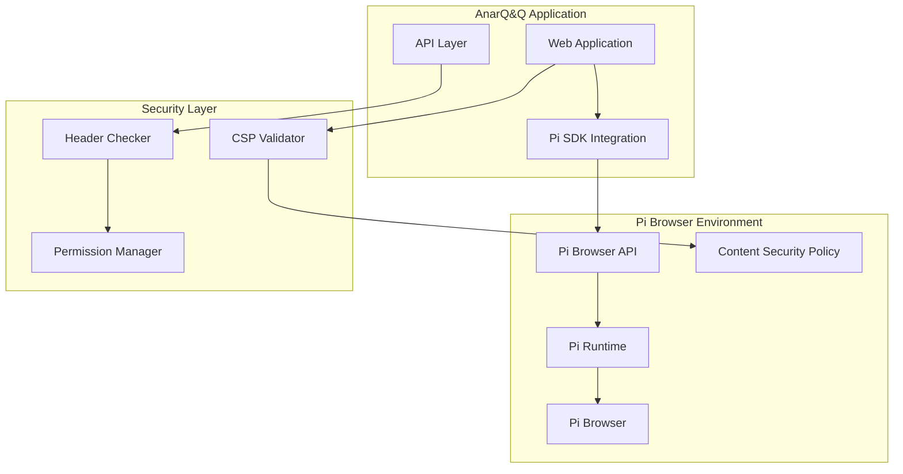

# Pi Browser Compatibility Guide

## Overview

This guide covers Pi Browser compatibility requirements, Content Security Policy (CSP) configuration, and API integration for AnarQ&Q ecosystem applications. Pi Browser provides a secure environment for Pi Network applications with specific security and compatibility requirements.

## Prerequisites

- Pi Browser installed (latest version recommended)
- Pi Network Developer Account
- Understanding of web security policies
- AnarQ&Q ecosystem setup

## Pi Browser Architecture



## Content Security Policy (CSP) Configuration

### Required CSP Headers

```javascript
// CSP configuration for Pi Browser compatibility
const piCSPConfig = {
  'default-src': ["'self'", "https://*.minepi.com"],
  'script-src': [
    "'self'",
    "'unsafe-inline'", // Required for Pi SDK
    "https://*.minepi.com",
    "https://cdn.jsdelivr.net" // For external libraries
  ],
  'style-src': [
    "'self'",
    "'unsafe-inline'", // Required for dynamic styles
    "https://fonts.googleapis.com"
  ],
  'font-src': [
    "'self'",
    "https://fonts.gstatic.com"
  ],
  'img-src': [
    "'self'",
    "data:",
    "https://*.minepi.com",
    "https://ipfs.io" // For IPFS content
  ],
  'connect-src': [
    "'self'",
    "https://*.minepi.com",
    "wss://*.minepi.com", // WebSocket connections
    "https://api.qnet.anarq.org" // AnarQ&Q API
  ],
  'frame-src': [
    "'self'",
    "https://*.minepi.com"
  ],
  'worker-src': [
    "'self'",
    "blob:" // For Web Workers
  ]
};

// Generate CSP header string
function generateCSPHeader(config) {
  return Object.entries(config)
    .map(([directive, sources]) => `${directive} ${sources.join(' ')}`)
    .join('; ');
}

const cspHeader = generateCSPHeader(piCSPConfig);
```

### CSP Validation Service

```javascript
import { PiIntegrationLayer } from '../../../backend/services/PiIntegrationLayer.mjs';

class PiCSPValidator {
  constructor() {
    this.piIntegration = new PiIntegrationLayer();
    this.requiredDirectives = [
      'default-src',
      'script-src',
      'style-src',
      'connect-src',
      'img-src'
    ];
  }
  
  async validateCSP(cspHeader) {
    try {
      const cspDirectives = this.parseCSPHeader(cspHeader);
      const validation = {
        compliant: true,
        violations: [],
        warnings: [],
        recommendations: []
      };
      
      // Check required directives
      for (const directive of this.requiredDirectives) {
        if (!cspDirectives[directive]) {
          validation.violations.push(`Missing required directive: ${directive}`);
          validation.compliant = false;
        }
      }
      
      // Check Pi Browser specific requirements
      await this.checkPiBrowserRequirements(cspDirectives, validation);
      
      // Check AnarQ&Q ecosystem compatibility
      await this.checkEcosystemCompatibility(cspDirectives, validation);
      
      return validation;
      
    } catch (error) {
      console.error('CSP validation failed:', error);
      return {
        compliant: false,
        violations: [`CSP validation error: ${error.message}`],
        warnings: [],
        recommendations: []
      };
    }
  }
  
  parseCSPHeader(cspHeader) {
    const directives = {};
    
    cspHeader.split(';').forEach(directive => {
      const [name, ...sources] = directive.trim().split(/\s+/);
      if (name) {
        directives[name] = sources;
      }
    });
    
    return directives;
  }
  
  async checkPiBrowserRequirements(directives, validation) {
    // Check script-src allows Pi SDK
    if (directives['script-src']) {
      const allowsPiSDK = directives['script-src'].some(src => 
        src.includes('minepi.com') || src === "'unsafe-inline'"
      );
      
      if (!allowsPiSDK) {
        validation.violations.push('script-src must allow Pi SDK sources');
        validation.compliant = false;
      }
    }
    
    // Check connect-src allows Pi API
    if (directives['connect-src']) {
      const allowsPiAPI = directives['connect-src'].some(src => 
        src.includes('minepi.com')
      );
      
      if (!allowsPiAPI) {
        validation.violations.push('connect-src must allow Pi Network API');
        validation.compliant = false;
      }
    }
    
    // Check for WebSocket support
    if (directives['connect-src']) {
      const allowsWebSocket = directives['connect-src'].some(src => 
        src.startsWith('wss://')
      );
      
      if (!allowsWebSocket) {
        validation.warnings.push('Consider allowing WebSocket connections for real-time features');
      }
    }
  }
  
  async checkEcosystemCompatibility(directives, validation) {
    // Check IPFS compatibility
    if (directives['img-src']) {
      const allowsIPFS = directives['img-src'].some(src => 
        src.includes('ipfs.io') || src.includes('gateway.pinata.cloud')
      );
      
      if (!allowsIPFS) {
        validation.recommendations.push('Add IPFS gateway to img-src for content loading');
      }
    }
    
    // Check AnarQ&Q API access
    if (directives['connect-src']) {
      const allowsAnarQ = directives['connect-src'].some(src => 
        src.includes('anarq.org') || src.includes('qnet.anarq.org')
      );
      
      if (!allowsAnarQ) {
        validation.violations.push('connect-src must allow AnarQ&Q ecosystem APIs');
        validation.compliant = false;
      }
    }
  }
  
  async applyCspFixes(violations) {
    const fixes = [];
    
    for (const violation of violations) {
      if (violation.includes('script-src')) {
        fixes.push({
          directive: 'script-src',
          action: 'add',
          value: 'https://*.minepi.com'
        });
      }
      
      if (violation.includes('connect-src')) {
        fixes.push({
          directive: 'connect-src',
          action: 'add',
          value: 'https://*.minepi.com wss://*.minepi.com'
        });
      }
      
      if (violation.includes('AnarQ&Q')) {
        fixes.push({
          directive: 'connect-src',
          action: 'add',
          value: 'https://api.qnet.anarq.org'
        });
      }
    }
    
    return fixes;
  }
}
```

## Pi Browser API Integration

### Pi SDK Integration

```javascript
class PiBrowserSDK {
  constructor() {
    this.piSDK = null;
    this.initialized = false;
  }
  
  async initialize() {
    try {
      // Load Pi SDK
      if (typeof window !== 'undefined' && window.Pi) {
        this.piSDK = window.Pi;
      } else {
        // Dynamically load Pi SDK
        await this.loadPiSDK();
      }
      
      // Initialize Pi SDK
      await this.piSDK.init({
        version: "2.0",
        sandbox: process.env.PI_ENVIRONMENT === 'sandbox'
      });
      
      this.initialized = true;
      console.log('Pi Browser SDK initialized successfully');
      
    } catch (error) {
      console.error('Failed to initialize Pi Browser SDK:', error);
      throw error;
    }
  }
  
  async loadPiSDK() {
    return new Promise((resolve, reject) => {
      const script = document.createElement('script');
      script.src = 'https://sdk.minepi.com/pi-sdk.js';
      script.onload = () => {
        this.piSDK = window.Pi;
        resolve();
      };
      script.onerror = reject;
      document.head.appendChild(script);
    });
  }
  
  async authenticate() {
    if (!this.initialized) {
      throw new Error('Pi SDK not initialized');
    }
    
    try {
      const auth = await this.piSDK.authenticate(
        ['payments', 'username'],
        this.onIncompletePaymentFound
      );
      
      return {
        accessToken: auth.accessToken,
        user: auth.user
      };
      
    } catch (error) {
      console.error('Pi authentication failed:', error);
      throw error;
    }
  }
  
  async createPayment(paymentData) {
    if (!this.initialized) {
      throw new Error('Pi SDK not initialized');
    }
    
    try {
      const payment = await this.piSDK.createPayment({
        amount: paymentData.amount,
        memo: paymentData.memo,
        metadata: {
          qflowExecutionId: paymentData.qflowExecutionId,
          squidId: paymentData.squidId
        }
      }, {
        onReadyForServerApproval: this.onReadyForServerApproval,
        onReadyForServerCompletion: this.onReadyForServerCompletion,
        onCancel: this.onPaymentCancel,
        onError: this.onPaymentError
      });
      
      return payment;
      
    } catch (error) {
      console.error('Pi payment creation failed:', error);
      throw error;
    }
  }
  
  onIncompletePaymentFound(payment) {
    console.log('Incomplete payment found:', payment);
    // Handle incomplete payment recovery
  }
  
  onReadyForServerApproval(paymentId) {
    console.log('Payment ready for server approval:', paymentId);
    // Approve payment on server
  }
  
  onReadyForServerCompletion(paymentId, txid) {
    console.log('Payment ready for completion:', paymentId, txid);
    // Complete payment on server
  }
  
  onPaymentCancel(paymentId) {
    console.log('Payment cancelled:', paymentId);
    // Handle payment cancellation
  }
  
  onPaymentError(error, payment) {
    console.error('Payment error:', error, payment);
    // Handle payment error
  }
}
```

### Browser Compatibility Checker

```javascript
class PiBrowserCompatibilityChecker {
  constructor() {
    this.piIntegration = new PiIntegrationLayer();
  }
  
  async checkCompatibility(apiEndpoints) {
    try {
      const compatibility = {
        browserSupported: false,
        apiVersion: null,
        supportedFeatures: [],
        limitations: [],
        missingHeaders: [],
        recommendations: []
      };
      
      // Check if running in Pi Browser
      compatibility.browserSupported = this.isPiBrowser();
      
      if (!compatibility.browserSupported) {
        compatibility.limitations.push('Not running in Pi Browser environment');
        return compatibility;
      }
      
      // Check Pi API version
      compatibility.apiVersion = await this.getPiAPIVersion();
      
      // Check supported features
      compatibility.supportedFeatures = await this.checkSupportedFeatures();
      
      // Check API endpoints
      const endpointChecks = await this.checkAPIEndpoints(apiEndpoints);
      compatibility.missingHeaders = endpointChecks.missingHeaders;
      
      // Generate recommendations
      compatibility.recommendations = this.generateRecommendations(compatibility);
      
      return compatibility;
      
    } catch (error) {
      console.error('Compatibility check failed:', error);
      throw error;
    }
  }
  
  isPiBrowser() {
    // Check for Pi Browser specific properties
    return typeof window !== 'undefined' && 
           (window.Pi || 
            navigator.userAgent.includes('PiBrowser') ||
            window.location.protocol === 'pi:');
  }
  
  async getPiAPIVersion() {
    try {
      if (window.Pi && window.Pi.version) {
        return window.Pi.version;
      }
      
      // Fallback: check via API call
      const response = await fetch('https://api.minepi.com/v2/version');
      const data = await response.json();
      return data.version;
      
    } catch (error) {
      console.warn('Could not determine Pi API version:', error);
      return 'unknown';
    }
  }
  
  async checkSupportedFeatures() {
    const features = [];
    
    // Check payment support
    if (window.Pi && typeof window.Pi.createPayment === 'function') {
      features.push('payments');
    }
    
    // Check authentication support
    if (window.Pi && typeof window.Pi.authenticate === 'function') {
      features.push('authentication');
    }
    
    // Check user data access
    if (window.Pi && typeof window.Pi.getUser === 'function') {
      features.push('user_data');
    }
    
    // Check WebSocket support
    if (typeof WebSocket !== 'undefined') {
      features.push('websockets');
    }
    
    // Check local storage
    if (typeof localStorage !== 'undefined') {
      features.push('local_storage');
    }
    
    // Check IndexedDB
    if (typeof indexedDB !== 'undefined') {
      features.push('indexed_db');
    }
    
    return features;
  }
  
  async checkAPIEndpoints(endpoints) {
    const missingHeaders = [];
    
    for (const endpoint of endpoints) {
      try {
        const response = await fetch(endpoint, { method: 'OPTIONS' });
        
        // Check CORS headers
        if (!response.headers.get('Access-Control-Allow-Origin')) {
          missingHeaders.push(`${endpoint}: Missing CORS headers`);
        }
        
        // Check CSP headers
        if (!response.headers.get('Content-Security-Policy')) {
          missingHeaders.push(`${endpoint}: Missing CSP headers`);
        }
        
        // Check Pi Browser specific headers
        if (!response.headers.get('X-Pi-Browser-Compatible')) {
          missingHeaders.push(`${endpoint}: Missing Pi Browser compatibility header`);
        }
        
      } catch (error) {
        missingHeaders.push(`${endpoint}: Endpoint not accessible - ${error.message}`);
      }
    }
    
    return { missingHeaders };
  }
  
  generateRecommendations(compatibility) {
    const recommendations = [];
    
    if (!compatibility.browserSupported) {
      recommendations.push('Test application in Pi Browser environment');
    }
    
    if (!compatibility.supportedFeatures.includes('payments')) {
      recommendations.push('Implement Pi SDK payment integration');
    }
    
    if (!compatibility.supportedFeatures.includes('websockets')) {
      recommendations.push('Consider fallback for real-time features');
    }
    
    if (compatibility.missingHeaders.length > 0) {
      recommendations.push('Configure server headers for Pi Browser compatibility');
    }
    
    return recommendations;
  }
}
```

## API Header Configuration

### Required Headers for Pi Browser

```javascript
// Express.js middleware for Pi Browser compatibility
function piCompatibilityMiddleware(req, res, next) {
  // CORS headers for Pi Browser
  res.header('Access-Control-Allow-Origin', 'https://*.minepi.com');
  res.header('Access-Control-Allow-Methods', 'GET, POST, PUT, DELETE, OPTIONS');
  res.header('Access-Control-Allow-Headers', 'Origin, X-Requested-With, Content-Type, Accept, Authorization, X-Pi-Token');
  res.header('Access-Control-Allow-Credentials', 'true');
  
  // Pi Browser compatibility header
  res.header('X-Pi-Browser-Compatible', 'true');
  
  // Security headers
  res.header('X-Content-Type-Options', 'nosniff');
  res.header('X-Frame-Options', 'SAMEORIGIN');
  res.header('X-XSS-Protection', '1; mode=block');
  
  // CSP header for Pi Browser
  const csp = generateCSPHeader(piCSPConfig);
  res.header('Content-Security-Policy', csp);
  
  // Handle preflight requests
  if (req.method === 'OPTIONS') {
    res.sendStatus(200);
  } else {
    next();
  }
}

// Apply middleware to all routes
app.use(piCompatibilityMiddleware);
```

### API Response Format

```javascript
class PiCompatibleAPIResponse {
  static success(data, metadata = {}) {
    return {
      success: true,
      data,
      metadata: {
        timestamp: new Date().toISOString(),
        piCompatible: true,
        ...metadata
      }
    };
  }
  
  static error(message, code = 'UNKNOWN_ERROR', details = {}) {
    return {
      success: false,
      error: {
        message,
        code,
        details,
        timestamp: new Date().toISOString()
      },
      metadata: {
        piCompatible: true
      }
    };
  }
  
  static paginated(data, pagination) {
    return {
      success: true,
      data,
      pagination: {
        page: pagination.page,
        limit: pagination.limit,
        total: pagination.total,
        hasNext: pagination.hasNext,
        hasPrev: pagination.hasPrev
      },
      metadata: {
        timestamp: new Date().toISOString(),
        piCompatible: true
      }
    };
  }
}
```

## Storage and Caching

### Pi Browser Storage Limitations

```javascript
class PiBrowserStorage {
  constructor() {
    this.storageQuota = 50 * 1024 * 1024; // 50MB typical limit
    this.compressionEnabled = true;
  }
  
  async setItem(key, value) {
    try {
      let serializedValue = JSON.stringify(value);
      
      // Compress large values
      if (this.compressionEnabled && serializedValue.length > 1024) {
        serializedValue = await this.compress(serializedValue);
      }
      
      // Check storage quota
      await this.checkStorageQuota(serializedValue.length);
      
      localStorage.setItem(key, serializedValue);
      
    } catch (error) {
      console.error('Failed to store item:', error);
      
      if (error.name === 'QuotaExceededError') {
        await this.cleanupStorage();
        // Retry once after cleanup
        localStorage.setItem(key, serializedValue);
      } else {
        throw error;
      }
    }
  }
  
  async getItem(key) {
    try {
      const value = localStorage.getItem(key);
      
      if (!value) {
        return null;
      }
      
      // Try to decompress if compressed
      let decompressedValue = value;
      if (this.compressionEnabled && this.isCompressed(value)) {
        decompressedValue = await this.decompress(value);
      }
      
      return JSON.parse(decompressedValue);
      
    } catch (error) {
      console.error('Failed to retrieve item:', error);
      return null;
    }
  }
  
  async checkStorageQuota(additionalSize) {
    if ('storage' in navigator && 'estimate' in navigator.storage) {
      const estimate = await navigator.storage.estimate();
      const used = estimate.usage || 0;
      const quota = estimate.quota || this.storageQuota;
      
      if (used + additionalSize > quota * 0.9) { // 90% threshold
        throw new Error('Storage quota exceeded');
      }
    }
  }
  
  async cleanupStorage() {
    // Remove expired items
    const keys = Object.keys(localStorage);
    
    for (const key of keys) {
      if (key.startsWith('temp_') || key.startsWith('cache_')) {
        const item = await this.getItem(key);
        
        if (item && item.expires && new Date(item.expires) < new Date()) {
          localStorage.removeItem(key);
        }
      }
    }
  }
  
  async compress(data) {
    // Simple compression implementation
    // In production, use a proper compression library
    return btoa(data);
  }
  
  async decompress(data) {
    return atob(data);
  }
  
  isCompressed(data) {
    // Simple check for base64 encoding
    return /^[A-Za-z0-9+/]*={0,2}$/.test(data);
  }
}
```

## Performance Optimization

### Pi Browser Performance Best Practices

```javascript
class PiBrowserOptimizer {
  constructor() {
    this.performanceMetrics = {
      loadTime: 0,
      renderTime: 0,
      apiResponseTime: 0,
      memoryUsage: 0
    };
  }
  
  async optimizeForPiBrowser() {
    // Lazy load non-critical resources
    await this.implementLazyLoading();
    
    // Optimize images for Pi Browser
    await this.optimizeImages();
    
    // Implement service worker for caching
    await this.setupServiceWorker();
    
    // Optimize API calls
    await this.optimizeAPIRequests();
    
    // Monitor performance
    this.startPerformanceMonitoring();
  }
  
  async implementLazyLoading() {
    // Lazy load images
    const images = document.querySelectorAll('img[data-src]');
    
    const imageObserver = new IntersectionObserver((entries) => {
      entries.forEach(entry => {
        if (entry.isIntersecting) {
          const img = entry.target;
          img.src = img.dataset.src;
          img.removeAttribute('data-src');
          imageObserver.unobserve(img);
        }
      });
    });
    
    images.forEach(img => imageObserver.observe(img));
  }
  
  async optimizeImages() {
    // Convert images to WebP format if supported
    const supportsWebP = await this.checkWebPSupport();
    
    if (supportsWebP) {
      const images = document.querySelectorAll('img');
      
      images.forEach(img => {
        if (img.src && !img.src.includes('.webp')) {
          const webpSrc = img.src.replace(/\.(jpg|jpeg|png)$/, '.webp');
          
          // Test if WebP version exists
          this.testImageExists(webpSrc).then(exists => {
            if (exists) {
              img.src = webpSrc;
            }
          });
        }
      });
    }
  }
  
  async setupServiceWorker() {
    if ('serviceWorker' in navigator) {
      try {
        const registration = await navigator.serviceWorker.register('/pi-sw.js');
        console.log('Service Worker registered:', registration);
      } catch (error) {
        console.error('Service Worker registration failed:', error);
      }
    }
  }
  
  async optimizeAPIRequests() {
    // Implement request batching
    this.requestBatcher = new APIRequestBatcher();
    
    // Setup request caching
    this.requestCache = new Map();
    
    // Implement request deduplication
    this.pendingRequests = new Map();
  }
  
  startPerformanceMonitoring() {
    // Monitor page load performance
    window.addEventListener('load', () => {
      const navigation = performance.getEntriesByType('navigation')[0];
      this.performanceMetrics.loadTime = navigation.loadEventEnd - navigation.loadEventStart;
    });
    
    // Monitor memory usage
    if ('memory' in performance) {
      setInterval(() => {
        this.performanceMetrics.memoryUsage = performance.memory.usedJSHeapSize;
      }, 30000); // Every 30 seconds
    }
    
    // Monitor API response times
    this.monitorAPIPerformance();
  }
  
  monitorAPIPerformance() {
    const originalFetch = window.fetch;
    
    window.fetch = async (...args) => {
      const startTime = performance.now();
      
      try {
        const response = await originalFetch(...args);
        const endTime = performance.now();
        
        this.performanceMetrics.apiResponseTime = endTime - startTime;
        
        // Log slow requests
        if (endTime - startTime > 5000) { // 5 seconds
          console.warn('Slow API request detected:', args[0], `${endTime - startTime}ms`);
        }
        
        return response;
      } catch (error) {
        const endTime = performance.now();
        this.performanceMetrics.apiResponseTime = endTime - startTime;
        throw error;
      }
    };
  }
  
  async checkWebPSupport() {
    return new Promise(resolve => {
      const webP = new Image();
      webP.onload = webP.onerror = () => {
        resolve(webP.height === 2);
      };
      webP.src = 'data:image/webp;base64,UklGRjoAAABXRUJQVlA4IC4AAACyAgCdASoCAAIALmk0mk0iIiIiIgBoSygABc6WWgAA/veff/0PP8bA//LwYAAA';
    });
  }
  
  async testImageExists(url) {
    return new Promise(resolve => {
      const img = new Image();
      img.onload = () => resolve(true);
      img.onerror = () => resolve(false);
      img.src = url;
    });
  }
}
```

## Testing

### Pi Browser Testing Framework

```javascript
import { describe, it, expect, beforeEach } from 'vitest';

describe('Pi Browser Compatibility', () => {
  let cspValidator;
  let compatibilityChecker;
  let piBrowserSDK;
  
  beforeEach(() => {
    cspValidator = new PiCSPValidator();
    compatibilityChecker = new PiBrowserCompatibilityChecker();
    piBrowserSDK = new PiBrowserSDK();
  });
  
  describe('CSP Validation', () => {
    it('should validate compliant CSP header', async () => {
      const cspHeader = generateCSPHeader(piCSPConfig);
      const validation = await cspValidator.validateCSP(cspHeader);
      
      expect(validation.compliant).toBe(true);
      expect(validation.violations).toHaveLength(0);
    });
    
    it('should detect CSP violations', async () => {
      const invalidCSP = "default-src 'self'"; // Missing required directives
      const validation = await cspValidator.validateCSP(invalidCSP);
      
      expect(validation.compliant).toBe(false);
      expect(validation.violations.length).toBeGreaterThan(0);
    });
  });
  
  describe('Browser Compatibility', () => {
    it('should check API endpoint compatibility', async () => {
      const endpoints = [
        '/api/qwallet/balance',
        '/api/squid/identity',
        '/api/qerberos/audit'
      ];
      
      const compatibility = await compatibilityChecker.checkCompatibility(endpoints);
      
      expect(compatibility).toHaveProperty('browserSupported');
      expect(compatibility).toHaveProperty('supportedFeatures');
      expect(compatibility).toHaveProperty('missingHeaders');
    });
  });
  
  describe('Pi SDK Integration', () => {
    it('should initialize Pi SDK successfully', async () => {
      // Mock Pi SDK
      global.window = { Pi: { init: vi.fn().mockResolvedValue(true) } };
      
      await piBrowserSDK.initialize();
      
      expect(piBrowserSDK.initialized).toBe(true);
    });
    
    it('should handle Pi authentication', async () => {
      // Mock Pi SDK authentication
      global.window = {
        Pi: {
          init: vi.fn().mockResolvedValue(true),
          authenticate: vi.fn().mockResolvedValue({
            accessToken: 'test-token',
            user: { uid: 'test-user' }
          })
        }
      };
      
      await piBrowserSDK.initialize();
      const auth = await piBrowserSDK.authenticate();
      
      expect(auth.accessToken).toBe('test-token');
      expect(auth.user.uid).toBe('test-user');
    });
  });
});
```

### Integration Testing

```javascript
describe('Pi Browser Integration Tests', () => {
  it('should work end-to-end in Pi Browser environment', async () => {
    // Setup Pi Browser environment
    const mockPiBrowser = setupMockPiBrowser();
    
    // Initialize application
    const app = new AnarQApplication();
    await app.initializeForPiBrowser();
    
    // Test Pi authentication
    const auth = await app.authenticateWithPi();
    expect(auth.success).toBe(true);
    
    // Test Pi payment
    const payment = await app.createPiPayment({
      amount: 1.0,
      memo: 'Test payment'
    });
    expect(payment.paymentId).toBeDefined();
    
    // Test API calls with Pi headers
    const apiResponse = await app.callAPI('/api/qwallet/balance');
    expect(apiResponse.success).toBe(true);
  });
});
```

## Troubleshooting

### Common Issues

1. **CSP Violations**: Check browser console for specific CSP errors
2. **API Access Denied**: Verify CORS and Pi Browser headers
3. **SDK Load Failures**: Check network connectivity and CSP settings
4. **Storage Quota Exceeded**: Implement storage cleanup strategies

### Debug Tools

```javascript
class PiBrowserDebugger {
  static async debugCSP() {
    const cspValidator = new PiCSPValidator();
    const currentCSP = document.querySelector('meta[http-equiv="Content-Security-Policy"]')?.content;
    
    if (currentCSP) {
      const validation = await cspValidator.validateCSP(currentCSP);
      console.log('CSP Validation Results:', validation);
    } else {
      console.warn('No CSP header found');
    }
  }
  
  static async debugCompatibility() {
    const checker = new PiBrowserCompatibilityChecker();
    const compatibility = await checker.checkCompatibility([
      window.location.origin + '/api/health'
    ]);
    
    console.log('Pi Browser Compatibility:', compatibility);
  }
  
  static debugPerformance() {
    const metrics = {
      loadTime: performance.timing.loadEventEnd - performance.timing.navigationStart,
      domReady: performance.timing.domContentLoadedEventEnd - performance.timing.navigationStart,
      firstPaint: performance.getEntriesByType('paint')[0]?.startTime || 0
    };
    
    console.log('Performance Metrics:', metrics);
  }
}

// Usage in browser console
// PiBrowserDebugger.debugCSP();
// PiBrowserDebugger.debugCompatibility();
// PiBrowserDebugger.debugPerformance();
```

## Best Practices

1. **Security**: Always validate CSP headers and API permissions
2. **Performance**: Optimize for Pi Browser's resource constraints
3. **Compatibility**: Test across different Pi Browser versions
4. **Storage**: Implement efficient storage management
5. **Error Handling**: Provide graceful fallbacks for Pi-specific features
6. **Testing**: Use automated testing for Pi Browser compatibility

## Support Resources

- [Pi Browser Developer Documentation](https://developers.minepi.com/browser)
- [Content Security Policy Guide](https://developer.mozilla.org/en-US/docs/Web/HTTP/CSP)
- [Pi SDK Reference](https://developers.minepi.com/sdk)
- AnarQ&Q Ecosystem Integration Support