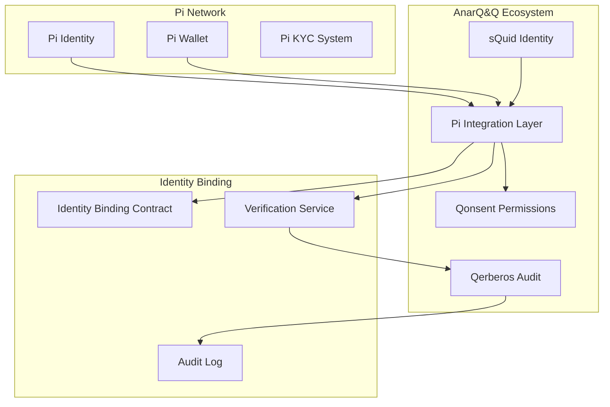

# Pi Identity Linking Guide

## Overview

This guide explains how to securely link Pi Network identities with sQuid identities in the AnarQ&Q ecosystem. Identity linking enables seamless cross-platform authentication and maintains user privacy while ensuring auditability through Qerberos.

## Prerequisites

- Pi Network account with verified identity
- sQuid identity created in AnarQ&Q ecosystem
- Access to Pi Browser or Pi SDK
- Understanding of cryptographic signatures

## Identity Architecture



## Identity Binding Process

### Step 1: Generate Identity Proof

```javascript
import { PiIntegrationLayer } from '../../../backend/services/PiIntegrationLayer.mjs';
import { sQuidService } from '../../../modules/squid/services/sQuidService.mjs';

class IdentityLinker {
  constructor() {
    this.piIntegration = new PiIntegrationLayer();
    this.squidService = sQuidService;
  }
  
  async generateIdentityProof(squidId, piUserId) {
    try {
      // Generate sQuid signature
      const squidSignature = await this.squidService.signIdentityBinding(
        squidId,
        piUserId,
        Date.now()
      );
      
      // Generate Pi identity proof
      const piProof = await this.piIntegration.generateIdentityProof(piUserId);
      
      // Create binding request
      const bindingRequest = {
        squidId,
        piUserId,
        squidSignature,
        piProof,
        timestamp: new Date().toISOString(),
        nonce: this.generateNonce()
      };
      
      return bindingRequest;
      
    } catch (error) {
      console.error('Failed to generate identity proof:', error);
      throw error;
    }
  }
  
  generateNonce() {
    return Math.random().toString(36).substring(2, 15) + 
           Math.random().toString(36).substring(2, 15);
  }
}
```

### Step 2: Verify Identity Binding

```javascript
class IdentityVerifier {
  constructor() {
    this.piIntegration = new PiIntegrationLayer();
    this.qerberosService = new QerberosIntegrationService();
  }
  
  async verifyIdentityBinding(bindingRequest) {
    try {
      // Verify sQuid signature
      const squidValid = await this.verifySquidSignature(
        bindingRequest.squidId,
        bindingRequest.squidSignature,
        bindingRequest.timestamp
      );
      
      if (!squidValid) {
        throw new Error('Invalid sQuid signature');
      }
      
      // Verify Pi identity proof
      const piValid = await this.verifyPiIdentityProof(
        bindingRequest.piUserId,
        bindingRequest.piProof
      );
      
      if (!piValid) {
        throw new Error('Invalid Pi identity proof');
      }
      
      // Check for existing bindings
      const existingBinding = await this.checkExistingBinding(
        bindingRequest.squidId,
        bindingRequest.piUserId
      );
      
      if (existingBinding) {
        throw new Error('Identity already bound');
      }
      
      // Generate Qerberos attestation
      const attestation = await this.generateQerberosAttestation(bindingRequest);
      
      return {
        valid: true,
        attestation,
        bindingHash: this.calculateBindingHash(bindingRequest)
      };
      
    } catch (error) {
      console.error('Identity verification failed:', error);
      return {
        valid: false,
        error: error.message
      };
    }
  }
  
  async verifySquidSignature(squidId, signature, timestamp) {
    // Verify sQuid cryptographic signature
    return await this.squidService.verifySignature(squidId, signature, timestamp);
  }
  
  async verifyPiIdentityProof(piUserId, proof) {
    // Verify Pi Network identity proof
    return await this.piIntegration.verifyIdentityProof(piUserId, proof);
  }
  
  async checkExistingBinding(squidId, piUserId) {
    // Check if identity is already bound
    const existingSquid = await this.piIntegration.getSquidForPiUser(piUserId);
    const existingPi = await this.squidService.getPiUserForSquid(squidId);
    
    return existingSquid || existingPi;
  }
  
  async generateQerberosAttestation(bindingRequest) {
    const attestationData = {
      type: 'identity_binding_attestation',
      squidId: bindingRequest.squidId,
      piUserId: bindingRequest.piUserId,
      timestamp: bindingRequest.timestamp,
      nonce: bindingRequest.nonce,
      verifier: 'pi-integration-layer'
    };
    
    return await this.qerberosService.generateAttestation(attestationData);
  }
  
  calculateBindingHash(bindingRequest) {
    const crypto = require('crypto');
    const data = `${bindingRequest.squidId}:${bindingRequest.piUserId}:${bindingRequest.timestamp}`;
    return crypto.createHash('sha256').update(data).digest('hex');
  }
}
```

### Step 3: Execute Identity Binding

```javascript
class IdentityBinder {
  constructor() {
    this.piIntegration = new PiIntegrationLayer();
    this.identityContract = null;
  }
  
  async initializeContract(environment = 'sandbox') {
    this.piIntegration.setEnvironment(environment);
    
    // Get identity contract address
    const contractAddress = await this.piIntegration.getContractAddress('sQuidPiIdentity');
    
    // Initialize contract interface
    this.identityContract = await this.piIntegration.getContract(
      contractAddress,
      'sQuidPiIdentity'
    );
  }
  
  async executeBinding(bindingRequest, verification) {
    try {
      if (!verification.valid) {
        throw new Error('Cannot execute binding: verification failed');
      }
      
      // Execute smart contract binding
      const transaction = await this.identityContract.bindIdentity(
        bindingRequest.squidId,
        bindingRequest.squidSignature,
        verification.attestation
      );
      
      // Wait for confirmation
      const receipt = await transaction.wait();
      
      // Store binding in local database
      const binding = await this.storeBinding({
        squidId: bindingRequest.squidId,
        piUserId: bindingRequest.piUserId,
        piAddress: transaction.from,
        bindingHash: verification.bindingHash,
        transactionHash: receipt.transactionHash,
        blockNumber: receipt.blockNumber,
        timestamp: new Date().toISOString(),
        verified: false // Will be verified in next step
      });
      
      // Log to Qerberos
      await this.logBindingExecution(binding, receipt);
      
      return binding;
      
    } catch (error) {
      console.error('Failed to execute identity binding:', error);
      throw error;
    }
  }
  
  async storeBinding(bindingData) {
    // Store in local database or IPFS
    const bindingId = `binding_${bindingData.squidId}_${bindingData.piUserId}`;
    
    // In a real implementation, this would store to a database
    const binding = {
      id: bindingId,
      ...bindingData,
      status: 'pending_verification'
    };
    
    return binding;
  }
  
  async logBindingExecution(binding, receipt) {
    await this.qerberosService.logEvent({
      type: 'pi_identity_binding_executed',
      bindingId: binding.id,
      squidId: binding.squidId,
      piUserId: binding.piUserId,
      transactionHash: receipt.transactionHash,
      blockNumber: receipt.blockNumber,
      gasUsed: receipt.gasUsed.toString(),
      timestamp: binding.timestamp
    });
  }
}
```

### Step 4: Verify and Activate Binding

```javascript
class BindingActivator {
  constructor() {
    this.piIntegration = new PiIntegrationLayer();
    this.qerberosService = new QerberosIntegrationService();
  }
  
  async verifyAndActivateBinding(bindingId) {
    try {
      // Retrieve binding
      const binding = await this.getBinding(bindingId);
      
      if (!binding) {
        throw new Error('Binding not found');
      }
      
      // Perform additional verification checks
      const verificationChecks = await this.performVerificationChecks(binding);
      
      if (!verificationChecks.passed) {
        throw new Error(`Verification failed: ${verificationChecks.errors.join(', ')}`);
      }
      
      // Activate binding on smart contract
      const activation = await this.activateContractBinding(binding);
      
      // Update binding status
      await this.updateBindingStatus(bindingId, 'verified', activation);
      
      // Grant Qonsent permissions
      await this.grantIdentityPermissions(binding);
      
      // Log activation
      await this.logBindingActivation(binding, activation);
      
      return {
        bindingId,
        status: 'verified',
        activation,
        permissions: await this.getIdentityPermissions(binding)
      };
      
    } catch (error) {
      console.error('Failed to verify and activate binding:', error);
      
      // Update binding status to failed
      await this.updateBindingStatus(bindingId, 'failed', { error: error.message });
      
      throw error;
    }
  }
  
  async performVerificationChecks(binding) {
    const checks = {
      passed: true,
      errors: []
    };
    
    try {
      // Check sQuid identity exists and is active
      const squidExists = await this.squidService.verifyIdentityExists(binding.squidId);
      if (!squidExists) {
        checks.errors.push('sQuid identity not found or inactive');
      }
      
      // Check Pi identity is valid
      const piValid = await this.piIntegration.verifyPiIdentity(binding.piUserId);
      if (!piValid) {
        checks.errors.push('Pi identity not valid');
      }
      
      // Check transaction is confirmed
      const txConfirmed = await this.piIntegration.isTransactionConfirmed(
        binding.transactionHash
      );
      if (!txConfirmed) {
        checks.errors.push('Binding transaction not confirmed');
      }
      
      // Check for duplicate bindings
      const duplicates = await this.checkForDuplicateBindings(binding);
      if (duplicates.length > 0) {
        checks.errors.push('Duplicate bindings detected');
      }
      
      checks.passed = checks.errors.length === 0;
      
    } catch (error) {
      checks.passed = false;
      checks.errors.push(`Verification check failed: ${error.message}`);
    }
    
    return checks;
  }
  
  async activateContractBinding(binding) {
    try {
      // Call smart contract verification method
      const transaction = await this.identityContract.verifyIdentity(binding.squidId);
      const receipt = await transaction.wait();
      
      return {
        transactionHash: receipt.transactionHash,
        blockNumber: receipt.blockNumber,
        gasUsed: receipt.gasUsed.toString(),
        timestamp: new Date().toISOString()
      };
      
    } catch (error) {
      console.error('Failed to activate contract binding:', error);
      throw error;
    }
  }
  
  async grantIdentityPermissions(binding) {
    // Grant Qonsent permissions for cross-platform operations
    const permissions = [
      'pi:wallet:read',
      'pi:wallet:transfer',
      'pi:identity:verify',
      'squid:identity:link',
      'qwallet:cross_platform:access'
    ];
    
    for (const permission of permissions) {
      await this.qonsentService.grantPermission(
        binding.squidId,
        permission,
        {
          piUserId: binding.piUserId,
          bindingId: binding.id,
          grantedBy: 'pi-integration-layer'
        }
      );
    }
    
    return permissions;
  }
  
  async logBindingActivation(binding, activation) {
    await this.qerberosService.logEvent({
      type: 'pi_identity_binding_activated',
      bindingId: binding.id,
      squidId: binding.squidId,
      piUserId: binding.piUserId,
      activationTxHash: activation.transactionHash,
      timestamp: activation.timestamp
    });
  }
}
```

## Identity Management

### Cross-Platform Authentication

```javascript
class CrossPlatformAuth {
  constructor() {
    this.piIntegration = new PiIntegrationLayer();
    this.squidService = sQuidService;
  }
  
  async authenticateWithLinkedIdentity(authRequest) {
    try {
      const { platform, userId, signature, challenge } = authRequest;
      
      let binding;
      
      if (platform === 'pi') {
        // Authenticate with Pi, get sQuid identity
        const piValid = await this.piIntegration.verifyPiSignature(
          userId,
          signature,
          challenge
        );
        
        if (!piValid) {
          throw new Error('Pi authentication failed');
        }
        
        binding = await this.getBindingByPiUser(userId);
        
      } else if (platform === 'squid') {
        // Authenticate with sQuid, get Pi identity
        const squidValid = await this.squidService.verifySignature(
          userId,
          signature,
          challenge
        );
        
        if (!squidValid) {
          throw new Error('sQuid authentication failed');
        }
        
        binding = await this.getBindingBySquidId(userId);
      }
      
      if (!binding || binding.status !== 'verified') {
        throw new Error('No verified identity binding found');
      }
      
      // Generate cross-platform session token
      const sessionToken = await this.generateCrossPlatformToken(binding);
      
      return {
        authenticated: true,
        binding,
        sessionToken,
        permissions: await this.getIdentityPermissions(binding)
      };
      
    } catch (error) {
      console.error('Cross-platform authentication failed:', error);
      return {
        authenticated: false,
        error: error.message
      };
    }
  }
  
  async generateCrossPlatformToken(binding) {
    const jwt = require('jsonwebtoken');
    
    const payload = {
      squidId: binding.squidId,
      piUserId: binding.piUserId,
      bindingId: binding.id,
      permissions: await this.getIdentityPermissions(binding),
      iat: Math.floor(Date.now() / 1000),
      exp: Math.floor(Date.now() / 1000) + (24 * 60 * 60) // 24 hours
    };
    
    return jwt.sign(payload, process.env.JWT_SECRET);
  }
}
```

### Identity Synchronization

```javascript
class IdentitySynchronizer {
  constructor() {
    this.piIntegration = new PiIntegrationLayer();
    this.squidService = sQuidService;
  }
  
  async synchronizeIdentityData(bindingId) {
    try {
      const binding = await this.getBinding(bindingId);
      
      if (!binding || binding.status !== 'verified') {
        throw new Error('Invalid or unverified binding');
      }
      
      // Get Pi identity data
      const piData = await this.piIntegration.getIdentityData(binding.piUserId);
      
      // Get sQuid identity data
      const squidData = await this.squidService.getIdentityData(binding.squidId);
      
      // Synchronize compatible data fields
      const syncResult = await this.performDataSync(piData, squidData, binding);
      
      // Log synchronization
      await this.logSynchronization(binding, syncResult);
      
      return syncResult;
      
    } catch (error) {
      console.error('Identity synchronization failed:', error);
      throw error;
    }
  }
  
  async performDataSync(piData, squidData, binding) {
    const syncFields = [
      'displayName',
      'profileImage',
      'publicKey',
      'preferences'
    ];
    
    const syncResult = {
      synchronized: [],
      conflicts: [],
      errors: []
    };
    
    for (const field of syncFields) {
      try {
        if (piData[field] && squidData[field]) {
          // Handle conflicts
          if (piData[field] !== squidData[field]) {
            syncResult.conflicts.push({
              field,
              piValue: piData[field],
              squidValue: squidData[field]
            });
          }
        } else if (piData[field] && !squidData[field]) {
          // Sync from Pi to sQuid
          await this.squidService.updateIdentityField(
            binding.squidId,
            field,
            piData[field]
          );
          syncResult.synchronized.push(`${field}: Pi -> sQuid`);
          
        } else if (!piData[field] && squidData[field]) {
          // Sync from sQuid to Pi (if Pi allows)
          const updated = await this.piIntegration.updateIdentityField(
            binding.piUserId,
            field,
            squidData[field]
          );
          
          if (updated) {
            syncResult.synchronized.push(`${field}: sQuid -> Pi`);
          }
        }
        
      } catch (error) {
        syncResult.errors.push({
          field,
          error: error.message
        });
      }
    }
    
    return syncResult;
  }
}
```

## Security and Privacy

### Privacy Protection

```javascript
class IdentityPrivacyManager {
  constructor() {
    this.encryptionKey = process.env.IDENTITY_ENCRYPTION_KEY;
  }
  
  async encryptSensitiveData(data) {
    const crypto = require('crypto');
    const cipher = crypto.createCipher('aes-256-cbc', this.encryptionKey);
    
    let encrypted = cipher.update(JSON.stringify(data), 'utf8', 'hex');
    encrypted += cipher.final('hex');
    
    return encrypted;
  }
  
  async decryptSensitiveData(encryptedData) {
    const crypto = require('crypto');
    const decipher = crypto.createDecipher('aes-256-cbc', this.encryptionKey);
    
    let decrypted = decipher.update(encryptedData, 'hex', 'utf8');
    decrypted += decipher.final('utf8');
    
    return JSON.parse(decrypted);
  }
  
  async anonymizeIdentityData(binding) {
    // Create anonymized version for analytics
    return {
      bindingId: this.hashIdentifier(binding.id),
      squidIdHash: this.hashIdentifier(binding.squidId),
      piUserIdHash: this.hashIdentifier(binding.piUserId),
      timestamp: binding.timestamp,
      status: binding.status
    };
  }
  
  hashIdentifier(identifier) {
    const crypto = require('crypto');
    return crypto.createHash('sha256').update(identifier + process.env.HASH_SALT).digest('hex');
  }
}
```

### Audit and Compliance

```javascript
class IdentityAuditor {
  constructor() {
    this.qerberosService = new QerberosIntegrationService();
  }
  
  async auditIdentityBinding(bindingId) {
    try {
      const binding = await this.getBinding(bindingId);
      const auditTrail = await this.getAuditTrail(bindingId);
      
      const auditReport = {
        bindingId,
        binding,
        auditTrail,
        compliance: await this.checkCompliance(binding),
        security: await this.checkSecurity(binding),
        privacy: await this.checkPrivacy(binding),
        timestamp: new Date().toISOString()
      };
      
      // Store audit report
      await this.storeAuditReport(auditReport);
      
      return auditReport;
      
    } catch (error) {
      console.error('Identity audit failed:', error);
      throw error;
    }
  }
  
  async checkCompliance(binding) {
    return {
      gdprCompliant: await this.checkGDPRCompliance(binding),
      kycCompliant: await this.checkKYCCompliance(binding),
      dataRetention: await this.checkDataRetention(binding)
    };
  }
  
  async checkSecurity(binding) {
    return {
      signatureValid: await this.verifySignatures(binding),
      encryptionValid: await this.verifyEncryption(binding),
      accessControlValid: await this.verifyAccessControl(binding)
    };
  }
  
  async checkPrivacy(binding) {
    return {
      dataMinimization: await this.checkDataMinimization(binding),
      consentValid: await this.checkConsent(binding),
      anonymizationApplied: await this.checkAnonymization(binding)
    };
  }
}
```

## Testing

### Unit Tests

```javascript
import { describe, it, expect, beforeEach } from 'vitest';
import { IdentityLinker, IdentityVerifier, IdentityBinder } from '../identity-linking.mjs';

describe('Pi Identity Linking', () => {
  let identityLinker;
  let identityVerifier;
  let identityBinder;
  
  beforeEach(() => {
    identityLinker = new IdentityLinker();
    identityVerifier = new IdentityVerifier();
    identityBinder = new IdentityBinder();
  });
  
  describe('Identity Proof Generation', () => {
    it('should generate valid identity proof', async () => {
      const squidId = 'squid-test-123';
      const piUserId = 'pi-user-456';
      
      const proof = await identityLinker.generateIdentityProof(squidId, piUserId);
      
      expect(proof.squidId).toBe(squidId);
      expect(proof.piUserId).toBe(piUserId);
      expect(proof.squidSignature).toBeDefined();
      expect(proof.piProof).toBeDefined();
      expect(proof.timestamp).toBeDefined();
      expect(proof.nonce).toBeDefined();
    });
  });
  
  describe('Identity Verification', () => {
    it('should verify valid identity binding', async () => {
      const bindingRequest = {
        squidId: 'squid-test-123',
        piUserId: 'pi-user-456',
        squidSignature: 'valid-signature',
        piProof: 'valid-proof',
        timestamp: new Date().toISOString(),
        nonce: 'test-nonce'
      };
      
      const verification = await identityVerifier.verifyIdentityBinding(bindingRequest);
      
      expect(verification.valid).toBe(true);
      expect(verification.attestation).toBeDefined();
      expect(verification.bindingHash).toBeDefined();
    });
    
    it('should reject invalid identity binding', async () => {
      const bindingRequest = {
        squidId: 'squid-test-123',
        piUserId: 'pi-user-456',
        squidSignature: 'invalid-signature',
        piProof: 'invalid-proof',
        timestamp: new Date().toISOString(),
        nonce: 'test-nonce'
      };
      
      const verification = await identityVerifier.verifyIdentityBinding(bindingRequest);
      
      expect(verification.valid).toBe(false);
      expect(verification.error).toBeDefined();
    });
  });
  
  describe('Identity Binding Execution', () => {
    it('should execute identity binding successfully', async () => {
      await identityBinder.initializeContract('sandbox');
      
      const bindingRequest = {
        squidId: 'squid-test-123',
        piUserId: 'pi-user-456',
        squidSignature: 'valid-signature',
        piProof: 'valid-proof',
        timestamp: new Date().toISOString(),
        nonce: 'test-nonce'
      };
      
      const verification = {
        valid: true,
        attestation: 'test-attestation',
        bindingHash: 'test-hash'
      };
      
      const binding = await identityBinder.executeBinding(bindingRequest, verification);
      
      expect(binding.id).toBeDefined();
      expect(binding.squidId).toBe(bindingRequest.squidId);
      expect(binding.piUserId).toBe(bindingRequest.piUserId);
      expect(binding.status).toBe('pending_verification');
    });
  });
});
```

### Integration Tests

```javascript
describe('Pi Identity Integration Tests', () => {
  it('should complete full identity linking flow', async () => {
    // Generate identity proof
    const proof = await identityLinker.generateIdentityProof('squid-123', 'pi-456');
    
    // Verify identity binding
    const verification = await identityVerifier.verifyIdentityBinding(proof);
    expect(verification.valid).toBe(true);
    
    // Execute binding
    const binding = await identityBinder.executeBinding(proof, verification);
    expect(binding.status).toBe('pending_verification');
    
    // Activate binding
    const activation = await bindingActivator.verifyAndActivateBinding(binding.id);
    expect(activation.status).toBe('verified');
    
    // Test cross-platform authentication
    const auth = await crossPlatformAuth.authenticateWithLinkedIdentity({
      platform: 'pi',
      userId: 'pi-456',
      signature: 'test-signature',
      challenge: 'test-challenge'
    });
    
    expect(auth.authenticated).toBe(true);
    expect(auth.binding.squidId).toBe('squid-123');
  });
});
```

## Troubleshooting

### Common Issues

1. **Signature Verification Failures**: Check signature format and algorithms
2. **Contract Interaction Errors**: Verify contract deployment and ABI
3. **Permission Denied**: Ensure proper Qonsent scopes are granted
4. **Binding Conflicts**: Check for existing identity bindings

### Debug Tools

```javascript
class IdentityDebugger {
  static async debugBinding(bindingId) {
    const binding = await this.getBinding(bindingId);
    const auditTrail = await this.getAuditTrail(bindingId);
    
    console.log('Binding Debug Info:');
    console.log('Status:', binding.status);
    console.log('Created:', binding.timestamp);
    console.log('Audit Events:', auditTrail.length);
    
    return { binding, auditTrail };
  }
  
  static async validateBindingIntegrity(bindingId) {
    // Comprehensive binding validation
    const checks = await this.performIntegrityChecks(bindingId);
    console.log('Integrity Checks:', checks);
    return checks;
  }
}
```

## Best Practices

1. **Security**: Always verify signatures and attestations
2. **Privacy**: Encrypt sensitive identity data
3. **Auditability**: Log all identity operations to Qerberos
4. **Permissions**: Use Qonsent for fine-grained access control
5. **Testing**: Test identity flows across all environments
6. **Monitoring**: Monitor binding success rates and errors

## Support

For identity linking support:
- Review Qerberos audit logs for detailed error information
- Check Pi Network identity verification status
- Verify sQuid identity is active and properly configured
- Contact development team through DAO governance system