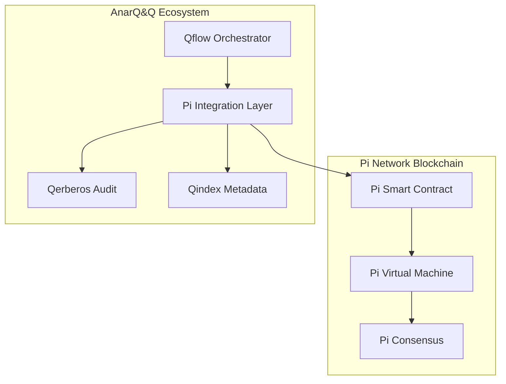

# Pi Smart Contracts Integration Guide

## Overview

This guide covers deploying and integrating Pi Network smart contracts with the AnarQ&Q ecosystem through Qflow workflows. Pi smart contracts enable decentralized applications to leverage Pi Network's blockchain while maintaining integration with Q∞ modules.

## Prerequisites

- Pi Network Developer Account with smart contract access
- Solidity development environment
- AnarQ&Q ecosystem setup (Qflow, Qerberos, Qindex)
- Pi testnet/mainnet access

## Smart Contract Architecture



## Contract Templates

### Basic Payment Contract

```solidity
// SPDX-License-Identifier: MIT
pragma solidity ^0.8.19;

import "@pi-network/contracts/PiToken.sol";
import "@pi-network/contracts/Ownable.sol";

contract QwalletPiPayment is Ownable {
    PiToken public piToken;
    
    event PaymentExecuted(
        address indexed from,
        address indexed to,
        uint256 amount,
        string qflowExecutionId,
        uint256 timestamp
    );
    
    event PaymentFailed(
        address indexed from,
        address indexed to,
        uint256 amount,
        string reason,
        string qflowExecutionId
    );
    
    constructor(address _piTokenAddress) {
        piToken = PiToken(_piTokenAddress);
    }
    
    function executePayment(
        address to,
        uint256 amount,
        string memory qflowExecutionId,
        bytes memory qerberosSignature
    ) external returns (bool) {
        require(to != address(0), "Invalid recipient address");
        require(amount > 0, "Amount must be greater than 0");
        require(bytes(qflowExecutionId).length > 0, "Qflow execution ID required");
        
        // Verify Qerberos signature
        require(verifyQerberosSignature(qflowExecutionId, qerberosSignature), "Invalid Qerberos signature");
        
        // Check balance
        require(piToken.balanceOf(msg.sender) >= amount, "Insufficient Pi balance");
        
        // Execute transfer
        bool success = piToken.transferFrom(msg.sender, to, amount);
        
        if (success) {
            emit PaymentExecuted(msg.sender, to, amount, qflowExecutionId, block.timestamp);
        } else {
            emit PaymentFailed(msg.sender, to, amount, "Transfer failed", qflowExecutionId);
        }
        
        return success;
    }
    
    function verifyQerberosSignature(
        string memory qflowExecutionId,
        bytes memory signature
    ) internal pure returns (bool) {
        // Implement Qerberos signature verification
        // This would integrate with the Qerberos audit system
        return true; // Simplified for example
    }
    
    function getBalance(address account) external view returns (uint256) {
        return piToken.balanceOf(account);
    }
}
```

### DAO Governance Contract

```solidity
// SPDX-License-Identifier: MIT
pragma solidity ^0.8.19;

contract QDAOGovernance {
    struct Proposal {
        uint256 id;
        string title;
        string description;
        address proposer;
        uint256 votesFor;
        uint256 votesAgainst;
        uint256 startTime;
        uint256 endTime;
        bool executed;
        string qflowWorkflowId;
    }
    
    mapping(uint256 => Proposal) public proposals;
    mapping(uint256 => mapping(address => bool)) public hasVoted;
    mapping(address => uint256) public votingPower;
    
    uint256 public proposalCount;
    uint256 public constant VOTING_PERIOD = 7 days;
    uint256 public constant EXECUTION_DELAY = 2 days;
    
    event ProposalCreated(
        uint256 indexed proposalId,
        string title,
        address indexed proposer,
        string qflowWorkflowId
    );
    
    event VoteCast(
        uint256 indexed proposalId,
        address indexed voter,
        bool support,
        uint256 votingPower
    );
    
    event ProposalExecuted(
        uint256 indexed proposalId,
        string qflowWorkflowId,
        bool success
    );
    
    function createProposal(
        string memory title,
        string memory description,
        string memory qflowWorkflowId
    ) external returns (uint256) {
        require(bytes(title).length > 0, "Title required");
        require(bytes(qflowWorkflowId).length > 0, "Qflow workflow ID required");
        
        proposalCount++;
        
        proposals[proposalCount] = Proposal({
            id: proposalCount,
            title: title,
            description: description,
            proposer: msg.sender,
            votesFor: 0,
            votesAgainst: 0,
            startTime: block.timestamp,
            endTime: block.timestamp + VOTING_PERIOD,
            executed: false,
            qflowWorkflowId: qflowWorkflowId
        });
        
        emit ProposalCreated(proposalCount, title, msg.sender, qflowWorkflowId);
        
        return proposalCount;
    }
    
    function vote(uint256 proposalId, bool support) external {
        Proposal storage proposal = proposals[proposalId];
        require(proposal.id != 0, "Proposal does not exist");
        require(block.timestamp <= proposal.endTime, "Voting period ended");
        require(!hasVoted[proposalId][msg.sender], "Already voted");
        
        uint256 power = votingPower[msg.sender];
        require(power > 0, "No voting power");
        
        hasVoted[proposalId][msg.sender] = true;
        
        if (support) {
            proposal.votesFor += power;
        } else {
            proposal.votesAgainst += power;
        }
        
        emit VoteCast(proposalId, msg.sender, support, power);
    }
    
    function executeProposal(uint256 proposalId) external returns (bool) {
        Proposal storage proposal = proposals[proposalId];
        require(proposal.id != 0, "Proposal does not exist");
        require(block.timestamp > proposal.endTime + EXECUTION_DELAY, "Execution delay not met");
        require(!proposal.executed, "Proposal already executed");
        require(proposal.votesFor > proposal.votesAgainst, "Proposal rejected");
        
        proposal.executed = true;
        
        // Trigger Qflow workflow execution
        bool success = triggerQflowExecution(proposal.qflowWorkflowId, proposalId);
        
        emit ProposalExecuted(proposalId, proposal.qflowWorkflowId, success);
        
        return success;
    }
    
    function triggerQflowExecution(
        string memory workflowId,
        uint256 proposalId
    ) internal returns (bool) {
        // This would integrate with Qflow to execute the approved proposal
        // Implementation would call Qflow API or emit event for Qflow to process
        return true; // Simplified for example
    }
}
```

### Identity Verification Contract

```solidity
// SPDX-License-Identifier: MIT
pragma solidity ^0.8.19;

contract sQuidPiIdentity {
    struct IdentityBinding {
        string squidId;
        address piAddress;
        uint256 bindingTime;
        bool verified;
        bytes32 bindingHash;
    }
    
    mapping(string => IdentityBinding) public squidBindings;
    mapping(address => string) public piToSquid;
    
    event IdentityBound(
        string indexed squidId,
        address indexed piAddress,
        bytes32 bindingHash,
        uint256 timestamp
    );
    
    event IdentityVerified(
        string indexed squidId,
        address indexed piAddress,
        bool verified
    );
    
    function bindIdentity(
        string memory squidId,
        bytes memory squidSignature,
        bytes memory qerberosAttestation
    ) external {
        require(bytes(squidId).length > 0, "sQuid ID required");
        require(squidBindings[squidId].piAddress == address(0), "sQuid already bound");
        
        // Verify sQuid signature
        require(verifySquidSignature(squidId, squidSignature), "Invalid sQuid signature");
        
        // Verify Qerberos attestation
        require(verifyQerberosAttestation(squidId, msg.sender, qerberosAttestation), "Invalid Qerberos attestation");
        
        bytes32 bindingHash = keccak256(abi.encodePacked(squidId, msg.sender, block.timestamp));
        
        squidBindings[squidId] = IdentityBinding({
            squidId: squidId,
            piAddress: msg.sender,
            bindingTime: block.timestamp,
            verified: false,
            bindingHash: bindingHash
        });
        
        piToSquid[msg.sender] = squidId;
        
        emit IdentityBound(squidId, msg.sender, bindingHash, block.timestamp);
    }
    
    function verifyIdentity(string memory squidId) external {
        IdentityBinding storage binding = squidBindings[squidId];
        require(binding.piAddress != address(0), "Identity not bound");
        require(!binding.verified, "Identity already verified");
        
        // Additional verification logic would go here
        // This could involve checking with sQuid service or Qerberos
        
        binding.verified = true;
        
        emit IdentityVerified(squidId, binding.piAddress, true);
    }
    
    function verifySquidSignature(
        string memory squidId,
        bytes memory signature
    ) internal pure returns (bool) {
        // Implement sQuid signature verification
        return true; // Simplified for example
    }
    
    function verifyQerberosAttestation(
        string memory squidId,
        address piAddress,
        bytes memory attestation
    ) internal pure returns (bool) {
        // Implement Qerberos attestation verification
        return true; // Simplified for example
    }
    
    function getBinding(string memory squidId) external view returns (IdentityBinding memory) {
        return squidBindings[squidId];
    }
}
```

## Deployment Guide

### Environment Configuration

```javascript
// Pi contract deployment configuration
const contractConfig = {
  sandbox: {
    rpcUrl: 'https://api.sandbox.minepi.com',
    chainId: 314159,
    gasPrice: '20000000000', // 20 gwei
    gasLimit: 8000000
  },
  testnet: {
    rpcUrl: 'https://api.testnet.minepi.com',
    chainId: 314159265,
    gasPrice: '25000000000', // 25 gwei
    gasLimit: 8000000
  },
  mainnet: {
    rpcUrl: 'https://api.mainnet.minepi.com',
    chainId: 314159265359,
    gasPrice: '30000000000', // 30 gwei
    gasLimit: 8000000
  }
};
```

### Deployment Script

```javascript
import { ethers } from 'ethers';
import { PiIntegrationLayer } from '../../../backend/services/PiIntegrationLayer.mjs';

class PiContractDeployer {
  constructor(environment = 'sandbox') {
    this.environment = environment;
    this.config = contractConfig[environment];
    this.piIntegration = new PiIntegrationLayer();
    this.piIntegration.setEnvironment(environment);
  }
  
  async deployContract(contractName, constructorArgs = []) {
    try {
      // Setup provider and wallet
      const provider = new ethers.JsonRpcProvider(this.config.rpcUrl);
      const wallet = new ethers.Wallet(process.env.PI_PRIVATE_KEY, provider);
      
      // Load contract artifacts
      const contractArtifact = await this.loadContractArtifact(contractName);
      
      // Create contract factory
      const contractFactory = new ethers.ContractFactory(
        contractArtifact.abi,
        contractArtifact.bytecode,
        wallet
      );
      
      // Deploy contract
      console.log(`Deploying ${contractName} to Pi ${this.environment}...`);
      
      const contract = await contractFactory.deploy(...constructorArgs, {
        gasPrice: this.config.gasPrice,
        gasLimit: this.config.gasLimit
      });
      
      await contract.waitForDeployment();
      
      const contractAddress = await contract.getAddress();
      console.log(`${contractName} deployed to: ${contractAddress}`);
      
      // Register with Pi Integration Layer
      await this.piIntegration.registerContract(contractName, contractAddress);
      
      // Log deployment to Qerberos
      await this.logDeployment(contractName, contractAddress, constructorArgs);
      
      return {
        contractName,
        address: contractAddress,
        transactionHash: contract.deploymentTransaction().hash,
        environment: this.environment
      };
      
    } catch (error) {
      console.error(`Failed to deploy ${contractName}:`, error);
      throw error;
    }
  }
  
  async loadContractArtifact(contractName) {
    // Load compiled contract artifacts
    const fs = await import('fs');
    const path = await import('path');
    
    const artifactPath = path.join(
      process.cwd(),
      'artifacts',
      'pi',
      'contracts',
      `${contractName}.json`
    );
    
    const artifact = JSON.parse(fs.readFileSync(artifactPath, 'utf8'));
    return artifact;
  }
  
  async logDeployment(contractName, address, constructorArgs) {
    const qerberosService = await import('../../../backend/services/QerberosIntegrationService.mjs');
    
    await qerberosService.logEvent({
      type: 'pi_contract_deployed',
      contractName,
      address,
      constructorArgs,
      environment: this.environment,
      timestamp: new Date().toISOString(),
      deployer: process.env.PI_DEPLOYER_ADDRESS
    });
  }
}

// Deploy all contracts
async function deployAllContracts() {
  const deployer = new PiContractDeployer(process.env.PI_ENVIRONMENT || 'sandbox');
  
  try {
    // Deploy payment contract
    const paymentContract = await deployer.deployContract('QwalletPiPayment', [
      process.env.PI_TOKEN_ADDRESS
    ]);
    
    // Deploy governance contract
    const governanceContract = await deployer.deployContract('QDAOGovernance');
    
    // Deploy identity contract
    const identityContract = await deployer.deployContract('sQuidPiIdentity');
    
    console.log('All contracts deployed successfully:');
    console.log('Payment:', paymentContract.address);
    console.log('Governance:', governanceContract.address);
    console.log('Identity:', identityContract.address);
    
    // Generate deployment report
    await generateDeploymentReport([
      paymentContract,
      governanceContract,
      identityContract
    ]);
    
  } catch (error) {
    console.error('Deployment failed:', error);
    process.exit(1);
  }
}

async function generateDeploymentReport(deployments) {
  const report = {
    timestamp: new Date().toISOString(),
    environment: process.env.PI_ENVIRONMENT || 'sandbox',
    deployments,
    gasEstimates: await generateGasEstimates(deployments)
  };
  
  const fs = await import('fs');
  fs.writeFileSync(
    `artifacts/pi/deployment-report-${Date.now()}.json`,
    JSON.stringify(report, null, 2)
  );
  
  console.log('Deployment report generated');
}
```

## Qflow Integration

### Contract Interaction Workflow

```javascript
// Qflow workflow for Pi contract interaction
const piContractWorkflow = {
  id: 'pi-contract-payment',
  name: 'Pi Contract Payment Workflow',
  steps: [
    {
      id: 'validate-payment',
      type: 'validation',
      service: 'qwallet',
      action: 'validatePaymentRequest',
      inputs: ['amount', 'recipient', 'squidId']
    },
    {
      id: 'check-pi-balance',
      type: 'query',
      service: 'pi-integration',
      action: 'checkPiBalance',
      inputs: ['piAddress']
    },
    {
      id: 'execute-pi-payment',
      type: 'transaction',
      service: 'pi-integration',
      action: 'executeContractPayment',
      inputs: ['contractAddress', 'amount', 'recipient', 'qflowExecutionId'],
      depends: ['validate-payment', 'check-pi-balance']
    },
    {
      id: 'audit-payment',
      type: 'audit',
      service: 'qerberos',
      action: 'logPaymentExecution',
      inputs: ['transactionHash', 'amount', 'recipient', 'squidId'],
      depends: ['execute-pi-payment']
    }
  ]
};

// Execute Pi contract workflow
async function executePiContractWorkflow(workflowData) {
  const qflowService = await import('../../../backend/services/QflowService.mjs');
  
  try {
    const execution = await qflowService.executeWorkflow(
      piContractWorkflow,
      workflowData
    );
    
    console.log('Pi contract workflow executed:', execution.id);
    return execution;
    
  } catch (error) {
    console.error('Pi contract workflow failed:', error);
    throw error;
  }
}
```

## Gas Estimation and Optimization

### Gas Estimation Tool

```javascript
class PiGasEstimator {
  constructor(environment) {
    this.environment = environment;
    this.config = contractConfig[environment];
  }
  
  async estimateDeploymentGas(contractName, constructorArgs = []) {
    const provider = new ethers.JsonRpcProvider(this.config.rpcUrl);
    const contractArtifact = await this.loadContractArtifact(contractName);
    
    const contractFactory = new ethers.ContractFactory(
      contractArtifact.abi,
      contractArtifact.bytecode
    );
    
    const deployTransaction = contractFactory.getDeployTransaction(...constructorArgs);
    const gasEstimate = await provider.estimateGas(deployTransaction);
    
    const gasPrice = BigInt(this.config.gasPrice);
    const estimatedCost = gasEstimate * gasPrice;
    
    return {
      gasEstimate: gasEstimate.toString(),
      gasPrice: gasPrice.toString(),
      estimatedCost: estimatedCost.toString(),
      estimatedCostEth: ethers.formatEther(estimatedCost)
    };
  }
  
  async estimateTransactionGas(contractAddress, methodName, args = []) {
    const provider = new ethers.JsonRpcProvider(this.config.rpcUrl);
    const contract = new ethers.Contract(contractAddress, contractAbi, provider);
    
    const gasEstimate = await contract[methodName].estimateGas(...args);
    const gasPrice = BigInt(this.config.gasPrice);
    const estimatedCost = gasEstimate * gasPrice;
    
    return {
      method: methodName,
      gasEstimate: gasEstimate.toString(),
      gasPrice: gasPrice.toString(),
      estimatedCost: estimatedCost.toString(),
      estimatedCostEth: ethers.formatEther(estimatedCost)
    };
  }
  
  async generateGasReport(contracts) {
    const report = {
      environment: this.environment,
      timestamp: new Date().toISOString(),
      gasPrice: this.config.gasPrice,
      estimates: {}
    };
    
    for (const contract of contracts) {
      report.estimates[contract.name] = await this.estimateDeploymentGas(
        contract.name,
        contract.constructorArgs || []
      );
    }
    
    return report;
  }
}
```

## Testing

### Contract Unit Tests

```javascript
import { describe, it, expect, beforeEach } from 'vitest';
import { ethers } from 'ethers';

describe('Pi Smart Contracts', () => {
  let paymentContract;
  let governanceContract;
  let identityContract;
  let owner;
  let user1;
  let user2;
  
  beforeEach(async () => {
    // Setup test environment
    [owner, user1, user2] = await ethers.getSigners();
    
    // Deploy test contracts
    const PaymentContract = await ethers.getContractFactory('QwalletPiPayment');
    paymentContract = await PaymentContract.deploy(process.env.PI_TOKEN_ADDRESS);
    
    const GovernanceContract = await ethers.getContractFactory('QDAOGovernance');
    governanceContract = await GovernanceContract.deploy();
    
    const IdentityContract = await ethers.getContractFactory('sQuidPiIdentity');
    identityContract = await IdentityContract.deploy();
  });
  
  describe('Payment Contract', () => {
    it('should execute payment successfully', async () => {
      const amount = ethers.parseEther('1.0');
      const qflowExecutionId = 'test-execution-123';
      const qerberosSignature = '0x1234'; // Mock signature
      
      await expect(
        paymentContract.executePayment(
          user2.address,
          amount,
          qflowExecutionId,
          qerberosSignature
        )
      ).to.emit(paymentContract, 'PaymentExecuted');
    });
    
    it('should fail payment with insufficient balance', async () => {
      const amount = ethers.parseEther('1000.0'); // Large amount
      const qflowExecutionId = 'test-execution-124';
      const qerberosSignature = '0x1234';
      
      await expect(
        paymentContract.executePayment(
          user2.address,
          amount,
          qflowExecutionId,
          qerberosSignature
        )
      ).to.be.revertedWith('Insufficient Pi balance');
    });
  });
  
  describe('Governance Contract', () => {
    it('should create proposal successfully', async () => {
      const title = 'Test Proposal';
      const description = 'Test proposal description';
      const qflowWorkflowId = 'test-workflow-123';
      
      await expect(
        governanceContract.createProposal(title, description, qflowWorkflowId)
      ).to.emit(governanceContract, 'ProposalCreated');
    });
    
    it('should allow voting on proposal', async () => {
      // Create proposal first
      await governanceContract.createProposal(
        'Test Proposal',
        'Description',
        'workflow-123'
      );
      
      // Set voting power
      await governanceContract.setVotingPower(user1.address, 100);
      
      // Vote on proposal
      await expect(
        governanceContract.connect(user1).vote(1, true)
      ).to.emit(governanceContract, 'VoteCast');
    });
  });
  
  describe('Identity Contract', () => {
    it('should bind sQuid identity successfully', async () => {
      const squidId = 'squid-test-123';
      const squidSignature = '0x5678'; // Mock signature
      const qerberosAttestation = '0x9abc'; // Mock attestation
      
      await expect(
        identityContract.bindIdentity(
          squidId,
          squidSignature,
          qerberosAttestation
        )
      ).to.emit(identityContract, 'IdentityBound');
    });
  });
});
```

### Integration Tests

```javascript
describe('Pi Contract Integration Tests', () => {
  it('should integrate with Qflow workflow', async () => {
    const piIntegration = new PiIntegrationLayer();
    piIntegration.setEnvironment('sandbox');
    
    // Deploy contract
    const contractAddress = await piIntegration.deployPiSmartContract(
      paymentContractCode,
      'pi-payment-workflow'
    );
    
    expect(contractAddress).toBeDefined();
    
    // Execute workflow
    const workflowResult = await qflowService.executeWorkflow(
      'pi-payment-workflow',
      {
        contractAddress,
        amount: '1.0',
        recipient: 'test-recipient'
      }
    );
    
    expect(workflowResult.success).toBe(true);
  });
});
```

## Monitoring and Analytics

### Contract Event Monitoring

```javascript
class PiContractMonitor {
  constructor(contractAddress, contractAbi) {
    this.contractAddress = contractAddress;
    this.contractAbi = contractAbi;
    this.provider = new ethers.JsonRpcProvider(process.env.PI_RPC_URL);
    this.contract = new ethers.Contract(contractAddress, contractAbi, this.provider);
  }
  
  async startMonitoring() {
    // Monitor payment events
    this.contract.on('PaymentExecuted', (from, to, amount, qflowExecutionId, timestamp) => {
      this.handlePaymentEvent({
        type: 'PaymentExecuted',
        from,
        to,
        amount: amount.toString(),
        qflowExecutionId,
        timestamp: timestamp.toString()
      });
    });
    
    // Monitor governance events
    this.contract.on('ProposalCreated', (proposalId, title, proposer, qflowWorkflowId) => {
      this.handleGovernanceEvent({
        type: 'ProposalCreated',
        proposalId: proposalId.toString(),
        title,
        proposer,
        qflowWorkflowId
      });
    });
    
    console.log(`Started monitoring Pi contract: ${this.contractAddress}`);
  }
  
  async handlePaymentEvent(event) {
    // Log to Qerberos
    await qerberosService.logEvent({
      type: 'pi_contract_payment',
      ...event,
      contractAddress: this.contractAddress
    });
    
    // Update metrics
    await observabilityService.recordMetric('pi.contract.payment.count', 1);
    await observabilityService.recordMetric('pi.contract.payment.amount', parseFloat(event.amount));
  }
  
  async handleGovernanceEvent(event) {
    // Log to Qerberos
    await qerberosService.logEvent({
      type: 'pi_contract_governance',
      ...event,
      contractAddress: this.contractAddress
    });
    
    // Trigger Qflow workflow if needed
    if (event.type === 'ProposalCreated') {
      await qflowService.triggerWorkflow(event.qflowWorkflowId, {
        proposalId: event.proposalId,
        contractAddress: this.contractAddress
      });
    }
  }
}
```

## Security Considerations

### Best Practices

1. **Access Control**: Use OpenZeppelin's access control patterns
2. **Reentrancy Protection**: Implement reentrancy guards
3. **Input Validation**: Validate all inputs and parameters
4. **Gas Optimization**: Optimize for gas efficiency
5. **Upgrade Patterns**: Use proxy patterns for upgradeable contracts

### Security Checklist

- [ ] All external calls are protected against reentrancy
- [ ] Input validation is implemented for all public functions
- [ ] Access control is properly implemented
- [ ] Gas limits are considered for all operations
- [ ] Contract upgrade mechanisms are secure
- [ ] Integration with Qerberos audit system is complete
- [ ] Pi Network signature verification is implemented
- [ ] Emergency pause mechanisms are in place

## Troubleshooting

### Common Issues

1. **Deployment Failures**: Check gas limits and network connectivity
2. **Transaction Reverts**: Verify contract state and input parameters
3. **Integration Issues**: Ensure Qflow workflows are properly configured
4. **Gas Estimation Errors**: Update gas price and limits for network conditions

### Debug Tools

```javascript
// Contract debugging utilities
class PiContractDebugger {
  static async debugTransaction(transactionHash) {
    const provider = new ethers.JsonRpcProvider(process.env.PI_RPC_URL);
    const receipt = await provider.getTransactionReceipt(transactionHash);
    
    console.log('Transaction Debug Info:');
    console.log('Status:', receipt.status);
    console.log('Gas Used:', receipt.gasUsed.toString());
    console.log('Logs:', receipt.logs);
    
    return receipt;
  }
  
  static async traceContractCall(contractAddress, methodName, args) {
    // Implementation would use Pi Network's tracing API
    console.log(`Tracing call to ${contractAddress}.${methodName}(${args.join(', ')})`);
  }
}
```

## Support Resources

- [Pi Network Smart Contract Documentation](https://developers.minepi.com/contracts)
- [Solidity Documentation](https://docs.soliditylang.org)
- [OpenZeppelin Contracts](https://docs.openzeppelin.com/contracts)
- AnarQ&Q Ecosystem Integration Guides