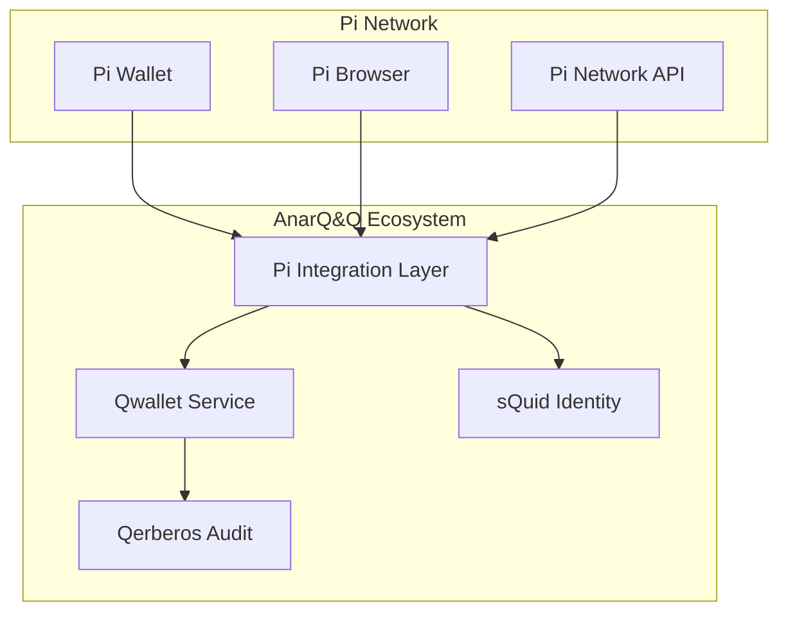

# Pi Wallet Integration Guide

## Overview

This guide provides comprehensive instructions for integrating Pi Wallet with the AnarQ&Q ecosystem through Qwallet. The integration enables seamless Pi Network transactions within the Q∞ module architecture.

## Prerequisites

- Pi Network Developer Account
- Pi Browser SDK access
- AnarQ&Q ecosystem setup (Qwallet, sQuid, Qerberos)
- Node.js 18+ environment

## Environment Setup

### Sandbox Environment
```bash
# Set Pi environment to sandbox
export PI_ENVIRONMENT=sandbox
export PI_API_KEY=your_sandbox_api_key
export PI_APP_ID=your_sandbox_app_id
```

### Testnet Environment
```bash
# Set Pi environment to testnet
export PI_ENVIRONMENT=testnet
export PI_API_KEY=your_testnet_api_key
export PI_APP_ID=your_testnet_app_id
```

### Mainnet Environment (Production)
```bash
# Set Pi environment to mainnet (feature flag protected)
export PI_ENVIRONMENT=mainnet
export PI_API_KEY=your_mainnet_api_key
export PI_APP_ID=your_mainnet_app_id
export PI_MAINNET_ENABLED=true
```

## Integration Architecture



## Code Examples

### Basic Pi Wallet Integration

```javascript
import { PiIntegrationLayer } from '../../../backend/services/PiIntegrationLayer.mjs';
import { QwalletIntegrationService } from '../../../backend/services/QwalletIntegrationService.mjs';

// Initialize Pi Integration
const piIntegration = new PiIntegrationLayer();
const qwalletService = new QwalletIntegrationService();

// Set environment (sandbox/testnet/mainnet)
piIntegration.setEnvironment('sandbox');

// Integrate Pi Wallet with Qwallet
async function integratePiWallet(qwalletInstance, piCredentials) {
  try {
    const integration = await piIntegration.integratePiWallet(
      qwalletInstance, 
      piCredentials
    );
    
    console.log('Pi Wallet integrated successfully:', integration.walletAddress);
    return integration;
  } catch (error) {
    console.error('Pi Wallet integration failed:', error);
    throw error;
  }
}
```

### Pi Identity Linking with sQuid

```javascript
// Link Pi identity with sQuid
async function linkPiIdentity(squidId, piUserId) {
  try {
    const binding = await piIntegration.linkPiIdentity(squidId, piUserId);
    
    // Verify the binding
    if (binding.verificationStatus === 'verified') {
      console.log('Pi identity linked successfully');
      
      // Log to Qerberos for audit
      await qerberosService.logEvent({
        type: 'pi_identity_linked',
        squidId,
        piUserId,
        bindingHash: binding.identityHash,
        timestamp: new Date().toISOString()
      });
    }
    
    return binding;
  } catch (error) {
    console.error('Pi identity linking failed:', error);
    throw error;
  }
}
```

### Pi Transaction Execution

```javascript
// Execute Pi transaction with Qflow context
async function executePiTransaction(transactionData, qflowContext) {
  try {
    // Validate transaction data
    const validation = await piIntegration.validateTransactionData(transactionData);
    if (!validation.valid) {
      throw new Error(`Invalid transaction: ${validation.errors.join(', ')}`);
    }
    
    // Execute transaction
    const result = await piIntegration.executePiTransaction(
      transactionData, 
      qflowContext
    );
    
    // Wait for confirmation
    const confirmation = await piIntegration.waitForConfirmation(
      result.transactionId,
      { timeout: 300000 } // 5 minutes
    );
    
    console.log('Pi transaction confirmed:', confirmation);
    return confirmation;
  } catch (error) {
    console.error('Pi transaction failed:', error);
    throw error;
  }
}
```

## Pi Browser Compatibility

### Content Security Policy (CSP) Validation

```javascript
// Check Pi Browser CSP compatibility
async function validatePiBrowserCSP() {
  try {
    const cspCheck = await piIntegration.checkPiBrowserCSP();
    
    if (!cspCheck.compliant) {
      console.warn('CSP issues detected:', cspCheck.violations);
      
      // Apply CSP fixes
      const fixes = await piIntegration.applyCspFixes(cspCheck.violations);
      console.log('Applied CSP fixes:', fixes);
    }
    
    return cspCheck;
  } catch (error) {
    console.error('CSP validation failed:', error);
    throw error;
  }
}
```

### Pi Browser API Compatibility

```javascript
// Validate Pi Browser API compatibility
async function validatePiBrowserCompatibility() {
  try {
    const compatibility = await piIntegration.validatePiBrowserCompatibility([
      '/api/qwallet/balance',
      '/api/qwallet/transfer',
      '/api/squid/identity',
      '/api/qerberos/audit'
    ]);
    
    if (compatibility.missingHeaders.length > 0) {
      console.warn('Missing headers for Pi Browser:', compatibility.missingHeaders);
    }
    
    return compatibility;
  } catch (error) {
    console.error('Pi Browser compatibility check failed:', error);
    throw error;
  }
}
```

## Webhook Security

### Signature Verification

```javascript
// Verify Pi Network webhook signatures
async function verifyPiWebhook(headers, body) {
  try {
    const verification = await piIntegration.verifyWebhookSignature(headers, body);
    
    if (!verification.valid) {
      throw new Error('Invalid webhook signature');
    }
    
    // Process webhook with Qonsent scopes
    const scopeValidation = await qonsentService.validateScopes(
      verification.principal,
      ['pi:webhook:receive', 'pi:transaction:notify']
    );
    
    if (!scopeValidation.authorized) {
      throw new Error('Insufficient Qonsent scopes for webhook');
    }
    
    return verification;
  } catch (error) {
    console.error('Webhook verification failed:', error);
    throw error;
  }
}
```

## Error Handling

### Common Error Scenarios

```javascript
// Comprehensive error handling for Pi integration
class PiIntegrationErrorHandler {
  static async handleError(error, context) {
    switch (error.code) {
      case 'PI_WALLET_NOT_FOUND':
        return await this.handleWalletNotFound(error, context);
      
      case 'PI_TRANSACTION_FAILED':
        return await this.handleTransactionFailure(error, context);
      
      case 'PI_IDENTITY_MISMATCH':
        return await this.handleIdentityMismatch(error, context);
      
      case 'PI_BROWSER_INCOMPATIBLE':
        return await this.handleBrowserIncompatibility(error, context);
      
      default:
        console.error('Unhandled Pi integration error:', error);
        throw error;
    }
  }
  
  static async handleWalletNotFound(error, context) {
    // Fallback to native Qwallet
    console.log('Pi Wallet not found, falling back to native Qwallet');
    return await qwalletService.createNativeWallet(context.userId);
  }
  
  static async handleTransactionFailure(error, context) {
    // Retry with exponential backoff
    const retryCount = context.retryCount || 0;
    if (retryCount < 3) {
      const delay = Math.pow(2, retryCount) * 1000;
      await new Promise(resolve => setTimeout(resolve, delay));
      
      return await piIntegration.executePiTransaction(
        context.transactionData,
        { ...context, retryCount: retryCount + 1 }
      );
    }
    
    throw new Error('Pi transaction failed after 3 retries');
  }
}
```

## Testing

### Unit Tests

```javascript
import { describe, it, expect, beforeEach } from 'vitest';
import { PiIntegrationLayer } from '../../../backend/services/PiIntegrationLayer.mjs';

describe('Pi Wallet Integration', () => {
  let piIntegration;
  
  beforeEach(() => {
    piIntegration = new PiIntegrationLayer();
    piIntegration.setEnvironment('sandbox');
  });
  
  it('should integrate Pi Wallet successfully', async () => {
    const mockQwallet = { userId: 'test-user', address: '0x123' };
    const mockPiCredentials = { apiKey: 'test-key', userId: 'pi-user' };
    
    const result = await piIntegration.integratePiWallet(
      mockQwallet, 
      mockPiCredentials
    );
    
    expect(result.walletAddress).toBeDefined();
    expect(result.integrationId).toBeDefined();
  });
  
  it('should link Pi identity with sQuid', async () => {
    const squidId = 'squid-123';
    const piUserId = 'pi-user-456';
    
    const binding = await piIntegration.linkPiIdentity(squidId, piUserId);
    
    expect(binding.verificationStatus).toBe('verified');
    expect(binding.identityHash).toBeDefined();
  });
});
```

### Integration Tests

```javascript
describe('Pi Network Integration Tests', () => {
  it('should execute Pi transaction on testnet', async () => {
    piIntegration.setEnvironment('testnet');
    
    const transactionData = {
      amount: 1.0,
      recipient: 'test-recipient',
      memo: 'Test transaction'
    };
    
    const qflowContext = {
      workflowId: 'test-workflow',
      executionId: 'test-execution'
    };
    
    const result = await piIntegration.executePiTransaction(
      transactionData,
      qflowContext
    );
    
    expect(result.transactionId).toBeDefined();
    expect(result.status).toBe('confirmed');
  });
});
```

## Performance Considerations

### Optimization Tips

1. **Connection Pooling**: Reuse Pi API connections
2. **Caching**: Cache Pi user data and wallet information
3. **Async Processing**: Use async/await for all Pi operations
4. **Timeout Handling**: Set appropriate timeouts for Pi API calls

### Monitoring

```javascript
// Monitor Pi integration performance
const performanceMetrics = {
  piWalletIntegrationTime: 0,
  piTransactionTime: 0,
  piIdentityLinkingTime: 0,
  errorRate: 0
};

// Track metrics
async function trackPiOperation(operation, operationFn) {
  const startTime = Date.now();
  
  try {
    const result = await operationFn();
    const duration = Date.now() - startTime;
    
    performanceMetrics[`${operation}Time`] = duration;
    
    // Send metrics to observability service
    await observabilityService.recordMetric(`pi.${operation}.duration`, duration);
    
    return result;
  } catch (error) {
    performanceMetrics.errorRate++;
    await observabilityService.recordMetric('pi.error.count', 1);
    throw error;
  }
}
```

## Security Best Practices

1. **Key Management**: Store Pi API keys in vault/environment variables
2. **Signature Verification**: Always verify webhook signatures
3. **Scope Validation**: Use Qonsent for permission management
4. **Audit Logging**: Log all Pi operations to Qerberos
5. **Environment Isolation**: Use feature flags for mainnet protection

## Troubleshooting

### Common Issues

1. **Pi Wallet Not Found**: User hasn't installed Pi Browser or wallet
2. **Transaction Timeout**: Pi Network congestion or insufficient balance
3. **Identity Mismatch**: sQuid and Pi identity not properly linked
4. **CSP Violations**: Pi Browser security policy conflicts

### Debug Mode

```javascript
// Enable debug mode for detailed logging
piIntegration.setDebugMode(true);

// This will log all Pi API calls and responses
const result = await piIntegration.executePiTransaction(transactionData, context);
```

## Support

For additional support:
- Check the [Pi Network Developer Documentation](https://developers.minepi.com)
- Review AnarQ&Q ecosystem logs in Qerberos
- Contact the development team through the DAO governance system