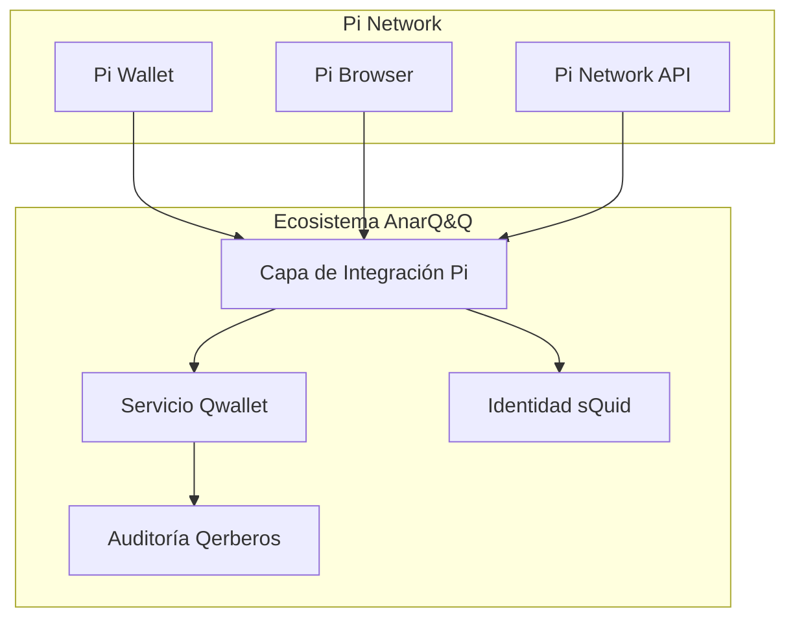

# Guía de Integración de Pi Wallet

## Descripción General

Esta guía proporciona instrucciones completas para integrar Pi Wallet con el ecosistema AnarQ&Q a través de Qwallet. La integración permite transacciones fluidas de Pi Network dentro de la arquitectura de módulos Q∞.

## Prerrequisitos

- Cuenta de Desarrollador de Pi Network
- Acceso al SDK de Pi Browser
- Configuración del ecosistema AnarQ&Q (Qwallet, sQuid, Qerberos)
- Entorno Node.js 18+

## Configuración del Entorno

### Entorno Sandbox
```bash
# Configurar entorno Pi a sandbox
export PI_ENVIRONMENT=sandbox
export PI_API_KEY=tu_clave_api_sandbox
export PI_APP_ID=tu_id_app_sandbox
```

### Entorno Testnet
```bash
# Configurar entorno Pi a testnet
export PI_ENVIRONMENT=testnet
export PI_API_KEY=tu_clave_api_testnet
export PI_APP_ID=tu_id_app_testnet
```

### Entorno Mainnet (Producción)
```bash
# Configurar entorno Pi a mainnet (protegido por feature flag)
export PI_ENVIRONMENT=mainnet
export PI_API_KEY=tu_clave_api_mainnet
export PI_APP_ID=tu_id_app_mainnet
export PI_MAINNET_ENABLED=true
```

## Arquitectura de Integración



## Ejemplos de Código

### Integración Básica de Pi Wallet

```javascript
import { PiIntegrationLayer } from '../../../backend/services/PiIntegrationLayer.mjs';
import { QwalletIntegrationService } from '../../../backend/services/QwalletIntegrationService.mjs';

// Inicializar integración Pi
const piIntegration = new PiIntegrationLayer();
const qwalletService = new QwalletIntegrationService();

// Configurar entorno (sandbox/testnet/mainnet)
piIntegration.setEnvironment('sandbox');

// Integrar Pi Wallet con Qwallet
async function integrarPiWallet(instanciaQwallet, credencialesPi) {
  try {
    const integracion = await piIntegration.integratePiWallet(
      instanciaQwallet, 
      credencialesPi
    );
    
    console.log('Pi Wallet integrado exitosamente:', integracion.walletAddress);
    return integracion;
  } catch (error) {
    console.error('Falló la integración de Pi Wallet:', error);
    throw error;
  }
}
```

### Vinculación de Identidad Pi con sQuid

```javascript
// Vincular identidad Pi con sQuid
async function vincularIdentidadPi(squidId, piUserId) {
  try {
    const vinculacion = await piIntegration.linkPiIdentity(squidId, piUserId);
    
    // Verificar la vinculación
    if (vinculacion.verificationStatus === 'verified') {
      console.log('Identidad Pi vinculada exitosamente');
      
      // Registrar en Qerberos para auditoría
      await qerberosService.logEvent({
        type: 'pi_identity_linked',
        squidId,
        piUserId,
        bindingHash: vinculacion.identityHash,
        timestamp: new Date().toISOString()
      });
    }
    
    return vinculacion;
  } catch (error) {
    console.error('Falló la vinculación de identidad Pi:', error);
    throw error;
  }
}
```

### Ejecución de Transacción Pi

```javascript
// Ejecutar transacción Pi con contexto Qflow
async function ejecutarTransaccionPi(datosTransaccion, contextoQflow) {
  try {
    // Validar datos de transacción
    const validacion = await piIntegration.validateTransactionData(datosTransaccion);
    if (!validacion.valid) {
      throw new Error(`Transacción inválida: ${validacion.errors.join(', ')}`);
    }
    
    // Ejecutar transacción
    const resultado = await piIntegration.executePiTransaction(
      datosTransaccion, 
      contextoQflow
    );
    
    // Esperar confirmación
    const confirmacion = await piIntegration.waitForConfirmation(
      resultado.transactionId,
      { timeout: 300000 } // 5 minutos
    );
    
    console.log('Transacción Pi confirmada:', confirmacion);
    return confirmacion;
  } catch (error) {
    console.error('Falló la transacción Pi:', error);
    throw error;
  }
}
```

## Compatibilidad con Pi Browser

### Validación de Política de Seguridad de Contenido (CSP)

```javascript
// Verificar compatibilidad CSP de Pi Browser
async function validarCSPPiBrowser() {
  try {
    const verificacionCSP = await piIntegration.checkPiBrowserCSP();
    
    if (!verificacionCSP.compliant) {
      console.warn('Problemas CSP detectados:', verificacionCSP.violations);
      
      // Aplicar correcciones CSP
      const correcciones = await piIntegration.applyCspFixes(verificacionCSP.violations);
      console.log('Correcciones CSP aplicadas:', correcciones);
    }
    
    return verificacionCSP;
  } catch (error) {
    console.error('Falló la validación CSP:', error);
    throw error;
  }
}
```

## Manejo de Errores

### Escenarios de Error Comunes

```javascript
// Manejo integral de errores para integración Pi
class ManejadorErroresIntegracionPi {
  static async manejarError(error, contexto) {
    switch (error.code) {
      case 'PI_WALLET_NOT_FOUND':
        return await this.manejarWalletNoEncontrado(error, contexto);
      
      case 'PI_TRANSACTION_FAILED':
        return await this.manejarFalloTransaccion(error, contexto);
      
      case 'PI_IDENTITY_MISMATCH':
        return await this.manejarDesajusteIdentidad(error, contexto);
      
      default:
        console.error('Error de integración Pi no manejado:', error);
        throw error;
    }
  }
  
  static async manejarWalletNoEncontrado(error, contexto) {
    // Recurrir a Qwallet nativo
    console.log('Pi Wallet no encontrado, recurriendo a Qwallet nativo');
    return await qwalletService.createNativeWallet(contexto.userId);
  }
}
```

## Pruebas

### Pruebas Unitarias

```javascript
import { describe, it, expect, beforeEach } from 'vitest';
import { PiIntegrationLayer } from '../../../backend/services/PiIntegrationLayer.mjs';

describe('Integración Pi Wallet', () => {
  let piIntegration;
  
  beforeEach(() => {
    piIntegration = new PiIntegrationLayer();
    piIntegration.setEnvironment('sandbox');
  });
  
  it('debería integrar Pi Wallet exitosamente', async () => {
    const mockQwallet = { userId: 'test-user', address: '0x123' };
    const mockPiCredentials = { apiKey: 'test-key', userId: 'pi-user' };
    
    const resultado = await piIntegration.integratePiWallet(
      mockQwallet, 
      mockPiCredentials
    );
    
    expect(resultado.walletAddress).toBeDefined();
    expect(resultado.integrationId).toBeDefined();
  });
  
  it('debería vincular identidad Pi con sQuid', async () => {
    const squidId = 'squid-123';
    const piUserId = 'pi-user-456';
    
    const vinculacion = await piIntegration.linkPiIdentity(squidId, piUserId);
    
    expect(vinculacion.verificationStatus).toBe('verified');
    expect(vinculacion.identityHash).toBeDefined();
  });
});
```

## Consideraciones de Rendimiento

### Consejos de Optimización

1. **Pooling de Conexiones**: Reutilizar conexiones de Pi API
2. **Caché**: Cachear datos de usuario Pi e información de wallet
3. **Procesamiento Asíncrono**: Usar async/await para todas las operaciones Pi
4. **Manejo de Timeouts**: Configurar timeouts apropiados para llamadas Pi API

## Mejores Prácticas de Seguridad

1. **Gestión de Claves**: Almacenar claves Pi API en vault/variables de entorno
2. **Verificación de Firmas**: Siempre verificar firmas de webhook
3. **Validación de Alcance**: Usar Qonsent para gestión de permisos
4. **Registro de Auditoría**: Registrar todas las operaciones Pi en Qerberos
5. **Aislamiento de Entorno**: Usar feature flags para protección de mainnet

## Solución de Problemas

### Problemas Comunes

1. **Pi Wallet No Encontrado**: Usuario no ha instalado Pi Browser o wallet
2. **Timeout de Transacción**: Congestión de Pi Network o saldo insuficiente
3. **Desajuste de Identidad**: Identidades sQuid y Pi no vinculadas correctamente
4. **Violaciones CSP**: Conflictos de política de seguridad de Pi Browser

### Modo Debug

```javascript
// Habilitar modo debug para registro detallado
piIntegration.setDebugMode(true);

// Esto registrará todas las llamadas y respuestas de Pi API
const resultado = await piIntegration.executePiTransaction(datosTransaccion, contexto);
```

## Soporte

Para soporte adicional:
- Consultar la [Documentación de Desarrolladores de Pi Network](https://developers.minepi.com)
- Revisar logs del ecosistema AnarQ&Q en Qerberos
- Contactar al equipo de desarrollo a través del sistema de gobernanza DAO