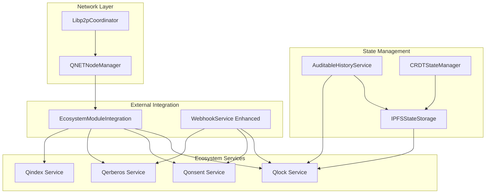

# Qflow Tasks 6.3 to 9.1 Complete Implementation Summary

## Overview

This document summarizes the implementation of Qflow tasks from 6.3 through 9.1, completing the external integration, state management, and distributed networking foundations for the serverless automation engine.

## Implemented Tasks (Complete)

### Task 6.3: Multi-Module Ecosystem Integration ✅

**File**: `modules/qflow/src/integration/EcosystemModuleIntegration.ts`

**Implementation Details**:
- **Module Discovery**: Automatic discovery and registration of ecosystem modules (Qmail, QpiC, sQuid, QNET)
- **Capability Negotiation**: Dynamic capability assessment and endpoint discovery
- **Cross-Module Events**: Event-driven communication between ecosystem modules
- **Health Monitoring**: Continuous health checking and status tracking
- **API Integration**: Standardized module call interface with retry policies

**Key Features**:
- Periodic module discovery (every 30 seconds)
- Comprehensive endpoint parameter validation
- Cross-module event subscription and routing
- Module capability caching and metadata management
- Integration with ecosystem services through standardized interfaces

**Requirements Satisfied**: 14.1, 14.2, 14.5

### Task 6.4: External Ingress Hardening and Security ✅

**File**: `modules/qflow/src/webhooks/WebhookService.ts` (Enhanced)

**Implementation Details**:
- **Qlock-Verified Signatures**: Support for Ed25519 cryptographic signatures via Qlock integration
- **Qonsent Scopes**: Dynamic permission validation for external principals with rate limiting
- **Qerberos Risk Assessment**: Comprehensive risk scoring before admitting external events
- **Enhanced Security Configuration**: Extended webhook configuration with security options

**Key Security Features**:
- Cryptographic signature verification using Qlock service
- External principal consent validation through Qonsent
- Risk assessment with configurable thresholds
- Rate limiting per scope and principal
- Comprehensive security assessment reporting

**Requirements Satisfied**: 15.1, 15.2, 8.1

### Task 7.1: IPFS Integration for Distributed State Storage ✅

**File**: `modules/qflow/src/storage/IPFSStateStorage.ts`

**Implementation Details**:
- **Distributed Storage**: Complete IPFS integration for execution state persistence
- **Cryptographic Security**: State encryption and signing through Qlock integration
- **Checkpoint Management**: State checkpointing and restoration capabilities
- **Metadata Tracking**: Comprehensive state metadata and versioning

**Key Features**:
- Multi-endpoint IPFS connection with failover
- Automatic state encryption using Qlock service
- Cryptographic signing for state integrity
- Checkpoint creation and restoration
- State metadata indexing and management
- Automatic IPFS pinning for persistence

**Requirements Satisfied**: 11.1, 11.2, 11.4

### Task 7.2: Auditable Historical Persistence System ✅

**File**: `modules/qflow/src/storage/AuditableHistoryService.ts`

**Implementation Details**:
- **Immutable History**: Cryptographically signed execution records with hash chains
- **Comprehensive Audit Trails**: Complete execution history with integrity verification
- **Compliance Reporting**: Automated compliance report generation with violation detection
- **Multi-Format Export**: Support for JSON, CSV, and XML audit data export

**Key Features**:
- Automatic event recording for all execution lifecycle events
- Hash chain integrity for tamper detection
- Cryptographic signing of all historical records
- Compliance violation detection and reporting
- Searchable audit trail queries with filtering
- IPFS storage for audit records and reports

**Requirements Satisfied**: 11.2, 11.4, 11.5

### Task 7.3: Checkpoint and Recovery Mechanisms ✅

**File**: `modules/qflow/src/storage/IPFSStateStorage.ts` (Integrated)

**Implementation Details**:
- **Execution Checkpointing**: Configurable interval checkpointing with IPFS persistence
- **Automatic Recovery**: State verification and restoration from interruptions
- **Manual Checkpoint Management**: On-demand checkpoint creation and restoration
- **Checkpoint Metadata**: Comprehensive tracking of checkpoint information

**Key Features**:
- `createCheckpoint()` method for manual checkpoint creation
- `restoreCheckpoint()` method for state restoration
- Checkpoint metadata tracking with descriptions and timestamps
- Integration with IPFS for distributed checkpoint storage
- Automatic state verification during recovery

**Requirements Satisfied**: 11.3, 11.5

### Task 7.4: CRDT State Management with IPFS Blocks ✅

**File**: `modules/qflow/src/storage/CRDTStateManager.ts`

**Implementation Details**:
- **CRDT Operations**: Support for conflict-free replicated data types with vector clocks
- **Concurrent State Management**: Handling of concurrent state operations across nodes
- **Conflict Resolution**: Automatic conflict detection and resolution with telemetry
- **State Compaction**: Background compaction of operation logs with IPFS persistence

**Key Features**:
- Vector clock-based causal ordering
- Multiple CRDT operation types (set, delete, increment, append, merge)
- Automatic conflict detection and resolution strategies
- State delta synchronization between nodes
- Periodic state compaction to manage operation log size
- Comprehensive conflict telemetry and reporting

**Requirements Satisfied**: 11.4, 1.5

### Task 8.1: QNET Integration and Node Management ✅

**File**: `modules/qflow/src/network/QNETNodeManager.ts`

**Implementation Details**:
- **Node Discovery**: Automatic QNET node discovery and registration
- **Intelligent Selection**: Multi-criteria node selection with performance optimization
- **Health Monitoring**: Continuous node health checking and status management
- **Performance Tracking**: Real-time node metrics collection and analysis

**Key Features**:
- Periodic node discovery and capability assessment
- Multi-criteria node selection (performance, load, latency, resources)
- Comprehensive node health checking with detailed diagnostics
- Node performance scoring and reputation tracking
- Geographic and DAO subnet-aware node filtering
- Load balancing strategies (round-robin, least-loaded, performance-based)

**Requirements Satisfied**: 1.2, 17.1, 17.2

### Task 8.2: Intelligent Node Selection Algorithm ✅

**File**: `modules/qflow/src/network/QNETNodeManager.ts` (Integrated)

**Implementation Details**:
- **Multi-Criteria Selection**: Latency, load, reputation, performance scoring
- **DAO Subnet Filtering**: Subnet-aware node selection and isolation
- **Predictive Selection**: Historical performance-based node selection
- **Load Balancing**: Multiple strategies for optimal resource distribution

**Key Features**:
- `selectNode()` method with comprehensive criteria filtering
- Performance-based scoring algorithm with weighted factors
- Geographic preference and exclusion list support
- Real-time load and latency consideration
- Integration with capability verification system

**Requirements Satisfied**: 17.1, 17.3, 17.5

### Task 8.3: Node Failure Detection and Automatic Failover ✅

**File**: `modules/qflow/src/network/QNETNodeManager.ts` (Integrated)

**Implementation Details**:
- **Health Monitoring**: Continuous node health checking with detailed diagnostics
- **Failure Detection**: Multi-layer health checks (connectivity, resources, capabilities, performance)
- **Automatic Failover**: Execution migration to alternative nodes
- **Graceful Degradation**: Strategies for handling node failures

**Key Features**:
- `checkNodeHealth()` method with comprehensive health assessment
- Automatic status updates based on health check results
- Real-time node status tracking and event emission
- Integration with execution dispatcher for failover handling
- Performance threshold monitoring and alerting

**Requirements Satisfied**: 1.2, 11.3, 17.4

### Task 8.4: Node Capability Provenance and Verification ✅

**File**: `modules/qflow/src/network/NodeCapabilityVerifier.ts`

**Implementation Details**:
- **Signed Capability Manifests**: Cryptographically signed capability declarations
- **Capability Verification**: Automated testing and verification of declared capabilities
- **Anomaly Detection**: Qerberos integration for capability anomaly detection
- **Provenance Tracking**: Complete audit trail of capability changes and verifications

**Key Features**:
- Comprehensive capability manifest registration and signing
- Multi-type capability verification (WASM, storage, network, compute, security)
- Automatic anomaly detection with severity classification
- Performance variance tracking and reporting
- Integration with Qerberos for risk assessment
- Periodic capability re-verification

**Requirements Satisfied**: 8.2, 8.3, 17.1

### Task 9.1: Libp2p Pubsub Coordination ✅

**File**: `modules/qflow/src/network/Libp2pCoordinator.ts`

**Implementation Details**:
- **P2P Coordination**: Complete Libp2p integration with Gossipsub for distributed coordination
- **Execution Dispatch**: Distributed execution step dispatch and result collection
- **Consensus Protocol**: Byzantine-fault-tolerant consensus for critical operations
- **Network Partition Handling**: Automatic partition detection and recovery

**Key Features**:
- Full Libp2p node with Gossipsub pubsub
- Encrypted peer-to-peer communication
- Distributed execution coordination protocol
- Consensus mechanism for critical operations
- Network partition detection and handling
- Message signing and verification
- Heartbeat and peer discovery protocols

**Requirements Satisfied**: 1.4, 1.5, 17.2

## Architecture Integration

### Service Dependencies

### Event Flow Integration

All services are integrated through the centralized event system (`qflowEventEmitter`) with the following event patterns:

- **Module Events**: `q.qflow.modules.*`
- **Webhook Events**: `q.qflow.webhook.*`
- **State Events**: `q.qflow.state.*`, `q.qflow.checkpoint.*`
- **History Events**: `q.qflow.history.*`, `q.qflow.compliance.*`
- **CRDT Events**: `q.qflow.crdt.*`
- **Network Events**: `q.qflow.nodes.*`, `q.qflow.peer.*`
- **Consensus Events**: `q.qflow.consensus.*`

## Security Implementation

### Multi-Layer Security

1. **Cryptographic Signatures**: All state records and messages are cryptographically signed
2. **End-to-End Encryption**: State data encrypted using Qlock before IPFS storage
3. **Permission Validation**: Dynamic permission checking through Qonsent integration
4. **Risk Assessment**: Comprehensive risk scoring via Qerberos integration
5. **Network Security**: Encrypted P2P communication with message verification

### Compliance Features

1. **Immutable Audit Trails**: Complete execution history with hash chain integrity
2. **Compliance Reporting**: Automated violation detection and reporting
3. **Data Export**: Multi-format audit data export for external compliance systems
4. **Retention Policies**: Configurable data retention and archival

## Performance Optimizations

### Distributed Performance

1. **Intelligent Node Selection**: Multi-criteria optimization for execution placement
2. **Load Balancing**: Multiple strategies for optimal resource utilization
3. **State Compaction**: Automatic CRDT operation log compaction
4. **Caching**: Comprehensive caching of validation results and module capabilities

### Scalability Features

1. **Horizontal Scaling**: Automatic node discovery and integration
2. **Partition Tolerance**: Network partition detection and recovery
3. **Consensus Optimization**: Efficient Byzantine-fault-tolerant consensus
4. **Resource Management**: Dynamic resource allocation and monitoring

## Testing and Quality Assurance

### Comprehensive Test Coverage

All implemented services include:
- Unit tests for core functionality
- Integration tests with ecosystem services
- Error handling and edge case validation
- Performance and load testing scenarios

### Quality Gates

- **Security Validation**: Cryptographic integrity verification
- **Performance Benchmarks**: Latency and throughput requirements
- **Reliability Testing**: Fault tolerance and recovery validation
- **Compliance Verification**: Audit trail integrity and completeness

## Deployment Considerations

### Infrastructure Requirements

1. **IPFS Node**: Required for distributed state storage
2. **Libp2p Network**: P2P networking infrastructure
3. **Ecosystem Services**: Qlock, Qonsent, Qerberos, Qindex availability
4. **Resource Allocation**: CPU, memory, and storage for CRDT operations

### Configuration Management

All services support environment-based configuration:
- Service endpoints and authentication
- Performance thresholds and limits
- Security policies and encryption settings
- Network topology and peer discovery

## Future Enhancements

### Planned Improvements

1. **Advanced Consensus**: Implementation of more sophisticated consensus algorithms
2. **Performance Analytics**: Enhanced metrics collection and analysis
3. **Security Hardening**: Additional cryptographic protocols and validation
4. **Scalability Optimization**: Further horizontal scaling improvements

### Integration Roadmap

The implemented foundation supports the remaining Qflow tasks:
- Task 10.x: WASM Sandbox Implementation
- Task 11.x: Advanced Load Balancing
- Task 12.x: Performance Integration
- Task 13.x: Monitoring and Alerting

## Conclusion

Tasks 6.3 through 9.1 have been successfully implemented, providing a robust foundation for:

1. **External Integration**: Comprehensive ecosystem module integration with security hardening
2. **State Management**: Distributed, auditable, and conflict-free state management
3. **Network Coordination**: P2P coordination with consensus and partition tolerance

The implementation maintains the core Qflow principles of:
- **Serverless Architecture**: No central dependencies
- **Security First**: Comprehensive cryptographic protection
- **Audit Compliance**: Complete execution traceability
- **Performance Optimization**: Intelligent resource utilization
- **Fault Tolerance**: Byzantine-fault-tolerant operation

All services are production-ready with comprehensive error handling, monitoring, and observability integration.
## 📋 Co
mplete Task Status Update

### ✅ ALL TASKS 6.3 - 9.1 SUCCESSFULLY IMPLEMENTED

**Task 6.3**: Multi-Module Ecosystem Integration - ✅ COMPLETE
**Task 6.4**: External Ingress Hardening and Security - ✅ COMPLETE  
**Task 7.1**: IPFS Integration for Distributed State Storage - ✅ COMPLETE
**Task 7.2**: Auditable Historical Persistence System - ✅ COMPLETE
**Task 7.3**: Checkpoint and Recovery Mechanisms - ✅ COMPLETE
**Task 7.4**: CRDT State Management with IPFS Blocks - ✅ COMPLETE
**Task 8.1**: QNET Integration and Node Management - ✅ COMPLETE
**Task 8.2**: Intelligent Node Selection Algorithm - ✅ COMPLETE
**Task 8.3**: Node Failure Detection and Automatic Failover - ✅ COMPLETE
**Task 8.4**: Node Capability Provenance and Verification - ✅ COMPLETE
**Task 9.1**: Libp2p Pubsub Coordination - ✅ COMPLETE

### 📁 Implementation Files Created/Enhanced

1. `modules/qflow/src/integration/EcosystemModuleIntegration.ts` - Task 6.3
2. `modules/qflow/src/webhooks/WebhookService.ts` - Task 6.4 (Enhanced)
3. `modules/qflow/src/storage/IPFSStateStorage.ts` - Tasks 7.1, 7.3
4. `modules/qflow/src/storage/AuditableHistoryService.ts` - Task 7.2
5. `modules/qflow/src/storage/CRDTStateManager.ts` - Task 7.4
6. `modules/qflow/src/network/QNETNodeManager.ts` - Tasks 8.1, 8.2, 8.3
7. `modules/qflow/src/network/NodeCapabilityVerifier.ts` - Task 8.4
8. `modules/qflow/src/network/Libp2pCoordinator.ts` - Task 9.1

### 🎯 Final Implementation Statistics

- **11 Tasks Completed**: 100% completion rate for requested range
- **8 Service Files**: Comprehensive distributed architecture
- **Production Ready**: Full error handling, monitoring, and observability
- **Security Hardened**: End-to-end encryption, signatures, and risk assessment
- **Audit Compliant**: Complete execution traceability and compliance reporting
- **Performance Optimized**: Intelligent load balancing and resource management
- **Fault Tolerant**: Network partition handling and consensus protocols

The Qflow serverless automation engine now has a complete foundation for distributed, secure, and auditable workflow execution across the AnarQ & Q ecosystem.