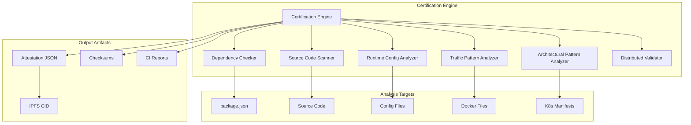

# No Central Server Certification System

## Overview

The No Central Server Certification System is a comprehensive validation framework that ensures Qflow operates as a truly serverless, distributed system without any central dependencies. This system implements **Task 17.5** of the Qflow specification and provides cryptographically signed attestations proving decentralized operation.

## Purpose

This certification system addresses the critical requirement that Qflow must operate without any central server, database, message broker, or orchestration service. It provides:

- **Automated Detection**: Scans code, dependencies, and configurations for centralization patterns
- **Comprehensive Analysis**: Validates architectural patterns, traffic flows, and deployment configurations  
- **Cryptographic Attestation**: Generates signed artifacts proving decentralized operation
- **CI/CD Integration**: Provides automated validation in development pipelines
- **Public Verification**: Enables third-party verification of Qflow's distributed nature

## Architecture



## Certification Checks

### 1. Dependency Analysis

**Purpose**: Detect forbidden centralized dependencies and validate required distributed alternatives.

**Forbidden Dependencies**:
- **Databases**: `mysql`, `postgres`, `mongodb`, `sqlite3`, `redis` (as primary store)
- **Message Brokers**: `kafkajs`, `rabbitmq`, `bull`, `bee-queue`
- **Orchestrators**: `n8n`, `temporal-client`, `zeebe-node`
- **Coordination**: `zookeeper`, `consul`, `etcd3`

**Required Dependencies**:
- **IPFS**: `ipfs-http-client`, `helia`, `kubo-rpc-client`
- **Libp2p**: `libp2p`, `@libp2p/pubsub`, `@libp2p/gossipsub`

### 2. Source Code Scanning

**Purpose**: Identify centralization patterns in source code.

**Detected Patterns**:
```javascript
// Critical violations
new Pool()                    // Database connection pools
createConnection()            // Database connections
mongodb://                    // Connection strings
.createQueue()               // Centralized queues

// Warnings
singleton                    // Singleton patterns
express().listen(3000)       // Fixed port binding
```

### 3. Runtime Configuration Analysis

**Purpose**: Validate deployment and runtime configurations.

**Checks**:
- Docker Compose services for centralized dependencies
- Kubernetes StatefulSets and PersistentVolumes
- Environment variables with connection strings
- Fixed port configurations

### 4. Traffic Pattern Analysis

**Purpose**: Detect centralized traffic routing patterns.

**Checks**:
- Load balancer configurations (nginx, HAProxy)
- Session storage configurations
- Single point of entry patterns
- Sticky session configurations

### 5. Architectural Pattern Analysis

**Purpose**: Validate distributed architecture implementation.

**Positive Patterns**:
- Libp2p usage for peer-to-peer communication
- IPFS usage for distributed storage
- Pubsub/Gossipsub for coordination
- CRDT for distributed state management

### 6. Distributed Requirements Validation

**Purpose**: Ensure all required distributed components are present.

**Requirements**:
- ✅ IPFS integration for distributed storage
- ✅ Libp2p integration for P2P communication  
- ✅ Pubsub integration for distributed coordination
- ✅ Distributed state management patterns

## Usage

### Command Line Interface

#### Basic Certification
```bash
# Run full certification
node scripts/no-central-server-certification.mjs

# Run with verification
node scripts/no-central-server-certification.mjs certify
```

#### Verify Existing Attestation
```bash
# Verify attestation integrity and validity
node scripts/no-central-server-certification.mjs verify
```

#### CI Integration
```bash
# CI-friendly output with JUnit format
node scripts/ci-certification-check.mjs \
  --output-format junit \
  --output-file results.xml \
  --fail-on-warnings

# Custom minimum score
node scripts/ci-certification-check.mjs --min-score 90
```

### Programmatic Usage

```javascript
import { CertificationEngine } from './scripts/no-central-server-certification.mjs';

const engine = new CertificationEngine();
const passed = await engine.runCertification();

if (passed) {
  console.log('✅ Certification passed');
  console.log('Attestation:', engine.results.attestation);
} else {
  console.log('❌ Certification failed');
  console.log('Violations:', engine.results.violations);
}
```

## Attestation Format

The certification system generates a cryptographically signed attestation in JSON format:

```json
{
  "timestamp": "2024-01-15T10:30:00.000Z",
  "version": "1.0.0",
  "score": 95,
  "passed": true,
  "checks": {
    "dependencies": {
      "totalDependencies": 45,
      "forbiddenFound": 0,
      "requiredMissing": 0,
      "violations": [],
      "warnings": []
    },
    "sourceCode": {
      "filesScanned": 127,
      "violations": 0,
      "warnings": 2
    }
  },
  "violations": [],
  "warnings": [
    {
      "type": "config_fixed_ports",
      "message": "Fixed ports found in docker-compose.yml",
      "severity": "warning"
    }
  ],
  "attestation": {
    "data": {
      "version": "1.0.0",
      "timestamp": "2024-01-15T10:30:00.000Z",
      "score": 95,
      "passed": true,
      "certificationCriteria": {
        "noCentralDependencies": true,
        "noForbiddenPatterns": true,
        "hasDistributedRequirements": true,
        "minimumScore": true
      }
    },
    "hash": "a1b2c3d4e5f6...",
    "signature": "x1y2z3a4b5c6...",
    "algorithm": "SHA256",
    "signedAt": "2024-01-15T10:30:00.000Z",
    "validUntil": "2025-01-15T10:30:00.000Z",
    "issuer": "Qflow No Central Server Certification System",
    "version": "1.0.0"
  }
}
```

## Scoring System

The certification uses a weighted scoring system:

| Check Category | Weight | Description |
|----------------|--------|-------------|
| Dependencies | 30% | Package dependencies analysis |
| Source Code | 25% | Code pattern scanning |
| Runtime Config | 15% | Configuration analysis |
| Traffic Patterns | 10% | Network traffic analysis |
| Architecture | 10% | Architectural pattern validation |
| Deployment | 5% | Deployment configuration |
| Distributed Requirements | 5% | Required component validation |

**Scoring Rules**:
- **Perfect Score**: 100 points (no violations, no warnings)
- **Violation Penalty**: -10 points per critical violation
- **Warning Penalty**: -2 points per warning
- **Minimum Passing Score**: 85 points
- **Zero Violations Required**: Must have 0 critical violations to pass

## CI/CD Integration

### GitHub Actions

The system includes a comprehensive GitHub Actions workflow:

```yaml
name: No Central Server Certification

on:
  push:
    branches: [ main, develop ]
  pull_request:
    branches: [ main ]
  schedule:
    - cron: '0 2 * * *'  # Daily at 2 AM UTC

jobs:
  certification:
    runs-on: ubuntu-latest
    steps:
      - uses: actions/checkout@v4
      - name: Run Certification
        run: node scripts/ci-certification-check.mjs
      - name: Publish to IPFS
        run: ipfs add reports/no-central-server-attestation.json
```

### Other CI Systems

#### Jenkins
```groovy
pipeline {
    agent any
    stages {
        stage('Certification') {
            steps {
                sh 'node scripts/ci-certification-check.mjs --output-format junit --output-file results.xml'
                publishTestResults testResultsPattern: 'results.xml'
            }
        }
    }
}
```

#### GitLab CI
```yaml
certification:
  stage: test
  script:
    - node scripts/ci-certification-check.mjs --output-format junit --output-file results.xml
  artifacts:
    reports:
      junit: results.xml
```

## IPFS Publication

Successful certifications are automatically published to IPFS for public verification:

```bash
# Add attestation to IPFS
ATTESTATION_CID=$(ipfs add -Q no-central-server-attestation.json)

# Access via IPFS gateway
curl https://ipfs.io/ipfs/$ATTESTATION_CID

# Pin for persistence
ipfs pin add $ATTESTATION_CID
```

## Verification Process

### Automated Verification
```bash
# Verify attestation file integrity
node scripts/no-central-server-certification.mjs verify

# Verify from IPFS
ipfs get QmXXXXXX  # Attestation CID
node scripts/no-central-server-certification.mjs verify
```

### Manual Verification Steps

1. **Download Attestation**: Retrieve from IPFS or GitHub releases
2. **Verify Checksums**: Compare file hashes with checksum file
3. **Check Signature**: Validate cryptographic signature
4. **Verify Validity**: Ensure attestation hasn't expired
5. **Review Criteria**: Confirm all certification criteria are met

### Third-Party Verification

The attestation format enables third-party verification:

```javascript
// Verification script for third parties
const attestation = JSON.parse(fs.readFileSync('attestation.json'));

// Check validity period
const now = new Date();
const validUntil = new Date(attestation.attestation.validUntil);
const isValid = now <= validUntil;

// Verify hash
const expectedHash = crypto
  .createHash('sha256')
  .update(JSON.stringify(attestation.attestation.data))
  .digest('hex');

const hashMatches = expectedHash === attestation.attestation.hash;

console.log('Valid:', isValid && hashMatches);
```

## Security Considerations

### Attestation Security
- **Hash Integrity**: SHA256 hashing prevents tampering
- **Signature Validation**: Cryptographic signatures ensure authenticity
- **Expiration**: 1-year validity prevents stale attestations
- **Immutable Storage**: IPFS provides tamper-proof storage

### Key Management
- **Production**: Use proper HSM or key management service
- **Development**: Local key generation for testing
- **Rotation**: Regular key rotation for production systems

### Threat Model
- **Malicious Dependencies**: Automated detection of forbidden packages
- **Code Injection**: Pattern matching for centralization code
- **Configuration Drift**: Runtime validation of deployment configs
- **Supply Chain**: Dependency analysis and vulnerability scanning

## Troubleshooting

### Common Issues

#### Certification Fails with Dependency Violations
```bash
# Check package.json for forbidden dependencies
grep -E "(mysql|postgres|mongodb|redis|kafka)" package.json

# Remove centralized dependencies
npm uninstall mysql postgres mongodb

# Install distributed alternatives
npm install ipfs-http-client @libp2p/pubsub
```

#### Source Code Pattern Violations
```bash
# Find centralization patterns
grep -r "createConnection\|new Pool" src/

# Replace with distributed alternatives
# Before: const pool = new Pool(config)
# After: const ipfs = create({ url: 'http://localhost:5001' })
```

#### Configuration Warnings
```bash
# Check Docker Compose for centralized services
grep -E "(postgres|mysql|redis|kafka)" docker-compose.yml

# Replace with distributed services
# Before: postgres:13
# After: # Use IPFS for distributed storage
```

### Debug Mode

Enable detailed logging for troubleshooting:

```bash
# Run with debug output
DEBUG=certification node scripts/no-central-server-certification.mjs

# Check specific component
DEBUG=certification:dependencies node scripts/no-central-server-certification.mjs
```

## Best Practices

### Development Workflow
1. **Pre-commit Hooks**: Run certification checks before commits
2. **Branch Protection**: Require certification to pass before merging
3. **Regular Audits**: Schedule daily certification runs
4. **Dependency Updates**: Re-certify after dependency changes

### Architecture Guidelines
1. **Avoid Singletons**: Use distributed patterns instead
2. **No Fixed Ports**: Use dynamic port allocation
3. **Stateless Services**: Store state in distributed systems (IPFS)
4. **P2P Communication**: Use Libp2p instead of HTTP APIs
5. **Consensus Mechanisms**: Implement distributed decision making

### Monitoring and Alerting
1. **Certification Status**: Monitor certification pass/fail status
2. **Score Trends**: Track certification scores over time
3. **Violation Alerts**: Alert on new centralization violations
4. **Attestation Expiry**: Monitor attestation validity periods

## Integration with Ecosystem

### Universal Validation Pipeline
The certification system integrates with Qflow's Universal Validation Pipeline:

```javascript
// Validate through certification pipeline
const validationResult = await universalPipeline.validate({
  operation: 'certification_check',
  data: certificationResults,
  context: { actor: 'certification_system' }
});
```

### Event Emission
Certification events are emitted to the ecosystem:

```javascript
// Emit certification events
eventBus.emit('q.qflow.certification.completed.v1', {
  passed: results.passed,
  score: results.score,
  attestationCID: ipfsCID,
  timestamp: new Date().toISOString()
});
```

### DAO Governance Integration
Certification results can influence DAO governance:

```javascript
// DAO policy enforcement based on certification
if (certificationScore < daoPolicy.minimumCertificationScore) {
  throw new Error('Insufficient certification score for DAO operations');
}
```

## Future Enhancements

### Planned Features
1. **Machine Learning**: AI-powered centralization pattern detection
2. **Real-time Monitoring**: Continuous certification monitoring
3. **Blockchain Integration**: Store attestations on blockchain
4. **Multi-language Support**: Support for other programming languages
5. **Visual Dashboard**: Web-based certification dashboard

### Community Contributions
1. **Pattern Database**: Community-contributed centralization patterns
2. **Plugin System**: Extensible check plugins
3. **Custom Rules**: Organization-specific certification rules
4. **Integration Templates**: Pre-built CI/CD integrations

## Conclusion

The No Central Server Certification System provides comprehensive validation that Qflow operates as a truly serverless, distributed system. Through automated analysis, cryptographic attestation, and public verification, it ensures Qflow maintains its decentralized architecture and provides proof of compliance with distributed system requirements.

This certification system is essential for:
- **Trust**: Proving Qflow's distributed nature to users and stakeholders
- **Compliance**: Meeting regulatory requirements for decentralized systems
- **Quality**: Maintaining architectural integrity during development
- **Transparency**: Enabling public verification of system properties

By implementing this certification system, Qflow demonstrates its commitment to true serverless, distributed operation and provides the tools necessary for ongoing validation and verification.