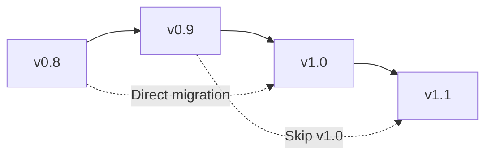

# Qmail Compatibility Matrix

This document defines the compatibility requirements and integration versions for the Qmail module.

## Module Dependencies

### Core Dependencies

| Module | Version | Status | Integration Type | Required Features |
|--------|---------|--------|------------------|-------------------|
| sQuid | v1.0.0+ | Required | HTTP/MCP | Identity verification, reputation |
| Qlock | v1.0.0+ | Required | MCP | Encryption, signatures, key management |
| Qonsent | v1.0.0+ | Required | HTTP/MCP | Permission checking, access control |
| Qindex | v1.0.0+ | Required | HTTP/MCP | Message indexing, search |
| Qerberos | v1.0.0+ | Required | HTTP/Events | Audit logging, spam detection |
| Qmask | v1.0.0+ | Optional | HTTP/MCP | Privacy profiles, anonymization |
| Qwallet | v1.0.0+ | Optional | HTTP/MCP | Premium services, payments |

### Infrastructure Dependencies

| Service | Version | Status | Purpose |
|---------|---------|--------|---------|
| IPFS | v0.20.0+ | Required | Decentralized storage |
| Node.js | v18.0.0+ | Required | Runtime environment |
| Express | v4.18.0+ | Required | HTTP server |
| Event Bus | v1.0.0+ | Required | Event publishing |

## Integration Compatibility

### sQuid Integration
```yaml
version: "1.0.0"
compatibility: "REQUIRED"
integration_type: "HTTP_API"
endpoints:
  - "/api/squid/verify"
  - "/api/squid/identity/{squidId}"
  - "/api/squid/reputation/{squidId}"
headers:
  required:
    - "x-squid-id"
    - "x-sig"
    - "x-ts"
  optional:
    - "x-subid"
features:
  - identity_verification
  - signature_validation
  - reputation_scoring
  - subidentity_support
fallback: "MOCK_SERVICE"
```

### Qlock Integration
```yaml
version: "1.0.0"
compatibility: "REQUIRED"
integration_type: "MCP_TOOLS"
tools:
  - "qlock.encrypt"
  - "qlock.decrypt"
  - "qlock.sign"
  - "qlock.verify"
  - "qlock.generateKey"
encryption_levels:
  - "STANDARD"
  - "HIGH"
  - "QUANTUM"
key_management:
  - "automatic_rotation"
  - "kms_integration"
  - "hsm_support"
fallback: "LOCAL_CRYPTO"
```

### Qonsent Integration
```yaml
version: "1.0.0"
compatibility: "REQUIRED"
integration_type: "HTTP_API"
endpoints:
  - "/api/qonsent/check"
  - "/api/qonsent/grant"
  - "/api/qonsent/revoke"
permissions:
  - "message.send"
  - "message.read"
  - "message.delete"
  - "admin.access"
policies:
  - "deny_by_default"
  - "granular_scoping"
  - "real_time_revocation"
fallback: "PERMISSIVE_MODE"
```

### Qindex Integration
```yaml
version: "1.0.0"
compatibility: "REQUIRED"
integration_type: "HTTP_API"
endpoints:
  - "/api/qindex/put"
  - "/api/qindex/get"
  - "/api/qindex/list"
  - "/api/qindex/search"
index_types:
  - "message_metadata"
  - "sender_index"
  - "recipient_index"
  - "thread_index"
  - "date_index"
search_features:
  - "encrypted_search"
  - "faceted_search"
  - "full_text_search"
fallback: "LOCAL_INDEX"
```

### Qerberos Integration
```yaml
version: "1.0.0"
compatibility: "REQUIRED"
integration_type: "HTTP_API_EVENTS"
endpoints:
  - "/api/qerberos/audit"
  - "/api/qerberos/analyze"
  - "/api/qerberos/risk-score"
events:
  - "q.qmail.sent.v1"
  - "q.qmail.delivered.v1"
  - "q.qmail.spam.detected.v1"
features:
  - "spam_detection"
  - "threat_analysis"
  - "audit_logging"
  - "risk_assessment"
fallback: "LOCAL_LOGGING"
```

### Qmask Integration
```yaml
version: "1.0.0"
compatibility: "OPTIONAL"
integration_type: "HTTP_API"
endpoints:
  - "/api/qmask/apply"
  - "/api/qmask/profile"
  - "/api/qmask/anonymize"
features:
  - "metadata_anonymization"
  - "privacy_profiles"
  - "gdpr_compliance"
  - "selective_masking"
fallback: "NO_MASKING"
```

### Qwallet Integration
```yaml
version: "1.0.0"
compatibility: "OPTIONAL"
integration_type: "HTTP_API"
endpoints:
  - "/api/qwallet/quote"
  - "/api/qwallet/pay"
  - "/api/qwallet/balance"
features:
  - "premium_messaging"
  - "certified_delivery_fees"
  - "storage_quota_billing"
  - "payment_verification"
fallback: "FREE_TIER_ONLY"
```

## API Compatibility

### HTTP API Versions
| Version | Status | Supported Until | Breaking Changes |
|---------|--------|-----------------|------------------|
| v1.0 | Current | 2025-12-31 | None |
| v0.9 | Deprecated | 2024-06-30 | Response format changes |
| v0.8 | Unsupported | 2024-01-31 | Authentication changes |

### MCP Tool Versions
| Tool | Version | Status | Changes |
|------|---------|--------|---------|
| qmail.send | v1.0 | Current | Initial release |
| qmail.fetch | v1.0 | Current | Initial release |
| qmail.receipt | v1.0 | Current | Initial release |
| qmail.search | v1.0 | Current | Initial release |

### Event Schema Versions
| Event | Version | Status | Compatibility |
|-------|---------|--------|---------------|
| q.qmail.sent.v1 | v1 | Current | Backward compatible |
| q.qmail.delivered.v1 | v1 | Current | Backward compatible |
| q.qmail.receipt.generated.v1 | v1 | Current | Backward compatible |

## Environment Compatibility

### Development Environment
```yaml
node_version: "18.0.0+"
npm_version: "8.0.0+"
docker_version: "20.0.0+"
docker_compose_version: "2.0.0+"
os_support:
  - "Linux (Ubuntu 20.04+)"
  - "macOS (12.0+)"
  - "Windows (WSL2)"
mock_services: "ENABLED"
external_dependencies: "MOCKED"
```

### Staging Environment
```yaml
node_version: "18.0.0+"
kubernetes_version: "1.24.0+"
helm_version: "3.8.0+"
external_services: "REQUIRED"
monitoring: "ENABLED"
logging: "CENTRALIZED"
```

### Production Environment
```yaml
node_version: "18.0.0+"
kubernetes_version: "1.24.0+"
high_availability: "REQUIRED"
load_balancing: "REQUIRED"
monitoring: "COMPREHENSIVE"
alerting: "24/7"
backup: "AUTOMATED"
disaster_recovery: "TESTED"
```

## Database Compatibility

### IPFS Compatibility
| IPFS Version | Status | Features |
|--------------|--------|----------|
| v0.20.0+ | Supported | Full feature set |
| v0.19.x | Limited | Basic storage only |
| v0.18.x | Unsupported | Security issues |

### Event Store Compatibility
| Event Store | Version | Status | Features |
|-------------|---------|--------|----------|
| Apache Kafka | 3.0+ | Preferred | High throughput |
| Redis Streams | 6.2+ | Supported | Simple setup |
| EventStore | 21.10+ | Supported | Event sourcing |

## Client Compatibility

### Web Browsers
| Browser | Version | Status | Features |
|---------|---------|--------|----------|
| Chrome | 100+ | Full | All features |
| Firefox | 98+ | Full | All features |
| Safari | 15+ | Full | All features |
| Edge | 100+ | Full | All features |

### Mobile Platforms
| Platform | Version | Status | Features |
|----------|---------|--------|----------|
| iOS | 15.0+ | Full | All features |
| Android | 11+ | Full | All features |
| React Native | 0.68+ | Full | All features |

### API Clients
| Client | Language | Version | Status |
|--------|----------|---------|--------|
| @anarq/qmail-js | JavaScript | 1.0.0+ | Official |
| @anarq/qmail-python | Python | 1.0.0+ | Official |
| @anarq/qmail-go | Go | 1.0.0+ | Community |
| @anarq/qmail-rust | Rust | 1.0.0+ | Community |

## Migration Compatibility

### Version Migration Paths


### Data Migration
| From Version | To Version | Migration Type | Downtime |
|--------------|------------|----------------|----------|
| v0.9 | v1.0 | Automatic | None |
| v0.8 | v1.0 | Manual | 30 minutes |
| v0.8 | v0.9 | Automatic | None |

### Configuration Migration
| Setting | v0.9 | v1.0 | Migration |
|---------|------|------|-----------|
| encryption_level | string | enum | Automatic |
| retention_days | number | ISO8601 | Manual |
| spam_threshold | 0-100 | 0.0-1.0 | Automatic |

## Testing Compatibility

### Test Framework Versions
| Framework | Version | Purpose |
|-----------|---------|---------|
| Vitest | 1.0+ | Unit testing |
| Supertest | 6.3+ | API testing |
| Playwright | 1.30+ | E2E testing |
| Jest | 29.0+ | Legacy support |

### Mock Service Compatibility
| Service | Mock Version | Real Version | Compatibility |
|---------|--------------|--------------|---------------|
| sQuid | 1.0.0 | 1.0.0+ | 100% |
| Qlock | 1.0.0 | 1.0.0+ | 100% |
| Qonsent | 1.0.0 | 1.0.0+ | 100% |
| Qindex | 1.0.0 | 1.0.0+ | 100% |

## Performance Compatibility

### Minimum Requirements
| Metric | Development | Staging | Production |
|--------|-------------|---------|------------|
| CPU | 2 cores | 4 cores | 8 cores |
| Memory | 4GB | 8GB | 16GB |
| Storage | 20GB | 100GB | 1TB |
| Network | 100Mbps | 1Gbps | 10Gbps |

### Scalability Limits
| Component | Max Throughput | Max Storage | Max Connections |
|-----------|----------------|-------------|-----------------|
| Message Processing | 10K msg/sec | 10TB | 100K concurrent |
| IPFS Storage | 1GB/sec | Unlimited | 10K nodes |
| Event Publishing | 100K events/sec | 1PB | 1M subscribers |

## Security Compatibility

### TLS Versions
| Version | Status | Usage |
|---------|--------|-------|
| TLS 1.3 | Required | All connections |
| TLS 1.2 | Deprecated | Legacy clients only |
| TLS 1.1 | Unsupported | Security risk |

### Cryptographic Standards
| Algorithm | Key Size | Status | Usage |
|-----------|----------|--------|-------|
| AES-GCM | 256-bit | Current | Message encryption |
| RSA | 4096-bit | Current | Key exchange |
| ECDSA | P-384 | Current | Signatures |
| Kyber | 1024-bit | Future | Post-quantum |

## Monitoring Compatibility

### Metrics Systems
| System | Version | Status | Features |
|--------|---------|--------|----------|
| Prometheus | 2.40+ | Preferred | Full metrics |
| Grafana | 9.0+ | Preferred | Dashboards |
| DataDog | Latest | Supported | APM |
| New Relic | Latest | Supported | APM |

### Logging Systems
| System | Version | Status | Features |
|--------|---------|--------|----------|
| ELK Stack | 8.0+ | Preferred | Full logging |
| Fluentd | 1.15+ | Supported | Log forwarding |
| Splunk | 9.0+ | Supported | Enterprise |