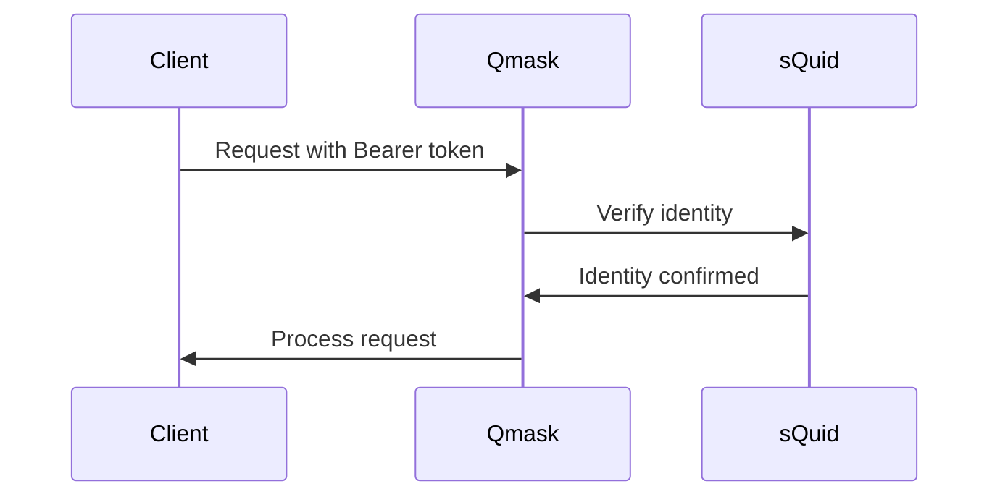
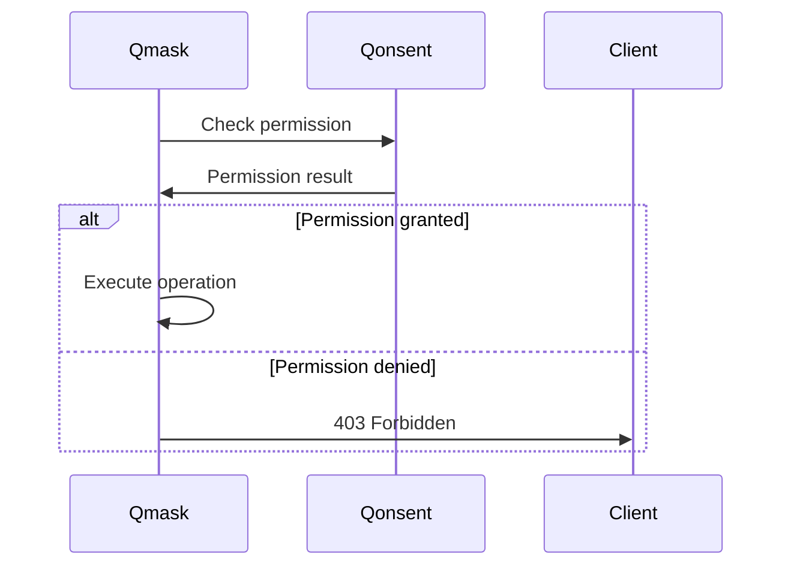
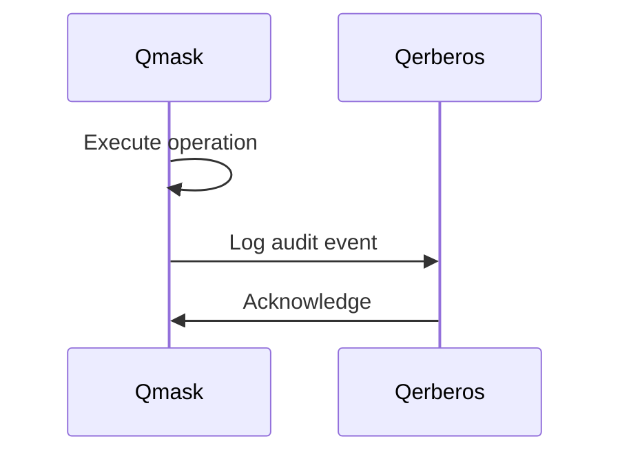

# Qmask Compatibility Matrix

## Module Dependencies

### Core Dependencies

| Module | Version | Purpose | Integration Type | Required |
|--------|---------|---------|------------------|----------|
| sQuid | 2.0.0+ | Identity verification | HTTP API | Yes |
| Qonsent | 2.0.0+ | Permission checking | HTTP API | Yes |
| Qerberos | 2.0.0+ | Audit logging | HTTP API | Yes |
| Qindex | 2.0.0+ | Content indexing | HTTP API | Optional |
| Qlock | 2.0.0+ | Encryption services | HTTP API | Optional |

### External Dependencies

| Service | Version | Purpose | Integration Type | Required |
|---------|---------|---------|------------------|----------|
| MongoDB | 7.0+ | Primary database | Direct connection | Yes |
| Redis | 7.0+ | Caching and sessions | Direct connection | Yes |
| IPFS | 0.20+ | Content storage | HTTP API | Optional |

## API Compatibility

### HTTP API Versions

| Version | Status | Supported Until | Breaking Changes | Migration Guide |
|---------|--------|-----------------|------------------|-----------------|
| v1 | Deprecated | 2024-12-31 | Profile schema changes | [v1-to-v2-migration.md] |
| v2 | Current | Active | N/A | N/A |

### MCP Tool Versions

| Tool | Version | Status | Supported Until | Changes |
|------|---------|--------|-----------------|---------|
| qmask.apply | 1.0 | Current | Active | Initial release |
| qmask.profile | 1.0 | Current | Active | Initial release |
| qmask.assess | 1.0 | Current | Active | Initial release |

## Event Schema Compatibility

### Published Events

| Event | Schema Version | Status | Backward Compatible | Forward Compatible |
|-------|----------------|--------|--------------------|--------------------|
| q.qmask.applied.v1 | 1.0 | Current | Yes | Yes |
| q.qmask.profile.created.v1 | 1.0 | Current | Yes | Yes |
| q.qmask.profile.updated.v1 | 1.0 | Current | Yes | Yes |
| q.qmask.profile.deleted.v1 | 1.0 | Current | Yes | Yes |
| q.qmask.assessment.completed.v1 | 1.0 | Current | Yes | Yes |
| q.qmask.dsr.created.v1 | 1.0 | Current | Yes | Yes |
| q.qmask.dsr.completed.v1 | 1.0 | Current | Yes | Yes |

### Consumed Events

| Event | Source Module | Schema Version | Handler Status |
|-------|---------------|----------------|----------------|
| q.squid.identity.updated.v1 | sQuid | 1.0 | Implemented |
| q.qonsent.permission.revoked.v1 | Qonsent | 1.0 | Planned |

## Database Schema Compatibility

### MongoDB Collections

| Collection | Schema Version | Indexes | Migration Required |
|------------|----------------|---------|-------------------|
| privacy_profiles | 2.0 | name, createdBy, tags | No |
| privacy_assessments | 2.0 | assessmentId, assessedBy | No |
| masking_operations | 2.0 | timestamp, actor | No |

### Schema Evolution

| Version | Changes | Migration Script | Rollback Supported |
|---------|---------|------------------|-------------------|
| 2.0 | Initial schema | N/A | N/A |
| 2.1 | Add compliance flags | migrate-2.0-to-2.1.js | Yes |

## Integration Patterns

### Authentication Flow



### Permission Check Flow



### Audit Logging Flow



## Version Support Policy

### Support Lifecycle

| Phase | Duration | Support Level | Updates |
|-------|----------|---------------|---------|
| Current | 18 months | Full support | Features, security, bugs |
| Maintenance | 12 months | Security only | Critical security fixes |
| End of Life | N/A | No support | No updates |

### Deprecation Process

1. **Announcement**: 6 months advance notice
2. **Warning Phase**: Deprecation warnings in responses
3. **Maintenance Phase**: Security fixes only
4. **End of Life**: Complete removal

## Environment Compatibility

### Deployment Environments

| Environment | Node.js | MongoDB | Redis | IPFS | Status |
|-------------|---------|---------|-------|------|--------|
| Development | 18+ | 7.0+ | 7.0+ | 0.20+ | Supported |
| Staging | 18+ | 7.0+ | 7.0+ | 0.20+ | Supported |
| Production | 20+ | 7.0+ | 7.0+ | 0.20+ | Supported |

### Container Compatibility

| Platform | Version | Status | Notes |
|----------|---------|--------|-------|
| Docker | 24.0+ | Supported | Official images |
| Kubernetes | 1.25+ | Supported | Helm charts available |
| Docker Compose | 2.0+ | Supported | Development setup |

## Testing Compatibility

### Test Framework Versions

| Framework | Version | Purpose | Status |
|-----------|---------|---------|--------|
| Vitest | 1.0+ | Unit testing | Current |
| Supertest | 6.3+ | API testing | Current |
| MongoDB Memory Server | 9.0+ | Database testing | Current |

### Contract Testing

| Consumer | Provider | Contract Version | Status |
|----------|----------|------------------|--------|
| Frontend | Qmask API | 2.0 | Active |
| Qerberos | Qmask Events | 1.0 | Active |
| Qindex | Qmask Events | 1.0 | Active |

## Migration Guides

### API Version Migration

#### v1 to v2 Migration

**Breaking Changes:**
- Profile schema updated with compliance flags
- Error response format standardized
- Authentication header format changed

**Migration Steps:**
1. Update client libraries to v2
2. Modify profile creation to include compliance flags
3. Update error handling for new response format
4. Test all integrations thoroughly

### Database Migration

#### Schema Version 2.0 to 2.1

**Changes:**
- Add `complianceFlags` array to privacy_profiles collection
- Add index on `complianceFlags` field

**Migration Script:**
```javascript
// Add complianceFlags field to existing profiles
db.privacy_profiles.updateMany(
  { complianceFlags: { $exists: false } },
  { $set: { complianceFlags: [] } }
);

// Create index
db.privacy_profiles.createIndex({ complianceFlags: 1 });
```

## Troubleshooting

### Common Integration Issues

| Issue | Cause | Solution |
|-------|-------|----------|
| Authentication failures | Invalid sQuid token | Verify token format and expiration |
| Permission denied | Missing Qonsent permissions | Check permission grants |
| Slow response times | Database connection issues | Monitor connection pool |
| Event publishing failures | Qerberos unavailable | Implement retry logic |

### Compatibility Validation

| Check | Command | Expected Result |
|-------|---------|-----------------|
| API version | `curl /api/v1/health` | Version 2.0.0 |
| Database schema | `db.privacy_profiles.findOne()` | Contains required fields |
| Event publishing | Check Qerberos logs | Events received |
| MCP tools | Test tool invocation | Successful response |