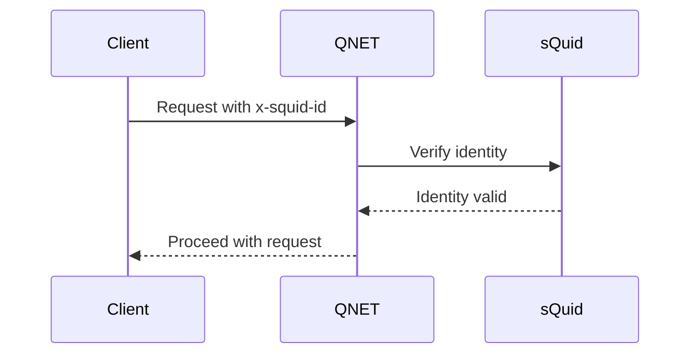
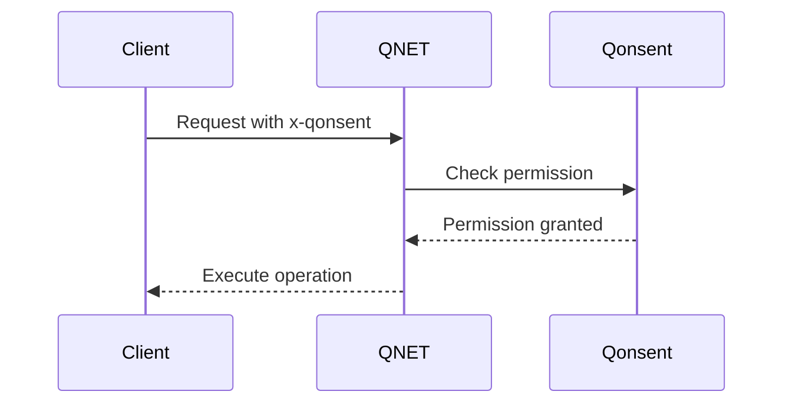
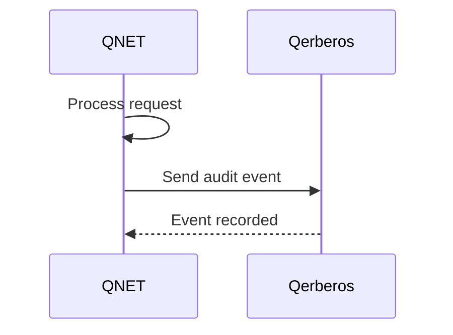

# QNET Compatibility Matrix

This document defines compatibility requirements and version support for QNET integration with other Q ecosystem modules.

## Module Integration Compatibility

### Core Dependencies

| Module | Version | Compatibility | Status | Notes |
|--------|---------|---------------|--------|-------|
| sQuid | v1.0+ | Required | ✅ Active | Identity verification |
| Qonsent | v1.0+ | Required | ✅ Active | Permission checking |
| Qlock | v1.0+ | Optional | ✅ Active | Data encryption |
| Qerberos | v1.0+ | Recommended | ✅ Active | Security monitoring |
| Qindex | v1.0+ | Optional | ✅ Active | Network indexing |

### Optional Integrations

| Module | Version | Compatibility | Status | Notes |
|--------|---------|---------------|--------|-------|
| Qwallet | v1.0+ | Optional | ✅ Active | Payment processing |
| Qmask | v1.0+ | Optional | ✅ Active | Privacy protection |
| Qdrive | v1.0+ | Optional | ✅ Active | File storage routing |
| Qmarket | v1.0+ | Optional | ✅ Active | Content delivery |
| Qmail | v1.0+ | Optional | ✅ Active | Message routing |

## API Version Compatibility

### HTTP API Versions

| Version | Status | Supported Until | Breaking Changes | Migration Guide |
|---------|--------|-----------------|------------------|-----------------|
| v1.0 | Current | TBD | None | N/A |
| v0.9 | Deprecated | 2024-06-01 | Authentication headers | [Migration Guide](./migrations/v0.9-to-v1.0.md) |

### MCP Tool Versions

| Tool | Version | Status | Supported Until | Changes |
|------|---------|--------|-----------------|---------|
| qnet.ping | v1.0 | Current | TBD | Initial release |
| qnet.capabilities | v1.0 | Current | TBD | Initial release |
| qnet.status | v1.0 | Current | TBD | Initial release |

### Event Schema Versions

| Event | Version | Status | Supported Until | Schema Changes |
|-------|---------|--------|-----------------|----------------|
| q.qnet.node.joined.v1 | v1.0 | Current | TBD | Initial schema |
| q.qnet.node.left.v1 | v1.0 | Current | TBD | Initial schema |
| q.qnet.node.alert.v1 | v1.0 | Current | TBD | Initial schema |
| q.qnet.topology.changed.v1 | v1.0 | Current | TBD | Initial schema |

## Integration Patterns

### Authentication Flow


### Authorization Flow


### Audit Flow


## Environment Compatibility

### Development Environment
- **Node.js**: 18.x or higher
- **Docker**: 20.x or higher
- **Docker Compose**: 2.x or higher
- **Operating System**: Linux, macOS, Windows (WSL2)

### Production Environment
- **Container Runtime**: Kubernetes 1.24+, Docker Swarm 20.x+
- **Load Balancer**: NGINX 1.20+, HAProxy 2.4+, AWS ALB, GCP Load Balancer
- **Service Mesh**: Istio 1.15+, Linkerd 2.12+ (optional)
- **Monitoring**: Prometheus 2.37+, Grafana 9.0+ (optional)

### Cloud Platforms
- **AWS**: EKS 1.24+, Lambda (Node.js 18.x), ALB, CloudWatch
- **Google Cloud**: GKE 1.24+, Cloud Functions, Cloud Load Balancing
- **Azure**: AKS 1.24+, Azure Functions, Application Gateway
- **Self-hosted**: Kubernetes 1.24+, Docker Swarm 20.x+

## Network Requirements

### Ports and Protocols
- **HTTP API**: Port 3014 (configurable)
- **Health Check**: Same as HTTP API port
- **Inter-node Communication**: HTTPS (443), custom ports for mesh
- **Monitoring**: Prometheus metrics on /metrics endpoint

### Firewall Rules
```
# Inbound
Allow TCP 3014 from load balancer
Allow TCP 443 from other QNET nodes
Allow ICMP from monitoring systems

# Outbound
Allow TCP 443 to sQuid service
Allow TCP 443 to Qonsent service
Allow TCP 443 to Qerberos service
Allow TCP 443 to IPFS nodes
```

### DNS Requirements
- **Service Discovery**: Internal DNS for service-to-service communication
- **External Access**: Public DNS for client access (optional)
- **Health Checks**: DNS resolution for dependency services

## Data Format Compatibility

### Request/Response Formats
- **Content-Type**: `application/json` (primary), `text/plain` (health checks)
- **Character Encoding**: UTF-8
- **Date Format**: ISO 8601 (RFC 3339)
- **UUID Format**: RFC 4122 v4

### Event Formats
- **Event Schema**: JSON Schema Draft 7
- **Event Naming**: `q.qnet.<action>.<version>` pattern
- **Timestamp Format**: ISO 8601 with timezone
- **Event ID**: UUID v4

## Security Compatibility

### TLS/SSL Requirements
- **Minimum Version**: TLS 1.2
- **Recommended Version**: TLS 1.3
- **Cipher Suites**: ECDHE-RSA-AES256-GCM-SHA384, ECDHE-RSA-AES128-GCM-SHA256
- **Certificate**: Valid X.509 certificate from trusted CA

### Authentication Methods
- **Primary**: sQuid identity with cryptographic signatures
- **Fallback**: API key authentication (development only)
- **Headers**: Standard Q ecosystem headers (x-squid-id, x-sig, etc.)

### Authorization Mechanisms
- **Primary**: Qonsent UCAN tokens
- **Fallback**: Role-based access control (development only)
- **Granularity**: Operation-level permissions

## Performance Requirements

### Latency Targets
- **P50**: < 50ms for read operations
- **P95**: < 150ms for write operations
- **P99**: < 200ms for complex operations

### Throughput Targets
- **Requests per Second**: 1000+ per node
- **Concurrent Connections**: 500+ per node
- **Data Transfer**: 1Gbps+ per node

### Resource Limits
- **Memory**: 512MB minimum, 2GB recommended
- **CPU**: 1 core minimum, 2 cores recommended
- **Storage**: 10GB minimum, 100GB recommended
- **Network**: 100Mbps minimum, 1Gbps recommended

## Monitoring and Observability

### Metrics Compatibility
- **Format**: Prometheus metrics format
- **Labels**: Consistent labeling across Q ecosystem
- **Retention**: 30 days minimum, 1 year recommended

### Logging Compatibility
- **Format**: Structured JSON logs
- **Level**: Configurable (debug, info, warn, error)
- **Destination**: stdout/stderr, file, syslog, centralized logging

### Tracing Compatibility
- **Standard**: OpenTelemetry
- **Propagation**: W3C Trace Context
- **Sampling**: Configurable sampling rates

## Upgrade and Migration

### Rolling Updates
- **Zero Downtime**: Supported with proper load balancing
- **Backward Compatibility**: Maintained for one major version
- **Health Checks**: Kubernetes-style readiness/liveness probes

### Data Migration
- **Schema Evolution**: Backward compatible schema changes
- **Data Retention**: Configurable retention policies
- **Backup/Restore**: IPFS-based backup and restore procedures

### Rollback Procedures
- **Configuration**: Git-based configuration management
- **Database**: Point-in-time recovery capabilities
- **Service**: Blue-green deployment support