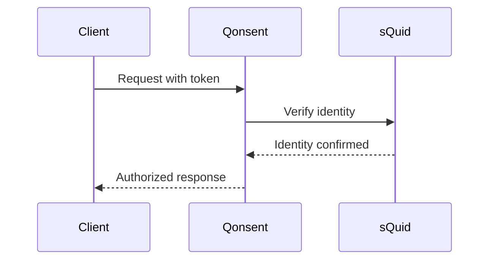
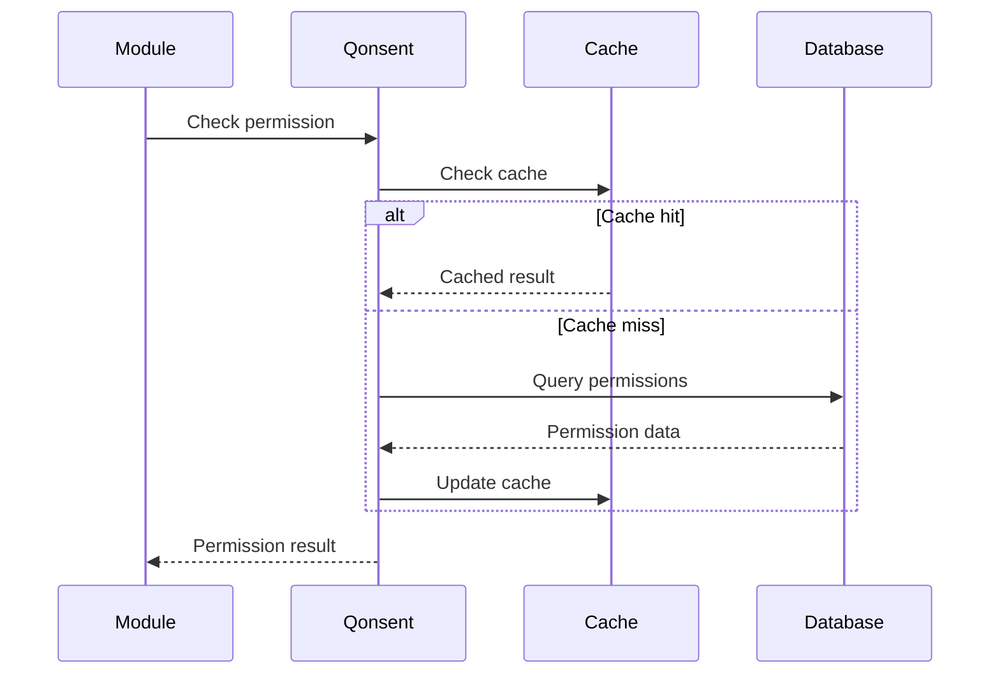
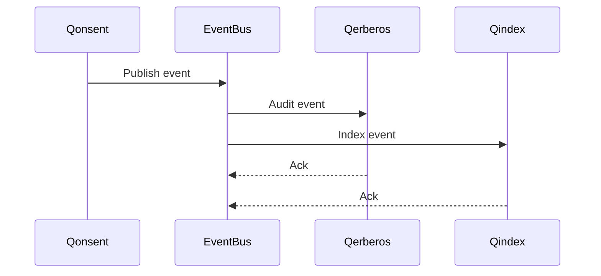

# Qonsent Compatibility Matrix

This document defines the compatibility requirements and integration versions for the Qonsent module.

## Module Dependencies

### Core Dependencies

| Module | Version | Required | Purpose | Integration Type |
|--------|---------|----------|---------|------------------|
| sQuid | v2.0+ | Yes | Identity verification | HTTP API |
| Qlock | v2.0+ | Yes | Encryption & signatures | MCP Tools |
| Qerberos | v2.0+ | Yes | Audit logging | HTTP API + Events |
| Qindex | v2.0+ | Optional | Resource indexing | HTTP API |
| Event Bus | v1.0+ | Yes | Event publishing | Redis/NATS |

### Optional Dependencies

| Module | Version | Required | Purpose | Integration Type |
|--------|---------|----------|---------|------------------|
| Qmask | v2.0+ | No | Privacy profiles | HTTP API |
| QNET | v2.0+ | No | Network health | HTTP API |
| DAO/Communities | v2.0+ | No | DAO governance | HTTP API |

## API Compatibility

### HTTP API Versions

| Version | Status | Supported Until | Breaking Changes |
|---------|--------|-----------------|------------------|
| v1.0 | Deprecated | 2024-06-01 | Initial release |
| v1.1 | Deprecated | 2024-09-01 | Added batch operations |
| v2.0 | Current | TBD | UCAN policy engine |
| v2.1 | Development | TBD | Enhanced delegation |

### MCP Tool Versions

| Tool | Version | Status | Changes |
|------|---------|--------|---------|
| qonsent.check | v1.0 | Current | Initial implementation |
| qonsent.grant | v1.0 | Current | Initial implementation |
| qonsent.revoke | v1.0 | Current | Initial implementation |

## Event Schema Compatibility

### Published Events

| Event | Schema Version | Status | Consumers |
|-------|----------------|--------|-----------|
| q.qonsent.grant.issued.v1 | v1.0 | Current | Qerberos, Qindex, Qmail |
| q.qonsent.revoked.v1 | v1.0 | Current | Qerberos, Qindex |
| q.qonsent.policy.updated.v1 | v1.0 | Current | Qerberos, DAO/Communities |

### Consumed Events

| Event | Schema Version | Status | Producer |
|-------|----------------|--------|----------|
| q.squid.identity.updated.v1 | v1.0 | Current | sQuid |
| q.dao.membership.changed.v1 | v1.0 | Optional | DAO/Communities |

## Database Compatibility

### MongoDB Versions

| Version | Status | Notes |
|---------|--------|-------|
| 5.0+ | Supported | Minimum version |
| 6.0+ | Recommended | Better performance |
| 7.0+ | Supported | Latest features |

### Schema Migrations

| Migration | From Version | To Version | Breaking |
|-----------|--------------|------------|----------|
| 001_initial | - | v1.0 | No |
| 002_ucan_policies | v1.0 | v2.0 | Yes |
| 003_delegation | v2.0 | v2.1 | No |

## Client Library Compatibility

### JavaScript/TypeScript

| Library | Version | Node.js | Browser |
|---------|---------|---------|---------|
| @anarq/qonsent-client | v2.0+ | 18+ | Modern |
| @anarq/common-clients | v1.0+ | 18+ | Modern |

### Python

| Library | Version | Python | Status |
|---------|---------|--------|--------|
| anarq-qonsent | v2.0+ | 3.8+ | Available |

### Go

| Library | Version | Go | Status |
|---------|---------|-----|--------|
| github.com/anarq/qonsent-go | v2.0+ | 1.19+ | Available |

## Integration Patterns

### Authentication Flow

### Permission Check Flow

### Event Publishing Flow

## Deployment Compatibility

### Container Platforms

| Platform | Version | Status | Notes |
|----------|---------|--------|-------|
| Docker | 20.0+ | Supported | Standard deployment |
| Kubernetes | 1.24+ | Supported | Recommended for production |
| Docker Compose | 2.0+ | Supported | Development only |

### Cloud Providers

| Provider | Services | Status | Notes |
|----------|----------|--------|-------|
| AWS | ECS, EKS, Lambda | Supported | Full feature support |
| GCP | GKE, Cloud Run | Supported | Full feature support |
| Azure | AKS, Container Instances | Supported | Full feature support |

### Serverless Platforms

| Platform | Version | Status | Notes |
|----------|---------|--------|-------|
| AWS Lambda | Node.js 18+ | Supported | Cold start optimized |
| Vercel | Node.js 18+ | Supported | Edge functions |
| Cloudflare Workers | - | Planned | Future support |

## Testing Compatibility

### Test Frameworks

| Framework | Version | Language | Status |
|-----------|---------|----------|--------|
| Vitest | 1.0+ | TypeScript | Current |
| Jest | 29+ | TypeScript | Supported |
| Mocha | 10+ | TypeScript | Supported |

### Mock Services

| Service | Version | Purpose | Status |
|---------|---------|---------|--------|
| sQuid Mock | v1.0 | Identity verification | Available |
| Qerberos Mock | v1.0 | Audit logging | Available |
| Qlock Mock | v1.0 | Encryption/signing | Available |

## Migration Guides

### From v1.x to v2.0

#### Breaking Changes
1. **Policy Format**: Migrated from simple rules to UCAN policies
2. **API Endpoints**: New endpoint structure under `/api/v2`
3. **Event Schema**: Updated event payloads with additional fields
4. **Database Schema**: New collections for UCAN policies

#### Migration Steps
1. **Backup Data**: Export existing policies and grants
2. **Update Dependencies**: Upgrade to compatible module versions
3. **Run Migration**: Execute database migration scripts
4. **Update Clients**: Upgrade client libraries to v2.0+
5. **Test Integration**: Verify all integrations work correctly
6. **Deploy**: Roll out new version with monitoring

#### Compatibility Layer
- v1 API endpoints remain available until 2024-06-01
- Automatic policy format conversion for existing data
- Event schema backward compatibility maintained

### From v2.0 to v2.1

#### Non-Breaking Changes
1. **Enhanced Delegation**: New delegation capabilities
2. **Performance Improvements**: Optimized permission checks
3. **Additional Events**: New event types for delegation

#### Migration Steps
1. **Update Dependencies**: Upgrade to v2.1
2. **Deploy**: Standard deployment process
3. **Enable Features**: Opt-in to new delegation features

## Support Matrix

### Supported Versions

| Version | Release Date | End of Support | Security Updates |
|---------|--------------|----------------|------------------|
| v1.0 | 2023-01-01 | 2024-01-01 | No |
| v1.1 | 2023-06-01 | 2024-06-01 | No |
| v2.0 | 2024-01-01 | 2025-01-01 | Yes |
| v2.1 | 2024-06-01 | 2025-06-01 | Yes |

### Deprecation Timeline

| Feature | Deprecated | Removed | Replacement |
|---------|------------|---------|-------------|
| Simple Policies | v2.0 | v3.0 | UCAN Policies |
| v1 API Endpoints | v2.0 | v2.2 | v2 API Endpoints |
| Legacy Events | v2.1 | v2.3 | New Event Schema |