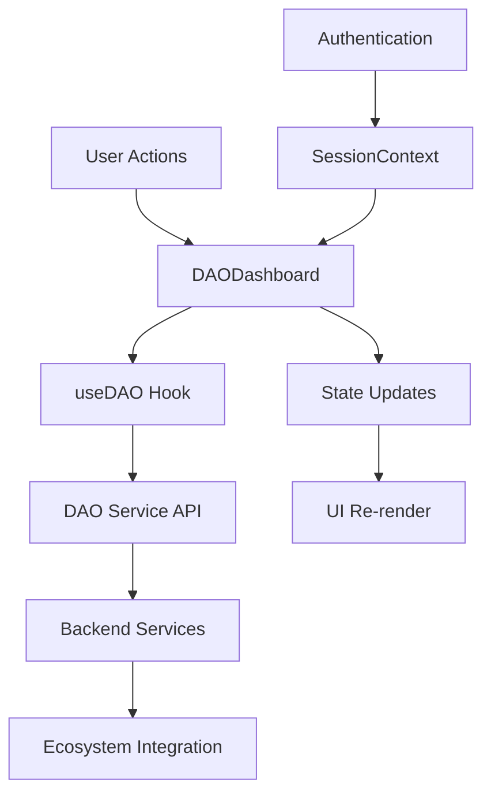

# DAODashboard Component Documentation

## Overview

The `DAODashboard` component serves as the main interface for interacting with a specific DAO within the AnarQ&Q ecosystem. It provides comprehensive DAO management functionality including viewing DAO details, managing proposals, voting, and membership operations.

## Features

### ✅ Core Functionality
- **DAO Information Display** - Shows detailed DAO metadata and statistics
- **Membership Management** - Join DAO functionality with access control
- **Proposal Management** - View, filter, and interact with DAO proposals
- **Voting Interface** - Access to voting on active proposals
- **Real-time Updates** - Live data refresh and status updates

### ✅ User Experience
- **Responsive Design** - Mobile-first responsive layout
- **Loading States** - Skeleton loaders for better perceived performance
- **Error Handling** - Comprehensive error states with user-friendly messages
- **Accessibility** - WCAG 2.1 compliant with keyboard navigation and screen reader support
- **Search & Filtering** - Advanced proposal filtering and search capabilities

## Props

```typescript
interface DAODashboardProps {
  daoId: string;        // Required: The ID of the DAO to display
  className?: string;   // Optional: Additional CSS classes
}
```

## Usage

### Basic Usage

```tsx
import { DAODashboard } from '../components/dao';

function DAOPage({ daoId }: { daoId: string }) {
  return (
    <div className="min-h-screen bg-gray-50">
      <DAODashboard daoId={daoId} />
    </div>
  );
}
```

### With Router Integration

```tsx
import { useParams } from 'react-router-dom';
import { DAODashboard } from '../components/dao';

function DAORoute() {
  const { daoId } = useParams<{ daoId: string }>();
  
  if (!daoId) {
    return <div>DAO ID is required</div>;
  }
  
  return <DAODashboard daoId={daoId} />;
}
```

### With Custom Styling

```tsx
import { DAODashboard } from '../components/dao';

function CustomDAOPage({ daoId }: { daoId: string }) {
  return (
    <DAODashboard 
      daoId={daoId} 
      className="custom-dao-dashboard max-w-6xl"
    />
  );
}
```

## Component Structure

### Main Sections

1. **DAO Header**
   - DAO name and description
   - Visibility badge and member status
   - Join/refresh buttons
   - Statistics grid (members, quorum, proposals)

2. **Membership Section**
   - Join DAO interface for non-members
   - Authentication prompts for unauthenticated users
   - Member-specific content access

3. **Proposals Section** (Members Only)
   - Proposals list with filtering and search
   - Create proposal button (for eligible users)
   - Individual proposal cards with voting options

### State Management

The component uses the `useDAO` hook for all data operations:

```typescript
const {
  currentDAO,      // Current DAO details
  proposals,       // List of DAO proposals
  membership,      // User's membership status
  loading,         // Loading state
  error,          // Error state
  getDAO,         // Fetch DAO details
  getProposals,   // Fetch proposals
  getMembership,  // Check membership
  joinDAO,        // Join DAO function
  clearError      // Clear error state
} = useDAO();
```

## Data Flow



## Features in Detail

### DAO Information Display

- **Basic Info**: Name, description, creation date
- **Visibility**: Public, DAO-only, or Private with color-coded badges
- **Statistics**: Member count, quorum requirements, proposal counts
- **Governance Rules**: Token requirements and voting mechanisms

### Membership Management

- **Join Functionality**: One-click DAO joining with loading states
- **Access Control**: Respects DAO visibility and token requirements
- **Status Display**: Clear indication of membership status
- **Error Handling**: Detailed error messages for failed join attempts

### Proposal Management

- **List Display**: All proposals with status indicators
- **Filtering**: Filter by status (active/closed) and search by title/description
- **Sorting**: Sort by creation date, vote count, or expiration date
- **Pagination**: Ready for large proposal lists (future enhancement)

### Voting Interface

- **Eligibility Checking**: Verifies user voting rights
- **Status Display**: Shows voting status and deadlines
- **Integration Ready**: Prepared for VotingInterface component integration

## Accessibility Features

### WCAG 2.1 Compliance

- **Keyboard Navigation**: Full keyboard accessibility
- **Screen Reader Support**: Proper ARIA labels and descriptions
- **Color Contrast**: Minimum 4.5:1 contrast ratio
- **Focus Management**: Clear focus indicators
- **Semantic HTML**: Proper heading hierarchy and structure

### Responsive Design

- **Mobile First**: Optimized for mobile devices
- **Breakpoints**: 
  - Mobile: Single column layout
  - Tablet: Two column grid
  - Desktop: Multi-column layout with sidebar
- **Touch Targets**: Minimum 44px touch targets
- **Flexible Layouts**: Adapts to different screen sizes

## Error Handling

### Error Types

1. **Network Errors**: API connectivity issues
2. **Authentication Errors**: sQuid identity validation failures
3. **Permission Errors**: Insufficient rights for actions
4. **Data Errors**: Invalid or missing DAO data
5. **Business Logic Errors**: DAO rule violations

### Error Display

- **Toast Notifications**: For temporary errors
- **Inline Messages**: For form validation errors
- **Error Cards**: For component-level failures
- **Retry Options**: User-friendly retry mechanisms

## Performance Optimizations

### Loading Strategies

- **Skeleton Loaders**: Immediate visual feedback
- **Progressive Loading**: Load critical data first
- **Memoization**: Cache expensive computations
- **Debounced Search**: Optimize search operations

### Caching

- **DAO Details**: Cached for 5 minutes
- **Proposals**: Active proposals cached for 1 minute
- **Membership**: Cached for session duration

## Integration Points

### Ecosystem Services

- **sQuid**: Authentication and identity management
- **Qonsent**: Access control and privacy rules
- **Qwallet**: Token/NFT balance verification
- **Qindex**: Activity logging and indexing
- **Qerberos**: Security and integrity validation

### Future Components

The DAODashboard is designed to integrate with:

- **CreateProposalForm**: Proposal creation interface
- **ProposalCard**: Individual proposal display
- **VotingInterface**: Voting interaction component

## Testing

### Test Coverage

- **Unit Tests**: Component rendering and logic
- **Integration Tests**: Hook and API interactions
- **Accessibility Tests**: WCAG compliance verification
- **Responsive Tests**: Multi-device compatibility

### Test Files

- `DAODashboard.test.tsx`: Comprehensive test suite
- Coverage includes all user interactions and edge cases

## Customization

### Styling

The component uses TailwindCSS classes and can be customized through:

- **CSS Classes**: Override default styles
- **Theme Variables**: Customize colors and spacing
- **Component Props**: Additional className prop

### Behavior

Customize behavior through:

- **Hook Configuration**: Modify useDAO hook behavior
- **Environment Variables**: Configure API endpoints
- **Feature Flags**: Enable/disable specific features

## Browser Support

- **Modern Browsers**: Chrome 90+, Firefox 88+, Safari 14+, Edge 90+
- **Mobile Browsers**: iOS Safari 14+, Chrome Mobile 90+
- **Accessibility**: Screen readers and assistive technologies

## Dependencies

### Required

- React 18+
- TypeScript 4.5+
- TailwindCSS 3.0+
- Heroicons React

### Peer Dependencies

- `useDAO` hook from composables
- `useSessionContext` from contexts
- UI components from components/ui

## Migration Guide

### From DAOExplorer

If migrating from using DAOExplorer for individual DAO management:

```tsx
// Before
<DAOExplorer />

// After
<DAODashboard daoId={selectedDAOId} />
```

### Props Changes

No breaking changes from previous versions.

## Troubleshooting

### Common Issues

1. **DAO Not Loading**: Check daoId prop and network connectivity
2. **Join Button Not Working**: Verify authentication status
3. **Proposals Not Showing**: Check membership status
4. **Styling Issues**: Ensure TailwindCSS is properly configured

### Debug Mode

Enable debug logging:

```tsx
// Set in development environment
process.env.NODE_ENV === 'development' && console.log('DAO Debug Mode');
```

## Contributing

When contributing to the DAODashboard component:

1. Follow the existing code style and patterns
2. Add tests for new functionality
3. Update documentation for API changes
4. Ensure accessibility compliance
5. Test on multiple devices and browsers

## License

Part of the AnarQ&Q ecosystem under the project license.