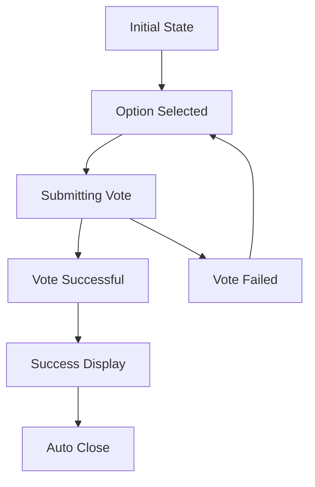

# VotingInterface Component Documentation

## Overview

The `VotingInterface` component provides a comprehensive voting experience for DAO proposal participation within the AnarQ&Q ecosystem. It features eligibility validation, interactive option selection, real-time feedback, and seamless integration with the DAO governance system.

## Features

### ✅ Core Functionality
- **Interactive Voting** - Radio button selection with visual feedback
- **Eligibility Validation** - Multi-factor voting eligibility checking
- **Vote Submission** - Secure vote recording with blockchain integration
- **Real-time Feedback** - Loading states, success confirmation, error handling
- **Time Management** - Dynamic countdown and urgency indicators

### ✅ User Experience
- **Modal Interface** - Fullscreen modal with responsive design
- **Visual Feedback** - Clear selection states and progress indicators
- **Accessibility** - WCAG 2.1 compliant with keyboard navigation and screen reader support
- **Smart Messaging** - Context-aware error messages and guidance
- **Auto-close** - Automatic modal closure after successful vote

## Props

```typescript
interface VotingInterfaceProps {
  proposal: Proposal;        // Required: The proposal to vote on
  daoId: string;            // Required: DAO identifier
  open?: boolean;           // Optional: Modal open state (default: true)
  onClose?: () => void;     // Optional: Close callback
  className?: string;       // Optional: Additional CSS classes
}
```

## Usage

### Basic Usage

```tsx
import { VotingInterface } from '../components/dao';

function ProposalVoting({ proposal, daoId }: { proposal: Proposal, daoId: string }) {
  const [showVoting, setShowVoting] = useState(false);
  
  const handleVoteComplete = () => {
    setShowVoting(false);
    // Refresh proposal data
    refreshProposals();
  };

  return (
    <>
      <button onClick={() => setShowVoting(true)}>
        Vote Now
      </button>
      
      <VotingInterface
        proposal={proposal}
        daoId={daoId}
        open={showVoting}
        onClose={handleVoteComplete}
      />
    </>
  );
}
```

### Integration with ProposalCard

```tsx
import { ProposalCard, VotingInterface } from '../components/dao';

function ProposalList({ proposals, daoId }: { proposals: Proposal[], daoId: string }) {
  const [votingProposal, setVotingProposal] = useState<Proposal | null>(null);
  
  const handleVote = (proposalId: string) => {
    const proposal = proposals.find(p => p.id === proposalId);
    if (proposal) {
      setVotingProposal(proposal);
    }
  };
  
  const handleVoteComplete = () => {
    setVotingProposal(null);
    // Refresh proposals
  };

  return (
    <div>
      {proposals.map(proposal => (
        <ProposalCard
          key={proposal.id}
          proposal={proposal}
          daoId={daoId}
          onVote={handleVote}
        />
      ))}
      
      {votingProposal && (
        <VotingInterface
          proposal={votingProposal}
          daoId={daoId}
          open={!!votingProposal}
          onClose={handleVoteComplete}
        />
      )}
    </div>
  );
}
```

### With Custom Styling

```tsx
import { VotingInterface } from '../components/dao';

function CustomVotingInterface({ proposal, daoId }: { proposal: Proposal, daoId: string }) {
  return (
    <VotingInterface
      proposal={proposal}
      daoId={daoId}
      className="custom-voting-interface"
      onClose={() => console.log('Voting completed')}
    />
  );
}
```

## Component States

### 1. Eligibility Error State

When users cannot vote, the component displays a clear error message:

```tsx
// Rendered when eligibility.canVote === false
<Dialog>
  <DialogContent>
    <DialogTitle>Cannot Vote</DialogTitle>
    <div>
      <p>{eligibility.reason}</p>
      <p>{eligibility.details}</p>
      <Button onClick={onClose}>Close</Button>
    </div>
  </DialogContent>
</Dialog>
```

**Error Scenarios:**
- **Not Authenticated**: User needs to sign in
- **Not a Member**: User must join the DAO first
- **No Voting Rights**: User lacks voting permissions
- **Proposal Closed**: Voting has ended
- **Expired**: Voting deadline has passed

### 2. Voting Interface State

The main voting interface for eligible users:

```tsx
// Main voting interface
<Dialog>
  <DialogContent>
    <DialogTitle>Cast Your Vote</DialogTitle>
    <div>
      {/* Proposal Summary */}
      <Card>
        <CardHeader>
          <CardTitle>{proposal.title}</CardTitle>
          <CardDescription>Creator and date info</CardDescription>
        </CardHeader>
        <CardContent>
          <p>{proposal.description}</p>
          <div>Time remaining and expiration</div>
        </CardContent>
      </Card>
      
      {/* Voting Options */}
      <Card>
        <CardHeader>
          <CardTitle>Select Your Vote</CardTitle>
        </CardHeader>
        <CardContent>
          {proposal.options.map(option => (
            <div key={option} className="voting-option">
              <input type="radio" />
              <label>{option}</label>
              <span>Current votes</span>
            </div>
          ))}
        </CardContent>
      </Card>
      
      {/* Vote Distribution Preview */}
      <Card>
        <CardHeader>
          <CardTitle>Current Vote Distribution</CardTitle>
        </CardHeader>
        <CardContent>
          {/* Progress bars and percentages */}
        </CardContent>
      </Card>
      
      {/* Action Buttons */}
      <div>
        <Button onClick={onClose}>Cancel</Button>
        <Button onClick={handleSubmitVote}>Submit Vote</Button>
      </div>
    </div>
  </DialogContent>
</Dialog>
```

### 3. Success State

After successful vote submission:

```tsx
// Success confirmation
<Dialog>
  <DialogContent>
    <DialogTitle>Vote Submitted</DialogTitle>
    <div>
      <div className="success-message">
        <p>Your vote has been recorded!</p>
        <p>You voted for: {voteSubmitted}</p>
      </div>
      <p>Your vote has been securely recorded on the blockchain</p>
      <Button onClick={onClose}>Close</Button>
    </div>
  </DialogContent>
</Dialog>
```

## Eligibility System

### Eligibility Checks

```typescript
const eligibility = useMemo(() => {
  if (!isAuthenticated) {
    return {
      canVote: false,
      reason: 'You must be authenticated to vote',
      details: 'Please sign in with your sQuid identity to participate in governance.'
    };
  }

  if (!membership?.isMember) {
    return {
      canVote: false,
      reason: 'You must be a DAO member to vote',
      details: 'Only DAO members can participate in governance decisions.'
    };
  }

  if (!membership.permissions.canVote) {
    return {
      canVote: false,
      reason: 'You do not have voting permissions',
      details: 'Your current membership level does not include voting rights.'
    };
  }

  if (proposal.status !== 'active') {
    return {
      canVote: false,
      reason: 'This proposal is no longer active',
      details: 'Voting has ended for this proposal.'
    };
  }

  if (timeRemaining.expired) {
    return {
      canVote: false,
      reason: 'Voting period has expired',
      details: 'The deadline for voting on this proposal has passed.'
    };
  }

  return { canVote: true, reason: null, details: null };
}, [isAuthenticated, membership, proposal.status, timeRemaining.expired]);
```

### Eligibility States

1. **✅ Can Vote**
   - User is authenticated
   - User is a DAO member
   - User has voting permissions
   - Proposal is active
   - Voting deadline not passed

2. **❌ Cannot Vote**
   - Shows specific error message
   - Provides helpful guidance
   - Offers close button only

## Time Management

### Time Calculation

```typescript
const timeRemaining = useMemo(() => {
  const now = new Date();
  const expiresAt = new Date(proposal.expiresAt);
  const timeLeft = expiresAt.getTime() - now.getTime();
  
  if (timeLeft <= 0) {
    return { text: 'Expired', urgent: true, expired: true };
  }
  
  const hoursLeft = Math.floor(timeLeft / (1000 * 60 * 60));
  const daysLeft = Math.floor(hoursLeft / 24);
  
  if (daysLeft > 1) {
    return { text: `${daysLeft} days remaining`, urgent: false, expired: false };
  } else if (hoursLeft > 1) {
    return { text: `${hoursLeft} hours remaining`, urgent: hoursLeft <= 24, expired: false };
  } else {
    const minutesLeft = Math.floor(timeLeft / (1000 * 60));
    return { 
      text: minutesLeft > 0 ? `${minutesLeft} minutes remaining` : 'Expires soon', 
      urgent: true, 
      expired: false 
    };
  }
}, [proposal.expiresAt]);
```

### Time Display States

- **Days Remaining**: `"3 days remaining"` (normal styling)
- **Hours Remaining**: `"5 hours remaining"` (urgent if ≤24 hours)
- **Minutes Remaining**: `"30 minutes remaining"` (urgent styling)
- **Expires Soon**: `"Expires soon"` (urgent styling)
- **Expired**: `"Expired"` (blocks voting)

### Visual Urgency

```tsx
<Badge 
  variant="secondary" 
  className={cn(
    timeRemaining.urgent 
      ? "bg-orange-100 text-orange-800" 
      : "bg-blue-100 text-blue-800"
  )}
>
  <ClockIcon className="h-3 w-3 mr-1" />
  {timeRemaining.text}
</Badge>
```

## Vote Selection Interface

### Radio Button Implementation

```tsx
{proposal.options.map((option, index) => (
  <div
    key={index}
    className={cn(
      "relative flex items-center p-4 border rounded-lg cursor-pointer transition-all duration-200",
      votingState.selectedOption === option
        ? "border-blue-500 bg-blue-50 ring-2 ring-blue-200"
        : "border-gray-200 hover:border-gray-300 hover:bg-gray-50",
      votingState.isSubmitting && "opacity-50 cursor-not-allowed"
    )}
    onClick={() => handleOptionSelect(option)}
  >
    <input
      type="radio"
      name="vote-option"
      value={option}
      checked={votingState.selectedOption === option}
      onChange={() => handleOptionSelect(option)}
      disabled={votingState.isSubmitting}
      className="h-4 w-4 text-blue-600 border-gray-300 focus:ring-blue-500"
      aria-describedby={`option-${index}-description`}
    />
    <div className="ml-3 flex-1">
      <label className="text-sm font-medium text-gray-900 cursor-pointer">
        {option}
      </label>
      <p id={`option-${index}-description`} className="text-xs text-gray-500 mt-1">
        Current: {votePreview[index]?.count || 0} votes ({votePreview[index]?.percentage || 0}%)
      </p>
    </div>
    {votingState.selectedOption === option && (
      <CheckCircleIcon className="h-5 w-5 text-blue-600" />
    )}
  </div>
))}
```

### Selection Features

- **Visual Feedback**: Selected options have blue border and background
- **Current Vote Display**: Shows current vote counts for each option
- **Accessibility**: Proper radio button group with labels
- **Disabled State**: Options disabled during submission
- **Hover Effects**: Subtle hover states for better UX

## Vote Submission Process

### Submission Flow

```typescript
const handleSubmitVote = async () => {
  if (!votingState.selectedOption || !eligibility.canVote) return;

  setVotingState(prev => ({
    ...prev,
    isSubmitting: true,
    error: null
  }));

  try {
    const voteData = {
      option: votingState.selectedOption,
      signature: `vote_${Date.now()}_${Math.random().toString(36).substr(2, 9)}`
    };

    const result = await voteOnProposal(daoId, proposal.id, voteData);
    
    if (result) {
      setVotingState(prev => ({
        ...prev,
        isSubmitting: false,
        hasVoted: true,
        voteSubmitted: votingState.selectedOption,
        selectedOption: null
      }));

      // Auto-close after 3 seconds
      setTimeout(() => {
        onClose?.();
      }, 3000);
    }
  } catch (err) {
    const errorMessage = err instanceof Error ? err.message : 'Failed to submit vote';
    setVotingState(prev => ({
      ...prev,
      isSubmitting: false,
      error: errorMessage
    }));
  }
};
```

### Submission States

1. **Ready to Submit**
   - Option selected
   - Submit button enabled
   - Normal button styling

2. **Submitting**
   - Loading spinner in button
   - All inputs disabled
   - "Submitting..." text

3. **Success**
   - Success modal displayed
   - Vote choice confirmed
   - Auto-close timer started

4. **Error**
   - Error message displayed
   - Form remains interactive
   - User can retry

## Vote Distribution Preview

### Current Vote Display

```typescript
const votePreview = useMemo(() => {
  if (!proposal.results) return null;

  const totalVotes = proposal.voteCount || 0;
  return proposal.options.map(option => {
    const result = proposal.results[option] || { count: 0, weight: 0 };
    const percentage = totalVotes > 0 ? (result.count / totalVotes) * 100 : 0;
    
    return {
      option,
      count: result.count,
      percentage: Math.round(percentage * 10) / 10
    };
  });
}, [proposal.results, proposal.options, proposal.voteCount]);
```

### Preview Features

- **Progress Bars**: Visual representation of current vote distribution
- **Vote Counts**: Raw vote numbers and percentages
- **Quorum Display**: Shows total votes and quorum requirement
- **Real-time Data**: Based on current proposal state

## State Management

### Voting State Interface

```typescript
interface VotingState {
  selectedOption: string | null;    // Currently selected voting option
  isSubmitting: boolean;           // Whether vote is being submitted
  hasVoted: boolean;              // Whether vote has been successfully submitted
  voteSubmitted: string | null;   // The option that was voted for
  error: string | null;          // Any error that occurred
}
```

### State Transitions



### State Reset

```typescript
// Reset state when proposal changes
useEffect(() => {
  setVotingState({
    selectedOption: null,
    isSubmitting: false,
    hasVoted: false,
    voteSubmitted: null,
    error: null
  });
  clearError();
}, [proposal.id, clearError]);
```

## Integration Points

### DAO Dashboard Integration

```tsx
// In DAODashboard.tsx
const [showVotingInterface, setShowVotingInterface] = useState(false);
const [votingProposal, setVotingProposal] = useState<Proposal | null>(null);

const handleVoteOnProposal = (proposalId: string) => {
  const proposal = proposals.find(p => p.id === proposalId);
  if (proposal) {
    setVotingProposal(proposal);
    setShowVotingInterface(true);
  }
};

const handleVotingComplete = () => {
  setShowVotingInterface(false);
  setVotingProposal(null);
  loadDAOData(); // Refresh proposals
};

// Render VotingInterface
{votingProposal && (
  <VotingInterface
    proposal={votingProposal}
    daoId={daoId}
    open={showVotingInterface}
    onClose={handleVotingComplete}
  />
)}
```

### ProposalCard Integration

```tsx
// In ProposalCard.tsx
<Button onClick={() => onVote?.(proposal.id)}>
  <HandRaisedIcon className="h-4 w-4 mr-1" />
  Vote Now
</Button>
```

### Hook Integration

```typescript
const {
  membership,
  voteOnProposal,
  loading,
  error,
  clearError
} = useDAO();

const { isAuthenticated } = useSessionContext();
```

## Accessibility Features

### WCAG 2.1 Compliance

- **Keyboard Navigation**: Full keyboard accessibility
- **Screen Reader Support**: Proper ARIA labels and descriptions
- **Color Contrast**: Minimum 4.5:1 contrast ratio
- **Focus Management**: Clear focus indicators
- **Form Labels**: Proper association between labels and inputs

### ARIA Implementation

```tsx
<input
  type="radio"
  name="vote-option"
  value={option}
  checked={votingState.selectedOption === option}
  onChange={() => handleOptionSelect(option)}
  disabled={votingState.isSubmitting}
  className="h-4 w-4 text-blue-600 border-gray-300 focus:ring-blue-500"
  aria-describedby={`option-${index}-description`}
/>
<label className="text-sm font-medium text-gray-900 cursor-pointer">
  {option}
</label>
<p id={`option-${index}-description`} className="text-xs text-gray-500 mt-1">
  Current: {votePreview[index]?.count || 0} votes
</p>
```

### Keyboard Navigation

- **Tab Order**: Logical tab sequence through radio buttons and action buttons
- **Enter/Space**: Select radio buttons and activate buttons
- **Escape**: Close modal (handled by Dialog component)
- **Arrow Keys**: Navigate between radio buttons in group

## Error Handling

### Error Types

1. **Eligibility Errors**: User cannot vote (handled by eligibility state)
2. **Submission Errors**: Vote submission failed
3. **Network Errors**: API connectivity issues
4. **Validation Errors**: Invalid vote data

### Error Display

```tsx
{(votingState.error || daoError) && (
  <div className="bg-red-50 border border-red-200 rounded-lg p-4">
    <div className="flex items-start">
      <ExclamationTriangleIcon className="h-5 w-5 text-red-400 mt-0.5 mr-3 flex-shrink-0" />
      <div className="flex-1">
        <p className="text-red-800">{votingState.error || daoError}</p>
      </div>
    </div>
  </div>
)}
```

## Performance Optimizations

### Memoization

```typescript
// Time remaining calculation is memoized
const timeRemaining = useMemo(() => {
  // Complex time calculation
}, [proposal.expiresAt]);

// Eligibility checking is memoized
const eligibility = useMemo(() => {
  // Complex eligibility logic
}, [isAuthenticated, membership, proposal.status, timeRemaining.expired]);

// Vote preview is memoized
const votePreview = useMemo(() => {
  // Vote distribution calculation
}, [proposal.results, proposal.options, proposal.voteCount]);
```

### Efficient Rendering

- **Conditional Rendering**: Only render necessary components based on state
- **State Optimization**: Minimal state updates and re-renders
- **Event Handling**: Optimized event handlers with proper dependencies

## Testing

### Test Coverage

- **Component Rendering**: All states and display modes
- **Eligibility Checking**: All eligibility scenarios
- **Vote Selection**: Option selection and visual feedback
- **Vote Submission**: Success and error scenarios
- **Time Display**: All time states and urgency indicators
- **User Interactions**: Button clicks, radio selection, modal closure
- **Accessibility**: ARIA labels, keyboard navigation, focus states
- **Edge Cases**: Missing data, network errors, expired proposals

### Test Files

- `VotingInterface.test.tsx`: Comprehensive test suite
- Coverage includes all user interactions and edge cases

## Browser Support

- **Modern Browsers**: Chrome 90+, Firefox 88+, Safari 14+, Edge 90+
- **Mobile Browsers**: iOS Safari 14+, Chrome Mobile 90+
- **Modal Support**: Full Dialog API support required

## Dependencies

### Required

- React 18+
- TypeScript 4.5+
- TailwindCSS 3.0+
- Heroicons React

### Peer Dependencies

- `useDAO` hook from composables
- `useSessionContext` from contexts
- UI components from components/ui

## Future Enhancements

### Planned Features

1. **Vote History**: Display user's previous votes
2. **Delegation**: Vote delegation to other members
3. **Multi-signature**: Multi-sig voting for high-stakes proposals
4. **Anonymous Voting**: Privacy-preserving vote options
5. **Vote Reasoning**: Optional comments with votes

### Integration Roadmap

1. **Notification System**: Real-time voting notifications
2. **Analytics**: Detailed voting analytics and insights
3. **Social Features**: Discussion and debate integration
4. **Mobile App**: Native mobile voting interface

## Troubleshooting

### Common Issues

1. **Vote Button Not Working**: Check authentication and membership status
2. **Options Not Selectable**: Verify proposal is active and not expired
3. **Submission Failing**: Check network connectivity and DAO service status
4. **Modal Not Closing**: Verify onClose callback is provided

### Debug Mode

```tsx
// Enable debug logging in development
if (process.env.NODE_ENV === 'development') {
  console.log('Voting state:', votingState);
  console.log('Eligibility:', eligibility);
  console.log('Time remaining:', timeRemaining);
}
```

## Contributing

When contributing to the VotingInterface component:

1. Follow existing code style and patterns
2. Add tests for new functionality
3. Update documentation for API changes
4. Ensure accessibility compliance
5. Test on multiple devices and browsers

## License

Part of the AnarQ&Q ecosystem under the project license.